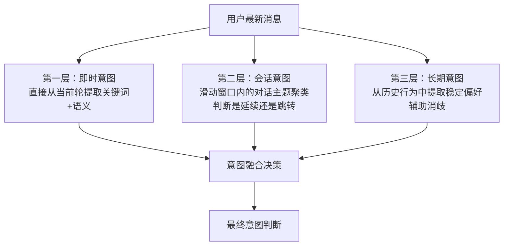

## Q：当用户对话零碎、跨轮次且意图发生跳跃时，如何结合上下文准确判断当前意图？

> 来源：某小厂FOSHO/AI应用开发二面

**新手答**：“用最近几轮对话判断意图。”

**高手答**：

意图跳跃的本质是：**用户心智模型是连续的，但表达是碎片化的**。用户脑中有一条清晰的思路，但说出来的话是断断续续、前后跳转的。只看最近几轮会误判——因为最新一轮可能是对三轮前某个话题的回溯。

**三层意图识别策略**：



| 层级 | 输入 | 输出 | 作用 |
|------|------|------|------|
| 即时意图 | 当前轮用户消息 | 关键词 + 初步意图分类 | 捕捉最新表达 |
| 会话意图 | 最近 3-5 轮对话 | 主题聚类 + 是否跳跃判断 | 判断延续 vs 跳转 |
| 长期意图 | 用户历史画像 | 稳定偏好 + 高频需求 | 消歧和补全 |

**跳跃检测机制**：

计算当前 query 与上一轮 query 的语义相似度：
- 相似度 > 0.7 → 延续当前话题，正常处理
- 相似度 0.3~0.7 → 灰区，结合历史判断是否是对更早话题的回溯
- 相似度 < 0.3 → 判定为跳跃，触发“话题重置”

**跳跃后的处理**：
- 清空工作记忆（当前话题的中间状态）
- 保留用户画像（长期偏好不受话题切换影响）
- 检查是否是对历史话题的回溯——如果是，从话题记忆中恢复该话题的上下文

**编程/Agent 场景的特殊处理**：

用户可能在多个文件间跳转，但底层任务是同一个（比如“修复一个跨模块的 bug”）。这时候需要维护的是**任务栈**而非话题栈——文件切换不是意图跳跃，而是同一任务的不同步骤。

```text
话题栈（对话场景）：聊天气 → 聊餐厅 → 回到天气 → 各话题独立
任务栈（Agent 场景）：改文件A → 改文件B → 跑测试 → 同一任务的不同步骤
```

**差距在哪**：面试官考的是对“意图不连续”这个真实工程难题的解题思路，不是教科书式的意图分类。只看最近几轮会在跳跃时误判，只靠语义相似度会在“同一任务不同步骤”时误触跳跃检测。三层融合 + 场景化判断才是完整方案。
