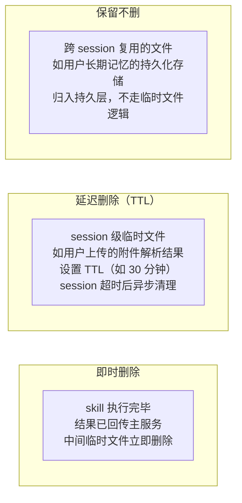

## Q：session 里的临时文件存主服务还是 skill 进程服务，要不要删，什么时候删？

> 来源：阿里淘天/Agent开发一面

**新手答**：“存主服务，session 结束就删。”

**高手答**：

临时文件应该存在 **skill 进程侧**（谁生产谁管理），主服务只保留文件引用（URI/路径）。

**存储位置的设计原则**：

| 决策 | 方案 | 原因 |
|------|------|------|
| 存哪里 | skill 进程本地 | ① 避免主服务成为 IO 瓶颈 ② skill 进程重启时可以清理自己的垃圾 ③ 多 skill 并行时避免命名冲突 |
| 主服务存什么 | 只存文件引用 | URI/路径 + 过期时间，按需拉取内容 |
| 命名空间 | `/tmp/\{session_id\}/\{skill_id\}/` | 天然隔离不同 session 和 skill 的文件 |

**删除策略（三级）**：

| 级别 | 删除时机 | 适用对象 | 示例 |
|------|---------|---------|------|
| 即时删除 | skill 执行完、结果回传后 | 中间产物 | 格式转换的临时文件、解压缩的中间目录 |
| 延迟删除 | session 超时后（TTL 30min） | session 级资源 | 用户上传附件的解析结果、临时生成的图表 |
| 保留不删 | 永不自动删除 | 跨 session 资源 | 用户长期记忆文件、持久化配置 |

**工程注意点**：

1. **命名空间隔离**：`/tmp/\{session_id\}/\{skill_id\}/` 确保多 session、多 skill 并行不冲突
2. **进程异常退出兜底**：skill 进程 crash 后临时文件不会自动清理——靠 cron job 定时扫描 `/tmp/` 下超过 TTL 的目录并清理
3. **磁盘满报警**：临时文件积累可能撑满磁盘，设置报警阈值在 80%，触发时强制清理所有过期文件
4. **大文件特殊处理**：超过阈值（如 100MB）的临时文件不走本地磁盘，直接走对象存储（S3/OSS），skill 只拿到下载链接

**差距在哪**：面试官考的是微服务架构下的资源生命周期管理能力——看似小问题，但反映系统设计功底。“存主服务+session 结束删”有两个问题：主服务变成 IO 瓶颈，以及 session 异常断开时临时文件变成孤儿。skill 侧管理+分级删除+cron 兜底才是生产级方案。
