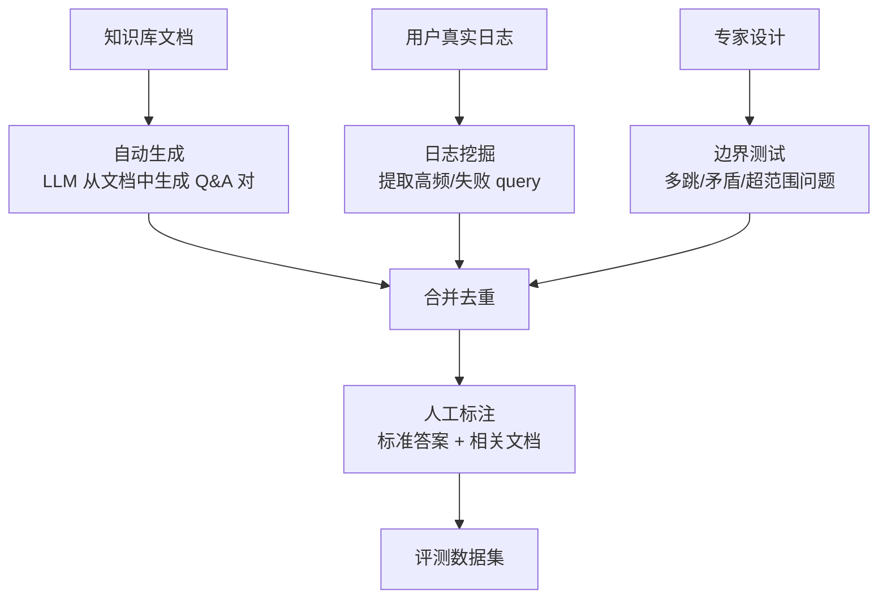
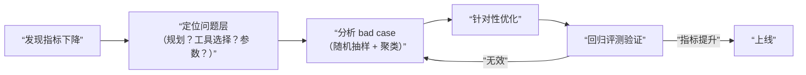

## 评测方案设计与实践

### Q：通过什么方式去验证 Skill 的提升效果，指标是什么？

> 来源：美团/食杂后端一面 【电商库存一面追问：Skill 变更影响面回归】【字节火山引擎 Managed Agent 一面追问：脚本与模型评审对比两个 Skill】【[快手 AI 全栈一面](https://www.nowcoder.com/feed/main/detail/a30242712e8d456c839ff4223470f491)追问：降低离线评测成本并预估转人工率变化】【[快手 - Agent 开发岗（应用落地 + AI 工具）](https://www.nowcoder.com/discuss/926274020192841728)追问：Skill 的质量评估指标有哪些？】【[作业帮一面 9.5](https://www.nowcoder.com/feed/main/detail/21ca46108ebf479fb8056c6e9f61d42f)追问：怎么验证 skill 的效果？怎么判断 skill 行不行、要不要改？】【[阿里边缘bu 秋招一面 （已过）](https://www.nowcoder.com/feed/main/detail/bdebbb6088b6405e9eb2bd2c345acb6e)追问：任务执行完成率从不足 50% 提升到 100%，这个指标是怎么评测出来的？】

**新手答**：“看用户反馈好不好，或者看任务成功率有没有提升。”

**高手答**：

验证 Skill 效果需要**分层度量 + 对照实验**：

**1. 指标体系**

| 层级 | 指标 | 含义 |
|------|------|------|
| 触发层 | 触发准确率 | 该触发时触发、不该触发时不触发 |
| 执行层 | 端到端成功率 | Skill 被调用后任务完成的比例 |
| 效率层 | 步数 / Token 消耗 | 有 Skill vs 无 Skill 的资源对比 |
| 质量层 | 输出一致性 | 同类任务多次执行结果的稳定程度 |

**2. 评测方法**

- **A/B 对照**：同一批 eval case，分别在有/无该 Skill 的条件下跑，对比成功率和步数
- **回归检测**：新增 Skill 后原有能力是否退化（跑全量 eval set）
- **边界测试**：故意给模糊/交叉意图，看 Skill 是否误触发

大规模离线评测先按意图、风险和难度分层抽样，并缓存解析、检索和确定性工具结果，只重跑受 Skill 变更影响的阶段；便宜规则先筛硬失败，模型 Judge 只处理剩余语义样本，高风险和 Judge 分歧再人工复核。报告必须给置信区间和分层结果，不能用缩小样本后的点估计声称“转人工率会下降”。上线后再按同一转人工口径做稳定分桶验证，区分必要转人工和可避免转人工。

评价脚本和模型评审承担不同职责。格式、必填字段、工具调用、单测和业务不变量优先用确定性脚本；开放式质量使用固定 Rubric 的模型 Judge，隐藏候选名称并随机交换 A/B 顺序，重复多次检查位置偏差。Judge 分歧或高风险 Case 进入人工复核。对比两个 Skill 时固定模型、Prompt、工具快照和任务集，只改变 Skill 版本，同时报告成功率、路由准确率、Token、延迟、副作用和置信区间，不能用单次“看起来更好”决定发布。

回归集要分三圈：该 Skill 自己的正向、反向和边界 case；它与相邻 Skill 的**路由混淆对**（同一意图只改一个关键条件，看是否选错）；以及全局任务集。发布门槛同时约束本 Skill 的收益和另外两圈的最大退化，不能只证明“自己的题做得更好”，却让路由抢占其他 Skill 或损伤通用任务。

**3. 实战经验**

Skill 的效果不是线性的——简单任务提升不大，复杂重复任务提升显著。所以评测集要**按任务复杂度分层**，分别算各层提升比例，避免被简单任务的高基线稀释了真正的收益。

**差距在哪**：新手只看一个结果指标。高手分了触发/执行/效率/质量四层，且有对照实验设计和回归检测意识。面试官考的是你对“如何科学度量一个能力模块效果”的工程化思维。

---

### Q：RAG 系统如何评测？有哪些评测维度和指标？评测数据集怎么构建？

> 来源：快手 AI Agent 开发一面 / [钉钉一面](https://www.nowcoder.com/discuss/923765750446202880)【[字节二面（Trae）](https://www.nowcoder.com/discuss/924821959647440896)追问：评测机制怎么做？】【[腾讯/csig/元宝/内容安全/日常实习/三轮技术面试](https://www.nowcoder.com/feed/main/detail/60f381f558a848ceac18c666268dc7da)追问：对于什么场景进行评测？评测目标是什么？评测集怎么构建的？】【[百度Agent一面](https://www.nowcoder.com/feed/main/detail/72858aade19d443facc870fea8bb134f)追问：评测集是怎么做的？】

**新手答**：“看回答准不准。”

**高手答**：

RAG 评测不能只看最终回答——需要**分阶段评估**，才能定位问题出在哪个环节。

**评测维度和指标**：

| 评测阶段 | 维度 | 核心指标 | 说明 |
|---------|------|---------|------|
| 检索质量 | 召回率 | Recall@K | 正确文档是否进入了候选集 |
| 检索质量 | 精确率 | Precision@K | 候选集中相关文档的占比 |
| 检索质量 | 排序质量 | MRR / NDCG | 正确文档是否排在前面 |
| 生成质量 | 忠实度 | Faithfulness | 回答是否忠于检索到的文档（不编造） |
| 生成质量 | 相关性 | Answer Relevancy | 回答是否切题 |
| 生成质量 | 完整性 | Completeness | 回答是否覆盖了问题的所有方面 |
| 端到端 | 准确率 | Correctness | 最终回答和标准答案的一致性 |
| 端到端 | 拒答率 | Rejection Rate | 知识库无答案时，模型是否正确拒答而非编造 |

**评测框架**：

```text
RAGAS：自动化评测框架，内置 Faithfulness、Answer Relevancy 等指标
TruLens：支持自定义评测函数，可追踪 RAG 管线每个环节
DeepEval：开源评测框架，支持 LLM-as-Judge 模式
```

**评测数据集的构建**：



**高质量评测数据的要求**：

1. **覆盖多种问题类型**：
   - 单跳事实题（答案在一个文档中）
   - 多跳推理题（需要关联多个文档）
   - 对比题（两个实体的异同）
   - 超范围题（知识库中没有答案，测试拒答能力）
   - 时效性题（信息可能过期）

2. **标注内容**：每条数据包含 query、标准答案、相关文档列表（ground truth）、难度标签

3. **数据规模**：通常 200-500 条覆盖主要场景即可，关键是**多样性而非数量**

4. **持续更新**：知识库更新后，评测集也要同步更新，否则评测结果不反映真实表现

**差距在哪**：新手只看“准不准”一个维度。高手把评测拆成检索和生成两个阶段，每个阶段有独立的指标体系，且说清了评测数据集的构建方法和质量要求。面试官考的是你有没有完整的 RAG 质量保障体系——不是“上线看看效果”，而是有离线评测、有基准数据、有分阶段归因。

**追问：评测集 100 条够吗？分布怎么分析？baseline 用什么？**

> 来源：字节 AI 一面（RAG 项目深挖）

100 条评测集的三个致命问题：

1. **统计显著性不足**：100 条样本下，Recall@5 从 0.81 波动到 0.75 可能只是随机误差，你无法区分“真的变差了”和“评测集太小导致的噪声”
2. **分布偏差**：如果 100 条中 80 条是简单的单跳事实题，Recall@5 = 0.81 不代表系统在多跳推理题上也能达到同样水平
3. **无 baseline 对照**：0.81 是好是坏？没有参照系就是一个孤立数字

**评测集规模的工程标准**：

| 场景规模 | 最低评测集 | 构建方式 |
|---------|-----------|---------|
| PoC / Demo | 50-100 条 | 手工构造即可 |
| 内部工具上线 | 200-500 条 | 自动生成 + 人工审核 |
| 面向用户产品 | 1000+ 条 | 真实日志挖掘 + 专家标注 + 对抗样本 |

**分布分析必做的三件事**：
- **按 query 类型分层**：单跳事实 / 多跳推理 / 对比 / 超范围各占多少，分层计算指标
- **按难度分级**：简单（答案在单段落内）/ 中等（需跨段落）/ 困难（需跨文档）
- **按文档来源分布**：确保评测集覆盖知识库的各个领域，而非集中在少数文档

**baseline 设计**：

| Baseline | 作用 | 实现 |
|----------|------|------|
| BM25 纯关键词检索 | 检验向量检索是否比传统检索好 | 同样的 query 走 BM25 |
| 纯 LLM 无检索 | 检验 RAG 是否真的有价值 | 直接问模型，不给文档 |
| 人类表现 | 性能上限参照 | 让领域专家回答同样的问题 |

有了 baseline，“Recall@5 = 0.81”才有意义——“比 BM25 的 0.62 高 30%，但离人类的 0.95 还有差距”。

---

### Q：Agent 的端到端成功率和工具误调用率怎么量化？怎么改进？

> 来源：腾讯 AI 应用开发二面【[百度 - Agent 研发岗（架构方向）](https://www.nowcoder.com/discuss/926273622006665216)追问：工具调用成功率如何进行离线、在线评测？】

**新手答**：“看任务完成了没有，完成了就算成功。”

**高手答**：

“完成了没有”是最粗的指标，**无法定位问题出在哪个环节**。量化需要拆层，改进需要闭环。

**端到端成功率的分层量化**：

| 指标 | 定义 | 公式 |
|------|------|------|
| 端到端成功率 | 任务从输入到输出完全正确的比例 | 成功任务数 / 总任务数 |
| 规划成功率 | 模型生成的执行计划逻辑正确的比例 | 计划合理数 / 总规划数 |
| 工具选择准确率 | 选对了工具的比例 | 正确选择数 / 总选择数 |
| 工具调用成功率 | 工具调用返回有效结果的比例 | 有效返回数 / 总调用数 |
| 回复质量 | 最终回复满足用户意图的比例 | 满意回复数 / 总回复数（需人工/LLM 评估） |

**工具误调用率的细分**：

工具误调用不是一个单一指标，需要区分三种错误：

```text
误选工具（选了不该选的）→ 看工具选择 Precision
漏选工具（该选的没选）→ 看工具选择 Recall
参数错误（选对了但参数传错）→ 看参数校验通过率
```

**量化工具链**：

- **日志基建**：每一步（意图识别 → 规划 → 工具选择 → 工具执行 → 结果生成）都记结构化日志，带 trace_id 串联
- **离线评估**：用标注好的评测集定期跑回归，计算各层指标
- **线上监控**：用 LangSmith / Langfuse / 自建 dashboard 实时追踪成功率、延迟、token 消耗

**改进闭环**：



常见优化手段：
- **工具选择准确率低** → 重写工具描述（加使用场景、输入输出示例）、减少工具数量（合并相似工具）
- **参数错误率高** → 参数 schema 加 enum 约束、在 System Prompt 中加参数填写示例
- **规划成功率低** → 拆分复杂任务（让模型先生成计划再执行）、加 Few-shot 示例

**差距在哪**：新手只看一个“成功率”数字，出了问题不知道该查哪。高手把端到端成功率拆成规划/工具选择/工具执行/回复质量四层，把工具误调用拆成误选/漏选/参数错误三类，且给出了从日志基建到改进闭环的完整量化方案。面试官考的是你有没有“可观测 + 可归因 + 可改进”的 Agent 评测方法论。

---

### Q：Ragas 评测框架是什么？Answer Relevance 偏低时，怎么区分是检索问题还是模型问题？

> 来源：蚂蚁 AI应用开发 二面

**新手答**：“Ragas 是评测 RAG 的工具，Answer Relevance 低就是检索不好。”

**高手答**：

**Ragas 框架**：一个专门评测 RAG 系统的开源框架，核心是把端到端的评测拆解成**多个独立维度**，每个维度单独打分，这样出了问题能精准定位到哪个环节。

核心指标：

| 指标 | 评测什么 | 不依赖 |
|------|---------|-------|
| Faithfulness（忠实度） | 回答是否基于检索到的上下文，而非编造 | 不依赖标注答案 |
| Answer Relevance（答案相关性） | 回答是否切题、是否回答了用户的问题 | 不依赖检索结果 |
| Context Precision（上下文精度） | 检索到的内容中，相关内容排在前面的比例 | 需要标注答案 |
| Context Recall（上下文召回） | 回答所需的信息是否都被检索到了 | 需要标注答案 |

**Answer Relevance 偏低时的诊断方法**：

Answer Relevance 低有两种可能：检索给了错误的上下文（模型“巧妇难为无米之炊”），或者检索正确但模型理解/表达能力不足。区分方法：

**1. 交叉检验法**：固定相同的检索结果，分别用当前模型和一个已知强模型（如 GPT-4）生成回答。如果强模型的 Answer Relevance 显著更高 → 当前模型能力不足。如果强模型也低 → 检索问题。

**2. 指标联动分析**：
- Context Recall 低 + Answer Relevance 低 → 检索没有找到相关文档，模型无法回答 → **检索问题**
- Context Recall 高 + Faithfulness 高 + Answer Relevance 低 → 检索结果正确且模型忠实引用了，但回答方式不切题 → **模型理解/表达问题**
- Context Precision 低 + Answer Relevance 低 → 检索结果中噪声太多，模型被无关信息干扰 → **检索排序问题**

**3. 人工抽样**：随机抽取 20-30 个低分 case，人工判断检索结果和模型回答各自的质量。自动化指标是辅助，人工抽样是最终确认。

**差距在哪**：新手直接把 Answer Relevance 低归因于检索——这是最常见的误判。高手用交叉检验和指标联动两种方法精准区分了检索质量和模型能力的影响边界。面试官考的是你有没有系统性的 RAG 评测和问题诊断能力。

**追问：Ragas 的 Context Precision 过低，怎么优化？**

> 来源：阿里淘天 AI应用开发一面

Context Precision 衡量的是**检索结果中相关文档的排位**——即使召回了正确文档，如果排在第 4、5 位而噪声文档排在前面，Context Precision 也会很低。

**优化的三个方向**：

| 方向 | 具体方案 | 效果 |
|------|---------|------|
| 检索排序 | 引入 Rerank 模型（Cross-Encoder）对召回结果重排序 | 直接提升相关文档排位 |
| 召回质量 | 优化 query 改写 + 混合检索（向量+BM25），减少噪声召回 | 从源头减少不相关文档 |
| 索引质量 | 改进分块策略（避免语义碎片化）+ 清洗知识库噪声文档 | 底层数据质量决定上限 |

**诊断优先级**：先看 Context Recall——如果 Recall 也低，说明正确文档根本没进候选集，优化召回策略优先；如果 Recall 高但 Precision 低，说明正确文档进了但排位差，加 Rerank 即可。
