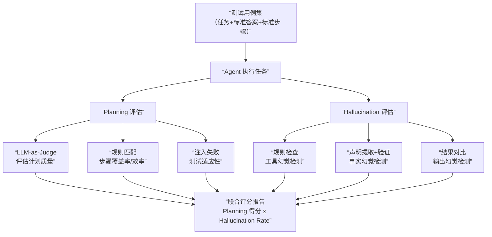
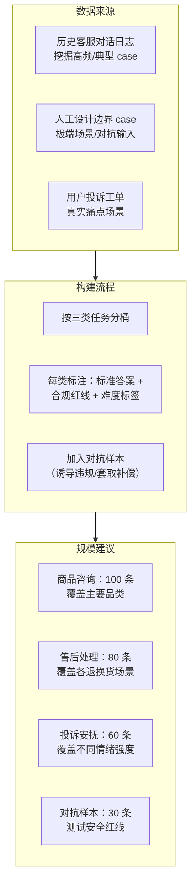

## Q：如何为 Word、PDF、Markdown 等文档生成与编辑能力设计通用自动评测框架？

> 来源：[百度 AI 测开一面](https://www.nowcoder.com/feed/main/detail/cd8e446a6ec14edfa53cf4c7b6864c4d)

**新手答**：“准备一些标准文档，用 LLM-as-Judge 比较生成内容是否相似。”

**高手答**：

文档 Agent 的输出是**可解析、可渲染、可继续编辑的工件**，不能只把文本抽出来算相似度。每条评测样本应包含输入工件、编辑指令、允许变化范围、必须保持的不变量、期望证据和风险级别；先冻结工具、字体和渲染环境，再运行同一任务，保证结果可复现。

评测拆成五层：

| 层级 | Oracle | 典型检查 |
|---|---|---|
| 文件有效性 | 格式解析器/办公软件 | 能否打开、保存、重新解析和导出 |
| 结构正确性 | AST/OOXML/PDF 对象模型 | 标题、段落、表格、图片、链接、书签和元数据 |
| 编辑语义 | 目标字段、差分和业务规则 | 指定内容已改，未授权范围未变，引用与数字一致 |
| 视觉结果 | 固定环境渲染 + 像素/布局比较 | 分页、溢出、遮挡、字体替换、表格断裂 |
| 任务过程 | Trace 与资源指标 | 工具选择、失败恢复、人工介入、耗时和成本 |

不同格式共享评测骨架，但必须先固定具体格式和方言。`.docx` 可按 [ECMA-376](https://ecma-international.org/publications-and-standards/standards/ecma-376/)检查 OOXML 包结构和文档对象，旧 `.doc` 不在该标准范围内；Markdown 则要声明 CommonMark、GitHub Flavored Markdown、kramdown 等目标方言，[CommonMark 规范与测试集](https://spec.commonmark.org/)只验证其核心语法，不覆盖所有表格、任务列表或站点扩展。PDF 更偏最终呈现，需要同时检查页面对象、文本/链接提取和固定分辨率渲染。跨格式转换还要验证语义和引用保持，不能要求内部结构逐字节相同。

确定性检查先门禁：文件损坏、Schema 错、目标字段未改、非目标区域变化或页面遮挡直接失败。只有“表达是否清晰”“摘要是否完整”这类难以程序化的语义质量才交给带固定 Rubric 的 LLM Judge，并用人工抽样校准。生成模型和 Judge 不应共享未公开金标；高风险模板还要保留独立只读验收集，防止两者一起误解需求。

报告按格式、操作类型、文档复杂度和风险切片，至少看任务通过率、结构错误率、非预期改动率、视觉回归率、可重开/导出率、人工复核成本和 P95 延迟。这样才能区分“内容写对但文件坏了”“文件能开但改错区域”和“结构正确但排版不可用”。

**差距在哪**：新手把文档当纯文本。高手用格式解析、编辑差分、业务不变量、视觉渲染和过程 trace 建立多层 Oracle，并明确确定性门禁与 LLM Judge 的边界。

---

### Q：怎么理解 Vibe Coding？你有哪些实践经验？

> 来源：蚂蚁 AI应用开发 二面【[快手 - Agent 开发岗（应用落地 + AI 工具）](https://www.nowcoder.com/discuss/926274020192841728)追问：Vibe Coding 在实际工程中的优缺点是什么？】

**新手答**：“就是用 AI 写代码，说需求然后让模型生成。”

**高手答**：

Vibe Coding 是 Andrej Karpathy 提出的概念——开发者用自然语言描述意图，AI 生成代码，开发者不逐行审查而是直接运行看效果，凭“感觉”（vibe）判断代码是否正确。核心特征：**开发者从“写代码的人”变成“描述需求+验证结果的人”**。

**适用场景和边界**：

| 场景 | 适合 Vibe Coding | 原因 |
|------|----------------|------|
| 原型验证 / 脚本 | 适合 | 快速试错，错了重来成本低 |
| UI / 前端样式 | 适合 | 视觉验证直观，改起来快 |
| 数据处理脚本 | 适合 | 输入输出明确，结果可验证 |
| 核心业务逻辑 | **不适合** | 错误难发现，后果严重 |
| 安全相关代码 | **不适合** | “看起来能跑”不等于安全 |

**实践经验**：

1. **小步快跑**：不要一次描述完整需求，而是分步骤——先搭框架 → 再填功能 → 最后优化。每步验证后再进入下一步
2. **验证比生成更重要**：AI 生成代码很快，但验证代码是否正确才是耗时的部分。好的 Vibe Coding 实践是花 20% 时间描述需求，80% 时间验证和调试
3. **知道什么时候停**：Vibe Coding 的效率在简单任务上极高，但在复杂逻辑上迅速下降。当你发现自己花更多时间解释 bug 而非描述需求时，就该切回手写代码

**对 Agent 开发的启示**：Vibe Coding 本质上就是人类使用了一个“代码生成 Agent”——用户用 NL 描述意图，Agent 调用代码生成工具执行。这个体验的好坏直接反映了 Agent 系统的核心能力：意图理解、工具调用、结果验证。

**差距在哪**：新手把 Vibe Coding 等同于“用 AI 写代码”。高手理解它的本质（角色转变：写代码→验证结果），知道适用边界（原型适合、核心逻辑不适合），且有具体的实践方法论。面试官考的是你对 AI 辅助开发的思考深度——不是“用没用过”，而是“怎么用、什么时候不用”。

---

### Q：如何衡量 Agent 的 Planning 能力 vs Hallucination Rate？请列举具体的量化评估指标或自动化评估框架

> 来源：淘天 AI Agent 一面

**新手答**：“看任务成功率就行了。”

**高手答**：

Planning 能力和 Hallucination Rate 必须**同时评估**，因为它们之间存在本质张力——规划能力越强意味着模型越敢自主决策，但自主决策越多，幻觉风险越高。只看成功率会掩盖这个矛盾：一次“碰巧成功”的幻觉规划和一次“系统性正确”的规划，在成功率上没有区别。

**Planning 能力的量化指标**：

| 指标 | 定义 | 评估方法 |
|------|------|---------|
| 计划完整度（Plan Completeness） | 生成的计划是否覆盖了任务所需的所有关键步骤 | 与标准步骤列表对比，计算覆盖率 |
| 步骤正确率（Step Correctness） | 每一步的动作和参数是否正确 | 逐步对比标准答案，人工或 LLM 评判 |
| 工具选择准确率（Tool Selection Accuracy） | 是否选择了最合适的工具 | 与标注的最优工具选择对比 |
| 计划效率（Plan Efficiency） | 实际步数 vs 最优步数 | 比值越接近 1 越好，>2 说明有冗余 |
| 计划适应性（Plan Adaptability） | 遇到工具失败或意外结果时能否调整计划 | 故意注入失败，观察恢复行为 |
| 子目标分解质量 | 复杂任务是否被合理拆解为可执行的子任务 | LLM-as-Judge 评分（1-5 分） |

**Hallucination Rate 的量化指标**：

| 指标 | 定义 | 评估方法 |
|------|------|---------|
| 忠实度（Faithfulness） | 回答是否忠实于检索到的证据 | RAGAS Faithfulness 指标，或人工标注 |
| 事实基础率（Factual Grounding Rate） | 输出中有多少比例的陈述可以追溯到可靠来源 | 逐句标注来源，计算有来源覆盖的比例 |
| 无依据声明率（Unsupported Claim Ratio） | 输出中无法在上下文或知识库中找到支撑的声明占比 | 自动提取声明 → 逐条验证 → 计算比例 |
| 工具幻觉率（Tool Hallucination Rate） | 调用不存在的工具或使用不合法参数的比例 | 规则检查：工具名 ∈ 可用列表？参数符合 schema？ |
| 结果幻觉率 | 声称工具返回了某结果但实际返回不同 | 对比模型声称的工具结果与实际工具返回值 |

**核心矛盾：Planning 越强，Hallucination 风险越高**

```text
Planning 自主性光谱：
低自主 ──────────────────────────── 高自主
固定流程    受限规划    自由规划    完全自主
幻觉风险低              幻觉风险高
能力上限低              能力上限高

→ 评估不能只看一端，要画出”能力-幻觉”的帕累托曲线
```

所以评估框架必须同时覆盖两个维度，生成类似这样的联合报告：

```text
Agent A：Planning 得分 82，Hallucination Rate 15% → 高能力、中风险
Agent B：Planning 得分 78，Hallucination Rate 5%  → 中能力、低风险
Agent C：Planning 得分 90，Hallucination Rate 30% → 高能力、高风险（不可上线）
```

**自动化评估框架对比**：

| 框架 | 核心能力 | Planning 评估 | Hallucination 评估 |
|------|---------|-------------|-------------------|
| RAGAS | RAG 管线自动评测 | 不直接支持 | Faithfulness、Answer Relevancy |
| AgentBench | Agent 多场景基准测试 | 任务完成率、步骤效率 | 间接（通过错误分析） |
| ToolBench | 工具调用能力评测 | 工具选择准确率、调用链正确性 | 工具幻觉率 |
| 自建评估管线 | 定制化全维度评估 | LLM-as-Judge + 规则打分 | 声明提取 + 来源验证 |

**自建管线的推荐做法**：



LLM-as-Judge 用于评估 Planning 质量（计划是否合理、步骤是否冗余），规则检查用于 Hallucination 检测（工具名是否存在、参数是否合法、引用的事实是否有来源）。两类评估互补：LLM 擅长语义判断，规则擅长精确校验。

**差距在哪**：新手只看“任务成功率”——这是一个结果指标，无法区分“系统性正确”和“碰巧成功”，更无法暴露潜在的幻觉风险。高手同时评估 Planning 能力和 Hallucination Rate，认识到两者之间的张力关系，并用多框架组合（LLM-as-Judge + 规则检查 + 注入测试）构建完整的评估管线。面试官考的是你有没有“评估即工程”的思维——不是跑一个 benchmark 就完了，而是要建一套持续运行的评估体系。

---

### Q：设计一个电商客服 Agent 的评测方案——商品咨询、售后处理、投诉安抚三类任务如何分别评估？

> 来源：淘天 AI Agent 一面（场景题）

**新手答**：“看客服满意度评分。”

**高手答**：

电商客服 Agent 的三类任务——商品咨询、售后处理、投诉安抚——**评测维度和指标必须分开设计**，因为它们的成功标准完全不同。

**分任务评测维度**：

| 维度 | 商品咨询 | 售后处理 | 投诉安抚 |
|------|---------|---------|---------|
| 核心目标 | 回答准确、促进转化 | 问题解决、流程合规 | 情绪缓解、用户留存 |
| 准确性指标 | 商品信息正确率（价格/规格/库存） | 政策引用正确率（退换货规则） | 情绪识别准确率 |
| 效率指标 | 平均响应时间、对话轮数 | 问题解决时长、一次解决率 | 情绪转正轮数 |
| 质量指标 | 推荐相关度、交叉销售率 | 解决方案合理性、用户确认率 | 共情表达质量、升级率（越低越好） |
| 安全指标 | 不承诺虚假信息 | 不违反退换货政策 | 不激化矛盾、不做超权限承诺 |

**投诉安抚场景的特殊指标设计**——用户满意度很难直接衡量，需要**代理指标**：

| 代理指标 | 如何采集 | 为什么能反映满意度 |
|---------|---------|------------------|
| 情绪转正率 | 对话开始和结束时的情绪分类（NLP 情感分析） | 从负面转为中性/正面说明安抚有效 |
| 情绪转正轮数 | 首次情绪转正时的对话轮次 | 轮数越少说明安抚效率越高 |
| 升级人工率 | 安抚后仍要求转人工的比例 | 越低说明 Agent 安抚能力越强 |
| 复访投诉率 | 同一用户 7 天内再次投诉的比例 | 低说明问题真正被解决，不是敷衍过去的 |
| 主动评分率 | 用户主动给好评的比例（非弹窗请求） | 主动好评比被动评分更真实 |
| 会话完成率 | 用户在对话中途离开的比例 | 高离开率说明用户对 Agent 回复不满 |

**评测数据集构建**：



**判定 Agent 好坏的综合评分**：

不能用一个分数定生死——三类任务加权，且有**一票否决**机制：

```text
综合得分 = 0.4 × 商品咨询得分 + 0.3 × 售后处理得分 + 0.3 × 投诉安抚得分

一票否决项（触发任何一项直接判定不合格）：
  - 承诺虚假商品信息（价格/功能/库存）
  - 违反退换货政策做出超权限承诺
  - 回复激化用户情绪（情绪恶化率 > 5%）
  - 泄露其他用户信息
```

**差距在哪**：新手只想到一个“满意度”数字。高手把三类任务的评测维度完全拆开——商品咨询看准确性和转化，售后看解决率和合规，投诉安抚用情绪转正率等代理指标替代难以直接衡量的满意度。面试官用这个场景题考的是你能不能把抽象的“Agent 评测”落地到具体业务场景中，且能设计出可量化、可采集的指标体系。
