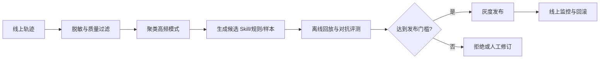

## Q：Agent 自进化闭环如何设计？怎样判断沉淀出的经验值得进入系统？

> 来源：字节/Agent 开发实习生一面 【电商库存一面追问：人工审批、C 端灰度与回滚】【字节火山引擎 Managed Agent 一面追问：自动更新 AGENTS.md / Skills 后如何验证提升】【[阿里控股 Agent Infra 二面](https://www.nowcoder.com/feed/main/detail/627844d5923149b6ac46a631b2b41d5a)项目深挖】

**新手答**：“收集成功案例，让模型总结成 Skill，再自动更新。”

**高手答**：

自进化不是让 Agent 随意改 Prompt，而是受控的经验生产与发布流水线：

候选经验至少满足四个门槛：可复现，不依赖偶然上下文；有覆盖率，能解决一类问题；无回归，在固定集上不伤害旧能力；可治理，来源、版本、权限和回滚路径清晰。候选产物不能自行进入生产，必须由明确的业务或技术 Owner 审批；高风险变更还要经过安全、合规或领域专家复核。产物可以是 Skill、路由规则、评测 case 或训练样本，不应默认直接改模型权重。

C 端发布的门槛要更严：先用影子流量验证，再按用户或会话稳定分桶做小比例金丝雀；实时观测任务成功率、投诉/违规率、工具副作用、延迟和成本，并为关键指标设置自动停止与回滚阈值。每次发布都绑定候选来源、评测报告、审批人、Prompt/模型/Skill 版本和回滚目标，保证出现问题时能定位到具体变更，而不是只知道“自进化后效果变差了”。

落到真实项目时，闭环中的每个候选还应有独立 `candidate_id`，关联产生它的失败 Trace、去重后的模式、适用边界、修改 diff 和审批记录。离线对照要同时跑“该类失败样本、相邻场景和冻结回归集”，灰度时保留未使用候选的对照流量；只有收益能归因到这次变更，且重复运行稳定、没有把失败转移到其他切片，才允许晋级。个人简历里的单次指标提升不能替代这些可复核证据。

**差距在哪**：新手把自进化理解成“模型自改 Prompt”，高手设计了数据过滤、候选生成、离线评测、灰度和回滚的闭环。面试官考的是如何让学习发生，同时不失去系统控制权。
