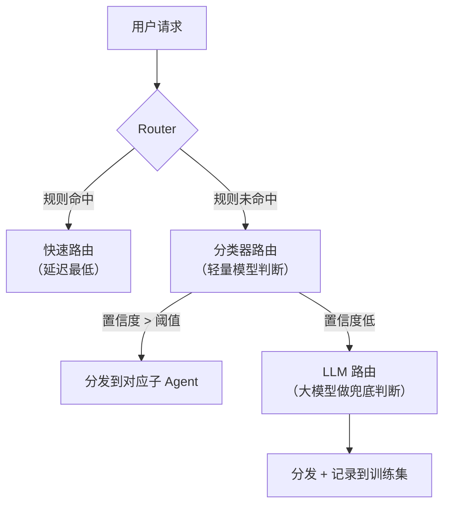
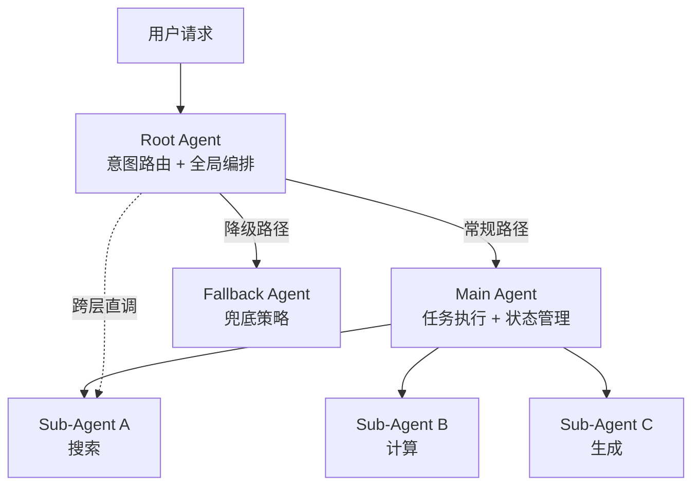
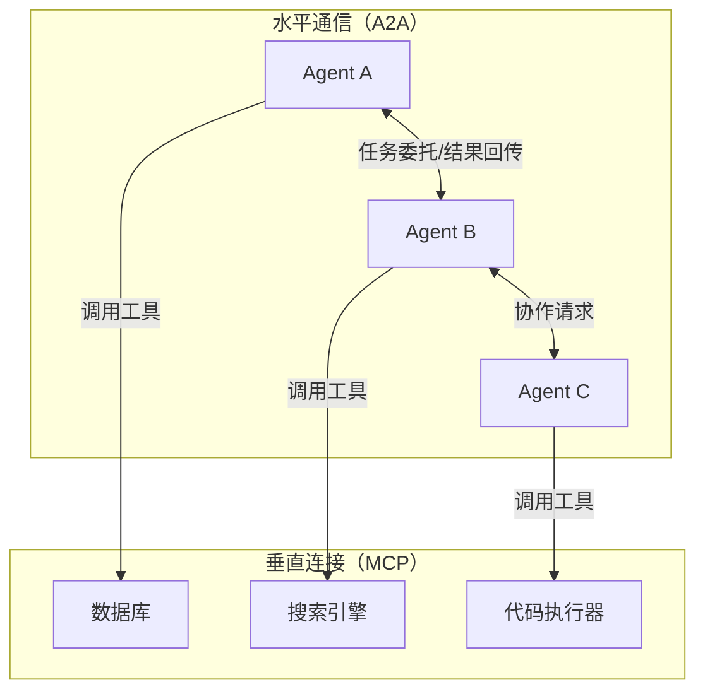
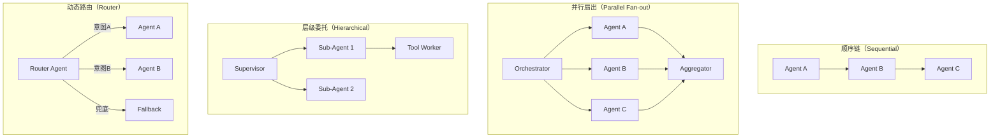

## 编排与路由

### Q：Multi Agent 系统中 Router 节点依据什么规则把任务分给子 Agent？

> 来源：淘天 AI Agent 二面【[虾皮Agent一面](https://www.nowcoder.com/feed/main/detail/409dc8793a7b450eb51ee32c2b923d49)追问：复杂任务场景下，中心调度 Agent 如何路由调用不同的 subAgent？】

**新手答**：“根据关键词匹配分发。”

**高手答**：

Router 是多 Agent 系统的“调度中枢”，它的分发质量直接决定系统上限。分发规则从简单到复杂有**三个层次**：

| 层次 | 方法 | 原理 | 适用场景 |
|------|------|------|---------|
| 规则路由 | 关键词/正则/意图标签匹配 | 预定义路由表，命中即分发 | 意图类型少且边界清晰 |
| 分类器路由 | 轻量分类模型（如 BERT 意图分类器） | 用标注数据训练，输出意图类别 + 置信度 | 意图类型多但有训练数据 |
| LLM 路由 | 让大模型根据任务描述选择子 Agent | Prompt 中列出子 Agent 的能力描述，模型做推理选择 | 开放域任务、难以预定义路由规则 |

**生产级 Router 的设计要点**：



**级联路由**：先用规则（零延迟），命中就走；未命中再用分类器（毫秒级）；分类器置信度低才调 LLM（百毫秒级）。这样 80% 的请求被规则/分类器快速分发，只有边界 case 才用 LLM 做精细判断。

**Router 分发信息应包含什么**：

```text
路由结果 = {
    target_agent: "售后处理 Agent",
    confidence: 0.92,
    task_summary: "用户要求退货，订单号 xxx",
    context_slice: [必要的上下文片段],
    fallback_agent: "通用客服 Agent"  // 目标 Agent 无法处理时的降级
}
```

不只是“发给谁”，还要带上**任务摘要**（避免子 Agent 重新解析原始输入）、**上下文切片**（只给必要信息，不给全量历史）、和**降级路径**。

**Router 的常见失败模式**：

| 失败模式 | 表现 | 解决方案 |
|---------|------|---------|
| 意图重叠 | 两个子 Agent 都能处理，Router 随机分 | 定义优先级 + 能力边界文档 |
| 意图漂移 | 对话中途用户换了话题，但 Router 没重新判断 | 每轮都重新路由，不只在首轮 |
| 置信度盲区 | 分类器给了 0.5 的置信度，不知道分给谁 | 设阈值兜底到 LLM 路由或人工 |
| 路由死循环 | A 转给 B，B 转给 A | 加路由计数器，超过 N 次强制升级 |

**差距在哪**：新手只想到关键词匹配——这在复杂场景下很快失效。高手有三层级联路由（规则 → 分类器 → LLM）的架构设计，且考虑了分发信息完整性、降级路径和常见失败模式。面试官考的是你对多 Agent 编排中“调度”这个关键环节的工程化认知。

**追问：LLM 路由 vs 规则路由，分别有什么优劣势？**

> 来源：阿里淘天 AI应用开发一面

| 维度 | 规则路由 | LLM 路由 |
|------|---------|---------|
| 延迟 | 微秒级，近乎零延迟 | 百毫秒~秒级，需要一次 LLM 推理 |
| 成本 | 零额外成本 | 每次路由消耗 token |
| 可解释性 | 完全透明，规则可审计 | 黑箱，模型可能给不出路由理由 |
| 灵活性 | 差，新意图必须手动加规则 | 强，能处理未见过的意图类型 |
| 准确性（边界清晰场景） | 高，精确匹配不出错 | 可能过度推理导致误分发 |
| 准确性（模糊场景） | 低，规则覆盖不到的全部漏掉 | 高，能做语义级理解 |
| 维护成本 | 规则越多越难维护 | 只需维护 Agent 能力描述 |

**实际选型建议**：不是二选一，而是级联——规则兜已知意图（快+稳），LLM 兜未知意图（灵活），两者互补。

---

### Q：详细介绍多智能体协同策略——三层 Agent（Root / Main+Fallback / Sub-Agent）是怎么配合流转的？主 Agent 越过中间层直接调子 Agent 时，上下文怎么跨层传递？

> 来源：淘天 Agent 开发【[虾皮Agent一面](https://www.nowcoder.com/feed/main/detail/409dc8793a7b450eb51ee32c2b923d49)追问：多层子 Agent 调用会不会造成中心调度 Agent 上下文爆炸？怎么解决？】

**新手答**：“Root 分发任务，Main 执行，Sub-Agent 做具体工具调用。上下文通过全局变量共享。”

**高手答**：

三层 Agent 架构是处理复杂任务时的经典设计——每一层解决不同粒度的问题：

**架构设计**：



| 层级 | 职责 | 决策范围 |
|------|------|---------|
| **Root** | 意图分类、路由分发、全局异常处理 | 决定「谁来做」 |
| **Main / Fallback** | 任务执行、子任务拆解、结果聚合 | 决定「怎么做」 |
| **Sub-Agent** | 单一能力执行（检索、API 调用、格式化） | 决定「做的细节」 |

**流转机制**：

1. **正常流转**：Root 解析意图 → 路由到 Main Agent → Main 拆解为子任务 → 分发给 Sub-Agent → 结果回流到 Main 聚合 → 返回 Root → 输出
2. **Fallback 触发**：Main Agent 执行失败（超时/错误/置信度低）→ Root 降级到 Fallback Agent（简化策略、规则兜底或直接拒绝）
3. **跨层直调**：Root 识别到某些简单任务不需要经过 Main 的拆解 → 直接调用 Sub-Agent

**跨层上下文传递——不是全局变量，是结构化消息**：

全局变量共享在多 Agent 系统里是反模式——会导致上下文污染和并发冲突。正确做法是**结构化消息传递**：

```text
Root → Sub-Agent 直调时的上下文包：
{
  "intent": "搜索最新政策",        // Root 解析的意图
  "constraints": {"时效性": "7天内"},  // Root 提取的约束
  "context_snapshot": "用户正在咨询...", // 压缩后的会话摘要
  "trace_id": "req-12345"           // 全链路追踪 ID
}
```

关键设计原则：

| 原则 | 做法 |
|------|------|
| **最小上下文** | 每层只传递下一层需要的信息，不传完整对话历史 |
| **结构化而非自由文本** | 用 JSON schema 约束字段，防止信息丢失或格式混乱 |
| **只读快照** | Sub-Agent 拿到的是上下文快照，不能修改上层状态 |
| **结果回传统一格式** | Sub-Agent 返回标准化结果，Main/Root 按需解析 |

**差距在哪**：新手用全局变量做上下文共享——这在生产中会导致并发冲突和上下文污染。高手用结构化消息传递 + 最小上下文原则，既保证了信息完整性，又避免了跨层耦合。面试官考的是你对多层 Agent 系统的工程化设计能力。

---

### Q：Multi-Agent 如何通信？不同项目分别用了哪些通信方法？

> 来源：币安 AI大模型实习一面 / [中兴软开一面](https://www.nowcoder.com/feed/main/detail/0b39815babfb47108464ffabdf929eba)

**新手答**：“Agent 之间通过消息传递通信。”

**高手答**：

Multi-Agent 通信没有唯一标准，不同项目根据设计哲学选了不同方案。关键是理解**为什么选这种方式**：

**通信模式分类**：

| 通信模式 | 原理 | 代表项目 | 适合场景 |
|---------|------|---------|---------|
| 结构化消息传递 | JSON 消息体带 task_id/role/payload | OpenAI Agents SDK (Handoff) | 任务明确、Agent 间接口清晰 |
| 共享状态黑板 | 中央 State Store，Agent 订阅/写入 | LangGraph（State 对象）、AutoGen | 需要多 Agent 协作修改同一状态 |
| 文件系统中继 | 通过 .md 文件 / git 传递上下文 | Claude Code（CLAUDE.md + Memory） | 人机混合协作、需要人工审查 |
| 事件驱动 | Pub/Sub 模式，Agent 监听事件触发 | Hermes、企业级 Agent 编排 | 解耦强、Agent 数量多 |
| 函数调用委托 | 主 Agent 直接调用子 Agent 作为“工具” | Claude Code（Agent tool）、OpenClaw | 层级关系明确的主从模式 |
| 开放协议（A2A） | Agent Card + Task 生命周期 + JSON-RPC | Google A2A Protocol | 跨框架、跨组织的 Agent 互操作 |

**具体项目对比**：

**Claude Code**：主 Agent 通过 Agent tool 派发子任务（prompt 即通信协议），子 Agent 返回结构化结果。上下文隔离靠独立对话窗口，持久化靠 Memory 文件。通信代价极低——一个函数调用就完成了委托和回收。

**Codex**：多 Agent 通过 git worktree 隔离工作空间，通信靠 PR/commit message。适合并行开发——本质上是“用版本控制做 Agent 间协调”，天然支持冲突检测和合并。

**OpenClaw**：分层压缩记忆 + .md 文件作为 human-in-the-loop 审查接口。Agent 间通过事件触发流转，每次流转都经过人工可审查的中间态。

**Hermes**：情景记忆（Episodic Memory）+ 双索引（语义 + 时间），Agent 间通过事件关联度匹配触发——不是“A 通知 B”，而是“B 订阅了某类事件，A 的输出恰好匹配”。

工程选型要先确定通信边界：进程内可以传引用，但仍需单写者和版本控制；跨进程必须定义可序列化 schema、消息大小与超时；跨服务还需要鉴权、幂等键、重试、背压和死信处理。共享内存、API 和事件总线不是只换一种传输，而是将状态所有权、故障域和一致性责任放在不同位置。

**MCP vs A2A 协议层次区分**：



- **MCP**：解决 Agent → 工具/资源 的连接，类比 USB 接口接外设
- **A2A**：解决 Agent → Agent 的跨框架互操作，类比 HTTP 让不同服务互相调用
- 两者协同：A2A 负责水平通信（Agent 间委托任务），MCP 负责垂直连接（Agent 调工具）

**A2A 核心设计**：Agent Card（`/.well-known/agent.json` 声明能力）→ Task 生命周期（submitted → working → completed）→ 支持多轮交互和长时间运行任务。

**差距在哪**：新手只说“消息传递”——这等于没说。高手分析了六种通信模式各自的适用场景，且用具体项目对比说明了设计背后的取舍。面试官考的是你对 Agent 生态的广度认知——不只是“用过一个框架”，而是理解不同框架的通信哲学差异。

---

### Q：多 Agent 怎么编排的？用的什么编排模式？

> 来源：百度实习 AI 应用开发一面

**新手答**：“一个调一个，串行执行。”

**高手答**：

多 Agent 编排的本质是**决定谁在什么时候做什么、信息怎么流转**。不同任务复杂度对应不同的编排模式，没有万能方案：

**四种核心编排模式**：



| 编排模式 | 适用场景 | 优点 | 缺点 |
|---------|---------|------|------|
| **顺序链** | 流程固定、步骤间有依赖 | 简单可控、易调试 | 延迟线性增长、一步出错全链断 |
| **并行扇出** | 子任务独立、可并发 | 总延迟 = 最慢子任务 | 需要聚合逻辑、结果可能冲突 |
| **层级委托** | 复杂任务需要递归拆解 | 灵活、支持动态子任务 | 嵌套深度需限制、token 成本高 |
| **动态路由** | 多意图入口、一对多分发 | 解耦、易扩展新 Agent | 路由准确率是瓶颈 |

**工程实现的关键决策**：

1. **编排层用代码还是模型？** 生产环境中，主干流程用代码（状态机/DAG）编排，只在需要灵活判断的节点让模型参与路由决策。纯模型编排的不可控风险太高
2. **状态怎么传递？** Agent 之间传递结构化的 State 对象（不是自然语言），包含任务上下文、已完成步骤、中间结果。用共享 State Store（如 Redis）或消息传递（如事件总线）实现
3. **失败怎么处理？** 每个 Agent 节点需要独立的超时和重试策略。关键路径上的 Agent 失败要触发降级或回退，而非让整个编排链崩溃

**实际项目中的常见做法**：

大多数生产系统是**混合编排**——主流程用顺序链保证确定性，子任务内部用并行扇出提升效率，复杂决策节点用层级委托处理。纯用一种模式的系统很少见。

**差距在哪**：新手只想到串行调用——这是最简单的编排模式，且没有容错。高手给出了四种编排模式及其适用场景，且指出生产系统通常是混合编排，关键在于编排层用代码控制主干、状态用结构化对象传递、失败有独立恢复策略。面试官考的是你对多 Agent 系统编排的全局视野。

---

### Q：Multi-Agent 中心化编排模式 vs 点对点架构，核心区别和优势是什么？

> 来源：蚂蚁 AI应用开发 二面

**新手答**：「中心化就是有一个主 Agent 指挥别人，点对点是大家直接通信。」

**高手答**：

两种模式的核心区别在于**控制权的分布方式**：

| 维度 | 中心化编排 | 点对点（P2P） |
|------|-----------|-------------|
| 控制权 | 集中在 Orchestrator | 分散在各 Agent |
| 通信模式 | Hub-and-Spoke（星型） | Mesh（网状） |
| 任务分配 | Orchestrator 统一分配 | Agent 间协商或广播 |
| 全局视角 | Orchestrator 掌握全局状态 | 无单一节点有全局视角 |
| 故障影响 | Orchestrator 故障则全局瘫痪 | 单点故障只影响局部 |

**中心化编排的核心优势**：

1. **全局最优调度**：Orchestrator 知道所有子 Agent 的能力和当前负载，能做出全局最优的任务分配决策。P2P 模式下每个 Agent 只有局部信息，容易出现任务冲突或重复执行
2. **一致性保障**：状态集中管理，不会出现「A 以为 B 做完了，B 以为 A 在做」的不一致问题
3. **可观测性**：所有通信经过中心节点，天然有完整的执行链路日志。P2P 的通信分散在各节点之间，追踪和调试困难
4. **流程控制简单**：优先级、超时、取消等控制逻辑只需在 Orchestrator 实现一次

**P2P 的适用场景**：

当 Agent 数量多、任务高度并行、且不需要严格的全局协调时，P2P 更合适——比如信息收集类任务，多个 Agent 各自检索不同来源，结果最后汇总。

**生产实践中的选择**：绝大多数生产系统选中心化编排。原因很实际——可调试性和可控性远重于理论上的去中心化优势。Agent 系统的核心挑战不是「能不能跑」，而是「出了问题能不能查」，中心化在这方面有压倒性优势。

**差距在哪**：新手只说了「一个指挥、一个直接通信」的表面区别。高手从控制权分布、全局视角、一致性、可观测性四个维度做了系统对比，且给出了生产实践中的选择建议和理由。面试官考的是你对多 Agent 系统的工程权衡——不是哪个更「先进」，而是哪个更「可控」。

---

### Q：为什么大家都在用 Multi-Agent？从一开始到现在原因是否有变化？

> 来源：币安 AI大模型实习一面

**新手答**：“因为单 Agent 做不了复杂任务，所以要拆成多个。”

**高手答**：

Multi-Agent 的流行原因经历了**本质性转变**——从“不得不拆”到“拆了更好”：

**早期原因（2023）——能力不足的变通方案**：

单 Agent 的硬性限制迫使开发者拆分：
- 上下文窗口只有 4K-8K，一个复杂任务的中间状态就能塞满
- 工具调用不稳定，调用链越长出错概率越高
- 推理能力弱，长链路推理容易塌缩

所以当时拆 Multi-Agent 的本质是“**降低单次推理的复杂度**”——每个 Agent 只做一件小事，降低单点失败率。

**现在的原因（2025）——工程最佳实践**：

模型能力大幅提升（200K 窗口、稳定工具调用、强推理），单 Agent 理论上能做更多事了。但 Multi-Agent 依然是主流，原因变了：

| 维度 | 早期动机 | 现在动机 |
|------|---------|---------|
| 上下文 | 窗口太小放不下 | 隔离后每个 Agent 推理质量更高（减少干扰） |
| 专业化 | 模型不够强，需要简化任务 | 针对性 Prompt + 工具集比“全能”更稳定 |
| 并行 | 串行太慢 | 独立子任务并行，总延迟 = 最慢的那个 |
| 可观测性 | 没考虑 | 每个 Agent 可独立追踪、调试、替换 |
| 容错 | 没考虑 | 局部失败不影响全局，可精准重试 |

**本质变化**：从“能力不足的补丁”变成了“工程最佳实践”。

类比微服务演进：不是因为单体“不能跑”才拆微服务，而是因为分开更好维护、更好扩展、更好监控。Multi-Agent 是同样的逻辑——**分离关注点**在任何复杂系统里都是对的。

**一个反直觉的观察**：2025 年模型更强了，但 Multi-Agent 反而**更**流行了。因为模型能力提升让每个子 Agent 更可靠，Multi-Agent 系统的“通信税”相对于每个 Agent 的产出质量来说变得更值得了。以前拆了可能每个 Agent 都不靠谱，现在拆了每个 Agent 都很稳——拆的收益放大了。

**差距在哪**：新手只给出了“复杂任务需要拆分”这一个静态理由。高手梳理了 Multi-Agent 流行原因的演化——从被动应对到主动选择，且用微服务类比说清了本质逻辑。面试官考的是你对技术趋势的深度认知——不只是“知道大家在用”，而是“理解为什么在用、为什么现在还在用”。
