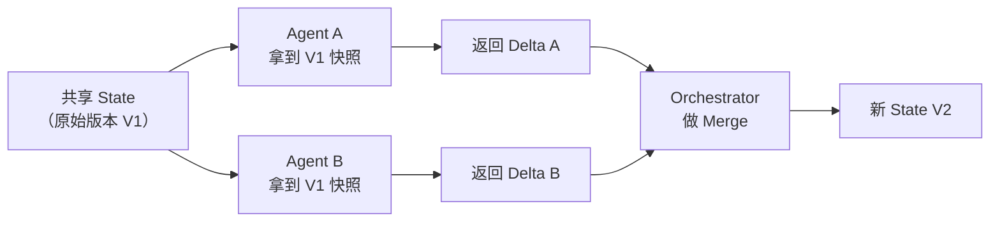

## Q：多个 Agent 并行跑的时候状态竞争怎么避免？

> 来源：淘天/AI Agent一面

**新手答**：“加锁。”

**高手答**：

首先明确：Agent 并行的“状态竞争”不同于传统并发——Agent 写的是“上下文/全局 State”，而非数据库行。传统的 mutex/锁在这里不是最优解，因为 Agent 操作粒度大、执行时间长，加锁会导致严重的性能退化。

**三种策略（从简到复杂）**：

| 策略 | 原理 | 适用场景 | 实现复杂度 |
|------|------|---------|-----------|
| State 分片（最推荐） | 每个 Agent 只写自己的 namespace | 任务可拆分、无共享写 | 低 |
| 写时复制（Copy-on-Write） | 每个 Agent 拿快照副本，执行完返回 delta | 需要读共享状态但写冲突少 | 中 |
| 悲观锁 | 对共享字段加 mutex | 多 Agent 必须写同一字段 | 高（会退化为串行） |

**策略一：State 分片（根本消除竞争）**

```text
全局 State = {
    agent_a.result: ...,    // Agent A 独占写
    agent_b.result: ...,    // Agent B 独占写
    agent_c.result: ...,    // Agent C 独占写
    final_output: ...       // 只有 Orchestrator 写
}
```

每个 Agent 只写自己的 namespace（如 `agent_a.result`），最后由 orchestrator 读取所有分片、合并生成最终输出——从设计上就不存在竞争。

**策略二：写时复制（COW）**



每个 Agent 拿到 State 的只读快照副本，执行完后返回变更增量（delta），orchestrator 负责合并。冲突时 orchestrator 裁决（可按优先级、时间戳或语义判断）。

**策略三：悲观锁（仅极端场景）**

当多个 Agent 必须写同一个字段时（如共同维护一个待办列表），才使用 mutex。但这本质上让并行退化为串行——如果频繁出现这种需求，说明你的任务拆分有问题。

**LangGraph 的做法**：

State 是 TypedDict，每个节点的返回值是 partial update，框架自动做 reducer merge（类似 Redux 的 reducer 模式）：

```text
Node A 返回: {"messages": [new_msg_a]}
Node B 返回: {"messages": [new_msg_b]}
Reducer（add_messages）: 自动合并为 {"messages": [...existing, new_msg_a, new_msg_b]}
```

**最佳实践**：设计 State Schema 时就避免写冲突——如果两个 Agent 需要写同一个字段，说明你的**任务拆分有问题**，应该回到架构设计层面解决，而不是在运行时用锁来补救。

**差距在哪**：面试官考的是对状态管理范式的理解——不是“加锁”那么简单，而是通过设计规避竞争。State 分片是最优解，COW 是次优解，加锁是最后手段。这和分布式系统中“shared-nothing 架构优于 shared-everything”是同一个原则。
