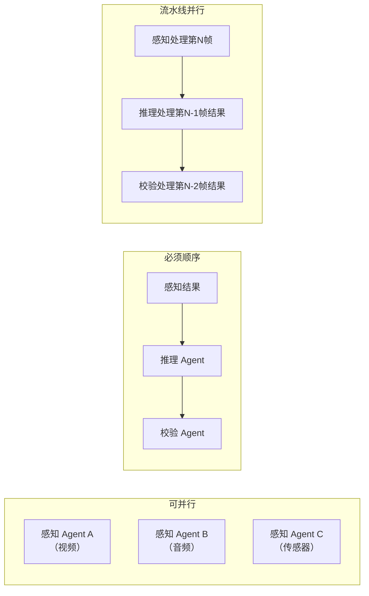

## Q：如果拆成感知/推理/校验 Agent，哪些能并行哪些要顺序，什么时候需要反向通信？

> 来源：商汤/大模型算法应用实习二面

**新手答**：“顺序执行就好了，感知→推理→校验。”

**高手答**：

纯顺序执行是最简单但最慢的方案。实际系统中需要精确分析依赖关系，最大化并行度。

**并行性分析**：



| 关系类型 | 具体场景 | 处理方式 |
|---------|---------|---------|
| 可并行 | 多个感知 Agent 同时处理不同模态数据 | Fan-out 并行，结果汇总后再进入推理 |
| 可并行 | 同一推理结果的多个校验维度（语法/语义/安全） | 校验 Agent 并行跑，结果合并 |
| 必须顺序 | 感知→推理（推理依赖感知结果） | 串行，上游完成才触发下游 |
| 必须顺序 | 推理→校验（校验需要推理输出） | 串行 |
| 可部分并行 | 流水线模式 | 感知处理第 N 帧时，推理可以处理第 N-1 帧 |

**反向通信场景**：

正向是感知→推理→校验，但三种情况需要**反向通知**：

| 反向通信 | 触发条件 | 处理方式 |
|---------|---------|---------|
| 校验→推理 | 校验失败，推理需要重新规划 | 反馈驱动的迭代：校验 Agent 把失败原因和修改建议回传推理 Agent |
| 推理→感知 | 推理发现信息不足，需要补充数据 | 主动探索：推理 Agent 告诉感知 Agent“需要重新采集 X 方面的数据” |
| 下游→上游 | 下游发现上游输出格式错误 | 上游修正并重发（通常只重试一次） |

**通信协议设计**：

用“事件总线”而非直接调用——解耦生产者和消费者，支持异步反向通知：

```text
正向事件：perception.completed → reasoning.started → verification.started
反向事件：verification.failed → reasoning.retry_requested
          reasoning.info_needed → perception.rescan_requested
```

**反向通信的终止条件**：设置最大反馈轮次（如 3 次），超过则降级处理——输出当前最优结果 + 置信度标注，不再循环。

**差距在哪**：面试官考的是对 DAG vs 循环图的理解，以及何时引入反馈环路的判断力。纯顺序暴露的是“没考虑过并行优化”，而盲目并行暴露的是“不理解数据依赖”。正确答案是精确分析依赖、最大化并行、有限反馈循环。
