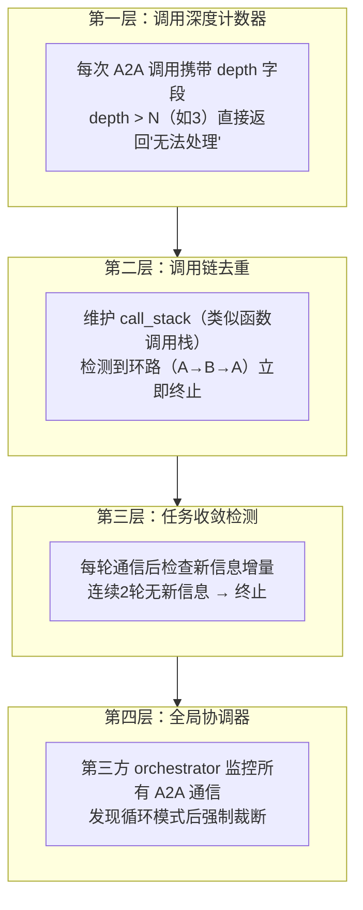

## Q：在 A2A 场景下，如何防止两个 Agent 陷入递归对话？

> 来源：AI应用开发进阶面

**新手答**：“设置最大轮次限制。”

**高手答**：

最大轮次是必要的兜底，但只靠它意味着你允许系统白白浪费 N 轮资源后才停下来。需要更早发现和阻断递归。

**递归对话的成因**：Agent A 请求 Agent B 帮助 → B 发现需要 A 的信息 → 再问 A → A 又问 B... 本质是**分布式死锁**——两个节点互相等待对方提供信息。

**四层防递归机制**：



**各层详解**：

| 层级 | 机制 | 检测时机 | 成本 |
|------|------|---------|------|
| 调用深度计数器 | 每次调用 depth+1，超过阈值拒绝 | 发起调用前 | 零成本，一次判断 |
| 调用链去重 | 维护调用栈，检测 A→B→A 环路 | 发起调用前 | 栈查找，O(n) |
| 任务收敛检测 | 对比本轮和上轮的信息增量 | 收到响应后 | 语义对比，有计算成本 |
| 全局协调器 | 监控所有 Agent 间通信拓扑 | 持续监控 | 需要独立服务 |

**A2A 协议层支持**：

Google A2A 协议中，TaskState 的 `BLOCKED` 状态可以标记任务卡死。当一个 Task 在两个 Agent 之间反复流转超过阈值时，协议层自动将任务状态设为 `BLOCKED`，触发超时回收。

**根本解决——设计层面杜绝递归**：

在 Agent 的 system prompt 中明确约束：**“你不能向请求你的 Agent 发起反向请求”**。用 prompt 约束 + 协议层校验双重保险：

```text
System Prompt 约束：
  "当你收到来自其他 Agent 的请求时，你只能基于自己已有的能力和数据回答。
   如果信息不足，返回'信息不足，需要用户提供'，而不是向请求方反向提问。"

协议层校验：
  A2A 消息头中携带 origin_agent_id，
  如果目标 Agent 尝试向 origin_agent_id 发起新请求 → 直接拦截
```

**差距在哪**：面试官考的是对分布式系统死锁问题的理解——A2A 递归本质就是分布式死锁。只设最大轮次是“让死锁超时后自己断”，而调用链去重+收敛检测+prompt约束是“从根本上不让死锁发生”。前者浪费资源，后者预防问题。
