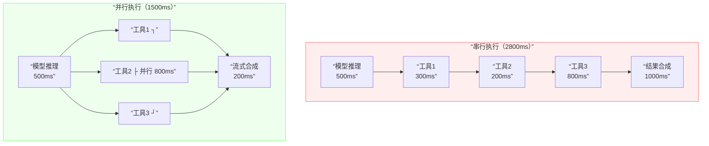
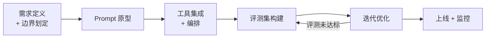
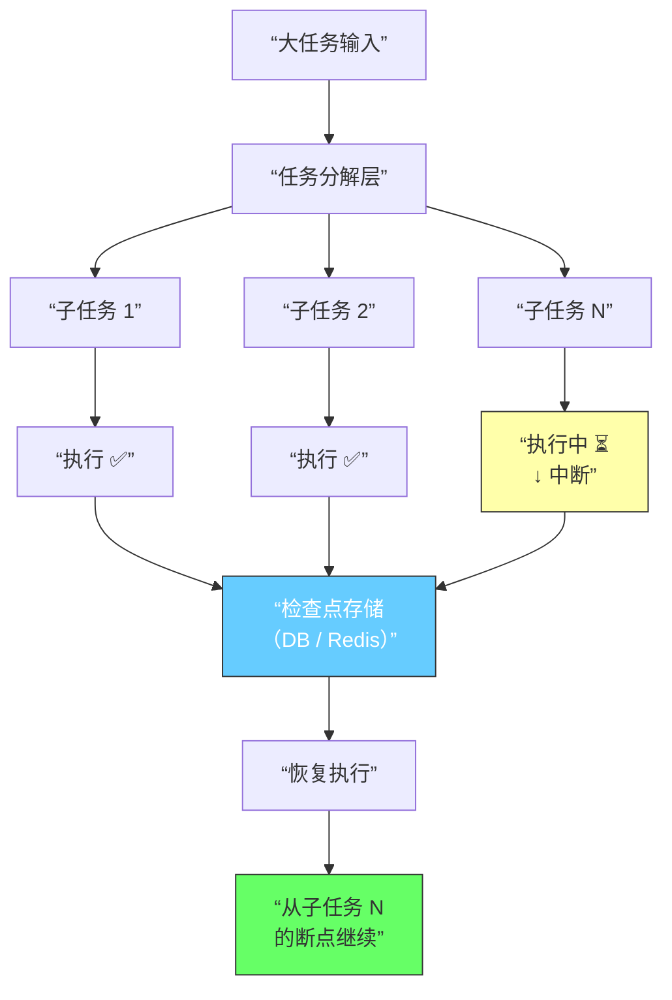

## 性能与延迟优化

### Q：AI 应用中 SSE 流式数据怎么处理？数据格式是什么？

> 来源：百度实习 AI 应用开发一面【[字节agent一面](https://www.nowcoder.com/feed/main/detail/612a1c20eea744a288b142f5b43f57e1)追问：SSE 在项目里用来做什么？推送的数据格式是什么样？】【[百度Agent一面](https://www.nowcoder.com/feed/main/detail/72858aade19d443facc870fea8bb134f)追问：有流式输出吗？具体的流式响应是怎么处理的？】

**新手答**：“就是后端一直发数据，前端一直收。”

**高手答**：

SSE（Server-Sent Events）是 AI 应用做流式输出的主流方案——模型逐 token 生成，后端逐 token 推送，用户不需要等全部生成完就能看到内容。

**SSE 数据格式**：

SSE 是纯文本协议，每条消息由字段组成，消息之间用空行分隔：

```text
event: message
data: {“content”: “你”, “role”: “assistant”}

event: message
data: {“content”: “好”, “role”: “assistant”}

event: done
data: [DONE]
```

| 字段 | 作用 | 示例 |
|------|------|------|
| `data:` | 消息体（必须），多行 data 会自动拼接 | `data: \{“token”: “hello”\}` |
| `event:` | 事件类型（可选），客户端按类型监听 | `event: tool_call` |
| `id:` | 消息 ID（可选），断线重连时用 | `id: 42` |
| `retry:` | 重连间隔毫秒（可选） | `retry: 3000` |

Content-Type 必须是 `text/event-stream`，连接是**单向的**（服务端 → 客户端）。

**前端处理**：

```text
核心 API：EventSource（原生）或 fetch + ReadableStream（更灵活）

EventSource 方式：
  - 自动重连、自动解析 SSE 格式
  - 缺点：只支持 GET，不能带自定义 header

fetch 方式（主流）：
  - fetch(url, {method: 'POST', body: ...})
  - 拿到 response.body（ReadableStream）
  - 用 TextDecoder 逐 chunk 解码
  - 手动按 \n\n 分割 SSE 消息
  - 优点：支持 POST、自定义 header、更灵活的错误处理
```

**工程上要处理的边界情况**：

1. **断线重连**：网络波动导致连接断开，需要用 `Last-Event-ID` 从断点续传，而非从头开始
2. **消息拼接**：一个 SSE chunk 可能包含不完整的消息（TCP 拆包），需要在客户端做缓冲区拼接
3. **背压处理**：模型生成速度可能超过前端渲染速度，需要控制 DOM 更新频率（requestAnimationFrame 或节流）
4. **超时处理**：长时间无数据推送时，客户端需要区分“模型还在思考”和“连接已断”
5. **优雅关闭**：用户中途取消生成时，前端 abort 请求，后端需要同步停止推理以节省算力

**SSE vs WebSocket**：

| 维度 | SSE | WebSocket |
|------|-----|-----------|
| 方向 | 单向（服务端→客户端） | 双向 |
| 协议 | HTTP | 独立协议（ws://） |
| 重连 | 内置自动重连 | 需手动实现 |
| 适用场景 | LLM 流式输出、通知推送 | 实时聊天、协同编辑 |
| 基础设施兼容性 | 好（走 HTTP，CDN/代理友好） | 需要额外配置代理 |

AI 应用中，模型输出是单向流，SSE 足够且更简单。只有需要客户端实时发送大量数据（如语音流）时才需要 WebSocket。

**差距在哪**：新手对 SSE 的理解停留在“后端发前端收”。高手说清了 SSE 的数据格式规范、两种前端处理方式的取舍、五个工程边界情况、以及和 WebSocket 的选型对比。面试官考的是你对流式通信的工程化理解——AI 应用开发绕不开 SSE。

---

### Q：针对包含 3 个以上工具调用且高频请求的任务，通过什么方式可以压低系统整体的端到端延迟？

> 来源：淘天 AI Agent 一面【[字节跳动9.3 Agent开发一面面经](https://www.nowcoder.com/discuss/925342611194286080)追问：如何解决上述长程任务运行延迟问题？】

**新手答**：“用更快的模型。”

**高手答**：

模型推理速度只是延迟的一部分。Agent 任务的端到端延迟是一条**串行链路的总和**——模型推理 + N 次工具调用 + 网络传输 + 最终合成。要压延迟，必须拆开这条链路，逐段优化。

**延迟拆解**：

```text
一次典型的多工具 Agent 任务延迟组成：

模型推理（工具选择）    ~500ms
├─ 工具调用 1（API 请求）  ~300ms
├─ 工具调用 2（数据库查询） ~200ms
├─ 工具调用 3（网页抓取）   ~800ms
模型推理（结果合成）    ~1000ms
─────────────────────────────
串行总延迟              ~2800ms
```

**核心策略：从串行到并行**：



**六大优化策略**：

**1. 工具并行调用**：识别无依赖关系的工具调用，用 `asyncio.gather` 并行执行。总耗时 = max(各工具耗时)，而非 sum。

```text
# 依赖分析示例
用户问：”北京明天天气怎么样，顺便帮我查一下机票价格”
  - 查天气 API ← 独立
  - 查机票 API ← 独立
  → 可并行，耗时从 300+400=700ms 降到 max(300,400)=400ms
```

**2. 投机执行（Speculative Execution）**：在当前工具还没返回时，预测下一步可能需要的工具调用并提前发起。如果预测正确，省掉一轮等待；如果错误，丢弃结果即可（前提是工具调用是只读的）。

**3. 结果缓存**：高频且时效性要求不高的工具结果做 TTL 缓存。

| 工具类型 | 缓存 TTL | 示例 |
|---------|---------|------|
| 天气查询 | 10 分钟 | 同一城市短时间内多次查询 |
| 汇率查询 | 5 分钟 | 同一币种对 |
| 知识库检索 | 1 小时 | 同一 query 的 RAG 结果 |
| 数据库聚合 | 按业务需求 | 日报、周报类统计 |

**4. 流式生成**：不等所有工具结果全部返回再开始合成，而是**边收结果边生成**。第一个工具结果返回后立即开始流式输出，后续结果到达时追加合成。用户感知到的首 token 延迟大幅降低。

**5. 工具调用批处理**：多次调用同一服务时，合并为一次批量请求。比如需要查 5 个用户的信息，合成一次 `SELECT ... WHERE id IN (...)` 而非 5 次单独查询。

**6. 模型分级**：工具选择和参数提取用小模型（7B），速度快且准确率够用；只有最终结果合成才用大模型保证质量。

**综合效果对比**：

| 优化手段 | 延迟降低 | 实现复杂度 | 适用条件 |
|---------|---------|-----------|---------|
| 工具并行调用 | 40-60% | 低 | 工具之间无依赖 |
| 结果缓存 | 30-80%（命中时） | 低 | 工具结果有时效性容忍 |
| 流式生成 | 首 token 延迟降 50%+ | 中 | 客户端支持流式接收 |
| 工具调用批处理 | 20-40% | 中 | 多次调用同一服务 |
| 投机执行 | 10-30% | 高 | 工具调用只读且可预测 |
| 模型分级 | 20-40% | 高 | 有合适的小模型可用 |

**实际工程组合**：

```text
第一优先级（低成本高收益）：
  ├─ 工具并行调用：改一下调度逻辑即可
  └─ 结果缓存：加一层 Redis 缓存

第二优先级（中等投入）：
  ├─ 流式生成：需要改前后端交互协议
  └─ 批处理合并：需要识别可合并的调用

第三优先级（高投入）：
  ├─ 模型分级：需要评估小模型的工具选择准确率
  └─ 投机执行：需要建立工具调用预测模型
```

**差距在哪**：新手只盯着模型速度——这只是链路中的一环。高手把端到端延迟拆成多段，逐段分析瓶颈，从并行化、缓存、流式、批处理、模型分级五个维度给出方案，并按投入产出比排了优先级。面试官考的是你对分布式系统延迟优化的工程直觉——Agent 系统本质上就是一个“模型 + 多服务调用”的分布式系统，优化思路和后端微服务架构是相通的。

---

### Q：开发 Agent 的时候，你用的是什么开发流程？为什么选这个流程？

> 来源：字节 Agent 开发实习一面 / [阿里云 SOC Agent Infra 一面](https://www.nowcoder.com/feed/main/detail/1bde9ba913d74ca6847962f679865f7e)

**新手答**：“想到什么做什么，边做边调。”

**高手答**：

Agent 开发和传统软件开发有本质区别——行为是概率性的、测试更难、需求往往要通过实验才能明确。所以不能用传统的“写需求→写代码→上线”流程，需要一套**以评测驱动为核心**的开发方法论。

### 六阶段 Agent 开发流程



**阶段一：需求定义 + 边界划定**

定义 Agent 应该做什么，更重要的是定义**它不应该做什么**。边界划定是 Agent 项目成败的关键——范围无限膨胀的 Agent 项目必然失败。

**阶段二：Prompt 原型**

用一个简单的 Prompt + 手动工具描述快速验证核心假设：模型能不能理解这个任务？这个阶段只需要几个小时，不要花几天搭架构。

**阶段三：工具集成 + 编排**

接入真实工具（MCP/原生函数调用），搭建执行循环。先跑通 Happy Path，不要在这个阶段处理所有边界情况。

**阶段四：评测集构建**

这是整个流程中**最关键的一步**——在优化之前构建评测集。评测集的组成：

| 类别 | 占比 | 作用 |
|------|------|------|
| 基础用例 | 60% | 验证核心功能 |
| 边界用例 | 20% | 覆盖异常输入和极端情况 |
| 对抗用例 | 10% | 测试 Prompt 注入、恶意输入 |
| 回归用例 | 10% | 防止优化过程中旧功能退化 |

没有评测集就去优化 Prompt，等于闭着眼睛调参数——不知道改好了还是改坏了。

**阶段五：迭代优化**

跑评测 → 找失败模式 → 修复（调整 Prompt / 增加工具 / 改善上下文） → 重新跑评测。每一轮迭代都是**数据驱动**的，不是凭感觉调。

**阶段六：上线 + 监控**

部署时加上日志记录、行为监控、高风险操作的人工审批。Agent 上线不是结束，是持续监控和迭代的开始。

### 为什么选这个流程？

核心理念是**评测驱动开发**（Eval-Driven Development），类似于传统软件的 TDD。评测集就是 Agent 开发的“测试套件”——每次改动都必须提升评测指标，否则就是退化。

Skill 应贯穿这条流程，而不是上线前临时写一份说明：开发阶段把可复用步骤、输入输出契约和工具权限固化为 Skill；测试阶段用固定 case 验证触发、执行顺序、失败退出和副作用；发布阶段绑定 Skill 版本、评测报告与灰度范围；线上复盘再把失败 Trace 归因到内容、工具、运行时或边界设计，生成候选修订并重新走评测和发布门禁。

### Agent 开发 vs 传统软件开发

| 维度 | 传统软件开发 | Agent 开发 |
|------|------------|-----------|
| 需求定义 | 确定性的功能规格 | 概率性的行为边界 |
| 测试方式 | 单元测试 + 集成测试 | 评测集 + 人工审查 |
| 调试方式 | 堆栈追踪 + 日志 | 执行链分析 + Prompt 考古 |
| 迭代节奏 | 写代码 → 跑测试 → 部署 | 调 Prompt → 跑评测 → 观察 → 调整 |
| 发布策略 | 功能开关 + 回滚 | 灰度发布 + 人工兜底 |

### 什么做法是错的

- 不要一上来就搭复杂的多 Agent 架构——先用单 Agent 验证核心假设
- 不要没有评测集就反复调 Prompt——这是盲人摸象
- 不要不测边界情况就上功能——Agent 的失败模式远比传统软件多

**差距在哪**：新手没有流程，想到什么做什么，遇到问题靠感觉调。高手有一套六阶段的系统化流程，核心是评测驱动开发——用数据说话而不是凭直觉。面试官考的是你有没有把 Agent 开发当成一个工程问题来系统性地解决，而不是当成“调 Prompt”的手艺活。

---

### Q：任务执行远大于单次 Token 限制时，如何设计以支持断点继续生成？

> 来源：淘天 AI Agent 一面

**新手答**：“让模型一次生成完。”

**高手答**：

现实中很多 Agent 任务的规模远超单次上下文窗口——比如分析一份 200 页的合同、生成一套完整的测试用例、或执行一个需要 50+ 步的复杂工作流。不可能一次塞进去，也不能指望一次调用就跑完。必须设计**断点续传**机制，像分布式任务调度器一样管理 Agent 的执行状态。

**三层架构设计**：



**第一层：任务分解**

把大任务拆成多个子任务，每个子任务的输入输出在单次上下文窗口内可完成：

```text
示例：分析 200 页合同
  → 子任务 1：提取合同基本信息（甲乙方、日期、金额）
  → 子任务 2：分析第 1-20 页的条款风险
  → 子任务 3：分析第 21-40 页的条款风险
  → ...
  → 子任务 N：汇总所有风险点，生成报告

每个子任务独立可执行，中间结果持久化到数据库
```

**第二层：检查点机制**

每完成一个关键步骤，保存结构化的检查点状态：

```text
Checkpoint 数据结构：
{
  “task_id”: “contract-analysis-001”,
  “total_subtasks”: 12,
  “completed”: [1, 2, 3, 4, 5],
  “current_subtask”: 6,
  “current_progress”: “已分析到第 108 页”,
  “intermediate_results”: {
    “基本信息”: { ... },
    “风险点”: [ ... ],
    “待确认项”: [ ... ]
  },
  “constraints”: {
    “输出格式”: “结构化 JSON”,
    “关注重点”: “知识产权条款”
  },
  “created_at”: “2026-04-23T10:30:00Z”,
  “last_updated”: “2026-04-23T10:45:00Z”
}
```

**第三层：状态恢复与上下文重建**

恢复时**不需要重放完整历史**，而是构建一个“恢复提示词”：

```text
恢复提示词 = 
  系统指令（角色 + 约束）
  + 任务概述（原始目标的一句话摘要）
  + 已完成进度（完成了什么、关键结论）
  + 当前子任务（从哪里继续、还剩什么）
  + 核心约束（必须遵循的格式和规则）

关键原则：恢复提示词的 token 数应远小于上下文窗口
  完整历史可能有 50K+ token
  恢复提示词只需要 2K-4K token
```

**关键工程细节**：

| 问题 | 解决方案 |
|------|---------|
| **幂等性** | 工具调用必须幂等，或用执行日志去重。恢复后不能重复执行已完成的操作（比如重复发邮件、重复写数据库） |
| **检查点粒度** | 太粗（每个子任务一次）→ 恢复代价大；太细（每步一次）→ 存储开销大。实践中按“关键里程碑”保存 |
| **上下文一致性** | 恢复时外部状态可能已变化（比如数据库数据更新了），需要校验检查点中引用的数据是否仍然有效 |
| **超时与重试** | 单个子任务设超时时间，超时后保存当前进度、切换到下一个子任务或进入等待队列 |
| **人工介入点** | 在关键决策节点设置人工确认，避免长时间无人监控的自动执行走偏 |

**与传统分布式任务框架的对比**：

| 特性 | Agent 断点续传 | Temporal / Airflow |
|------|--------------|-------------------|
| 状态管理 | 自然语言摘要 + 结构化 JSON | 严格的状态机 |
| 恢复策略 | 上下文重建（可能有信息损失） | 精确重放（无损） |
| 任务拆分 | 动态的，模型自行判断 | 静态的 DAG 定义 |
| 错误处理 | 模型可自适应调整策略 | 按预定义规则重试 |
| 适用场景 | 开放式、探索性任务 | 确定性流程 |

**实际上，最成熟的方案是两者结合**：用 Temporal 等工作流引擎管理子任务编排和检查点持久化，用 Agent 负责每个子任务内部的智能推理。工作流引擎保证可靠性，Agent 保证灵活性。

**差距在哪**：新手以为模型的上下文窗口是无限的——“一次生成完”在 4K token 的小任务上能凑合，但面对真实的复杂任务完全行不通。高手设计了任务分解 → 检查点 → 状态恢复的三层架构，并考虑了幂等性、粒度、一致性等生产级问题，还能类比到传统分布式任务框架。面试官考的是你对长时间运行任务的工程化设计能力——Agent 不只是“调一次 API”，而是一个需要持久化状态、支持故障恢复的分布式系统。

---

### Q：AI 应用的前端资源缓存怎么配的？

> 来源：百度实习 AI 应用开发一面

**新手答**：“用浏览器缓存就行。”

**高手答**：

AI 应用的前端缓存策略和普通 Web 应用一样，核心是**按资源变更频率分层**——频繁变化的资源不缓存或短缓存，稳定的资源强缓存。

**分层缓存策略**：

| 资源类型 | 缓存策略 | HTTP 头配置 | 原因 |
|---------|---------|-----------|------|
| JS/CSS（带 hash） | 强缓存一年 | `Cache-Control: max-age=31536000, immutable` | 文件名含 hash，内容变则 URL 变，无需重新验证 |
| HTML 入口文件 | 协商缓存 | `Cache-Control: no-cache` + `ETag` | 每次请求都验证是否更新，保证用户拿到最新版本 |
| 图片/字体 | 强缓存 + CDN | `Cache-Control: max-age=2592000` | 静态资源很少变，CDN 边缘节点分发 |
| API 响应 | 不缓存或短缓存 | `Cache-Control: no-store` 或 `max-age=60` | AI 生成结果通常不可复用 |

**关键机制**：

1. **内容哈希命名**：构建工具（Vite/Webpack）给 JS/CSS 文件名加 hash（如 `app.3a7f2b.js`），内容变则文件名变。这样可以对带 hash 的文件设超长缓存，部署新版本时旧缓存自动失效
2. **协商缓存**：HTML 文件用 `ETag`（内容指纹）或 `Last-Modified`。浏览器每次请求时带 `If-None-Match`，服务器内容没变则返回 304，省带宽
3. **CDN 配置**：静态资源上 CDN，配置 CDN 缓存 TTL + 部署时主动刷新 CDN 缓存
4. **Service Worker**：PWA 场景下可用 Service Worker 做离线缓存，但 AI 应用通常依赖后端实时响应，离线场景有限

**AI 应用的特殊点**：

- **SSE/WebSocket 连接不走缓存**：流式响应是实时的，缓存无意义
- **对话历史可以缓存在客户端**：用 IndexedDB 或 localStorage 存已完成的对话，减少重复请求
- **模型响应缓存**：相同 query 的模型响应可以在服务端做 KV 缓存（语义缓存），但这是后端策略，不是前端配置

**差距在哪**：新手只说“浏览器缓存”——太笼统。高手按资源类型分层配置，说清了强缓存 vs 协商缓存的选择逻辑、内容哈希命名的原理、以及 AI 应用的特殊缓存考量。面试官考的是你对前端工程化的基本功。
