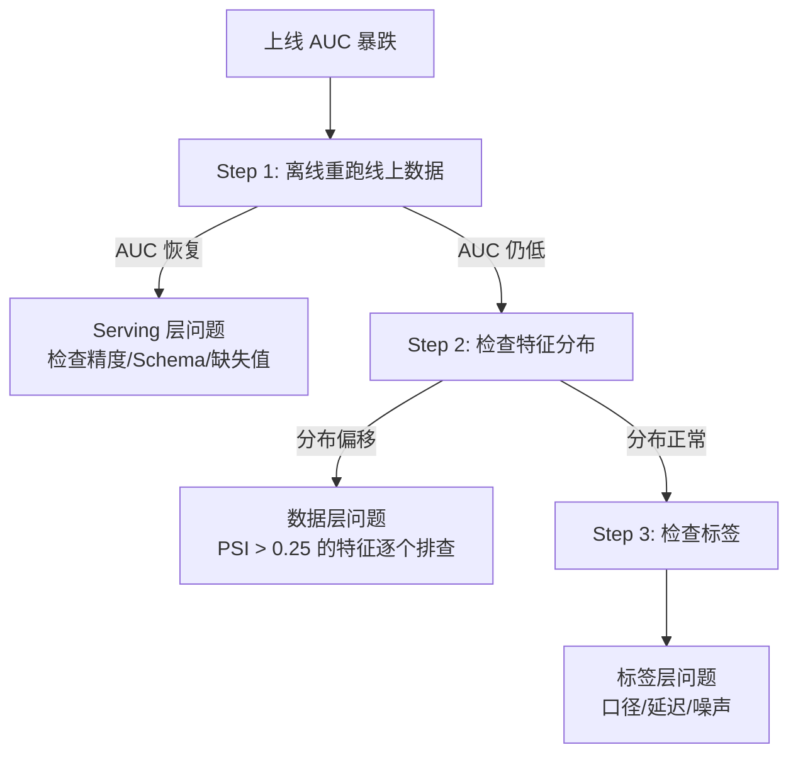
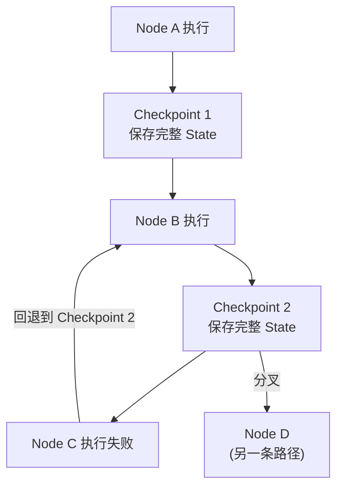

## 扩展与排查

### Q：AI Coding 检查错误的时间比自己写还长，怎么提效？

> 来源：字节实习二面【[拼多多 复活赛 一面](https://www.nowcoder.com/feed/main/detail/2109cf8eb0254507911fbf86bcbf51e4)追问：日常 coding 或改策略往往是不确定的事情，怎么让 Agent 提效？】

**新手答**：“那就不用 AI 写了，自己写更快。”

**高手答**：

这个“悖论”很常见，但**问题不在 AI Coding 本身，而在使用方式**。检查时间长，通常是因为三个原因：

**1. 生成粒度太大**

一次让 AI 生成整个模块（几百行），review 时完全不知道它的意图和设计决策，只能逐行检查。

解法：**小步生成，逐步确认**。每次只让 AI 生成一个函数或一个逻辑块（20-50 行），确认正确后再继续。Claude Code 的 plan 模式就是这个思路——先生成计划，确认后再执行。

**2. 对生成结果没有结构化验证**

只用肉眼 review 是最慢的方式。

解法：**让机器帮你检查**。配置好 TypeScript 类型检查、Lint 规则、已有测试套件，AI 生成后自动跑一遍。通过了静态检查和测试的代码，人工只需要 review 业务逻辑正确性，工作量减少 70%。

**3. 上下文给得不够精确**

AI 不了解项目上下文，生成的代码风格不一致、用了错误的 API、不符合项目规范。这些“小问题”累积起来，review 成本极高。

解法：**投入上下文工程**。把项目规范、API 文档、代码风格写进 CLAUDE.md 或 Rules；用 `@file` 引入相关代码作为参考。上下文给得越精确，生成质量越高，检查成本越低。

**效率公式**：

```text
AI Coding 的实际效率 = 生成速度 × 首次通过率
                    = 生成速度 × f(上下文质量, 任务粒度, 自动化验证)
```

检查时间长说明“首次通过率”太低，根因是上下文质量差、任务粒度大、没有自动化验证——不是 AI Coding 不行，是使用姿势需要优化。

**差距在哪**：新手直接放弃 AI Coding——这是把工具的学习曲线当成工具的上限。高手分析了检查成本高的三个根因（粒度大、无自动化验证、上下文不足），且给出了对应的提效方案。面试官考的是你对 AI Coding 工作流有没有深入思考——不是“用没用过”，而是“怎么用才高效”。

---

### Q：数据量和 QPS 增大后，Agent 架构怎么改进？需要什么硬件？RT 要求高时怎么部署？

> 来源：阿里国际 AI 应用研发二面

**新手答**：“加机器，用更好的 GPU。”

**高手答**：

### 按 QPS 量级分层的架构改进

| QPS 量级 | 架构策略 | 硬件配置 |
|---------|---------|---------|
| < 10 | 单机部署，vLLM/Ollama | 单卡 A100/H100，或 4090 开发机 |
| 10-100 | 多实例 + 负载均衡，连续批处理 | 2-4 卡 A100/H100，CPU 用于编排层 |
| 100-1000 | 微服务拆分（编排/推理/检索分离），推理集群 | GPU 集群 + 独立向量 DB 节点 + Redis 缓存 |
| 1000+ | 模型分级（大小模型混合），全链路异步，缓存命中率优化 | 混合 GPU 集群（H100 给大模型 + A10 给小模型） |

### RT（响应时间）优化的关键手段

1. **推理加速**：量化（INT4/INT8/FP8）、推测解码、KV Cache 复用、Prefix Caching
2. **模型分级调度**：简单请求走 7B/14B 小模型（延迟 < 200ms），复杂请求走大模型
3. **服务架构**：推理和编排分离部署，编排层用 CPU 即可；推理层用 vLLM/TensorRT-LLM/SGLang，continuous batching
4. **缓存策略**：语义缓存（相似 query 命中率可达 30-50%），工具结果缓存，KV Cache 跨请求复用

### GPU 选型参考

| GPU | 显存 | 适用场景 | 性价比 |
|-----|------|---------|-------|
| A100 80G | 80G | 70B 模型推理/微调，主力生产 GPU | 中 |
| H100 | 80G | 高吞吐推理，支持 FP8 | 高（新项目首选） |
| A10/L4 | 24G | 小模型推理（7B-14B），性价比高 | 高 |
| 4090 | 24G | 开发测试，不建议生产（缺 ECC、NVLink） | 开发最优 |

### Agent 特有的扩容挑战

Agent 和普通 LLM 推理不同——单次请求可能触发 5-15 次模型调用（规划 + 多次工具调用 + 总结），所以 Agent 的 QPS 要乘以平均调用次数来估算推理集群的真实负载。

**差距在哪**：新手只想到“加机器加 GPU”。高手按 QPS 量级分层给出了架构策略和硬件配置，且区分了推理加速和服务架构两个优化层面，并指出 Agent 的 QPS 需要乘以平均调用次数来估算真实负载。面试官考的是你对 Agent 系统从开发到生产扩容的全链路工程认知。

---

### Q：使用 LangGraph 开发 Agent，遇到最大的困难是什么？

> 来源：bilibili AI研发实习一面

**新手答**：“文档看不太懂。”

**高手答**：

LangGraph 的核心价值是把 Agent 的执行逻辑建模为**有状态的图（Graph）**，但这也带来了几个实际开发中非常痛的问题：

**困难一：状态设计是最大的架构决策**

LangGraph 中所有节点共享一个 State 对象，State 的字段设计直接决定了整个 Agent 的行为。设计不好的 State 会导致：
- 字段太少 → 节点之间信息传递不够，每个节点都要重新推理
- 字段太多 → 状态膨胀，调试困难，且不相关的字段可能干扰模型判断
- 类型不对 → 并发节点写同一个字段时覆盖（忘了用 Reducer）

```python
# 常见的 State 设计错误
class BadState(TypedDict):
    messages: list  # ❌ 并发节点同时 append 会互相覆盖

class GoodState(TypedDict):
    messages: Annotated[list, operator.add]  # ✅ Reducer 自动合并
```

**困难二：调试极其困难**

传统代码用断点就能调试。LangGraph 的执行是“图遍历 + 模型推理”的混合，出了问题很难定位：
- 不知道是模型推理错了，还是图的边条件判断错了，还是 State 传递有问题
- 节点之间的数据流是隐式的（通过 State），不像函数调用那样有明确的参数传递
- 解法：用 LangSmith 做执行链追踪，每个节点的输入输出都可视化；对关键节点加日志断点

**困难三：并发和状态合并**

LangGraph 支持 Fan-out 并行，但并发节点写回同一个 State 字段时必须用 Reducer 函数处理合并。这个机制初学时很容易忽略——结果是多个并发节点的输出互相覆盖，只剩最后一个。

**困难四：图的复杂度失控**

项目初期图很简单（3-5 个节点），但随着功能增加，边和条件判断快速膨胀。超过 10 个节点的图已经很难在脑子里追踪执行路径了。
- 解法：用 subgraph 做模块化——把相关节点封装成子图，主图只编排子图之间的关系
- 给每个条件边起有意义的名字，画出来能读懂

**困难五：Checkpoint 和恢复**

LangGraph 的 checkpointer 机制允许在任意节点暂停和恢复，但实际使用中 checkpoint 的序列化和反序列化经常出问题——特别是 State 中包含不可序列化的对象（如数据库连接、模型实例）时。

| 困难 | 根因 | 解法 |
|------|------|------|
| 状态设计难 | State 是全局共享的，字段设计影响所有节点 | 先画数据流图，再定义 State；并发字段必须加 Reducer |
| 调试难 | 执行链路是图遍历+模型推理的混合 | 用 LangSmith 可视化执行链；关键节点加日志 |
| 并发合并 | Reducer 机制不直观 | 任何可能被并发写入的字段都显式定义 Reducer |
| 复杂度失控 | 节点和边增长后图不可读 | 用 subgraph 模块化；控制单图节点数 < 10 |
| Checkpoint 序列化 | State 包含不可序列化对象 | State 中只放可序列化数据，非序列化对象放工厂函数 |

**差距在哪**：新手只说“文档看不懂”——这是学习阶段的问题不是工程问题。高手点出了状态设计、调试、并发合并、复杂度控制、Checkpoint 五个实际工程难点，每个都有具体的根因和解法。面试官考的是你对 Agent 开发框架的实战理解深度——踩过的坑越具体，越说明你真正用过。

---

### Q：Agent 系统的缓存选型——本地缓存 vs Redis，怎么选？

> 来源：字节实习二面

**新手答**：“数据量大用 Redis，小用本地缓存。”

**高手答**：

数据量只是一个维度。**选型的核心是根据一致性要求、访问模式和部署架构综合判断**：

| 维度 | 本地缓存（Guava/Caffeine） | Redis |
|------|--------------------------|-------|
| 访问延迟 | 纳秒级（堆内存） | 毫秒级（网络 IO） |
| 一致性 | 单进程内一致 | 跨进程/跨机器一致 |
| 容量 | 受 JVM 堆限制（通常 < 1GB） | 独立内存，可扩展到 TB |
| 故障影响 | 进程重启即丢失 | 持久化可恢复 |
| 适合场景 | 热点数据、不常变更、可容忍短暂不一致 | 共享状态、需要跨实例一致、数据量大 |

**Agent 系统中的典型选型**：

- **工具 schema 缓存** → 本地缓存。schema 很少变更，每台机器缓存一份即可，不需要跨实例一致
- **用户会话状态** → Redis。多个 Agent 实例需要读取同一个用户的会话上下文
- **LLM 响应缓存（语义缓存）** → Redis。相同语义的请求可以跨用户复用
- **Token 消耗计数** → Redis。需要实时跨实例汇总，做预算熔断

**二级缓存架构**：

很多生产系统同时使用两者——本地缓存做 L1（减少网络 IO），Redis 做 L2（保证一致性）：

```text
请求 → L1 本地缓存（命中？） → L2 Redis（命中？） → 数据源
                ↑ 回填                    ↑ 回填
```

**关键工程问题**：

1. **热 Key**：某个 Agent 工具被高频调用，对应的 Redis Key 请求量暴涨。解法：本地缓存兜底 + Redis 读副本分散压力
2. **大 Key**：长对话的会话状态可能达到几 MB。解法：拆分存储（按轮次分 key）或压缩后存储
3. **缓存命中率计算**：`命中率 = 缓存命中次数 / 总请求次数`。L1 命中率低于 60% 说明缓存策略需要调整（TTL 太短或缓存容量不足）
4. **迁移注意点**：从本地缓存迁到 Redis 后，JVM 堆内存压力减小（GC 频率降低），但网络延迟增加。需要在延迟和一致性之间找平衡

**差距在哪**：新手只按数据量做判断——这是最表面的维度。高手从一致性、延迟、容量、故障影响四个维度对比，且给出了 Agent 场景下的具体选型建议和二级缓存架构。面试官考的是你对缓存体系的工程化理解——不只是“知道 Redis”，而是知道什么场景用什么缓存、为什么。

---

### Q：模型离线 AUC 很高但上线后效果暴跌，怎么排查？

> 来源：淘宝闪购 Agent 一面（AI Coding 压轴题）

**新手答**：“可能是数据有问题，重新训练一下。”

**高手答**：

离线 AUC 92%、测试 89%、上线跌至 62%——这是工业界最经典的 Train-Serving Skew 问题。排查需要从**数据、标签、Serving 三个维度**系统展开，按影响幅度排序：

**数据层（影响最大，优先排查）**

| 排序 | 原因 | 影响幅度 | 排查方法 |
|------|------|---------|---------|
| 1 | Train-Serving 特征分布偏移 | 10-30% AUC 下降 | 对比线上/线下特征分布（KL 散度、PSI） |
| 2 | 线上样本分布与训练集不一致 | 5-20% | 对比线上流量的类别分布 vs 训练集 |
| 3 | 特征泄露导致离线 AUC 虚高 | 可达 20%+ | 检查是否用到了只有离线才有的“未来特征” |

**标签层**

| 排序 | 原因 | 影响幅度 | 排查方法 |
|------|------|---------|---------|
| 4 | 标签定义口径不一致 | 5-15% | 比对离线标签定义 vs 线上业务指标定义 |
| 5 | Label Delay 问题 | 3-10% | 检查标签回收窗口是否覆盖完整转化周期 |
| 6 | 标注噪声线上放大 | 3-8% | 抽样人工复审标注质量 |

**Serving 层**

| 排序 | 原因 | 影响幅度 | 排查方法 |
|------|------|---------|---------|
| 7 | 模型版本与 Feature Schema 未对齐 | 可致严重错误 | 比对模型期望的特征列表 vs 线上实际提供的 |
| 8 | 在线推理精度损失/缺失填充策略不一致 | 1-5% | 对比离线 batch 推理 vs 在线实时推理的输出 |

**排序依据**：数据层 skew 对 AUC 的影响幅度最大（可达 10-30%），且在工业界出现频率最高，因此排在前三。标签问题通常灰度期可被发现。Serving 层问题通过日志比对可快速定位，实际频率相对低。

**排查方法论**：



**差距在哪**：新手只能模糊地说“数据有问题”。高手从数据、标签、Serving 三个维度列出 8+ 具体原因，按影响幅度排序，并给出每个原因对应的排查方法。面试官考的不只是你知不知道这些原因，更是你能不能**按优先级系统排查**——工业界的 debug 不是靠灵感，是靠方法论。

---

### Q：高并发场景下同时调 10 个 Embedding 接口，asyncio.gather 相比多线程有什么资源优势？

> 来源：阿里淘天 AI应用开发一面

**新手答**：“asyncio 更快。”

**高手答**：

“更快”不准确——asyncio 和多线程在 IO 密集场景下的**完成时间几乎一样**，真正的差距在于**资源消耗**。

**核心区别**：

| 维度 | 多线程（threading） | 协程（asyncio） |
|------|-------------------|----------------|
| 调度层级 | OS 内核态调度 | 用户态调度（Python 解释器内部） |
| 内存开销 | 每线程 ~8MB 栈内存（默认） | 每协程 ~KB 级（几百字节到几 KB） |
| 上下文切换 | 内核态切换，涉及寄存器保存/恢复、TLB 刷新 | 用户态切换，只需保存/恢复 Python 帧对象 |
| 创建销毁成本 | 高（系统调用） | 极低（普通 Python 对象） |
| GIL 影响 | 受 GIL 限制，同一时刻只有一个线程执行 Python 代码 | 单线程内运行，天然不受 GIL 影响 |

**10 个并发 Embedding 调用的场景分析**：

瓶颈在**网络 IO**（等 API 返回），不在 CPU 计算。IO 密集型任务是协程的最佳场景——协程在 `await` 时让出执行权，单线程就能管理上千并发连接。

**资源对比**：

```text
多线程方案（10 个线程）：
  内存：10 × 8MB = 80MB 额外栈内存
  线程池管理开销：线程创建/销毁/调度
  OS 资源：10 个内核线程对象

asyncio 方案（10 个协程）：
  内存：10 × ~几KB = ~几十 KB
  无线程池，单线程 event loop 调度
  OS 资源：1 个线程

差距：内存开销差 1000 倍+
```

**asyncio 方案实现**：

```python
import asyncio
import aiohttp

async def embed_one(session, text):
    async with session.post(EMBED_URL, json={"input": text}) as resp:
        return await resp.json()

async def embed_batch(texts):
    async with aiohttp.ClientSession() as session:
        tasks = [embed_one(session, t) for t in texts]
        results = await asyncio.gather(*tasks)
    return results

# 10 个并发请求，单线程完成
results = asyncio.run(embed_batch(texts[:10]))
```

**asyncio 的局限——什么时候不适用**：

如果 Embedding 是**本地 CPU 计算**（比如用 sentence-transformers 在本地跑模型），asyncio **无法并行**——因为 Python 的 GIL 限制，单线程内 CPU 密集计算无法真正并行执行。这时需要 `ProcessPoolExecutor`：

```python
from concurrent.futures import ProcessPoolExecutor
import asyncio

async def embed_batch_cpu(texts):
    loop = asyncio.get_event_loop()
    with ProcessPoolExecutor(max_workers=4) as pool:
        # CPU 密集任务交给进程池
        results = await loop.run_in_executor(pool, local_embed, texts)
    return results
```

**实际工程中的混合方案**：

```text
asyncio + aiohttp      → 网络并发（调远程 Embedding API）
ProcessPoolExecutor     → CPU 密集（本地模型推理）
两者结合               → 最优资源利用

典型场景：
  10 个文本需要 Embedding
  ├─ 远程 API（OpenAI / BGE API）→ asyncio.gather + aiohttp
  └─ 本地模型（sentence-transformers）→ ProcessPoolExecutor + batch inference
```

| 场景 | 推荐方案 | 原因 |
|------|---------|------|
| 远程 API 调用（IO 密集） | asyncio + aiohttp | 内存占用极低，单线程管理上千连接 |
| 本地模型推理（CPU 密集） | ProcessPoolExecutor | 绕过 GIL，真正多核并行 |
| 本地 GPU 推理 | batch inference（一次送入） | GPU 本身并行计算，不需要多线程/多进程 |
| 混合场景 | asyncio 编排 + executor 处理 CPU 部分 | 各取所长 |

**差距在哪**：新手只说“更快”。高手区分了 IO 密集 vs CPU 密集场景，给出了具体的内存开销对比，且知道什么时候协程不适用。面试官考的是你对 Python 并发模型的工程理解。

---

### Q：Agent 异步任务管线中引入消息中间件（如 Kafka），会不会反而变慢或成为瓶颈？扫表和消息驱动各有什么优缺点？

> 来源：淘天 Agent 开发

**新手答**：“Kafka 是异步的，肯定更快。”

**高手答**：

消息中间件不是万能提速器——引入 Kafka 后系统延迟**可能反而增加**，关键看任务类型：

**什么时候 Kafka 反而变慢？**

| 场景 | 直接调用延迟 | Kafka 延迟 | 结论 |
|------|------------|-----------|------|
| 单次简单任务（<100ms） | ~50ms | ~50ms + 入队 + 消费延迟 ≈ 200ms | Kafka 更慢 |
| 多步串行任务 | 步骤间直接调用 | 每步都经 Kafka 中转，延迟倍增 | 严重更慢 |
| 高并发异步任务 | 线程池打满，排队阻塞 | 削峰填谷，稳定吞吐 | Kafka 优势明显 |
| 长时任务（分钟级） | 占线程等待，资源浪费 | 发消息后释放线程，异步回调 | Kafka 优势明显 |

**核心认知**：Kafka 的价值不是「更快」，而是「更稳」——通过**解耦生产者和消费者**，让系统在流量突增时不崩溃。延迟可能增加几十毫秒，但换来的是吞吐稳定性和可靠性。

**流量变大后 Kafka 本身会不会成为瓶颈？**

会，但可控。常见的瓶颈点和解法：

| 瓶颈 | 表现 | 解法 |
|------|------|------|
| 分区数不足 | 消费速度跟不上生产速度 | 增加 partition 数 + 消费者组扩容 |
| 单条消息过大 | 序列化/网络传输耗时 | 消息体只传 ID/引用，大数据走对象存储 |
| 消费者处理慢 | 消息堆积、lag 持续增长 | 业务侧限流（令牌桶） + 结合业务频次限制 |

**扫表 vs 消息驱动管理长时任务**：

| 维度 | 扫表（定时轮询） | 消息驱动（如 Kafka 双 Topic） |
|------|-----------------|---------------------------|
| **实时性** | 取决于扫描间隔（秒级延迟） | 近实时（毫秒级） |
| **资源开销** | 持续查库，空转浪费 | 事件驱动，无空转 |
| **可靠性** | 数据库是天然持久化，断电不丢 | 需配置持久化和消费确认 |
| **复杂度** | 简单直接，一条 SQL 搞定 | 需维护 Topic、消费者组、死信队列 |
| **适用规模** | 小规模（<1000 任务/分钟） | 大规模（10000+ 任务/分钟） |
| **状态可查** | 数据库直接查，运维友好 | 需额外建状态表或监控面板 |

**生产中的最佳实践**：小规模用扫表（简单可靠），中大规模用消息驱动 + 状态表（消息负责流转，数据库负责状态持久化和查询），两者结合取长补短。

**差距在哪**：新手认为异步就等于更快。高手区分了 Kafka 适用和不适用的场景，且给出了扫表和消息驱动在不同规模下的选型依据。面试官考的是你对异步架构 trade-off 的理解——不是「用不用」，而是「什么时候用」。

---

### Q：用 AI Coding 工具写代码达不到预期怎么办？

> 来源：CVTE/AI应用工程师一面

**新手答**：“多试几次，换个写法描述需求，或者自己手写。”

**高手答**：

“达不到预期”要先**定位是哪层的问题**，然后针对性解决：

**1. 意图传达问题（最常见）**

AI 不理解你要什么。表现为：生成的代码逻辑方向完全错误。

解法：不要一句话描述需求，而是给**结构化上下文**——输入/输出示例、约束条件、已有代码片段、类似功能的参考实现。本质上你在做上下文工程，和给 Agent 写 Prompt 一样的方法论。

**2. 知识边界问题**

AI 对你用的框架/库版本不熟。表现为：API 不存在、用法过时。

解法：把相关源码、类型定义、文档片段喂给它。Claude Code 的 `@file` 引用、Cursor 的 `@codebase` 都是这个思路——扩充 AI 的工作上下文。

**3. 架构一致性问题**

AI 生成的代码能跑但不符合项目风格/架构。表现为：命名混乱、模式不统一。

解法：用 CLAUDE.md / .cursorrules 定义项目规范，或者用 Skill 封装项目特有的代码模式，让 AI 每次生成都对齐架构约束。

**4. 复杂度超限问题**

任务太复杂，超出单次生成能力。表现为：前半段对后半段错。

解法：**拆任务**。把一个大需求拆成 3-5 个小步骤，每步验证后再进行下一步。用 Plan 模式先对齐方案，再逐步实现。

**差距在哪**：新手的“多试几次”是盲目重试。高手先分类问题（意图/知识/架构/复杂度），每类有不同的解法策略。面试官考的是你对 AI 辅助开发的方法论——不是“用不用 AI”，而是“AI 不好使时怎么系统性解决”。

---

### Q：LangGraph 的 State Snapshot（状态快照）机制是怎么实现的？解决什么问题？

> 来源：字节后端开发 Agent 一面

**新手答**：“就是保存一下当前状态，方便恢复。”

**高手答**：

LangGraph 的 State Snapshot 机制本质是**基于 Checkpoint 的确定性状态管理**——让 Agent 的执行过程可追溯、可回退、可分叉。

**解决的核心问题**：

Agent 执行多步任务时，中间任何一步可能失败或产生分支。没有快照机制，失败后只能从头重跑；有了快照，可以从任意中间状态恢复或分叉。

**实现机制**：



| 组件 | 职责 |
|------|------|
| State | 图执行的全局状态对象（TypedDict），包含所有节点共享的数据 |
| Checkpointer | 在每个节点执行后序列化并持久化当前 State |
| Thread | 一次完整的图执行实例，通过 thread_id 标识 |
| Checkpoint ID | 每个快照的唯一标识，支持精确回退到任意历史状态 |

**Checkpointer 的存储实现**：

| 存储后端 | 适用场景 |
|---------|---------|
| MemorySaver | 开发调试，内存存储，进程结束丢失 |
| SqliteSaver | 单机持久化，轻量部署 |
| PostgresSaver | 生产环境，多实例共享状态 |

**快照解决的三个工程问题**：

1. **Human-in-the-loop**：节点执行到需要人工确认时，保存快照暂停；人工审批后从快照恢复继续执行
2. **错误恢复**：工具调用失败时回退到上一个快照，换策略重试，而不是从头重跑整个流程
3. **状态分叉**：同一个快照可以沿不同路径继续执行（类似 Git 分支），用于 A/B 测试不同的 Agent 决策路径

**和 Git 的类比**：

```text
Checkpoint ≈ Git Commit（记录某一刻的完整状态）
Thread ≈ Git Branch（一条执行路径）
回退 ≈ Git Reset（回到历史状态）
分叉 ≈ Git Branch（从某个 Commit 开出新分支）
```

**差距在哪**：新手只理解“保存状态”——这和普通变量序列化没区别。高手理解 Checkpoint 是 LangGraph 实现确定性执行、人工干预、错误恢复的基础设施，且能讲清具体的存储实现和应用场景。面试官考的是你对 Agent 框架状态管理的理解深度——不是“用过 LangGraph”，而是理解它为什么要这样设计。
