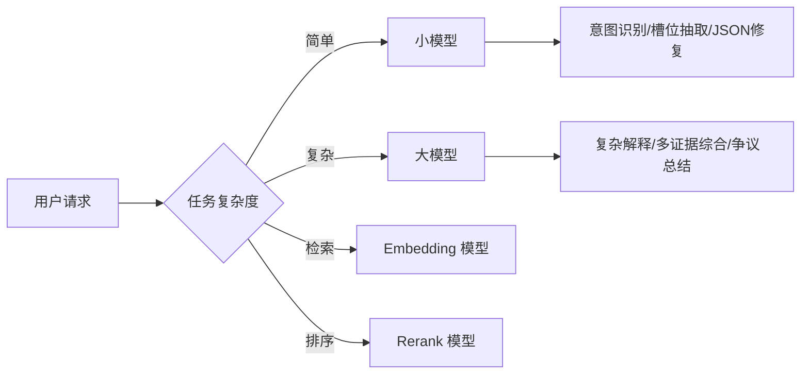

## Q：产品的用户量、每日 token 消耗和底层模型选型怎么估算？

> 来源：快手AI应用开发一面

**新手答**：“看产品有多少用户，乘以每次对话的 token 数就行了。”

**高手答**：

这类问题不能只报一个数字，要展示**估算方法论**。核心公式：

```text
日 token 消耗 = DAU × AI 触发率 × 平均轮数 × 每轮 token 量
```

以理赔场景为例：DAU 5 万，20% 触发 AI 审核/解释（1 万次 AI 会话），每次平均 3 轮，每轮输入上下文 1500 token + 输出 500 token：

```text
1万会话 × 3轮 × (1500 + 500) = 6000万 token/天
```

底层模型不会只用一个，需要**分层路由**：



| 模型层 | 用途 | 选型考虑 |
|--------|------|----------|
| 小模型 | 意图识别、JSON 修复 | 低延迟、低成本 |
| 大模型 | 多证据综合、争议解释 | 准确性优先 |
| Embedding | 知识库向量化 | 维度/召回率 |
| Rerank | 重排精排 | 精度/延迟 |

延迟要求严格时还要做**模型路由和降级**：大模型 P95 超时后返回模板化解释或进入人工审核队列。

成本估算要覆盖：模型调用费、Embedding 索引存储、向量检索 QPS、GPU 推理实例数。线上的实际消耗 = 估算值 × 1.3（缓存未命中、重试、上下文膨胀的安全系数）。

**差距在哪**：新手只能报一个“大概多少 token”。高手能展示完整估算链路：DAU → 触发率 → 轮数 → token → 分层模型路由 → 降级策略 → 成本。面试官考的不是精确数字，而是你的**工程化容量规划能力**——能否从业务指标推导到资源需求。
