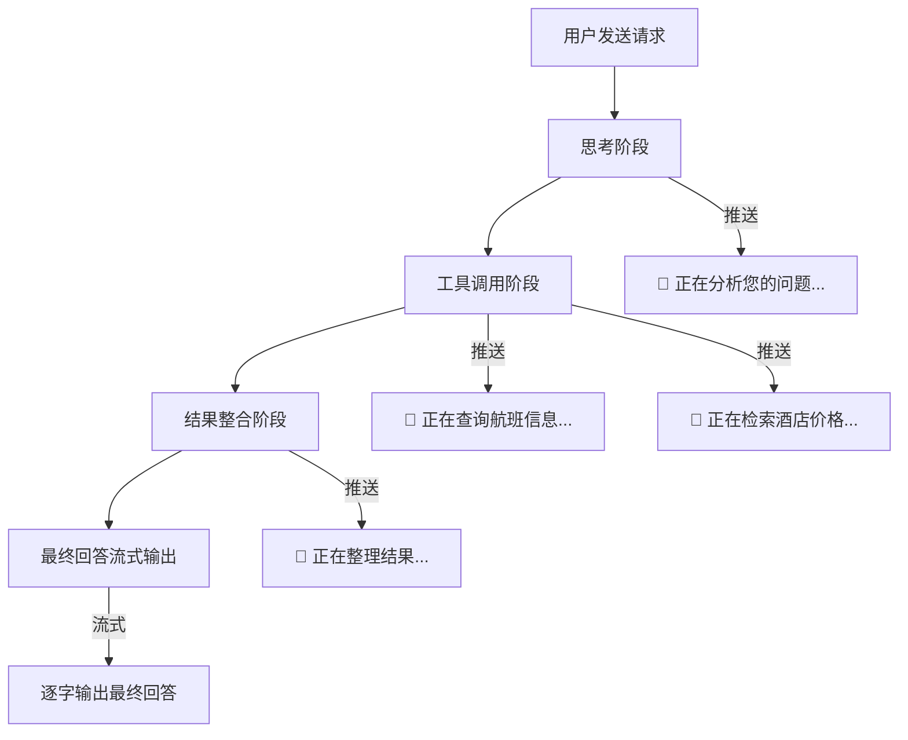

## Q：如何设计 Agent 的流式输出以提升用户体验，特别是包含工具调用和多次大模型交互时？

> 来源：Agent开发八股合集（南京大学） / [阿里千问 Agent 开发一面](https://www.nowcoder.com/feed/main/detail/463438ee0d9e403b98e8578a05ba4e3f)

**新手答**：“用 SSE 把模型输出一个字一个字推给前端就行了。”

**高手答**：

简单的 LLM 流式输出只需要 SSE token-by-token 推送，但 Agent 场景复杂得多——一次用户请求可能包含多次模型调用、工具执行、结果整合，用户等待时间远超纯生成场景。UX 设计的核心原则是：**让用户始终知道系统在做什么，而不是面对空白等待。**

**Agent 流式输出的分层设计：**

**具体工程实现：**

1. **事件类型分层**：SSE 不能只有 `data:` 一种类型，需要区分：
   - `thinking`：模型推理中间过程（可选展示）
   - `tool_call`：工具调用开始，附带工具名和参数摘要
   - `tool_result`：工具返回结果摘要
   - `content`：最终回答的流式 token
   - `status`：状态更新（“正在搜索”、“已找到 3 条结果”）

2. **工具调用期间的“占位体验”**：
   - 工具执行时前端展示进度指示器 + 当前步骤文案
   - 并行工具调用时展示多个进度条，完成一个标绿一个
   - 工具超时时给用户可操作的提示（“查询耗时较长，是否继续等待？”）

3. **部分结果渐进展示**：
   - 多步任务不必等全部完成才输出——检索到的中间结果可以先展示为“草稿”，最终整合后替换
   - 类似 Deep Research 的“研究进展”面板：实时展示已完成步骤和发现

4. **异常与中断处理**：
   - 工具失败时立即推送错误状态，不让用户干等
   - 支持用户中途取消（发送 cancel 事件），后端优雅中止当前工具链
   - SSE 连接断开后支持断点续传（通过 event ID 重连恢复）

5. **延迟隐藏技巧**：
   - 模型还在 plan 时就开始展示“理解您的需求：xxx”
   - 第一个工具调用结果返回后立即开始生成部分回答，不等全部工具完成
   - 预测性 UI：根据 plan 预先渲染结果骨架（skeleton），数据到了填充

流上语义判断要在质量和时延之间分层：字符拼接、协议校验可只看当前增量；安全、完整句和工具参数判断使用有限滑动窗口；需要全文关系的任务在句末、工具结束或阶段完成时生成语义 checkpoint，再异步做全量复核。消费者跟不上时应通过有界缓冲、暂停上游或合并低价值进度事件施加背压；业务接入层还要按租户并发、任务预算和风险做准入或拒绝，不能把无限请求都推给流处理器。

**差距在哪**：面试官考的是你对“Agent 不是 ChatBot”的 UX 理解。纯 LLM 只需 token 流，Agent 需要多阶段状态反馈、并行任务进度、异常即时通知。能设计出分层事件协议 + 渐进展示策略，说明你做过面向用户的 Agent 产品而非只写后端。
