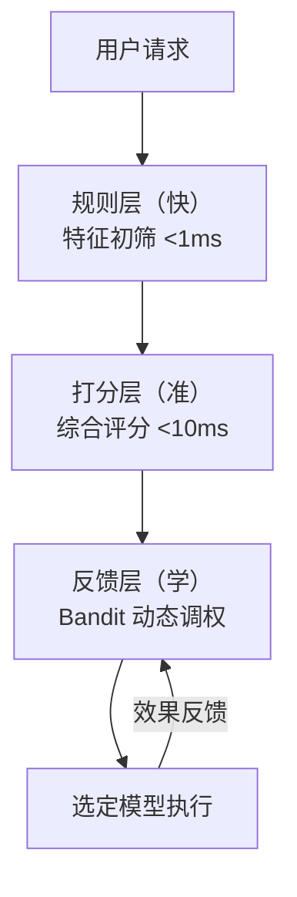

## Q：多模型如何动态路由？根据视频特征、任务特征、成本、延迟和效果选模型？

> 来源：商汤/大模型算法应用实习二面【[百度Agent一面](https://www.nowcoder.com/feed/main/detail/72858aade19d443facc870fea8bb134f)追问：模型路由的依据是什么？】【[作业帮秋招一面](https://www.nowcoder.com/feed/main/detail/c86c7591ba9d47b696774ddb48cdc9cb)追问：从大模型切到小模型主要是为了响应时长吗，实际效果对比大模型怎么样？】

**新手答**：“根据任务类型写 if-else 选模型。”

**高手答**：

动态路由本质是一个在线决策问题，需要平衡多个目标。if-else 只能处理最简单的情况，真正的路由系统要做到**多维度决策 + 数据驱动调整**。

**路由决策维度**：

| 维度 | 信号 | 权重策略 |
|------|------|---------|
| 任务复杂度 | token数、步骤数预估 | 复杂任务→大模型 |
| 延迟要求 | 用户场景SLA | 实时→小模型/规则 |
| 成本约束 | 月度budget剩余 | 预算紧→小模型优先 |
| 质量要求 | 任务类型(创意/事实/代码) | 高精度→大模型 |
| 历史表现 | 该类任务各模型的成功率 | 数据驱动选型 |

**三层实现方案**：



**第一层：规则层（快速初筛）**

用硬性特征规则排除不合格的候选模型：
- 视频 >1080p 且 >5min → 只保留支持长视频的模型
- 需要代码生成 → 排除纯文本模型
- 延迟要求 <500ms → 排除大模型

**第二层：打分层（精确选型）**

对候选模型按综合分数排序：

```text
score = α × quality + β × (1/latency) + γ × (1/cost)

其中：
  quality = 该模型在该任务类型上的历史成功率
  latency = 该模型的 P95 响应时间
  cost = 该模型的千 token 单价
  α, β, γ = 根据场景动态调整的权重
```

**第三层：反馈层（持续优化）**

用 Bandit 算法（如 UCB/Thompson Sampling）根据实际效果动态调整权重——不需要离线训练，在线即可学习“哪个模型在哪类任务上表现更好”。

**故障兜底**：首选模型超时 → 自动 fallback 到次选模型，不中断用户体验。实现方式：并发发起请求但只用首选结果，超时后切换到次选的已有结果。

**关键洞察**：路由本身不能太耗时——路由决策应在 <10ms 完成，否则还不如直接用默认模型。所以规则层和打分层都是纯内存计算，不涉及网络调用。

**差距在哪**：新手的 if-else 只能处理静态规则，无法适应模型表现的动态变化。高手设计了规则层（快速排除）+ 打分层（精确选型）+ 反馈层（持续学习）的三层架构，且强调路由决策本身的延迟约束。面试官考的是对“模型即资源”的调度思维——像调度微服务一样调度模型，需要考虑成本、延迟、质量的多目标优化。
