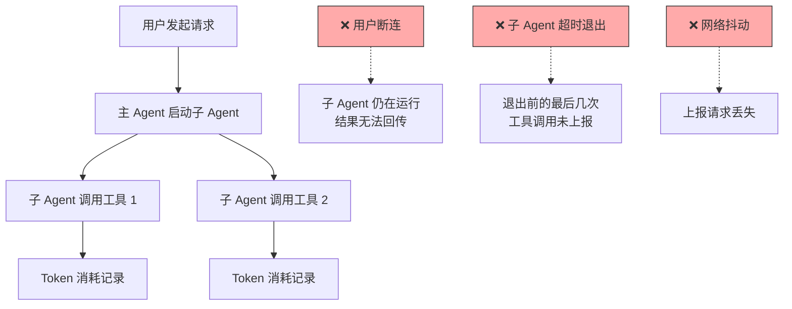

## Q：子 Agent 和工具调用的 Token 用量统计缺失，怎么做容错补偿？（用户断连、子 Agent 延迟退出场景）

> 来源：深信服 AI 全栈开发二面（开源 Agent 项目贡献）

**新手答**：“每次调用完记一下 token 数就行了。”

**高手答**：

Token 用量统计看似简单，但在多 Agent 架构中，有几个场景会导致统计缺失：

**问题场景分析**：



**容错补偿的三层设计**：

**第一层：预扣费（Pessimistic Accounting）**

在子 Agent 启动前，基于历史数据预估本次任务的 token 消耗上限，先从用户配额中预扣。任务正常完成后，用实际消耗替换预扣值；异常退出时，预扣值作为近似统计保留。

```text
预扣策略：
  子 Agent 启动 → 预扣 estimated_max_tokens（基于任务类型 P95 消耗）
  正常完成 → 预扣释放，记录实际值
  异常退出 → 预扣值按衰减系数保留（如 0.7 × estimated_max）
```

**第二层：异步上报 + 本地缓冲**

子 Agent 和工具调用的 token 消耗不依赖同步回传，而是写入本地缓冲队列，异步批量上报：

1. **本地 WAL（Write-Ahead Log）**：每次模型调用完成后，先写本地日志文件（追加写，不丢失），再异步上报到统计服务
2. **重试队列**：上报失败的记录进入重试队列，指数退避重试
3. **进程退出前 flush**：子 Agent 收到终止信号（SIGTERM）时，先 flush 缓冲区再退出。设置 graceful shutdown 超时（如 5s）

**第三层：事后对账（Reconciliation）**

对于极端情况（进程被 kill -9、机器宕机），用定期对账补偿：

| 对账方式 | 实现 | 适用场景 |
|---------|------|---------|
| 模型供应商账单核对 | 每小时拉取 API 使用量，和本地统计做 diff | 使用云端 API 时 |
| 请求日志反推 | 从网关/负载均衡器的请求日志中提取 token 信息 | 自部署推理服务 |
| 估算补偿 | 按“同类任务的平均 token 消耗”补充缺失记录 | 日志完全丢失时的兜底 |

**用户断连场景的特殊处理**：

用户断连后，子 Agent 可能还在运行（尤其是异步任务）。这时需要：

1. 子 Agent 的 token 统计独立于用户连接状态——即使用户断了，统计仍然正常记录
2. 任务级别的 token 预算熔断——用户断连后，子 Agent 继续消耗 token 超过预算上限时自动终止
3. 断连恢复后，客户端拉取任务级别的 token 汇总，补齐前端展示

**差距在哪**：新手只想到“调用完记一下”——这是理想路径。高手考虑了用户断连、子 Agent 延迟退出、网络丢失三类异常场景，用预扣费 + 异步缓冲 + 事后对账三层容错保证统计完整性。面试官考的是你对分布式系统中“数据完整性”问题的工程化思考——token 统计本质上是一个分布式计数器的可靠性问题。
