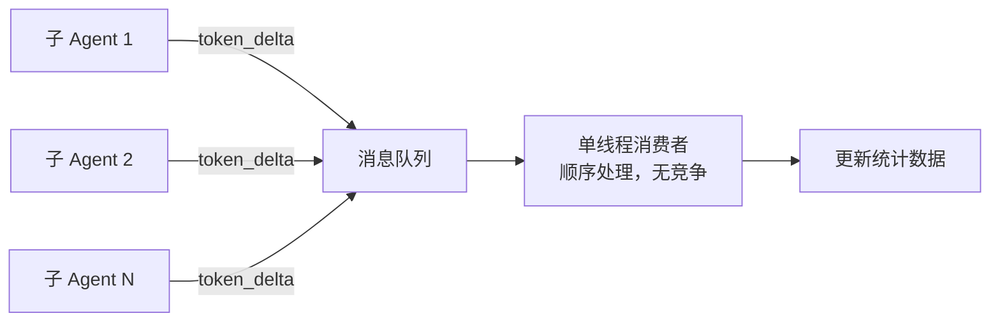

## Q：多个子 Agent 延迟退出，同时更新同一对话的 Token 统计数据，线程竞争怎么解决？

> 来源：深信服 AI 全栈开发二面

**新手答**：“加个锁就行了。”

**高手答**：

“加锁”方向对，但具体怎么加、在哪个层面加、锁的粒度是什么——这些细节决定了方案是否适用于生产环境。

**问题本质**：

多个子 Agent 并行执行，各自消耗 token，最终需要汇总到同一个 session 的 token 统计字段。如果多个子 Agent 同时完成并尝试更新同一条记录：

```text
子 Agent A 读取当前 total_tokens = 1000
子 Agent B 读取当前 total_tokens = 1000
子 Agent A 写入 total_tokens = 1000 + 500 = 1500
子 Agent B 写入 total_tokens = 1000 + 300 = 1300  ← 覆盖了 A 的更新！
```

经典的“读-改-写”竞态条件（Lost Update）。

**四种解决方案对比**：

| 方案 | 实现 | 优点 | 缺点 | 适用场景 |
|------|------|------|------|---------|
| **原子增量操作** | `INCR` / `UPDATE SET x = x + delta` | 最简单、性能最好 | 只适合简单累加 | token 计数（首选） |
| **分布式锁** | Redis `SETNX` + 过期时间 | 强一致 | 锁等待增加延迟 | 需要读-改-写的复杂更新 |
| **乐观锁（CAS）** | 带版本号更新，失败重试 | 无锁等待 | 高并发时重试多 | 中等竞争场景 |
| **归并队列** | 各子 Agent 写消息队列，单消费者汇总 | 完全无竞争 | 延迟略高 | 高并发 + 复杂统计 |

**最佳方案：原子增量操作**

对于 token 统计这种“只需要累加”的场景，根本不需要锁——用数据库的原子自增操作：

```text
Redis 方案：
  HINCRBY session:{id}:tokens input_tokens 500
  HINCRBY session:{id}:tokens output_tokens 300
  → 原子操作，无竞态，O(1)

SQL 方案：
  UPDATE session_stats 
  SET total_tokens = total_tokens + 500,
      updated_at = NOW()
  WHERE session_id = 'xxx';
  → 数据库内部保证原子性
```

**为什么不用分布式锁**：

分布式锁（如 Redis SETNX）虽然能解决问题，但引入了不必要的复杂度——锁超时设多少？获取锁失败怎么重试？死锁怎么处理？对于简单的计数累加，原子操作是最优解。

**需要锁的场景——复杂统计**：

如果统计逻辑不只是累加（比如“如果总 token 超过预算则拒绝，否则累加”），就需要原子的读-判断-写操作：

```text
Redis Lua 脚本（原子执行）：
  local current = tonumber(redis.call('HGET', key, 'total'))
  if current + delta > budget then
    return -1  -- 超预算，拒绝
  end
  redis.call('HINCRBY', key, 'total', delta)
  return current + delta
```

Lua 脚本在 Redis 中原子执行，不需要外部锁。

**归并队列方案——高并发场景**：

当并发子 Agent 数量极大（如 50+ 并发），且统计逻辑复杂时，用消息队列解耦：



各子 Agent 只负责发消息（无阻塞），单消费者串行处理所有更新——彻底消除竞争，代价是统计延迟增加几十毫秒。

**差距在哪**：新手只说“加锁”——这是最暴力且通常不是最优的方案。高手根据业务特征（简单累加 vs 复杂判断）选择不同方案：简单累加用原子操作（零锁开销），复杂逻辑用 Lua 脚本或归并队列。面试官考的是你对并发控制的方案选型能力——不是“会不会用锁”，而是“什么时候不需要锁”。
