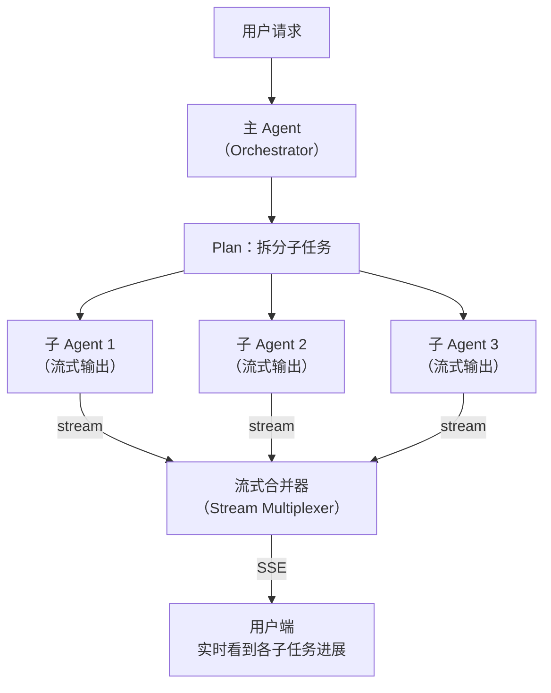

## Q：Agent 框架如何实现流式并行？了解 Claude Code 的流式并行是怎么做的吗？

> 来源：广州某小厂 Agent 后端开发二面

**新手答**：“用多线程同时跑多个 Agent 就行了。”

**高手答**：

流式并行（Streaming Parallelism）是指 Agent 在执行多步任务时，**边流式输出边并行执行子任务**——用户不需要等所有子任务完成才看到结果，而是每完成一个就实时推送一部分。

**和普通并行的区别**：

| 维度 | 普通并行 | 流式并行 |
|------|---------|---------|
| 用户体验 | 等所有任务完成才返回 | 每完成一个子任务就推送部分结果 |
| 输出模式 | 一次性返回完整结果 | 流式递增返回 |
| 适用场景 | 后台批处理 | 面向用户的实时交互 |
| 难点 | 并发控制 | 并发控制 + 流式输出顺序 + 部分结果合并 |

**流式并行的核心架构**：



**实现的三个关键组件**：

**1. 子任务并行调度器**

用 `asyncio.gather` 或类似机制同时启动多个子 Agent，每个子 Agent 独立执行并产出流式输出：

```text
async def parallel_execute(subtasks):
    streams = [spawn_sub_agent(task) for task in subtasks]
    async for event in merge_streams(streams):
        yield event  # 实时推送每个子 Agent 的输出片段
```

**2. 流式合并器（Stream Multiplexer）**

多个子 Agent 同时产出 token 流，需要一个合并器决定“先推送谁的输出”：

- **按完成顺序**：谁先产出就先推送谁（最低延迟，但输出顺序不固定）
- **按逻辑顺序**：按子任务的编号顺序推送（有序但可能有等待）
- **分区域推送**：前端为每个子任务分配独立的渲染区域，各自独立流式显示（并行但有序）

**3. 部分结果与最终合并**

子 Agent 各自完成后，主 Agent 可能需要基于所有子结果做最终合成（如总结、去重）。这时有两种策略：
- **增量合成**：每个子结果到达后立即更新总结（延迟低但质量可能变）
- **两阶段输出**：先流式推送各子结果，全部完成后再推送一个“综合总结”

**Claude Code 的流式并行实现思路**：

Claude Code 的 Agent 工具支持并行启动多个子 Agent（`run_in_background`），每个子 Agent 独立执行并产出结果。其流式并行的设计哲学：

1. **主 Agent 不阻塞**：启动子 Agent 后立即继续处理其他任务或响应用户
2. **子 Agent 独立上下文**：每个子 Agent 有自己的上下文窗口，互不干扰
3. **结果异步汇总**：子 Agent 完成后通知主 Agent，主 Agent 按需合并结果
4. **隔离性**：子 Agent 可以在独立的 worktree 中工作，避免文件系统冲突

**工程实现的难点**：

| 难点 | 解决方案 |
|------|---------|
| 子 Agent 输出交错导致用户困惑 | 前端按子任务分区渲染，每个区域独立流式 |
| 某个子 Agent 卡住拖慢整体 | 设置单任务超时，超时后用已有结果继续 |
| 子 Agent 之间有依赖关系 | DAG 调度——无依赖的并行，有依赖的串行 |
| 流式输出中途某个子 Agent 失败 | 推送错误事件，其他子 Agent 继续执行 |
| token 预算分配 | 总预算按子任务数均分，某个子任务省下的配额可以转移 |

**差距在哪**：新手把“流式并行”等同于“多线程”。高手理解这是一个涉及并行调度、流式合并、部分结果推送的完整架构问题，且能结合 Claude Code 的实际设计说明“非阻塞启动 + 独立上下文 + 异步汇总”的实现思路。面试官考的是你对 Agent 系统中“并行 + 流式”这两个维度交叉时的工程化设计能力。
