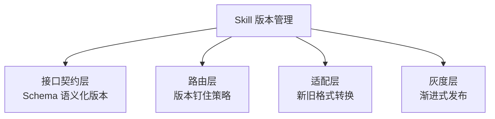

## Q：如何给 Agent 工具系统设计动态 Skill，而不让版本升级破坏历史任务？

> 来源：关于skill的面试问题【[〔社招〕〔面经〕9月初XX科技(中厂) AI全栈工程师（Agent应用）一面 挂](https://www.nowcoder.com/discuss/926232883432296448)追问：Skill 里哪些是固定、哪些随观察动态调整？】【[美团 - Agent 开发岗（场景设计方向）](https://www.nowcoder.com/discuss/926273749555376128)追问：Agent 插件系统热插拔 Skill？】

**新手答**：“做好版本管理就行。”

**高手答**：

核心矛盾：Skill 需要迭代升级（修 bug、加功能），但正在执行的任务依赖旧版本的输入输出格式。简单的“版本管理”不够——需要一套**运行时兼容+灰度验证+自动回滚**的完整方案。

**版本兼容设计（四层）**：



**第一层：接口契约层**

Skill 的 input/output schema 使用语义化版本号：
- v1.0 → v1.1：minor 升级，只加字段不删字段（向后兼容）
- v1.x → v2.0：major 升级，允许破坏性变更（不兼容）

```text
skill_name/
  ├── v1/
  │   ├── schema.yaml    # 输入输出格式定义
  │   └── handler.py     # 执行逻辑
  ├── v2/
  │   ├── schema.yaml
  │   └── handler.py
  └── adapter_v1_to_v2.py  # 格式转换器
```

**第二层：路由层——版本钉住**

- 新 session 使用最新版本
- 进行中的 session 锁定启动时的版本（版本钉住）
- 路由表记录 `\{session_id: skill_version\}` 映射

**第三层：适配层——新旧格式互转**

新旧版本间加 adapter：旧版本的输出格式自动转换为新版本的输入格式。这样即使上游还在用 v1，下游已经升级到 v2，中间的 adapter 保证数据流不断。

**第四层：灰度层——渐进式发布**

新版本先对 10% 流量生效，监控以下指标：
- 执行成功率是否下降
- 输出格式解析错误率
- 用户反馈满意度

验证无回退问题后全量发布。

**防破坏的自动化检查**：

| 检查项 | 实现方式 | 触发时机 |
|--------|---------|---------|
| 向后兼容性测试 | 用旧版本的 test fixtures 调新版本，断言不报错 | CI 中每次 Skill 变更 |
| Schema diff 检查 | 自动检测是否有字段删除或类型变更 | PR 提交时 |
| 回滚演练 | 定期切回旧版本验证回滚路径可用 | 定期自动化 |

**回滚机制**：发现新版本问题后，一键切回旧版本——路由表指向旧版本即可，无需代码回滚。

**差距在哪**：新手的“版本管理”停留在“给文件打个 tag”的层面。高手设计了接口契约（语义化版本）+ 路由钉住（进行中任务不受影响）+ 适配层（格式互转）+ 灰度发布（渐进验证）的四层方案。面试官考的是对“运行中系统不可停”这个约束的系统性解法——不是简单的“版本号”，而是一套保证连续性的工程机制。
