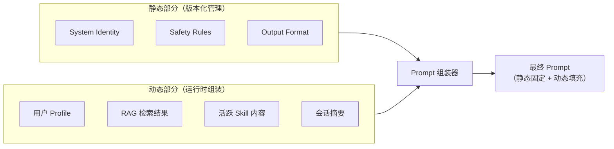

## Q：动态 Prompt 和静态 Prompt 有什么区别？各自在什么场景下用？

> 来源：字节跳动 Agent 二面（Coding Agent）

**新手答**：“静态 Prompt 写死的，动态 Prompt 可以变。”

**高手答**：

“可以变”只是表象。两者的核心区别在于**信息的确定时机和变化维度**：

**定义与区别**：

| 维度 | 静态 Prompt | 动态 Prompt |
|------|-----------|-----------|
| **确定时机** | 开发时确定，部署后不变 | 运行时根据上下文实时组装 |
| **变化频率** | 版本级别（每次发版才改） | 请求级别（每次请求都可能不同） |
| **内容来源** | 工程师手写 | 代码逻辑 + 外部数据 + 用户状态 |
| **token 开销** | 固定，可优化 | 不确定，需要预算控制 |
| **典型内容** | 角色定义、行为规则、安全约束 | 用户画像、检索结果、工具列表、历史摘要 |

**静态 Prompt 的典型场景**：

```text
适合做静态 Prompt 的内容：
├── 角色定义："你是一个资深代码审查工程师"
├── 行为红线："绝不删除用户代码，不执行 rm -rf"
├── 输出格式："回答使用 Markdown 格式，代码块标注语言"
└── 通用规则："不确定时主动确认，不要猜测用户意图"

特征：所有用户、所有请求都适用，不随上下文变化
```

**动态 Prompt 的典型场景**：

```text
适合做动态 Prompt 的内容：
├── 用户上下文："该用户的项目使用 React + TypeScript + Tailwind"
├── 检索结果："以下是和用户问题相关的 3 段文档..."
├── 工具可用性："当前可用工具：Read, Edit, Bash（限制：不可写 /etc）"
├── 会话历史摘要："用户之前讨论了数据库优化方案，已确认用 PostgreSQL"
└── 条件规则："如果用户是付费版，可以使用高级功能 X"

特征：随用户、会话、任务状态动态变化
```

**工程实践中的组装模式**：



**为什么不能全部动态化**：

- 静态部分利用 **Prompt Caching**——相同的 System Prompt 前缀可以跨请求复用 KV Cache，大幅降低首 token 延迟和成本
- 静态部分是**质量锚点**——动态内容可能引入噪声（检索结果不相关、用户信息过时），静态规则确保行为底线不变
- 静态部分便于**版本管理和 A/B 测试**——改一个角色定义的影响是全局的，需要严格测试后才能上线

**为什么不能全部静态化**：

- 无法适应不同用户的个性化需求
- 无法注入实时知识（检索结果、工具状态）
- 上下文窗口浪费——把所有可能需要的信息全写进静态 Prompt 会极度臃肿

**最佳实践**：

```text
黄金比例：静态 20-30% + 动态 70-80%

静态部分放最前面（利用 Prefix Caching）：
  [Identity + Rules + Format]  ← 固定前缀，命中缓存

动态部分按优先级排在后面：
  [Skill 内容 > RAG 结果 > 用户画像 > 历史摘要]
  
Token 预算分配：
  总预算 8K，静态 2K 固定，动态 6K 按优先级分配
```

**差距在哪**：新手只看到“变不变”的表面区别。高手理解背后的工程权衡——静态保证缓存复用和行为一致性，动态保证上下文相关性和个性化。两者的比例设计直接影响成本（Prompt Caching 命中率）和质量（上下文相关性）。面试官考的是你对 Prompt 系统工程化设计的理解深度。
