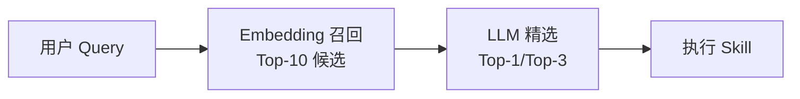

## Q：如果 Agent 挂 100 个 Skill，如何提升召回率、准确度、F1 综合值？

> 来源：关于skill的面试问题

**新手答**：“优化 skill 的描述，让模型更容易选对。”

**高手答**：

Skill 路由本质是一个**信息检索+分类问题**，100 个 Skill 的规模下，单靠描述优化远远不够。需要从召回、精排、评测、运行时四个层面系统优化。

**1. 描述优化（提升 Recall）**

让更多相关 Skill 被候选进入：

| 优化手段 | 做法 | 效果 |
|---------|------|------|
| 触发场景示例 | 每个 Skill 描述加 3-5 个 example queries | 扩大语义覆盖面 |
| Negative examples | 添加“这个 Skill 不处理 XX” | 减少误触发 |
| 同义词扩展 | “天气” → “天气/气温/降雨/紫外线” | 提升长尾 query 召回 |
| 分层描述 | 一句话摘要 + 详细能力说明 | 粗筛用摘要，精排用详情 |

**2. 路由架构（提升 Precision）**

让召回的候选中选出最准确的：



- **两阶段路由**：先 embedding 召回 Top-10 → 再 LLM 精选 Top-1（兼顾速度和准确度）
- **分层分域**：先确定领域（工作/生活/学习）→ 域内选 Skill（缩小候选空间）
- **互斥组**：定义互斥关系（如“翻译”和“润色”不能同时触发），避免模型在相似 Skill 间犹豫

**3. 评测驱动（提升 F1）**

没有评测就没有优化方向：

```text
评测集构建：
  - 100+ 真实 query → 标注正确 Skill
  - 计算 per-skill precision/recall
  - 找出"高混淆对"（如"总结" vs "摘要"）
  - 对高混淆对做差异化描述优化

迭代流程：
  跑评测 → 定位低分 Skill → 优化描述/架构 → 重新跑评测
```

**4. 运行时优化**

- **上下文感知**：根据当前对话历史动态调整 Skill 候选池——用户在讨论代码时，代码相关 Skill 权重提升
- **用户反馈回流**：用户纠正“不是这个 Skill”时记录，自动优化路由权重
- **频率先验**：高频使用的 Skill 在同等匹配度下优先（贝叶斯先验）

**差距在哪**：新手只想到“优化描述”——这是一维的。高手把 Skill 路由当作一个可量化的 ML 问题来解——有两阶段架构（召回+精排）、有评测集和指标（Precision/Recall/F1）、有迭代方法论（找混淆对→差异化优化）。面试官考的是你能不能把“选对 Skill”这个模糊问题工程化为一个有数据、有指标、有闭环的系统。
