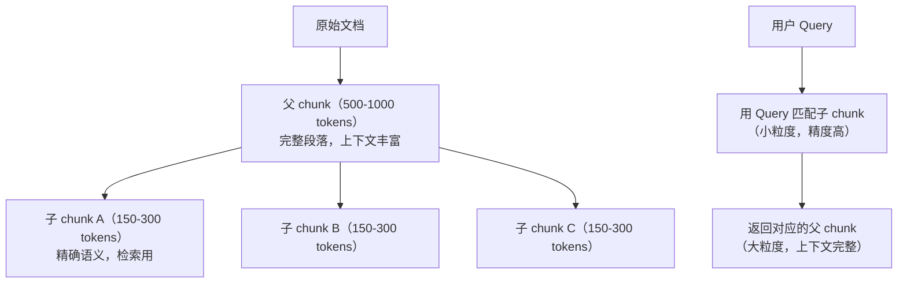
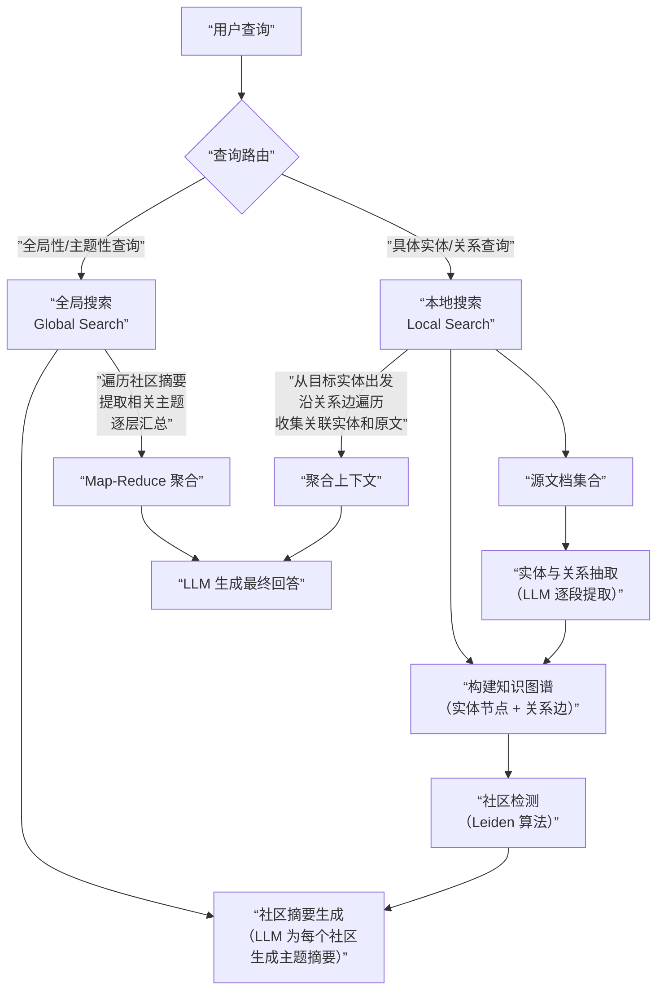
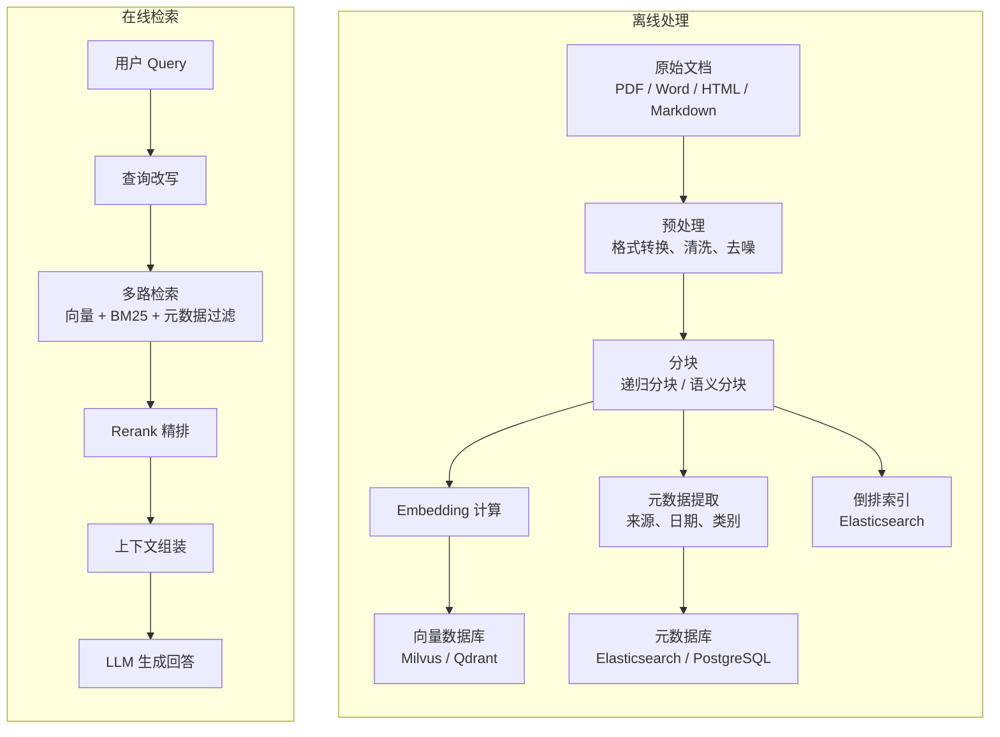

## 知识库与索引工程

### Q：分块策略怎么设计？不同策略的优缺点？

> 来源：高德 AI 应用开发实习一面【腾讯AI应用开发二面追问：chunk 边界修正 + 表格跨块修复】【字节AI一面追问：领域文档语义感知切片】【Shopee 一面追问：为什么不能只按固定 Token 数切分】【[字节数据平台 Agent 一面](https://www.nowcoder.com/feed/main/detail/f5f840632a19417b91b8987762427a6a)追问：跨物理页 Chunk 与页码引用】；[钉钉一面](https://www.nowcoder.com/discuss/923765750446202880)【[虾皮Agent一面](https://www.nowcoder.com/feed/main/detail/409dc8793a7b450eb51ee32c2b923d49)追问：文档分块具体采用什么分块策略？；除递归字符切分外，还有哪些文档分块方案？】【[百度Agent一面](https://www.nowcoder.com/feed/main/detail/72858aade19d443facc870fea8bb134f)追问：Chunk 太大或太小有什么影响？Chunk 大小怎么确定？】

**新手答**：“按 500 字切一段。”

**高手答**：

分块（Chunking）是 RAG 中**影响效果最大的单一设计决策**——切得不好，后面的检索和生成再怎么优化都救不回来。

**五种主流分块策略对比**：

| 策略 | 原理 | 优点 | 缺点 | 适用场景 |
|------|------|------|------|---------|
| 固定长度分块 | 按 token 数切分 | 实现简单、大小可控 | 可能切断语义 | 结构不清晰的纯文本 |
| 语义分块 | 按段落/章节/标题切分 | 保持语义完整 | 块大小不均匀 | 有清晰结构的文档 |
| 递归分块 | 先尝试大单元分割，不满足再细分 | 平衡语义和大小 | 实现复杂 | 通用场景首选 |
| Sliding Window | 固定大小 + 重叠区域 | 防止边界信息丢失 | 存储冗余 | 精度要求高的场景 |
| Agentic Chunking | 用 LLM 判断分块边界 | 最智能 | 成本高、速度慢 | 高价值文档 |

**关键参数设计**：

```text
Chunk Size（块大小）：256 ~ 1024 tokens
  太小（< 200 tokens）→ 语义不完整，一个 chunk 可能只有半句话
  太大（> 1500 tokens）→ 噪声多，embedding 被多个主题稀释，召回精度低

Overlap（重叠区域）：chunk size 的 10 ~ 20%
  作用：防止切断句子或段落，保证边界处的信息在相邻 chunk 中都有

Metadata（元信息）：每个 chunk 保留——
  source：来源文档标识
  page：所在页码
  section_title：所属章节标题
  parent_doc_id：父文档 ID（用于父子索引）
```

**父子索引策略**——同时解决检索精度和上下文完整性：



用小 chunk 做检索（精度高），返回大 chunk 给 LLM（上下文完整）——两全其美。

**递归分块的实现逻辑**：

```text
分割优先级：
  1. 先按 "\n\n"（段落）分割
  2. 段落仍然太大 → 按 "\n"（换行）分割
  3. 还是太大 → 按 "。"（句号）分割
  4. 再不行 → 按空格或字符数强制切分

每一级都尽可能保持语义完整，只有上一级切不够小时才降到下一级。
```

**实践建议**：从递归分块（LangChain 的 `RecursiveCharacterTextSplitter`）作为 baseline 开始，然后根据文档类型和评估结果调整。不同类型的文档用不同策略——技术文档用语义分块（按标题切），日志文件用固定长度分块，合同文档用 Agentic Chunking。

**差距在哪**：新手用固定长度一刀切，不考虑语义。高手对比了五种策略的优劣势，理解 chunk size 和语义完整性的 tradeoff，用父子索引同时满足检索精度和上下文质量，并且知道分块策略必须根据文档类型和评估结果来调整——不存在“万能的分块方案”。面试官考的是你对 RAG 管线中最关键的预处理环节有没有深入的工程理解。

**追问：chunk 切分的边界修正怎么做？比如表格被切成了两半怎么处理？**

> 来源：腾讯 AI 应用开发二面

边界修正是分块策略中最容易被忽视的工程细节。**切错边界比不切更糟**——一个被拦腰截断的表格，检索到任何一半都无法提供完整信息。

**主流边界修正策略**：

1. **结构感知切分**：先用文档解析器识别出结构元素（标题、段落、表格、代码块、列表），以完整结构元素为最小切分单位，绝不从结构内部切断
2. **Overlap（重叠窗口）**：相邻 chunk 之间保留 10-20% 的重叠区域。即使切断了，下一个 chunk 的开头会包含上一个的结尾，信息不会完全丢失
3. **表格特殊处理**：表格作为独立 chunk，不参与常规切分。如果表格超长，按行切分但**每个子 chunk 都保留表头**（表头是理解表格的关键）

**表格被切成两半的检测和修复**：

```text
检测：解析文档时标记所有表格的起止位置 → 切分后检查是否有 chunk 边界
     落在表格内部 → 有则标记为”边界异常”
修复：把跨越表格的两个 chunk 合并，或者把表格提取为独立 chunk
```

实际工程中，最稳的做法是**先提取后切分**：先用文档解析器把表格、图片、代码块等结构化元素单独提取出来，剩余的纯文本再做常规分块。这样结构化元素天然不会被切断。

**追问：领域文档（法律/医疗）的语义单元跨 chunk 被切散，怎么办？**

> 来源：字节 AI 一面（法律 RAG 项目深挖）

法律文档中，“第三条第二款”和“第三条之二”是完全不同的法律概念——前者是第三条下的第二个分款，后者是独立的第三条之二。如果切片把这类语义单元切散，模型会混淆引用关系，直接导致回答错误。

**领域感知切片的四层方案**：

| 层级 | 做什么 | 具体实现 |
|------|--------|---------|
| 结构解析 | 用领域规则识别语义边界 | 法律：条/款/项层级正则；医疗：诊断-处方-医嘱分段 |
| 边界保护 | 语义单元不可被切断 | 将“第X条”到“第X+1条”之间的内容视为原子块 |
| 层级 metadata | 每个 chunk 携带完整的上下文链 | `\{law: "民法典", chapter: "第三编", article: "第三条", clause: "第二款"\}` |
| 交叉引用 | 法条互相引用时双向关联 | “依据第五条”→ 在 chunk metadata 中标记依赖关系 |

**核心原则**：通用切片策略（按 token 数、按段落）是 baseline，领域文档必须叠加**领域感知的边界规则**。切片粒度不是工程参数，是业务决策——需要和领域专家一起定义“什么是不可切断的最小语义单元”。

**追问：句子或表格跨物理页时，Chunk 要不要跨页？怎么保证引用仍能定位？**

物理页是展示边界，不一定是语义边界。解析阶段先保存每个文本/表格单元的 `page_no + bbox/span`，再按段落、标题和表格结构拼语义单元；跨页句子可以合并，跨页表格要保留表头、续表关系和每一行的页码。Chunk metadata 不能只存一个 `page`，而应保存来源跨度，例如 `page_start/page_end` 和更细的证据 span。

检索返回 Chunk 后，引用层根据实际支持结论的 span 生成页码，而不是把整个跨页 Chunk 都标成同一页。验收要覆盖跨页句子、续表、脚注、页眉页脚和 OCR 错位，并检查“召回正确、引用页码也正确”两个指标。是否跨页最终由语义完整性决定，但证据定位必须保留到原始页面坐标。

---

### Q：GraphRAG 在处理 Agent 复杂关联查询时的优势在哪里？

> 来源：淘天 AI Agent 一面 【蚂蚁AI应用开发二面同题：GraphRAG 理解与应用】【字节二面追问：多跳推理/复杂逻辑查询场景下 RAG 架构优化】

**新手答**：“用知识图谱检索，比向量搜索更准。”

**高手答**：

先说清一个常见误解：GraphRAG ≠ 知识图谱检索。传统知识图谱检索是在预构建的三元组上做 SPARQL 查询，而 GraphRAG 是微软提出的一套完整架构——**从文档自动构建知识图谱 + 社区摘要 + 本地/全局双搜索**。

**传统 RAG 的瓶颈**：

传统 RAG 的检索单元是“文本块”（chunk），本质是扁平的。当用户的问题涉及**多跳推理**（A 和 B 的关系 → B 和 C 的关系 → 推导 A 和 C 的关系）或**跨文档关联**（信息分散在多个文档中）时，靠向量相似度只能找到局部相关的片段，无法把分散的信息串联起来。

```text
传统 RAG 的困境：
用户问：”项目 A 的技术负责人和项目 B 的技术负责人之间有什么合作关系？”

文档1 提到：张三是项目 A 的技术负责人
文档2 提到：李四是项目 B 的技术负责人
文档3 提到：张三和李四共同发表了论文 X

→ 向量检索可能只召回文档1和文档2，漏掉关键的文档3
→ 即使三个都召回了，模型也需要自己做推理串联
```

**GraphRAG 的架构与流程**：



**GraphRAG 的三大核心优势**：

**1. 多跳推理能力**

知识图谱天然支持关系链遍历。上面那个例子，在图中就是：项目A → 技术负责人 → 张三 → 合作论文 → 李四 → 技术负责人 → 项目B。沿着关系边走两三跳就能拿到完整的关联信息，不需要模型自己推理。

**2. 全局理解能力**

这是 GraphRAG 最大的创新——**社区摘要**。通过社区检测算法把图中紧密关联的实体聚成社区，再用 LLM 为每个社区生成主题摘要。当用户问“这个领域的整体趋势是什么”这类全局性问题时，传统 RAG 只能拼凑零散的片段，GraphRAG 可以直接基于社区摘要回答。

**3. 结构化实体消歧**

同一个实体在不同文档中可能有不同的名称（“OpenAI”、“openai”、“Open AI”），图构建过程中会做实体合并和消歧，保证检索的一致性。

**不同查询类型下的对比**：

| 查询类型 | 传统 RAG | GraphRAG |
|---------|---------|----------|
| 单跳事实题（“X 是什么”） | 效果好，向量检索足够 | 效果好，但构建成本更高 |
| 多跳关系题（“A 和 C 什么关系”） | 容易漏召回，依赖模型推理 | 图遍历直接获取关系链 |
| 全局摘要题（“整体趋势是什么”） | 只能拼凑片段，质量差 | 社区摘要直接回答，质量显著更好 |
| 对比分析题（“X 和 Y 的异同”） | 需要分别检索再交叉，效果不稳定 | 两个实体的关联属性在图中直接可比 |
| 时序关系题（“先发生什么后发生什么”） | 缺乏时序建模 | 可在关系边上标注时间属性 |

**什么时候该用 GraphRAG**：

```text
适合 GraphRAG 的场景：
✓ 文档集中有大量实体间的关系信息
✓ 用户经常问多跳推理或全局摘要类问题
✓ 实体消歧是痛点（同一实体多种写法）
✓ 需要可解释的推理路径

不适合 GraphRAG 的场景：
✗ 文档量小（<100篇），图太稀疏没有意义
✗ 查询以单跳事实题为主，传统 RAG 就够了
✗ 对实时性要求极高——图构建和社区摘要是离线批处理，延迟高
✗ 预算有限——图构建需要大量 LLM 调用（实体抽取 + 社区摘要）
```

成本方面，GraphRAG 的图构建阶段需要对每个文档段落调用 LLM 提取实体和关系，再对每个社区调用 LLM 生成摘要。对于 10 万篇文档的知识库，图构建的 LLM 调用成本可能是传统 RAG embedding 计算的 10-50 倍。但构建完成后，查询阶段的成本差异不大。

**差距在哪**：新手把 GraphRAG 等同于“知识图谱检索”——这忽略了 GraphRAG 最核心的创新：社区摘要和本地/全局双搜索架构。高手的回答从传统 RAG 的瓶颈讲起，解释了 GraphRAG 的完整管线（实体抽取 → 图构建 → 社区检测 → 摘要生成 → 双路搜索），并用对比表格说清了不同查询类型下的效果差异和适用边界。面试官考的不是“你知不知道 GraphRAG”，而是“你能不能说清楚它比传统 RAG 好在哪、什么时候该用、什么时候不该用”。

**追问：GraphRAG 召回海量关联信息后，生成阶段如何用 Self-Reflection 或 CoT 策略过滤检索噪声？**

> 来源：蚂蚁 AI应用开发 二面

GraphRAG 的 Community Summary + 三元组召回会返回大量关联信息，其中不少是“图上相关但问题无关”的噪声。生成阶段的过滤策略：

**CoT 策略（生成前过滤）**：在生成 Prompt 中要求模型先做一步“证据筛选”——逐条判断每个召回片段与当前问题的相关性，只保留高相关的片段再生成回答。这相当于在生成阶段内置了一个轻量 Rerank。

**Self-Reflection 策略（生成后校验）**：先基于全部召回信息生成初版回答，然后用反思 Prompt 检查：“回答中是否引用了与问题无关的信息？是否遗漏了关键关联？” 发现问题后定向修正。

**两者结合**：CoT 做前置过滤降低噪声，Self-Reflection 做后置校验捕获遗漏。前者减少“答非所问”，后者减少“漏答关键点”。

**追问：GraphRAG 的三元组是用 LLM 抽取的吗？怎么保证不幻觉？**

> 来源：腾讯 AI 应用开发二面

是的，三元组（实体-关系-实体）通常由 LLM 抽取，但**不能无条件信任 LLM 的抽取结果**。

**抽取流程**：

```text
文档段落 → LLM 提取实体 + 关系 → 结构化三元组 → 合并去重 → 入图
```

**幻觉控制的四层防线**：

1. **Prompt 约束**：在抽取 Prompt 中明确要求“只提取文本中明确提到的实体和关系，不推断”。给出具体的输出格式和 Few-shot 示例，减少模型自由发挥的空间
2. **Schema 约束**：预定义允许的实体类型和关系类型（如医学领域只允许“疾病-症状-药物-基因”四类实体）。LLM 抽出的实体必须属于预定义类型，否则丢弃
3. **多轮验证**：同一段文本让 LLM 抽取两次，只保留两次结果一致的三元组（投票机制）。或者用一个 Critic 模型检查抽取结果是否有文本依据
4. **溯源校验**：每个三元组保留源文本引用。后续使用时可以回查原文验证

**实体抽取错误的排查方法**：

- **随机抽样检查**：从抽取结果中随机抽 100 条三元组，人工校验准确率
- **高频实体审查**：按实体出现频次排序，高频实体更值得校验（一个错误的高频实体会污染大量关系）
- **孤立节点检查**：只有一条边的实体往往是噪声

**追问：Community Summary 的设计思路是什么？**

> 来源：腾讯 AI 应用开发二面

Community Summary 是 GraphRAG 最核心的创新——把知识图谱从“查询时遍历”变成“预计算摘要”。

**设计思路**：

1. **社区检测**：用 Leiden 算法对知识图谱做社区划分，把紧密关联的实体聚成社区（类似“话题簇”）
2. **层次化摘要**：对每个社区调用 LLM 生成一段自然语言摘要，描述“这个社区里的实体之间有什么关系、核心主题是什么”
3. **多层级**：社区可以递归聚合——小社区合成大社区，大社区有更宏观的摘要。查询时根据问题的抽象程度选择合适的层级

**为什么这样设计**：传统知识图谱回答全局性问题（“这个领域的整体趋势是什么”）需要遍历大量节点，成本高且容易遗漏。Community Summary 把全局知识预压缩成摘要，查询时直接检索摘要即可——用离线计算换在线效率。

**追问：GraphRAG 的叶子节点在智能客服中如何触发？**

> 来源：币安 AI大模型实习一面

GraphRAG 的图结构是分层的：根节点（全局摘要）→ 社区节点（主题簇摘要）→ 实体节点 → 叶子节点（原始文档 chunk / 三元组细节）。不同粒度的问题触达不同层级。

**触发机制——Global Search vs Local Search**：

| 用户问题类型 | 搜索模式 | 是否触达叶子节点 | 示例 |
|-------------|---------|---------------|------|
| 全局性/概览性 | Global Search | 否，社区摘要足够 | “你们有什么售后服务” |
| 具体实体细节 | Local Search | 是，需要原始文档细节 | “iPhone 15 能不能 7 天无理由退” |
| 需要外部数据 | Local + API 调用 | 是，且需调用外部系统 | “我的订单 123456 什么时候到” |

**叶子节点的触发流程**：


**工程实现要点**：用意图分类器判断问题粒度——粗粒度走 Global（快但粗），细粒度走 Local 到叶子节点（慢但准）。两者可以级联：先 Global 判断主题范围确认实体所属社区，再 Local 深入到叶子节点获取具体细节。

**智能客服中的典型场景**：用户问“我买的 XX 产品能退吗” → 实体识别提取产品名 → 图中定位到该产品节点 → 沿“退货政策”关系边遍历到叶子节点（具体退货条件、时间限制、操作步骤）→ 聚合上下文生成精确回答。

---

### Q：知识库整体怎么设计？

> 来源：高德 AI 应用开发实习一面【字节二面同题：RAG 完整流程从文档切块到生成】【阿里 Agent Infra 一面题库同题】；[百度 Agent 二面](https://www.nowcoder.com/feed/main/detail/bca7dc14bd654e91b89792608111b211)【[拼多多 复活赛 一面](https://www.nowcoder.com/feed/main/detail/2109cf8eb0254507911fbf86bcbf51e4)追问：聊聊你们知识库是怎么设计的？怎么检索的？】【[虾皮Agent一面](https://www.nowcoder.com/feed/main/detail/409dc8793a7b450eb51ee32c2b923d49)追问：讲下项目里 RAG 的整体实现流程。】

**新手答**：“把文档存到向量数据库。”

**高手答**：

知识库不是“把文档扔进向量数据库”——它是一个完整的系统，涵盖**文档处理、存储索引、检索召回、质量保障和运维**五个层面。

**整体架构**：



**五层设计**：

**1. 文档处理层**——把非结构化文档变成可检索的结构化数据：
- **格式解析**：PDF / Word / HTML → 纯文本。不同格式的解析难度差异很大——PDF 的表格和多栏排版是重灾区
- **清洗去噪**：去掉页眉页脚、广告、导航栏等无关内容
- **元数据提取**：来源、创建日期、类别、作者——这些元信息在检索时用于过滤和排序

**2. 索引层**——三种索引各司其职：
- **向量索引**（FAISS / Milvus）：语义检索，处理同义改写和模糊表述
- **倒排索引**（Elasticsearch）：关键词检索，处理精确术语和专有名词
- **元数据索引**（过滤字段）：结构化筛选，处理时间范围、文档类别等约束

为什么需要三种？因为不同类型的查询需要不同的索引——“退货政策”需要语义检索，“ERR_OOM_KILL”需要关键词检索，“最近一周的变更记录”需要元数据过滤。

**3. 检索层**——查询理解 + 多路召回 + 精排：
- 查询改写（多维度扩展用户意图）
- 多路召回（向量 + BM25 + 元数据过滤并行）
- Rerank 精排（Cross-Encoder 细粒度打分）
- 上下文组装（Top-K 截断、信息去冗余）

**4. 质量保障层**——知识库不是建完就不管了：
- **文档去重**：内容指纹检测近重复文档
- **新鲜度追踪**：过期文档标记或降权
- **冲突检测**：同一主题的矛盾信息标记提醒
- **覆盖分析**：哪些主题的文档充足，哪些有缺口

**5. 运维层**——保证知识库持续可用：
- **增量更新管线**：新文档自动入库，变更文档自动重新索引
- **版本管理**：文档变更可追溯
- **访问控制**：不同用户看到不同范围的文档
- **监控**：检索命中率、用户反馈、知识库健康度

**关键设计决策**：

| 决策点 | 选项 | 权衡 |
|--------|------|------|
| Chunk 大小 | 256 / 512 / 1024 tokens | 粒度越小检索越精确，但上下文越不完整 |
| 单索引 vs 多索引 | 只用向量 vs 向量 + BM25 + 元数据 | 多索引召回率高，但系统复杂度增加 |
| 实时更新 vs 批量更新 | 文档变更立即入库 vs 每天定时批量处理 | 实时性 vs 系统稳定性和计算成本 |

**差距在哪**：新手认为知识库就是向量数据库。高手设计了五层系统——文档处理、索引、检索、质量保障、运维——覆盖了从数据入库到持续运维的完整生命周期。面试官考的是你对知识库的认知是“一个组件”还是“一套系统”。
