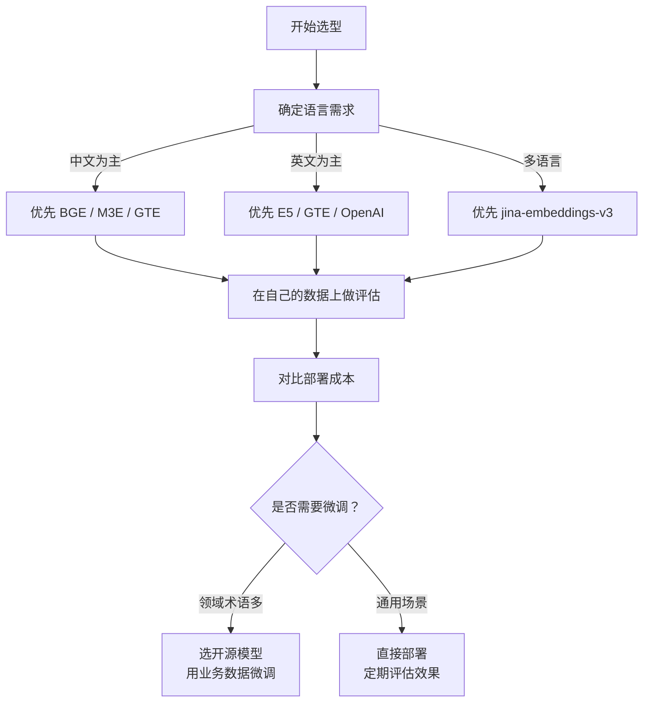
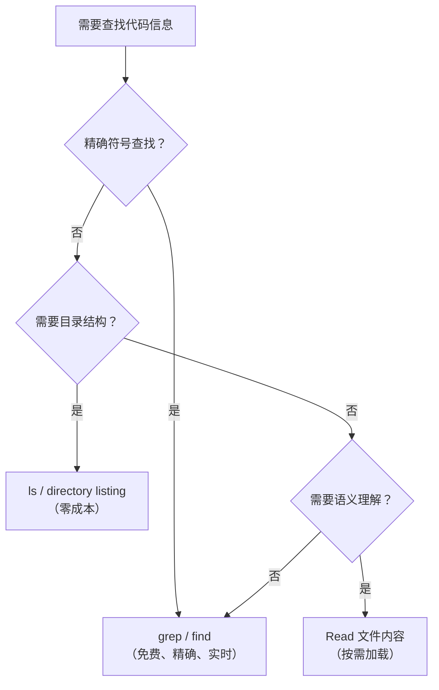

## Q：RAG 召回数据层应如何设计文档、Chunk、Embedding、版本和权限 Schema？

> 来源：[Newegg AI 软件工程实习一面](https://www.nowcoder.com/discuss/920719616005898240)【[拼多多 复活赛 一面](https://www.nowcoder.com/feed/main/detail/2109cf8eb0254507911fbf86bcbf51e4)追问：如果文档都做倒排或索引，怎么同时解决切分和权限问题？】

**新手答**：“建一张表存文档和向量，再加标题、内容、更新时间几个字段。”

**高手答**：

不要把逻辑文档、某次解析结果、Chunk 和 Embedding 塞进一张宽表。至少拆成五类实体：

```text
document       业务文档身份、数据源、owner、当前有效版本
document_ver   内容哈希、原始对象 URI、解析状态、创建时间、父版本
chunk          稳定 chunk_id、version_id、正文、章节路径、page/span、content_hash
embedding      chunk_id、model_id、维度、向量/向量库 point_id、构建状态
acl_binding    resource_id、subject/role/tenant、policy_version、有效期
```

离线任务另存 `ingestion_run`，记录解析器、Chunk 策略、Embedding 模型、输入/输出数量、失败项和幂等键。`document_id` 表示业务对象，`version_id` 表示不可变快照；回答绑定具体版本和 Chunk，不能只记“来自某文档”。Embedding 模型升级时新增 embedding 记录和索引版本，不覆盖旧向量；切流完成后再按保留策略回收。

关键不变量包括：Chunk 必须属于一个不可变文档版本；向量必须能反查原文 span；删除/权限撤销能沿数据血缘找到索引、缓存和派生摘要；同一 `content_hash + pipeline_version` 重跑幂等。关系库保存权威元数据和状态，原始大文件进对象存储，向量库负责近邻检索；三者通过稳定 ID 关联，不让向量库成为唯一事实源。

**差距在哪**：新手只有“内容加向量”，高手把版本、血缘、权限、模型迁移和可删除性落实成数据模型与不变量。

---

### Q：向量数据库怎么选型？不同规模下该用什么方案？

> 来源：阿里国际 AI 应用研发二面 【淘天Agent开发追问：为什么选 pgvector 而不是其他向量数据库】；[中兴软开一面](https://www.nowcoder.com/feed/main/detail/0b39815babfb47108464ffabdf929eba)；[钉钉一面](https://www.nowcoder.com/discuss/923765750446202880)

**新手答**：“用 Milvus 就行。”

**高手答**：

向量数据库的选型不是“挑一个最有名的”，而是**按数据规模分层选择，再根据业务需求做筛选**。

**按数据规模分层推荐**：

**小规模（< 10 万条向量）**：pgvector / SQLite-VSS

直接在现有关系型数据库上加向量扩展。运维成本几乎为零，不需要额外部署服务。对于早期项目和 PoC 阶段完全够用。

**中等规模（10 万 - 1000 万条向量）**：Milvus Lite / Qdrant / Weaviate

需要专用的向量数据库。这个量级对索引类型（HNSW / IVF）、过滤能力、持久化都有要求。这三个都支持元数据过滤，且社区活跃、文档完善。

**大规模（1000 万条以上）**：Milvus 集群 / Pinecone / Zilliz Cloud

需要分布式架构和水平扩展能力。Milvus 集群支持多副本和分片；Pinecone 和 Zilliz Cloud 是全托管服务，运维成本低但按量计费。

**选型维度对比**：

| 选型维度 | 关键问题 | 影响选择 |
|---------|---------|---------|
| 数据规模 | 当前多少条？预期增长到多少？ | 决定单机 vs 分布式 |
| 过滤需求 | 是否需要 metadata 过滤（按时间、类别筛选）？ | 排除不支持过滤的纯 ANN 方案 |
| 延迟要求 | P99 延迟要求多少 ms？ | 影响索引类型和部署架构 |
| 运维复杂度 | 团队有没有专人运维？ | 决定自建 vs 托管服务 |
| 成本 | 预算约束是什么？ | 开源自建 vs 商业托管 |
| 混合检索 | 是否需要向量 + 关键词混合搜索？ | 部分方案原生支持（Qdrant、Weaviate），部分需要外接 ES |

**关键考量**：大多数真实 Agent 场景都需要**元数据过滤**——比如“只检索最近 30 天的文档”“只查某个品类下的内容”。这个需求会直接淘汰一些纯 ANN 方案（如裸用 FAISS），因为它们不支持带条件的向量检索。

**生产建议**：**先简单后迁移**。项目初期用 pgvector 快速验证效果，等数据量或性能真正成为瓶颈时再迁移到专用向量数据库。过早引入分布式向量数据库是典型的过度工程——你花两周部署 Milvus 集群，结果数据才 5 万条，pgvector 10ms 就能搞定。

**差距在哪**：新手只给一个品牌名。高手按数据规模分层推荐，且给出了选型维度和“先简单后迁移”的工程建议。面试官考的是你对向量检索基础设施的全面认知。

---

### Q：Embedding 模型怎么选？选型时考虑哪些因素？

> 来源：高德 AI 应用开发实习一面

**新手答**：“用 OpenAI 的就行。”

**高手答**：

Embedding 模型选型不是“哪个最有名用哪个”，而是要**从六个维度系统评估**：

| 维度 | 考虑因素 | 说明 |
|------|---------|------|
| 语言支持 | 中文/英文/多语言 | 中文场景优先选中文优化模型 |
| 向量维度 | 768/1024/1536 | 维度越高精度越好但存储和检索成本越大 |
| 检索精度 | MTEB/C-MTEB 排名 | 用公开基准评估基础能力 |
| 推理速度 | tokens/sec | 影响索引构建和在线检索延迟 |
| 部署成本 | 模型大小、GPU 需求 | 小模型可 CPU 部署 |
| 最大长度 | 512/8192 tokens | 影响 chunk 大小设计 |

**主流模型对比**：

| 模型 | 来源 | 特点 |
|------|------|------|
| BGE 系列 | BAAI（智源） | 中文效果好，开源，多尺寸可选 |
| M3E | Moka | 中文优化，轻量 |
| text-embedding-3 | OpenAI | 效果好但需 API 调用，成本高 |
| jina-embeddings-v3 | Jina AI | 多语言，支持长文本 |
| GTE | Alibaba | 中英文均衡 |

**实际选型决策流程**：



1. **先确定语言需求**：中文场景优先选中文优化模型，不要盲目选英文模型
2. **跑 domain-specific evaluation**：不只看 MTEB/C-MTEB 排名，必须在自己的数据上评估。公开 benchmark 上排名第一的模型，在你的业务数据上可能排第五
3. **对比部署成本**：API 调用模型（如 OpenAI）按量计费，自部署模型有 GPU 成本。数据量大时自部署更划算
4. **考虑是否需要微调**：领域术语多的场景（医疗、法律、金融），通用模型的 embedding 质量会明显下降，这时选开源模型做微调是更好的路径

**关键认知**：公开 benchmark 排名不等于你的场景效果。必须在自己的数据上做 A/B 评测——构建几百条 `(query, relevant_doc)` 的评估集，跑 Recall@K 和 MRR，用数据说话。

**差距在哪**：新手直接选最有名的模型。高手从六个维度系统评估，坚持在业务数据上做 domain-specific evaluation，而不是盲目跟 benchmark 排名。面试官考的是你选型时有没有工程化的方法论，以及对“通用模型 vs 领域适配”这个 tradeoff 的理解。

---

### Q：为什么 Claude Code 不用 RAG 检索代码，而是直接用 grep？

> 来源：字节 Agent 开发实习一面

**新手答**：“可能是还没来得及实现 RAG。”

**高手答**：

这道题非常好，它直接挑战了“RAG 万能论”的假设。答案是：**对于代码检索场景，grep 在多个维度上优于 RAG，这是一个深思熟虑的架构选择，而不是技术局限。**

**grep 胜过 RAG 的五个原因**：

| 维度 | grep | RAG |
|------|------|-----|
| 精确性 | `grep "functionName"` 精确匹配，100% 准确率 | 向量检索返回“语义相似”的结果，可能漏掉目标函数 |
| 实时性 | 直接操作当前文件系统，永远是最新的 | 需要索引，代码一改索引就可能过时（开发时代码频繁变动） |
| 成本 | 纯 CPU 计算，免费，耗时 <100ms | 需要 Embedding 计算、向量数据库，索引需随代码变更重建 |
| 可解释性 | 结果确定且可追溯——匹配到哪个文件第几行一清二楚 | 结果取决于 Embedding 质量，无法解释“为什么返回这个结果” |
| 代码结构利用 | 代码高度结构化（函数、类、import 有固定模式），grep + 正则能精准利用这种结构 | Embedding 会丢失代码的结构信息，把代码当成普通文本处理 |

**什么时候 RAG 比 grep 更好**：

grep 不是万能的，以下场景 RAG 占优：

```text
自然语言查询："认证逻辑在哪里？"
  → grep 无法处理，因为代码中没有"认证逻辑"这个字符串
  → RAG 的语义检索能找到 auth_middleware.py、login_handler.py

概念级搜索："找到类似的实现"
  → grep 只能匹配精确字符串
  → 向量检索能找到语义相似的代码片段

跨模块依赖分析："哪些模块依赖了这个服务？"
  → grep 能做简单的 import 搜索，但知识图谱 / RAG 能发现间接依赖
```

**Claude Code 的实际策略——渐进式披露（Progressive Disclosure）**：



核心原则是**从最廉价、最精确的工具开始，按需逐步升级到更昂贵的工具**。grep 和 find 是第一层（零成本、高精度），读文件是第二层（中等成本），只有在前两层无法满足需求时才考虑更重的检索手段。

**这道题的 meta 启示**：

最佳检索方法取决于查询类型。不要默认使用 RAG——有时候更简单的工具反而更好。这个原则不仅适用于代码检索，也适用于所有 Agent 的工具选择：**先用廉价精确的工具，只在必要时才升级到昂贵复杂的工具**。这就是渐进式披露在工具选择层面的体现。

**差距在哪**：新手假设 RAG 是万能的，认为不用 RAG 是技术缺陷。高手理解 grep 在精确性、实时性、成本、可解释性和代码结构利用五个维度上的优势，并且看到了 Claude Code 的渐进式披露策略是一个**深思熟虑的架构选择**——从廉价精确工具开始，按需升级。面试官考的是你能不能跳出“RAG 万能论”的思维定式，根据场景选择最合适的检索方案。
