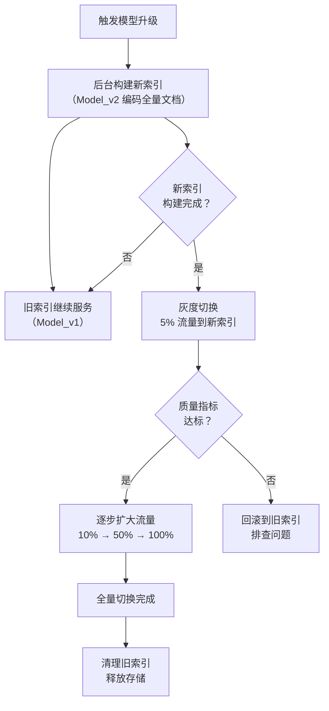

## Q：Coding Agent 应从代码反向理解领域知识，还是维护独立知识库/规则库？

> 来源：[国际业务 Agent 二面](https://www.nowcoder.com/feed/main/detail/b163baeb304e432d9b4c9c218ed467fa)

**新手答**：“把代码全部向量化放进知识库，Agent 检索到相关代码就能理解业务。”

**高手答**：

代码和知识库不是二选一，它们回答不同问题。代码、类型、接口和可执行测试是“系统现在怎么运行”的证据；产品规则、术语、流程、合规约束和设计决策解释“为什么这样运行、允许改成什么”。只读代码会把历史兼容逻辑误当业务规则，只读文档又可能使用已经过期的设计。

构建上下文时分层检索：先用符号搜索、依赖图和测试定位当前实现，再按模块、领域实体和版本检索规范/决策记录。每条外部知识保留 owner、适用服务、代码版本范围、更新时间和来源；代码索引绑定 commit，知识索引绑定文档版本。两者冲突时不让模型自行“取一个更合理的”，而是按权威策略处理：运行事实以当前代码/测试为准，目标行为以已批准 Spec 为准，无法判定则生成差异报告并请求 owner 澄清。

变更后同时验证代码和知识：接口/领域事件变化触发受影响文档检查，规范变更触发实现和测试差异检查。最终提交应说明用了哪些代码证据、哪些业务规则以及尚未解决的冲突，避免 Agent 把推断写成事实。

**差距在哪**：新手把领域知识等同于代码 Embedding，高手区分运行事实与规范意图，并用版本、权威层级和双向变更检查处理冲突。

---

### Q：升级 Embedding 模型后，怎么保证索引和检索向量的逻辑一致性？

> 来源：阿里国际 AI 应用研发二面

**新手答**：“重新跑一遍索引就行了。”

**高手答**：

**核心问题**：旧文档用 Model_v1 编码入库，新查询用 Model_v2 编码检索——两个模型的向量空间不对齐，导致检索质量断崖式下降。即使两个模型都很强，它们学到的向量空间是不同的，v1 空间里的“近邻”在 v2 空间里可能完全不是近邻。

“全量重建索引”是正确的方向，但**对于百万级文档，全量重建需要数小时甚至数天**，在此期间系统要么不可用，要么用旧模型继续服务（效果变差）。所以真正的挑战不是“能不能重建”，而是“怎么平滑过渡”。

**三种升级策略**：

**策略一：双索引并行**

```text
在旧索引继续服务的同时，后台用新模型构建新索引。
新索引构建完成后，做一次原子切换——流量瞬间从旧索引切到新索引。
```

优点：切换瞬间完成，用户无感知。缺点：过渡期需要双倍存储成本，且切换前无法验证新索引的线上效果。

**策略二：渐进式迁移**

```text
给每个文档向量打上 embedding_model_version 标签。
过渡期内，查询同时用 v1 和 v2 两个模型编码，分别检索对应版本的分区，合并结果。
后台逐步将旧文档用新模型重新编码，完成后删除旧分区。
```

优点：平滑过渡，任何时刻系统都可用。缺点：过渡期查询要编码两次、搜索两次，延迟翻倍。

**策略三：版本化索引 + 灰度切换**

```text
新索引构建完成后，不立即全量切换，而是先导流 5-10% 到新索引。
对比新旧索引的线上指标（召回率、相关性、用户点击率）。
指标达标 → 逐步扩大流量比例直到全量切换。
指标异常 → 立即回滚到旧索引。
```

优点：风险最低，有数据验证。缺点：验证周期长，需要流量分配基础设施。

**完整的双索引过渡流程**：



**工程保障措施**：

1. **始终存储原始文本**：向量可以重算，原始文本不能丢。每个 chunk 必须保留原始文本，这样任何时候都能用新模型重新编码
2. **版本标记每个向量**：`embedding_model_version` 字段必须持久化到向量记录中，方便区分哪些文档已迁移、哪些还没有
3. **自动化质量回归测试**：维护一组 `(query, expected_relevant_docs)` 的黄金测试集，每次模型升级后自动跑 Recall@K 和 MRR，低于阈值则阻断上线

**差距在哪**：新手只想到“重建”——这是正确的第一步但忽略了过渡期的可用性。高手给出了双索引并行、渐进式迁移、灰度切换三种策略，且强调了版本标记和自动化质量回归测试。面试官考的是你对向量检索系统升级的工程化思维——不是“能不能升级”，而是“怎么平滑升级”。
