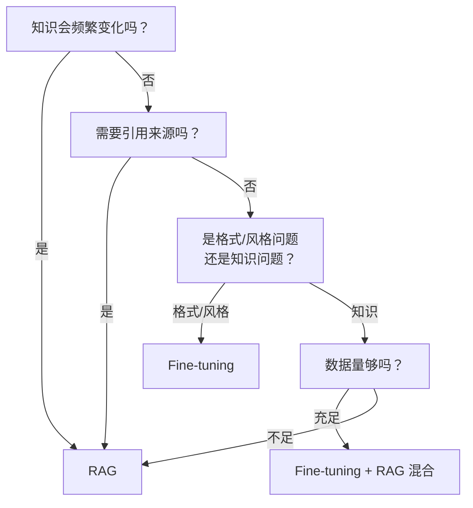
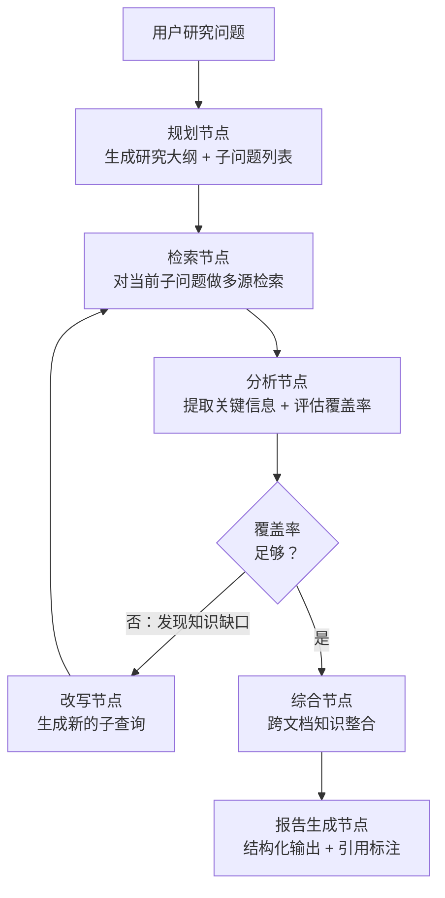
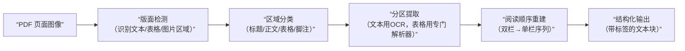
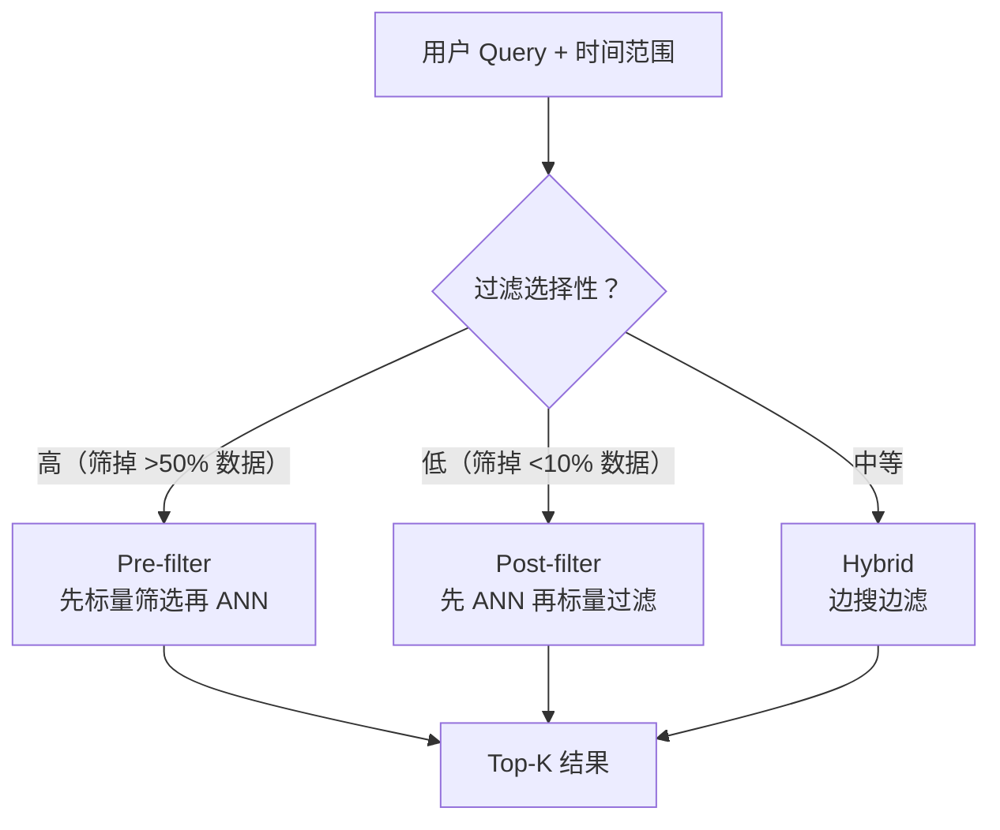
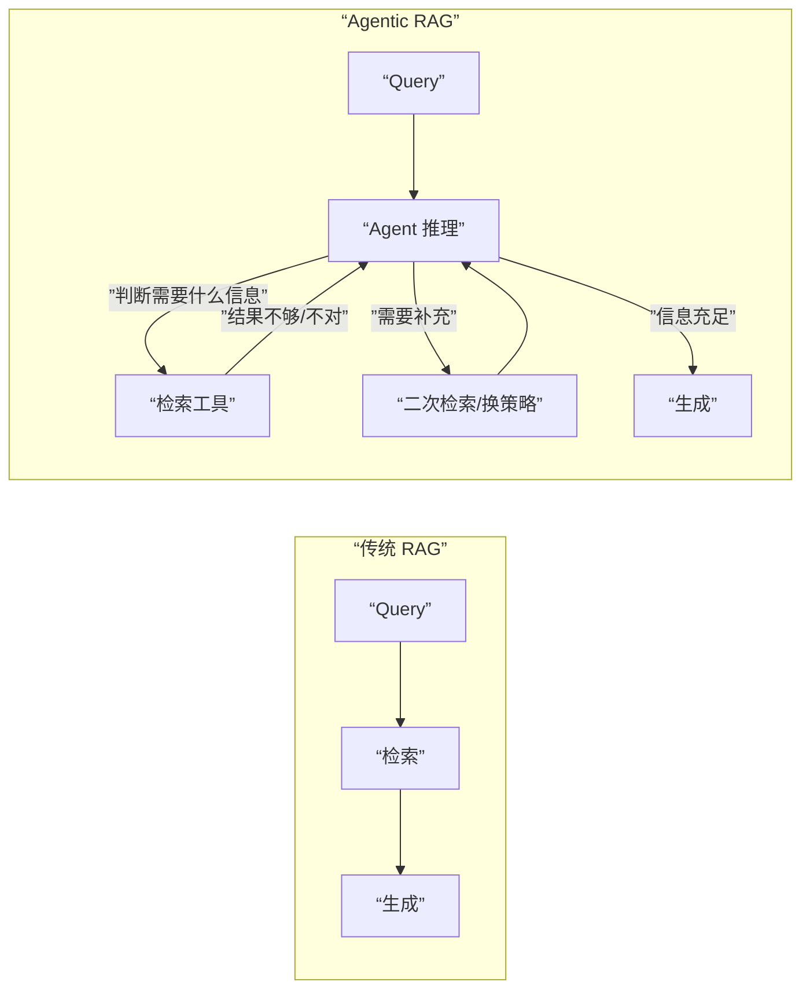
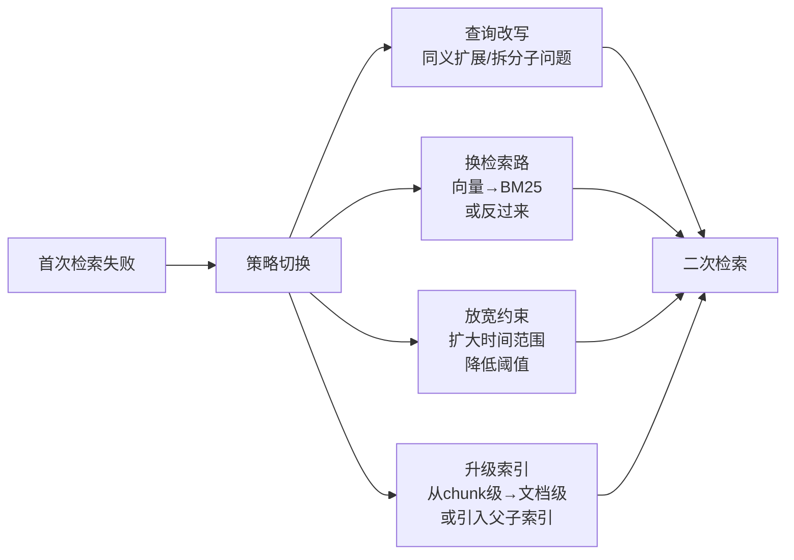
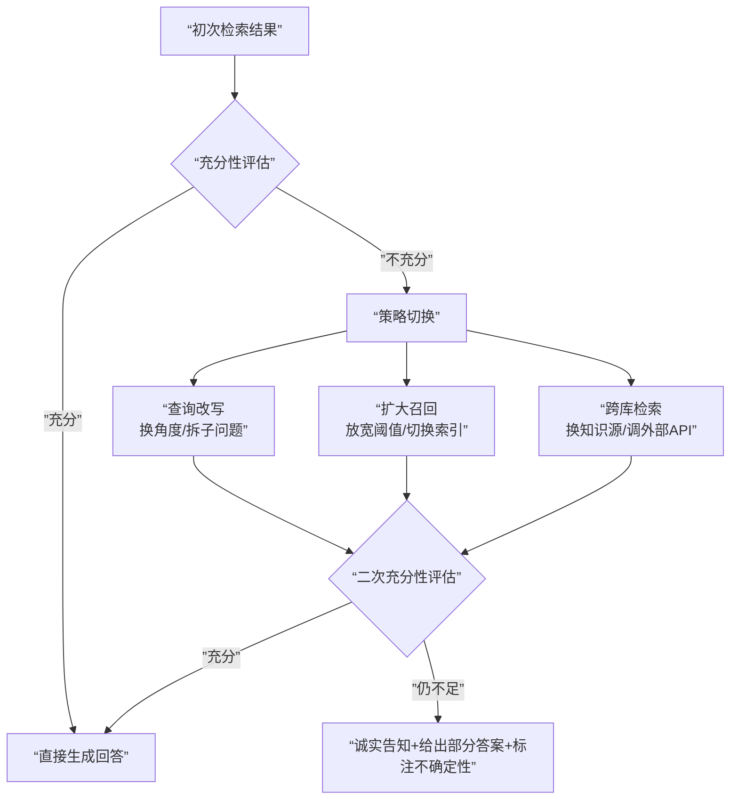

## 进阶检索架构

### Q：图检索、向量检索、混合检索有什么区别？怎么选？

> 来源：腾讯 AI 应用开发二面；[字节 AI 应用开发二面](https://www.nowcoder.com/feed/main/detail/7e8a821479a649fd914e449d312eeb95)【[百度Agent一面](https://www.nowcoder.com/feed/main/detail/72858aade19d443facc870fea8bb134f)追问：为什么选择混合召回？】【[作业帮秋招一面](https://www.nowcoder.com/feed/main/detail/c86c7591ba9d47b696774ddb48cdc9cb)追问：RAG 是多路检索吗，单路检索能不能做、能不能解决业务问题？】

**新手答**：“向量检索最常用，图检索更准。”

**高手答**：

三种检索方式解决的是**不同类型的查询问题**，不存在“哪个更准”：

| 维度 | 向量检索 | 混合检索 | 图检索（GraphRAG） |
|------|---------|---------|-------------------|
| **检索原理** | 语义相似度匹配 | 语义 + 关键词双路 | 实体关系遍历 + 社区摘要 |
| **擅长的查询** | “XX 是什么”“如何做 XX” | 既需要语义又需要精确匹配 | “XX 和 YY 有什么关系”“整体趋势” |
| **不擅长的查询** | 多跳推理、关系型问题 | 全局性总结类问题 | 简单事实问答 |
| **索引构建成本** | 低（只需 Embedding） | 中（Embedding + 倒排索引） | 高（LLM 抽取实体 + 图构建） |
| **查询延迟** | 毫秒级 | 毫秒级 | 秒级（需图遍历） |
| **维护成本** | 低（增量更新简单） | 中 | 高（实体变更需重建子图） |

**选型决策树**：

```text
查询类型主要是什么？
├── 事实问答（”XX 的创始人是谁”）→ 混合检索（关键词精确 + 语义兜底）
├── 概念解释（”什么是 RAG”）→ 向量检索（语义匹配足够）
├── 关系推理（”A 和 B 有什么关联”）→ 图检索
├── 全局总结（”这个领域的趋势”）→ 图检索（Community Summary）
└── 混合场景 → 多路检索 + ReRank 融合
```

**生产系统的常见做法**：不选一种，而是**多路并行、统一精排**。向量检索和关键词检索作为基础双路，图检索作为补充路（只在检测到关系型查询时启用）。最后用 ReRank 模型统一排序，取 Top-K 送给生成模型。

“为什么没用 Knowledge Graph”也要用证据回答：先按线上 Query 标注事实查找、精确术语、多跳关系和全局总结的占比，再用同一评测集比较向量/混合检索与图检索在目标切片上的增量。如果问题主要是单跳事实、实体关系数据不完整、知识更新频繁，图的抽取、消歧、冲突合并和增量维护成本可能高于收益，此时不使用 KG 是合理决策；只有关系型切片的端到端正确率、证据质量或可解释路径显著提升，且延迟与维护成本可接受，才逐步启用图检索。不能用“GraphRAG 更先进”或“项目没时间”代替量化取舍。

**差距在哪**：新手把三种检索当成“好/更好/最好”的关系。高手理解它们解决的是不同类型的查询问题——向量检索擅长语义匹配，混合检索兼顾精确和语义，图检索擅长关系推理和全局总结。选型依据不是“哪个更先进”，而是“你的查询类型分布是什么”。面试官考的是你对多种检索范式的系统性理解和选型能力。

---

### Q：RAG 架构与模型微调（Fine-tuning）相比，各自的适用场景和优缺点是什么？

> 来源：字节后端 Agent 开发二面 【淘天转正实习一面追问：预训练语料已包含相关知识为什么还要RAG】【[字节二面（Trae）](https://www.nowcoder.com/discuss/924821959647440896)追问：RAG 主要用来做什么？】

**新手答**：“RAG 不需要训练，Fine-tuning 效果更好。”

**高手答**：

这两种方案不是互斥的，而是解决**不同类型知识注入问题**的工具。核心判断框架：

**RAG 本质是「外挂知识」——检索时注入**

| 维度 | RAG |
|------|-----|
| 知识更新 | 改文档即生效，无需重新训练 |
| 可追溯性 | 每个回答都能追溯到来源文档 |
| 成本 | 无训练成本，主要是检索基础设施 |
| 知识容量 | 理论上无上限，取决于文档库规模 |
| 适用场景 | 知识频繁更新、需要引用来源、企业知识库 |

**Fine-tuning 本质是「内化知识」——训练时注入**

| 维度 | Fine-tuning |
|------|-------------|
| 知识更新 | 需重新训练和部署 |
| 可追溯性 | 无法追溯到具体来源 |
| 成本 | 训练 + 数据标注 + GPU 资源 |
| 知识容量 | 受模型参数量限制 |
| 适用场景 | 固化领域风格/格式、提升特定任务能力、降低推理成本 |

**关键决策点**：



**最优解往往是混合方案**：用 Fine-tuning 让模型学会领域的「语言」和「格式」（怎么说），用 RAG 注入具体的「事实」和「知识」（说什么）。例如医疗场景——微调让模型学会医学术语和问诊风格，RAG 提供最新的诊疗指南和药品信息。

**差距在哪**：新手把 RAG 和 Fine-tuning 当成二选一。高手理解两者解决不同问题——RAG 解决「知道什么」，Fine-tuning 解决「怎么表达」——且给出了决策框架和混合方案。面试官考的是你对知识注入手段的全局认知。

---

### Q：如何处理 RAG 过程中的权限隔离和时效性问题？

> 来源：字节后端 Agent 开发二面【[阿里千问 AI 应用研发一面](https://www.nowcoder.com/feed/main/detail/da6d74a34ceb4e52b9b4fbcac25cfb3b)追问：文档/Chunk ACL、缓存与引用泄露】【[拼多多 复活赛 一面](https://www.nowcoder.com/feed/main/detail/2109cf8eb0254507911fbf86bcbf51e4)追问：你们把内部文档给 Agent 用，有没有考虑过泄露问题？】

**新手答**：“给每个用户建一个单独的知识库。”

**高手答**：

权限隔离和时效性是 RAG 上生产环境后**最先暴露的两个安全问题**。单独建库的方案在用户量大时不可行——需要系统性的工程方案：

**一、权限隔离：检索前过滤，而非物理隔离**

```text
用户请求 → 鉴权（提取用户权限标签）
         → 在向量检索时注入 metadata filter
         → 只召回用户有权访问的文档
```

实现方式：

| 方案 | 实现 | 适用场景 |
|------|------|---------|
| **元数据过滤** | 每个文档 chunk 存储权限标签（部门、角色、项目），检索时通过 pre-filter 过滤 | 权限维度明确、变更不频繁 |
| **多租户索引** | 按租户分索引（物理隔离），查询时路由到对应索引 | 租户间数据完全隔离（如 SaaS 多客户） |
| **行级安全** | 在关系型数据库层面做权限控制，向量检索结果再和权限表 join | 权限规则复杂、需要动态变更 |

关键工程细节：pre-filter（检索前过滤）vs post-filter（检索后过滤）的选择。pre-filter 在向量数据库层面直接过滤，效率高但可能影响召回质量（候选集变小）；post-filter 先全量召回再权限过滤，召回质量高但有信息泄露风险（模型可能已经「看到」了无权限内容的 embedding 相似度信号）。**生产中推荐 pre-filter**。

ACL 必须从文档继承到 Chunk、派生摘要、图片描述和索引点，所有向量/BM25/GraphRAG/补充检索路径使用同一授权条件。向量库的 metadata filter 只是执行能力，例如 [Qdrant 官方过滤文档](https://qdrant.tech/documentation/search/filtering/)支持 payload 条件；授权策略仍由可信身份系统决定。关系元数据可使用类似 [PostgreSQL Row-Level Security](https://www.postgresql.org/docs/current/ddl-rowsecurity.html)的默认拒绝策略，并审计高权限账号和策略绕过边界。

缓存键还要包含租户、权限摘要和策略版本；权限撤销后使相关缓存失效。Rerank、上下文组装和最终引用再次校验资源权限，避免无权 Chunk 通过缓存、日志或引用反查泄露。回归集覆盖跨租户、共享文档、权限撤销、ACL 继承和缓存串读。

**二、时效性：文档生命周期管理**

| 策略 | 做法 |
|------|------|
| **时间戳标记** | 每个 chunk 存储文档创建/更新时间，检索时做时间衰减加权 |
| **增量更新** | 文档变更时只重新嵌入受影响的 chunk，不重建全量索引 |
| **版本管理** | 同一文档的多个版本共存，检索时优先返回最新版本 |
| **TTL 机制** | 设置文档过期时间，过期后自动降权或剔除 |

**时效性的隐藏陷阱**：用户问「最新的政策是什么」，如果召回了旧版本文档，模型会很自信地给出过时的答案——这比「不知道」更危险。防御方案：在生成阶段注入时间上下文（「以下文档更新于 2024-03-01，请注意时效性」），让模型自己判断是否需要提示用户信息可能过时。

**差距在哪**：新手只想到物理隔离（按用户建库）。高手给出了三层权限方案（元数据过滤、多租户索引、行级安全）和四种时效性策略，且点出了 pre-filter vs post-filter 的安全 trade-off。面试官考的是你对 RAG 工程化落地中安全问题的实战认知。

---

### Q：向量数据库中 IVF_FLAT 和 HNSW 索引的区别是什么？各自适合什么场景？

> 来源：快手AI应用开发一面【[阿里巴巴（淘天）- 大模型算法岗（搜推方向）](https://www.nowcoder.com/discuss/926272464059891712)追问：向量检索中 IVF 与 HNSW 的选型依据是什么？】【[全栈实习一面，20分钟居然问这么细😂](https://www.nowcoder.com/feed/main/detail/4af1e257116e4e36970c6e0d8bf2f70e)追问：你的 RAG 向量数据库用的索引是什么？】

**新手答**：“都是加速向量搜索的索引，HNSW 更快。”

**高手答**：

IVF_FLAT 和 HNSW 是两种完全不同的索引范式——一个基于分区量化，一个基于图遍历，适用场景差异很大：

| 维度 | IVF_FLAT | HNSW |
|------|----------|------|
| 核心思想 | 先聚类分桶，查询时只搜少数桶 | 构建多层跳表图，贪心遍历近邻 |
| 构建时间 | 快（kmeans 聚类） | 慢（逐点插入建图） |
| 内存占用 | 低（只存聚类中心 + 原始向量） | 高（每个节点存多层邻居指针） |
| 查询速度 | 中等（受 nprobe 参数控制） | 极快（图遍历，路径短） |
| 召回率 | nprobe 小时召回低，大时接近精确 | 高（ef_search 调大后接近 100%） |
| 增量更新 | 容易（新向量分配到最近的桶） | 较难（插入需更新多层图结构） |
| 数据规模 | 适合千万级以上（配合 PQ 压缩） | 适合百万到千万级 |

**IVF_FLAT 工作原理**：

```text
建索引：对所有向量做 K-means 聚类 → 得到 nlist 个聚类中心
查询时：计算 query 与所有聚类中心的距离 → 选最近的 nprobe 个桶 → 在这些桶内暴力搜索
```

**HNSW 工作原理**：

```text
建索引：逐个插入向量，每个向量随机分配层级 → 在每层中与最近邻建立边
查询时：从顶层入口点开始 → 在每层贪心跳到最近邻 → 逐层下降直到底层 → 底层精搜 Top-K
```

**选型决策**：

| 场景 | 推荐索引 | 原因 |
|------|---------|------|
| 数据量大（>1000w）、内存有限 | IVF_PQ（IVF + 量化压缩） | HNSW 内存扛不住 |
| 数据量中等、要求低延迟 | HNSW | 查询速度最快，延迟稳定 |
| 数据频繁更新（实时写入） | IVF_FLAT | 增量更新成本低 |
| 离线批量检索、对延迟不敏感 | IVF_FLAT（大 nprobe） | 召回率高且节省内存 |
| RAG 在线服务 | HNSW | 用户感知延迟要低，内存可以加机器解决 |

**差距在哪**：新手只知道“HNSW 更快”——这是结论不是理解。高手从数据结构原理（分桶 vs 图遍历）出发，推导出各自的性能特征和适用场景，且能给出具体的选型建议。面试官考的是你对向量检索底层机制的理解深度——不是会用 API，而是知道为什么这个参数要这样调。

---

### Q：Deep Research 在代码层面是怎么实现的？和普通 RAG 有什么区别？

> 来源：bilibili AI研发实习一面【字节火山引擎 Managed Agent 一面追问：如何用 Agent 做 Auto Research】

**新手答**：“就是多搜几次，然后总结一下。”

**高手答**：

Deep Research 不是“多搜几次”——它是一种**Agent 驱动的迭代检索-合成架构**，核心区别在于检索策略是动态的、由 Agent 在运行时根据已有信息决定下一步查什么。

**和普通 RAG 的本质区别**：

| 维度 | 普通 RAG | Deep Research |
|------|---------|---------------|
| 检索次数 | 一次（query → 检索 → 生成） | 多次迭代（每轮检索结果影响下一轮查询） |
| 查询生成 | 用户原始 query 或简单改写 | Agent 根据已有信息动态生成子查询 |
| 知识综合 | 拼接检索结果给模型 | 逐步构建结构化的知识图，跨文档关联 |
| 覆盖判断 | 无——检索一次就结束 | Agent 评估“信息是否足够”，不够则继续检索 |
| 输出 | 短回答 | 长篇结构化报告 |

**代码层面的核心实现**：

用 LangGraph 实现 Deep Research 的典型架构：



**关键实现细节**：

**1. 规划节点——把大问题拆成可检索的子问题**

```python
def plan_node(state):
    prompt = f"""将以下研究问题拆解成 3-5 个具体的子问题，
    每个子问题应该能通过一次文献检索回答：
    
    研究问题：{state["research_question"]}
    """
    sub_questions = llm.invoke(prompt)
    return {"sub_questions": sub_questions, "current_index": 0}
```

**2. 检索节点——对每个子问题做多源并行检索**

```python
async def search_node(state):
    query = state["sub_questions"][state["current_index"]]
    results = await asyncio.gather(
        search_semantic_scholar(query),
        search_arxiv(query),
        search_web(query),
    )
    merged = deduplicate(flatten(results))
    return {"search_results": merged}
```

和普通 RAG 只查一个向量库不同，Deep Research 通常并行查询多个数据源（学术数据库、网页、专利库），然后合并去重。

**3. 分析节点——提取信息并评估覆盖率**

这一步是 Deep Research 的核心——Agent 不只是检索，还要**评估检索结果的充分性**。如果发现知识缺口（某个子问题还没有足够的证据支撑），生成新的查询再检索。

```python
def analyze_node(state):
    extracted = llm.invoke(f"""从以下检索结果中提取关键信息：
    {state["search_results"]}
    
    已有知识：{state.get("accumulated_knowledge", "")}
    当前子问题：{state["sub_questions"][state["current_index"]]}
    
    输出：1. 关键发现  2. 置信度评估  3. 知识缺口
    """)
    return {
        "accumulated_knowledge": state.get("accumulated_knowledge", "") + extracted.findings,
        "gaps": extracted.gaps,
        "coverage_sufficient": extracted.confidence > 0.8
    }
```

**4. 迭代控制——防止无限检索**

```python
def should_continue(state):
    if state["coverage_sufficient"]:
        return "synthesize"
    if state["iteration_count"] >= MAX_ITERATIONS:  # 通常 3-5 轮
        return "synthesize"
    return "refine_query"
```

必须设置最大迭代次数，否则 Agent 可能陷入“总觉得信息不够”的无限循环。

**5. 综合节点——跨文档知识整合**

普通 RAG 直接把检索结果拼给模型生成答案。Deep Research 需要先做**跨文档的知识整合**——对比不同来源的观点、识别共识和争议、构建时间线和因果关系——然后基于整合后的结构化知识生成报告。

**工程上的核心难点**：

| 难点 | 解决方案 |
|------|---------|
| 迭代多轮导致上下文膨胀 | 每轮只保留结构化摘要，原始检索结果不进入下一轮上下文 |
| 多源检索结果质量参差不齐 | 来源权威性评分 + ReRank 精排 |
| 幻觉引用风险高 | 所有事实必须关联到具体检索结果的 ID，生成后做引用校验 |
| 检索成本高 | 设最大迭代次数 + 子问题优先级排序（先查最关键的） |

**差距在哪**：新手把 Deep Research 理解为“多搜几次加总结”。高手在代码层面展示了完整的迭代检索-分析-改写循环，核心是 Agent 驱动的动态查询生成和覆盖率评估——每轮检索的 query 不是预设的，而是根据已有信息实时生成的。面试官考的是你能不能把 Deep Research 从产品概念转化为可实现的 Agent 管线。

---

### Q：RAG 知识库的噪声剔除和文档去重怎么做？

> 来源：腾讯 AI 应用开发二面 【淘天Agent开发追问：防止 AI 批量生成虚假数据投毒】

**新手答**：“看着删。”

**高手答**：

知识库的质量直接决定 RAG 的效果上限。**垃圾进，垃圾出**——再好的检索和生成也无法弥补知识库本身的噪声。

**噪声剔除分三层**：

| 层次 | 噪声类型 | 剔除方法 |
|------|---------|---------|
| 文档级 | 空文档、格式损坏、非目标语言 | 规则过滤（长度/编码/语种检测） |
| 段落级 | 页眉页脚、版权声明、目录、广告 | 正则匹配 + 分类器（训练一个轻量模型区分正文和噪声） |
| 语义级 | 无信息量的废话、过时信息 | 信息密度评分（困惑度过低的段落往往是套话） |

**文档去重的三种策略**：

1. **精确去重（URL / 文件哈希）**：对文档的 URL 或内容 MD5 去重，处理完全相同的文档。最快，但无法处理“内容相同但格式不同”的情况
2. **近似去重（MinHash / SimHash）**：计算文档的指纹，相似度超过阈值（如 0.9）的文档只保留一篇。适合处理“同一篇文章的不同版本”
3. **语义去重（Embedding 聚类）**：对所有文档做 Embedding，用 DBSCAN 聚类，同一簇内保留质量最高的一篇。计算成本高，但能处理“不同表述的相同内容”

**重复片段识别**：

多篇文章中出现的重复段落（如“免责声明”“公司简介”）比整篇重复更隐蔽。处理方法：

```text
1. 对所有 chunk 计算 SimHash 指纹
2. 按指纹分桶，同桶内的 chunk 两两比较文本相似度
3. 相似度 > 0.85 的标记为重复片段
4. 保留出现次数最多的那一份，其余删除或标记为”低优先级”
```

**差距在哪**：新手要么不做清洗（让噪声进入检索），要么靠人工逐条检查（不可扩展）。高手从文档级/段落级/语义级三层做噪声剔除，用精确/近似/语义三种策略做去重，形成了可自动化、可扩展的知识库清洗管线。面试官考的是你对 RAG 数据质量的工程化管控能力。

---

### Q：PDF 解析用什么工具？Layout-aware Parsing 是怎么做的？

> 来源：腾讯 AI 应用开发二面

**新手答**：“用 PyPDF 读文本就行。”

**高手答**：

PyPDF 只能提取纯文本流，**完全丢失版面布局信息**——表格变成散乱的文字、双栏论文的左右栏被混在一起、图片标注和正文混淆。RAG 的质量上限取决于解析质量，解析错了后面全链路都救不回来。

**主流 PDF 解析工具对比**：

| 工具 | 原理 | 优势 | 劣势 | 适合场景 |
|------|------|------|------|---------|
| PyPDF / pdfplumber | 文本流提取 | 快、零依赖 | 丢失布局，表格乱 | 纯文本 PDF |
| Unstructured | 规则 + ML 混合 | 支持多格式，社区活跃 | 表格准确率一般 | 通用文档 |
| Marker | 视觉模型 | 版面还原度高 | 速度慢 | 学术论文 |
| MinerU (PDF-Extract-Kit) | 版面检测 + OCR | 表格还原强，开源 | 资源消耗大 | 复杂排版 PDF |
| 商业方案（Azure Document Intelligence） | 云端 ML | 准确率最高 | 收费、数据出境 | 企业级生产 |

**Layout-aware Parsing 的核心思路**：



关键是**先“看”再“读”**——不是直接提取文本流，而是先用视觉模型识别页面上每个区域的类型和位置，然后按阅读顺序依次提取。

**选型建议**：学术论文用 Marker 或 MinerU（版面复杂但格式相对规范），企业文档用 Unstructured + 自定义后处理，对准确率要求极高的场景用商业方案。**没有万能工具，必须横向对比**——用同一批标注好的文档测试不同工具的准确率，选最适合自己文档类型的。

**差距在哪**：新手用 PyPDF 读文本，遇到表格和复杂排版就束手无策。高手理解 Layout-aware Parsing 的核心是“先视觉理解版面结构，再分区提取内容”，并能对比不同工具的适用场景做选型。面试官考的是你对 RAG 管线最上游（文档解析）的工程理解——这一步的质量决定了后续所有环节的上限。

---

### Q：多模态 Embedding 检索中，文本语义与图像视觉特征的权重怎么平衡？用户检索图纸参数却召回外观相似零件，根源是什么？

> 来源：阿里淘天 AI应用开发一面

**新手答**：“把文本和图片都转成向量，拼一起搜。”

**高手答**：

多模态检索的核心矛盾是**不同模态的语义空间天然不对齐**——文本描述的是抽象概念（尺寸、材质、公差），图像编码的是视觉特征（颜色、形状、纹理）。“拼一起搜”忽略了这个根本问题。

**两种融合方式**：

| 融合方式 | 原理 | 优点 | 缺点 |
|---------|------|------|------|
| Early Fusion（CLIP-style 联合空间） | 文本和图像在训练时就映射到同一个向量空间 | 端到端优化，跨模态匹配能力强 | 通用模型学到的是“外观相似性”，不理解工程参数 |
| Late Fusion（分别编码再加权） | 文本和图像各自编码，检索时加权合并分数 | 权重可灵活调整，各模态可独立优化 | 跨模态交互弱，依赖权重调参 |

**权重平衡方案**：

**静态权重**：`final_score = α × text_sim + (1-α) × image_sim`，α 是固定值（如 0.6）。简单但不灵活——参数查询和外观查询用同一个权重显然不合理。

**动态权重**（更优方案）：根据 query 类型自动调整权重——

```text
Query 类型判断：
  "M8×1.25 螺栓 材质 304" → 参数查询 → α=0.9（几乎全靠文本）
  "这个零件长什么样"      → 外观查询 → α=0.2（主要靠图像）
  "找类似这张图纸的零件"  → 混合查询 → α=0.5（均衡）
```

实现方式：用一个轻量分类器（或规则引擎）先判断 query 类型，再动态设置 α。

**图纸参数召回外观相似零件的根源分析**：

问题**不在检索算法，在 Embedding 模型**。通用视觉模型（如 CLIP）在预训练时学到的是外观级别的相似性——颜色、形状、轮廓。它不理解工程图纸中的参数语义（尺寸标注、公差范围、材质标签）。所以当用户搜“M8×1.25 不锈钢螺栓”时，模型返回的是外观最像螺栓的图片，而不是参数匹配的零件。

**三种解决方案对比**：

| 方案 | 做法 | 优点 | 缺点 | 适用场景 |
|------|------|------|------|---------|
| 通用视觉模型（CLIP） | 直接用预训练模型做多模态检索 | 开箱即用，零成本 | 不理解工程参数，召回靠外观 | PoC 阶段、外观检索 |
| 领域微调模型 | 用工程图纸 + 参数标注数据微调 Embedding | 理解领域语义，参数匹配准确 | 需要标注数据，训练成本高 | 参数检索精度要求高 |
| 混合检索方案 | 参数字段走精确匹配，外观走向量检索 | 各取所长，参数精确、外观覆盖 | 系统复杂度高，需维护两套索引 | 生产环境首选 |

**推荐的生产方案——混合检索**：

```text
结构化参数（尺寸、材质、公差）→ 标量过滤（精确匹配 / 范围查询）
外观特征（形状、颜色）        → 向量检索（视觉相似度）
两路结果取交集或加权合并
```

结构化参数**不应该走向量检索**——“M8×1.25”这种精确规格用 Embedding 编码后会丢失精确性，直接用结构化字段过滤才是正确做法。向量检索只负责外观维度的相似度匹配。

**差距在哪**：新手把多模态当成“拼向量”。高手理解多模态检索的核心矛盾——不同模态的语义空间不对齐，权重平衡不是调参数，是选架构。面试官考的是你能不能从一个检索失败案例反推出系统设计缺陷。

---

### Q：向量数据库中需要限定时间范围检索时，标量条件过滤怎么高效实现？

> 来源：阿里淘天 AI应用开发一面

**新手答**：“先向量检索再过滤掉不符合时间的。”

**高手答**：

“先搜后滤”（Post-filter）是最直觉但最低效的方案——放大 K 倍检索再过滤，过滤率高时大量计算浪费，且可能凑不够 K 条结果。

**三种策略对比**：

| 策略 | 做法 | 优点 | 缺点 | 适用场景 |
|------|------|------|------|---------|
| Pre-filter | 先用标量索引（B-tree / bitmap）筛出时间范围内的文档 ID 集合，再在该子集上做 ANN 搜索 | 结果精确，不浪费向量计算 | 时间范围内文档太少时 ANN 效果退化（候选集不够大） | 过滤条件选择性高（筛掉大部分数据） |
| Post-filter | 先做 ANN 搜索取 top-K×M（放大 K），再用标量条件过滤 | 实现简单，不影响 ANN 索引结构 | 过滤率高时计算浪费严重，可能凑不够 K 条结果 | 过滤条件选择性低（只筛掉少量数据） |
| Hybrid | 在 ANN 搜索过程中同时检查标量条件，边搜边滤 | 平衡精度和效率 | 实现复杂，需要索引层支持 | 通用场景 |

**Pre-filter 的详细流程**：

```text
1. 用标量索引快速筛选：SELECT doc_id FROM docs WHERE timestamp > 1700000000
   → 得到候选 ID 集合（毫秒级，B-tree 范围查询）
2. 在候选 ID 子集上做 ANN 搜索：只在这些向量上计算距离
   → 得到 top-K 结果（精确且无浪费）
```

**Milvus 具体实现**：

Milvus 支持 boolean expression 做 pre-filter，底层在 segment 级做分区裁剪（partition pruning）：

```python
# Milvus pre-filter 示例
results = collection.search(
    data=[query_vector],
    anns_field="embedding",
    param={"metric_type": "COSINE", "params": {"nprobe": 10}},
    limit=10,
    expr="timestamp > 1700000000 and timestamp < 1710000000"  # 标量过滤
)
```

**最佳实践**：

1. **时间维度做 partition key**：按时间范围（如按月）对数据做分区，查询时直接跳过不相关的分区，连标量过滤都省了
2. **高基数标量字段建 scalar index**：对 timestamp、category 等字段建标量索引，加速过滤
3. **Pre-filter 优先**：除非过滤条件非常宽松（只筛掉 <10% 数据），否则 pre-filter 几乎总是优于 post-filter
4. **监控过滤率**：如果 post-filter 丢弃了超过 50% 的 ANN 结果，说明应该切换到 pre-filter



**差距在哪**：新手用“先搜后滤”的暴力方案。高手对比了 pre/post/hybrid 三种策略，理解 Milvus partition pruning 机制。面试官考的是你对向量数据库工程实现的理解深度。

---

### Q：Agentic RAG 是什么？和传统 RAG 的核心区别？

> 来源：美团Keeta Agent开发一面

**新手答**：「就是把 RAG 和 Agent 结合起来吧。」

**高手答**：

传统 RAG 是**单轮管线**：query → 检索 → 生成，一次检索定胜负。Agentic RAG 的本质变化是**把 Agent 的推理循环引入检索过程**——检索不再是单次操作，而是 Agent 的一个可反复调用的工具。

**两者的核心架构差异**：



| 维度 | 传统 RAG | Agentic RAG |
|------|---------|-------------|
| 检索决策 | 固定管线，query 进来就检索 | Agent 判断是否需要检索、检索什么 |
| 检索次数 | 单次 | 多次迭代，根据结果质量决定是否继续 |
| Query 改写 | 预定义规则改写 | Agent 根据上下文动态改写，甚至拆分子问题 |
| 结果评估 | 无（检索到什么就用什么） | Agent 评估检索质量，不满意则换策略重检 |
| 工具组合 | 只有向量检索 | 可组合多种检索工具（向量、图谱、SQL、API） |
| 适用场景 | 简单事实问答 | 复杂多跳推理、需要整合多源信息的任务 |

**Agentic RAG 的三个关键能力**：

1. **自主判断检索时机**：不是每个 query 都需要检索——Agent 先评估自身知识是否足够，不足时才触发检索。避免了传统 RAG 对所有请求都检索的资源浪费
2. **检索结果自我评估**：检索完成后，Agent 判断结果是否能回答问题。如果召回的文档不相关或信息不完整，主动改写 query 或切换检索策略进行二次检索
3. **多源检索编排**：复杂问题拆成多个子问题，分别用不同的检索工具（向量库查概念、知识图谱查关系、SQL 查数据），最后综合推理

**工程落地的权衡**：

Agentic RAG 的能力更强，但**延迟和成本也更高**——多次检索意味着多次 LLM 推理。生产中通常采用**分级策略**：简单 query 走传统 RAG 快速响应，复杂 query 才进入 Agentic RAG 循环。

**差距在哪**：新手把 Agentic RAG 简单理解为「RAG + Agent」的拼凑。高手理解核心区别在于**检索从固定管线变成了 Agent 的可迭代工具**——Agent 能自主决定是否检索、检索什么、结果够不够、要不要换策略。面试官考的是你对 RAG 范式演进的认知——从被动管线到主动推理。

---

### Q：补充检索是如何评估数据质量并触发的？怎么保证二次检索能搜到之前没搜到的内容？

> 来源：淘天 Agent 开发

**新手答**：“检索结果不好就再搜一次。”

**高手答**：

「再搜一次」如果用同样的策略，结果不会有本质变化。补充检索的关键是**先评估质量，再换策略重搜**：

**一、什么时候触发补充检索？**

需要一个**质量评估门控**，而不是每次都二次检索：

| 评估维度 | 检测方法 | 触发条件 |
|---------|---------|---------|
| **召回数量** | 候选文档数 < 阈值 | top-K 返回不足 3 条 |
| **相关性得分** | Rerank 后最高分低于阈值 | 最高分 < 0.5（模型和数据相关） |
| **覆盖度** | query 中的关键实体/概念是否被召回文档覆盖 | 核心实体零命中 |
| **自洽性** | 让模型判断「基于这些文档能否回答问题」 | 模型输出「信息不足」信号 |

最实用的方案是**相关性得分 + 模型自判**组合：Rerank 分数兜底硬指标，模型自判捕捉语义层面的不足。

**二、怎么保证二次检索搜到不同的内容？**

核心是**换检索策略**，而不是重复同一策略：



| 策略 | 做法 | 为什么能搜到新内容 |
|------|------|-------------------|
| **查询改写** | 用 LLM 将原 query 改写为 2-3 个不同表述 | 弥补词汇鸿沟，触达不同文档 |
| **切换检索路** | 首次向量召回不好 → 换 BM25 精确匹配 | 两种检索的盲区不同 |
| **放宽约束** | 去掉时间/来源等过滤条件 | 扩大候选集 |
| **拆分子问题** | 复杂 query 拆成多个简单子 query 分别检索 | 每个子 query 更精准 |

**三、防止无限循环**

补充检索必须设**上限**（最多 2-3 轮）。如果多轮检索后质量仍不达标，应该**诚实告知用户信息不足**，而不是用低质量结果硬凑答案。

**差距在哪**：新手的「再搜一次」没有质量评估也没有策略切换——大概率搜出同样的结果。高手先用质量门控判断是否需要补充检索，再用策略切换保证二次检索有实质性差异。面试官考的是你对 RAG 检索链路的精细化控制能力。

---

### Q：RAG 检索到的 Chunk 不足以回答问题，后续怎么处理？

> 来源：字节春招大模型测开一面

**新手答**：“让模型直接用自己的知识回答，或者告诉用户找不到。”

**高手答**：

这是 RAG 系统最常见的退化场景之一。“Chunk 不足”有两种含义——检索到了但信息不够完整，或者根本没检索到相关内容。处理策略完全不同：

**第一层：判断“不足”的程度**

在生成前先做一步**充分性评估**（Sufficiency Check）：用 LLM 判断当前检索结果能否支撑回答。评估维度：

- 关键实体是否存在（问“A 和 B 的区别”，至少要有 A 和 B 的描述）
- 时间/数值是否覆盖（问“2024年营收”，2023年的数据不算充分）
- 逻辑链是否完整（问“为什么 X 导致 Y”，需要因果链条，不能只有结论）

**第二层：补充检索策略**

如果判定不足，触发 Agentic RAG 的补充检索：



关键策略：

1. **查询改写** — 原始 query 可能太笼统或措辞偏离文档表达。拆成子问题、换同义词、补充上下文后重新检索
2. **扩大召回范围** — 降低相似度阈值、增加 Top-K、切换到 BM25 关键词匹配（语义检索漏掉的关键词匹配可能命中）
3. **跨库检索** — 如果本地知识库确实没有，可以调用外部搜索引擎、数据库查询、或调用其他系统的 API

**第三层：生成策略**

如果补充检索后仍不足：

- **部分回答 + 标注** — “根据现有信息，X 部分的答案是...，但关于 Y 的具体数据暂未找到”
- **不编造** — 绝对不能让模型用自身参数知识补充事实性信息（这是幻觉的主要来源）
- **引导用户** — “您可以提供更具体的文档/关键词吗？”或“建议查阅 XX 系统获取最新数据”

**差距在哪**：新手的处理是二元的——“有就答，没有就说不知道”。高手有一套分级应对策略：先评估不足程度，再用查询改写/扩大召回/跨库检索做补充，最后仍不足时给出部分答案并标注不确定性。面试官考的是你对 RAG 系统边界情况的处理能力——生产环境中“检索不足”比“检索精准”出现得更频繁。

---

### Q：向量数据库里两个同义词是什么关系？完全同义的词会在同一个点上吗？

> 来源：字节春招大模型测开一面

**新手答**：“同义词的向量应该一样，在同一个点上。”

**高手答**：

同义词在向量空间中**非常接近但不会完全重合**。这涉及 Embedding 模型的本质工作方式：

**为什么不在同一个点上**：

Embedding 模型编码的不仅是“词义”，还包括：
- **使用语境差异** — “开心”和“高兴”虽然同义，但“开心果”和“高兴果”不等价。模型会捕捉到这些细微的搭配差异
- **语域/正式度** — “逝世”和“死了”语义相同，但正式度不同，向量会有偏移
- **训练语料分布** — 两个词在训练数据中的上下文分布不完全相同，导致编码略有差异

**具体的空间关系**：

```text
完全同义词（如 “AI” 和 “人工智能”）：
  → 余弦相似度 > 0.95，几乎重合但有微小偏移

近义词（如 “开心” 和 “高兴”）：
  → 余弦相似度 0.85-0.95，同一区域的邻近点

上下位关系（如 “狗” 和 “动物”）：
  → 余弦相似度 0.6-0.8，有方向性偏移

反义词（如 “大” 和 “小”）：
  → 余弦相似度可能 0.3-0.6（不一定对称分布在原点两侧）
```

**对 RAG 的实际影响**：

同义词接近但不重合意味着：
1. 查询 “AI应用” 可以召回包含 “人工智能应用” 的文档（相似度高）
2. 但精确匹配度略低于完全相同的表述 → 这就是为什么需要**查询改写**（把 “AI” 扩展为 “AI/人工智能”）
3. 也是为什么**混合检索**（向量 + BM25）有效 — BM25 处理精确匹配，向量处理语义近似

**差距在哪**：新手认为同义词 = 同一个点。高手理解 Embedding 空间是连续的高维空间，同义词是“近邻”而非“重合”，且能解释为什么——因为模型编码的是上下文分布而非字典定义。面试官通过这个问题考察你对 Embedding 的理解是停留在“API 调用”还是真正理解其数学含义。
