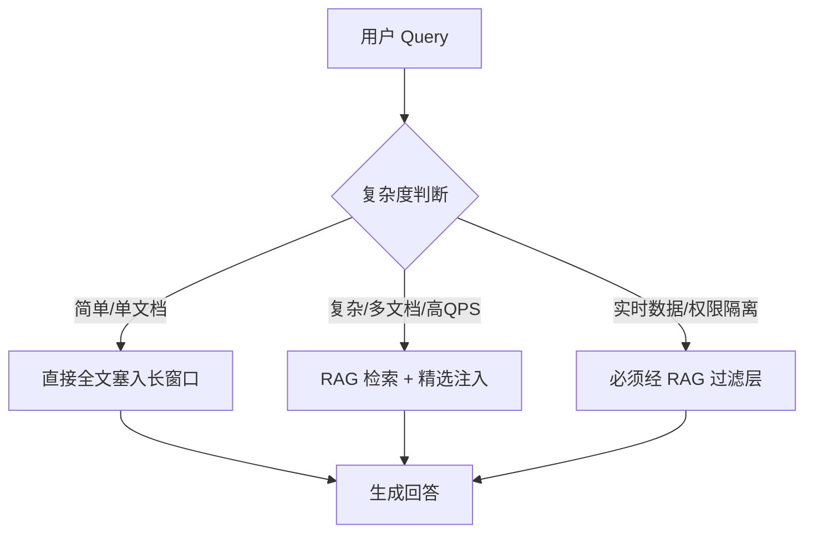

## Q：随着大模型上下文窗口持续扩容（100K→1M+），传统 RAG 技术是否会被完全替代？

> 来源：阿里淘天 AI Agent应用开发二面

**新手答**：“窗口够大了就不需要 RAG 了，直接把所有文档塞进去就行。”

**高手答**：

短期内不会被完全替代，长期会深度融合而非简单替代。核心论点：

**RAG 不会消失的四个理由：**

1. **成本问题**：1M token 的推理成本远高于“检索 5 个 chunk + 8K 上下文”。对高 QPS 场景（如客服），全量塞入的经济性不可接受
2. **注意力稀释**：即使窗口能装下，模型对中间位置信息的关注度仍然不均匀（Lost in the Middle 问题未根本解决），检索后精选 Top-K 反而提高相关信息的权重
3. **实时性与权限**：知识库持续更新，不可能每次请求都重新拼装全量文档；且不同用户有不同的数据权限，RAG 的过滤层天然支持权限隔离
4. **可审计性**：RAG 能明确告诉你“这个回答基于哪个文档的哪个片段”，全量塞入后模型引用溯源变得极困难

**窗口扩容确实改变了什么：**

- **RAG 的角色从“必须”变成“优化”**：以前窗口不够必须检索，现在是为了提高质量和降本而检索
- **chunk 策略变粗**：以前切 512 token 的小块，现在可以检索整段甚至整篇文档
- **检索-生成边界模糊化**：可以先粗检索一批大文档塞进长窗口，再让模型自己做“精排 + 生成”
- **简单场景不再需要 RAG**：FAQ、单文档问答等简单场景，直接全文塞入更省事

**未来的融合形态：**

**差距在哪**：这是开放观点题，面试官考的是技术判断力。新手非此即彼（要么 RAG 必须，要么窗口万能），高手能分场景讨论成本、注意力、实时性、可审计性四个维度，给出“不是替代而是融合”的结论，并能描述融合后的具体形态。
