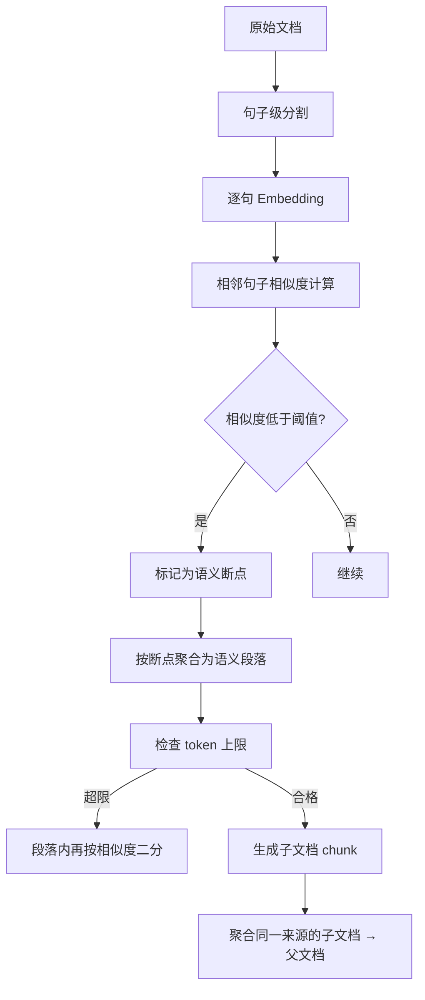
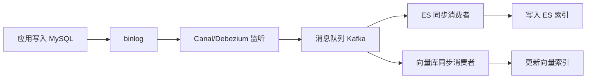
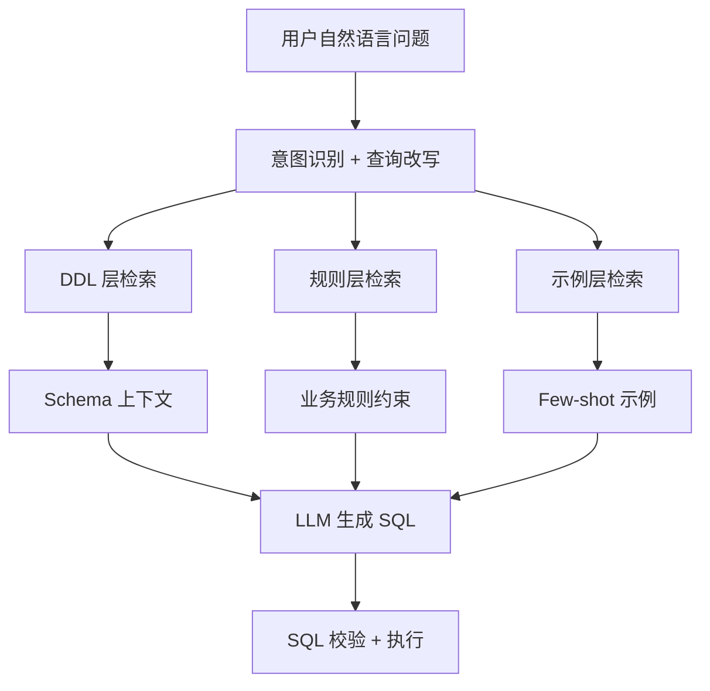

## 语义切分与文档聚类

### Q：父文档是怎么得到的？语义切分具体是怎么做的？聚类后怎么区分不同文档？

> 来源：同程Agent开发实习一面【[百度Agent一面](https://www.nowcoder.com/feed/main/detail/72858aade19d443facc870fea8bb134f)追问：为了保证连续语义，文本具体怎么切分？有什么算法？】

**新手答**：“按 512 token 切就行了，父文档就是原始文档。”

**高手答**：

父子文档索引的核心思路是：**子文档用于精准召回，父文档用于提供完整上下文**。语义切分是让子文档在语义上自洽的关键。

**语义切分流程：**



**具体步骤：**
1. **句子级分割**：用标点/换行将文档拆成句子序列
2. **逐句 Embedding**：每句生成向量
3. **滑动窗口余弦相似度**：计算相邻句子之间的语义相似度，相似度骤降的位置即为语义断点
4. **按断点聚合**：断点之间的句子合并为一个语义段落（即子 chunk）
5. **token 限制兜底**：如果某个语义段超过 max_tokens（如 512），在段内再找次级断点拆分

**父文档的生成方式：**
- 最简单：父文档 = 原始文档（或原始文档的某一节）
- 进阶：多个相邻子 chunk 共享同一父文档，父文档 = 子 chunks 的上下文窗口扩展（向前向后各扩展 N 句）

**聚类后如何区分不同来源：**
- 每个 chunk 携带 metadata：`\{doc_id, section_id, chunk_index, parent_id\}`
- 检索命中子 chunk 后，通过 `parent_id` 回溯父文档，返回更完整的上下文
- 不同文档通过 `doc_id` 天然隔离，聚类只在单文档内部进行

**差距在哪**：面试官深挖切分细节是为了验证“你的 RAG 到底做了多深”。只说“按 token 切”说明你用了默认方案没调优。能说出语义断点检测 + 相似度骤降 + 父子回溯，说明你真的做过切分实验并理解效果差异。

---

### Q：RAG 项目里，MySQL 和 Elasticsearch 的数据一致性怎么保证？

> 来源：视频面经汇总

**新手答**：“写入 MySQL 后同步写 ES。”

**高手答**：

MySQL 和 ES 的数据一致性是经典的“双写一致性”问题，在 RAG 系统中尤为重要——MySQL 存文档元数据和权限，ES 存全文索引用于召回，两边不一致会导致“能搜到但无权限”或“有权限但搜不到”。

**常见方案对比**：

| 方案 | 一致性 | 延迟 | 复杂度 |
|------|--------|------|--------|
| 同步双写 | 强（但有失败风险） | 高 | 低 |
| 异步消息队列 | 最终一致 | 秒级 | 中 |
| CDC（binlog 监听） | 最终一致 | 秒级 | 高 |
| 定时全量同步 | 弱一致 | 分钟级 | 低 |

**我们的实践（CDC + 补偿）：**



1. **主路径**：应用只写 MySQL，通过 Canal 监听 binlog 变更，推到 Kafka，下游消费者分别更新 ES 和向量库
2. **补偿机制**：定时 Job 对比 MySQL 和 ES 的文档 ID 集合，diff 出不一致的记录重新同步
3. **幂等保证**：ES 写入用文档 ID 作为 `_id`，重复消费不会产生重复数据
4. **顺序保证**：同一文档的变更按 partition key（doc_id）路由到同一 Kafka partition，保证顺序消费

**差距在哪**：新手的“同步双写”在生产中很脆弱——ES 写入失败怎么办？回滚 MySQL 吗？高手用 CDC 方案将写入解耦，配合补偿机制处理极端情况，这才是生产级的一致性方案。

---

### Q：手动干预切片是怎么做的？为什么需要这一步？

> 来源：视频面经汇总

**新手答**：“人工检查切片结果，把切错的手动改一下。”

**高手答**：

**为什么需要手动干预**：自动切片算法（按 token 数 / 按段落 / 按语义）在 80% 的文档上表现不错，但以下场景必须人工介入：

1. **表格跨页**：PDF 中的表格被切成上下两半，上半截没有表头，下半截缺少上下文
2. **图文混排**：图片说明被切到和图片不同的 chunk，检索到说明但没有图
3. **术语定义**：专业术语在第一次出现时有定义，但后续 chunk 中使用时失去了定义上下文
4. **层级结构**：技术文档的标题-子标题层级被打断，子内容脱离了父标题

**实现方式——三种粒度**：

| 方式 | 适用场景 | 实现 |
|------|---------|------|
| 标注切分规则 | 某类文档有固定结构 | 配置“遇到一级标题必须切分”等规则 |
| 手动标记断点 | 特殊文档（合同、法规） | 上传时人工在 UI 上标注分割点 |
| 切片后审核 | 线上 bad case 驱动 | 检索效果差的 query → 追溯到源 chunk → 人工修正 |

**工程落地的关键设计**：
- 切片结果存数据库时保留 `source_type` 字段标记（auto / manual_split / manual_merge）
- 人工修正后重新生成 embedding 并更新向量索引（增量更新，不重建全量）
- 建立“bad case → chunk 溯源 → 修正 → 效果验证”的闭环流程

**差距在哪**：面试官深挖切分细节是为了验证“你的 RAG 到底做了多深”。新手觉得切片是一次性的预处理工作。高手知道切片质量直接决定检索效果——自动切片解决大部分情况，但 bad case 驱动的人工干预是持续优化的关键环节。这体现了 RAG 系统的运营思维，而不是纯开发思维。

---

### Q：Text2SQL 的 RAG 架构里，DDL 层和规则层分别解决什么问题？业务表频繁变更时怎么保持可用？

> 来源：数据智能查询平台面试；[OPPO IT 开发一面](https://www.nowcoder.com/discuss/923561467092160512)

**新手答**：“DDL 层存表结构，规则层存一些 SQL 模板。”

**高手答**：

Text2SQL 的 RAG 架构不是简单的“查文档生成答案”，而是一个**分层知识注入系统**——每层解决不同类型的错误：



**DDL 层解决的问题——Schema 对齐：**
- 存储表结构、字段含义、枚举值映射、表关联关系
- 解决“表不存在”“字段名错误”“join 关系写反”等**结构性错误**
- 关键设计：不是存原始 DDL 文本，而是存**语义化描述**（如 `status: 订单状态，1=待付款 2=已付款 3=已取消`）

**规则层解决的问题——业务逻辑对齐：**
- 沉淀内容：计算口径（“GMV = 实付金额，不含退款”）、过滤条件（“有效订单需排除测试账号”）、时间约定（“自然周从周一开始”）、特殊逻辑（“跨境订单金额需转为人民币”）
- 解决“SQL 能跑但结果不对”的**语义性错误**

业务“黑话”和同义词先进入受治理的术语表，例如把“成交额”“流水”“GMV”映射到明确的指标版本，而不是只靠 Query 改写。再往上一层可以建立本体/语义层：统一定义指标、实体、维度、实体关系与 Join，并把用户可见范围绑定到行列级权限。模型负责把自然语言解析成受约束的语义查询或候选计划；确定性编译器负责校验指标与关系、注入权限策略并生成目标数据源 SQL，最终 SQL 还要经过只读、成本和语法门禁。

[Cube 语义层文档](https://docs.cube.dev/docs/introduction)展示了一种实现边界：指标、实体、Join 和访问规则集中在共享数据模型中，查询经语义层校验并确定性应用访问策略后才到数据仓库。这不是说 Text-to-SQL 必须依赖 Cube，而是说明“模型理解问题”和“受治理地编译/执行 SQL”应分层。直接 Text-to-SQL 更灵活，适合 Schema 较小、探索性强的场景；语义层/本体方案前期建模成本更高，但更适合跨数据源、稳定业务口径和统一权限。两者可以组合：模型先选语义对象，语义层编译 SQL；无法覆盖的长尾查询再进入受限的直接生成路径。

**业务表频繁变更时的保鲜机制：**

| 策略 | 实现 | 适用场景 |
|------|------|---------|
| Schema 变更监听 | 监听数据库 DDL 变更事件（如 MySQL 的 schema_change 事件），自动触发知识库更新 | 字段增删改 |
| 定时全量同步 | CronJob 每天对比 information_schema 与知识库的 diff，补充新增表/字段 | 兜底保障 |
| 业务方标注 | 提供 Web UI，业务方修改字段含义/计算口径后自动更新 Embedding | 语义变更 |
| 版本化管理 | DDL 知识按版本存储，查询时带上时间戳匹配对应版本 | 历史数据查询 |

**规则层感知业务变化的方式：**
- 被动：用户反馈“SQL 结果不对” → 追溯到规则缺失/过期 → 补充规则
- 主动：监控上游数据表血缘变更（如字段口径调整的 MR/PR），自动创建规则审核任务
- 定期：每季度组织业务方 review 规则库，清理过期规则

**差距在哪**：新手把 Text2SQL 简化成“查表结构+生成SQL”。高手看到的是一个三层知识注入系统——DDL 解决结构错误、规则解决语义错误、示例解决风格对齐。面试官深挖“变更怎么感知”是在考你有没有运营过这套系统，而不只是搭建过。

---

### Q：笔试题：多路召回结果合并去重 + 加权排序 + TopK

> 来源：数据智能查询平台面试（笔试）【[作业帮秋招一面](https://www.nowcoder.com/feed/main/detail/c86c7591ba9d47b696774ddb48cdc9cb)追问：两路检索得到的召回结果如何做结果融合？】

**题目**：给定多路召回结果，每条包含 docId、score 和来源（source）。要求合并去重，按加权分数排序，返回 TopK，保证同一文档只出现一次。

**高手答**：

```python
from collections import defaultdict
from typing import List, Dict

def merge_recall_results(
    recall_results: List[Dict],  # [{"docId": "d1", "score": 0.8, "source": "vector"}, ...]
    source_weights: Dict[str, float],  # {"vector": 0.6, "bm25": 0.3, "graph": 0.1}
    top_k: int = 10
) -> List[Dict]:
    """多路召回合并去重 + 加权排序"""
    # 1. 按 docId 聚合，累加加权分数
    doc_scores = defaultdict(float)
    doc_sources = defaultdict(list)
    
    for item in recall_results:
        doc_id = item["docId"]
        source = item["source"]
        weight = source_weights.get(source, 0.0)
        doc_scores[doc_id] += item["score"] * weight
        doc_sources[doc_id].append(source)
    
    # 2. 按加权总分降序排序
    sorted_docs = sorted(
        doc_scores.items(),
        key=lambda x: x[1],
        reverse=True
    )
    
    # 3. 取 TopK
    results = []
    for doc_id, final_score in sorted_docs[:top_k]:
        results.append({
            "docId": doc_id,
            "score": round(final_score, 4),
            "sources": doc_sources[doc_id]
        })
    
    return results
```

**关键设计决策：**

1. **去重策略**：同一 docId 被多路召回时，分数是**累加**而非取最大值——被多路命中本身就是强相关信号
2. **权重设计**：向量召回侧重语义相关，BM25 侧重关键词精准匹配，权重根据业务场景调——FAQ 场景 BM25 权重高，开放问答场景向量权重高
3. **归一化**：如果不同来源的 score 量纲不同（如向量余弦 0-1，BM25 可能 0-30+），需要先做 Min-Max 或 Z-Score 归一化再加权
4. **时间复杂度**：O(N log N)，N 为总召回条数。如果 N 很大且只需 TopK，可用堆优化到 O(N log K)

**面试沟通要点**：先写出清晰正确的基础版本，再主动提出“归一化”和“堆优化”的扩展——展示工程思维的层次感。

**差距在哪**：这道笔试题不难，面试官看的是代码风格（清晰度、命名）和对“为什么这样设计”的思考。只写出 sort 是及格，能说出累加 vs 取最大值的权衡、归一化的必要性、以及大规模场景的堆优化，才是加分项。
