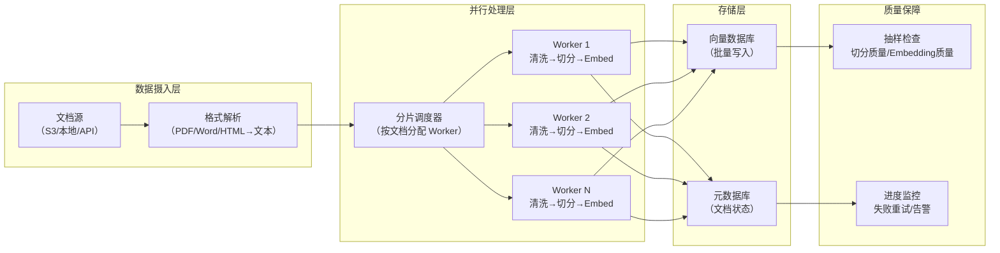

## Q：处理一万个长文档构建 RAG 知识库，工程上怎么做？

> 来源：阿里 Agent 面经（场景题）

**新手答**：“循环处理每个文档，切分后存到向量数据库。”

**高手答**：

一万个长文档（假设每个 5000-50000 字）的规模，单机串行处理可能需要数天。工程上需要从**并行处理、管线设计、质量保障和增量更新**四个维度系统设计。

**整体处理管线**：



**第一步：格式解析——最容易卡住的环节**

一万个文档格式不会统一（PDF、Word、HTML、Markdown 混合），解析是最耗时且最容易出错的环节：

| 格式 | 解析工具 | 难点 |
|------|---------|------|
| PDF | MinerU / Unstructured / 商业 API | 表格、双栏、扫描件 OCR |
| Word | python-docx / Unstructured | 嵌入图片、复杂格式 |
| HTML | BeautifulSoup + 正则清洗 | 去除导航/广告/脚本 |
| Markdown | 原生解析 | 最友好，几乎无损 |

**关键决策**：对 PDF 等复杂格式，先用自动解析 + 后期抽样检查的方式，不要追求 100% 解析正确——80% 质量上线后再迭代优化 bad case。

**第二步：并行处理——从小时级降到分钟级**

```text
规模估算：
  10000 文档 × 平均 10000 字 = 1 亿字
  切分后约 50 万 chunk
  Embedding 计算：50 万 × 768 维 ≈ 1.5GB 向量数据

单机串行耗时：
  解析：~2s/文档 × 10000 = 5.5 小时
  切分：~0.5s/文档 = 1.4 小时
  Embedding：~0.1s/chunk × 50 万 = 14 小时
  总计：~21 小时

10 Worker 并行：
  总计降到 ~2 小时
```

**并行策略**：

1. **文档级并行**：每个 Worker 处理一批文档（如每批 100 个），互不依赖
2. **Embedding 批处理**：不逐条调 API，而是攒够 32/64 条后批量调用，减少 API 开销
3. **异步管线**：解析、切分、Embedding 三个阶段用生产者-消费者模式串联，不等全部解析完才开始切分

**第三步：容错与状态管理**

处理一万个文档必然有失败——某个 PDF 解析崩溃、Embedding API 超时、网络抖动。需要：

| 容错机制 | 实现 |
|---------|------|
| **Checkpoint** | 每个文档处理完记录状态（pending/processing/done/failed） |
| **重试策略** | 失败的文档指数退避重试 3 次，仍然失败标记为 manual_review |
| **幂等设计** | 重复处理同一文档不产生重复 chunk（用 doc_id + chunk_index 做去重） |
| **进度可视化** | 实时显示总进度、成功/失败/进行中的数量 |
| **断点续跑** | 中断后从 checkpoint 恢复，不重头开始 |

**第四步：入库策略——批量写入 vs 逐条写入**

```text
❌ 逐条写入向量数据库：
  50 万次网络请求，延迟巨大，可能触发限流

✅ 批量写入：
  每攒够 1000 条 chunk，批量 upsert 到向量数据库
  Milvus/Qdrant 都支持批量 insert，吞吐高 10-50 倍
```

**第五步：质量保障——不能只看“处理完了”**

1. **切分质量抽检**：随机抽 100 个 chunk，人工检查是否语义完整、有无切断代码/表格
2. **Embedding 质量验证**：构造 20 组已知相关的 (query, doc) pair，验证 Recall@10 是否达标
3. **去重检查**：对所有 chunk 做近似去重（SimHash），重复率超过 5% 说明切分策略有问题
4. **覆盖度分析**：统计各文档的 chunk 数量分布，异常值（某文档只有 1 个 chunk 或 1000 个 chunk）需要排查

**第六步：增量更新——不是一次性工程**

知识库建好后，文档会持续更新。增量更新策略：

```text
文档新增 → 走完整处理管线 → 新 chunk 入库
文档修改 → 删除旧 chunk → 重新处理修改后的文档 → 新 chunk 入库
文档删除 → 按 doc_id 删除所有关联 chunk

触发方式：
  - 文件系统监听（inotify / fswatch）
  - 定时扫描 diff（每天一次）
  - 手动触发（管理后台）
```

**差距在哪**：新手的“循环处理”忽略了规模化场景下的并行处理、容错设计、质量保障和增量更新。高手设计了完整的工程管线——并行 Worker + 批量写入 + Checkpoint 容错 + 质量抽检 + 增量更新——这才是生产级知识库构建方案。面试官考的是你能不能把一个“看起来简单”的任务（处理文档）做成一个可靠的、可运维的工程系统。

---

### Q：RAG 知识库更新怎么不停服？热更新方案怎么设计？

> 来源：腾讯AI应用开发（Agent后端）【[抖音电商Agent全栈开发工程师一面](https://www.nowcoder.com/discuss/925066865183858688)追问：更新是每天全量跑一遍吗？】

**新手答**：“重新跑一遍 Embedding 流水线，更新完重启服务。”

**高手答**：

生产级 RAG 知识库的更新必须做到对用户无感知——不能停服、不能出现检索空窗期。

**1. 双索引切换（Blue-Green）**：
- 维护两份向量索引：active（当前服务）和 standby（正在更新）
- 增量或全量更新只操作 standby 索引
- 更新+验证通过后，原子切换路由指向 → 零停服
- 切换后保留旧索引一段时间用于快速回滚

**2. 增量更新（适合高频变更）**：
- 新文档实时切块 → Embedding → 写入向量库（append）
- 删除/修改的文档通过 doc_id 标记 soft delete → 检索时过滤
- 定期做 compaction 清理已标记删除的向量

**3. 版本化管理**：
- 每次更新带版本号，检索请求携带版本参数
- 支持灰度：10% 流量走新索引，90% 走旧索引
- A/B 对比新旧索引的检索质量指标（召回率、相关性分数）

**4. 一致性保证**：
- 文档元数据（MySQL/ES）和向量索引的同步用事件驱动（CDC + 消息队列）
- 写入向量库成功但元数据未同步 → 检索到但渲染不出来 → 需要双写确认机制
- 设置“数据新鲜度”指标：从文档更新到可被检索到的延迟 < 5min

**差距在哪**：新手的“重新跑一遍+重启”在生产环境是不可接受的——停服意味着用户体验中断。高手用双索引切换做零停服、增量更新做低延迟、版本化做灰度验证，三层组合保证知识库永远在线且可回滚。
