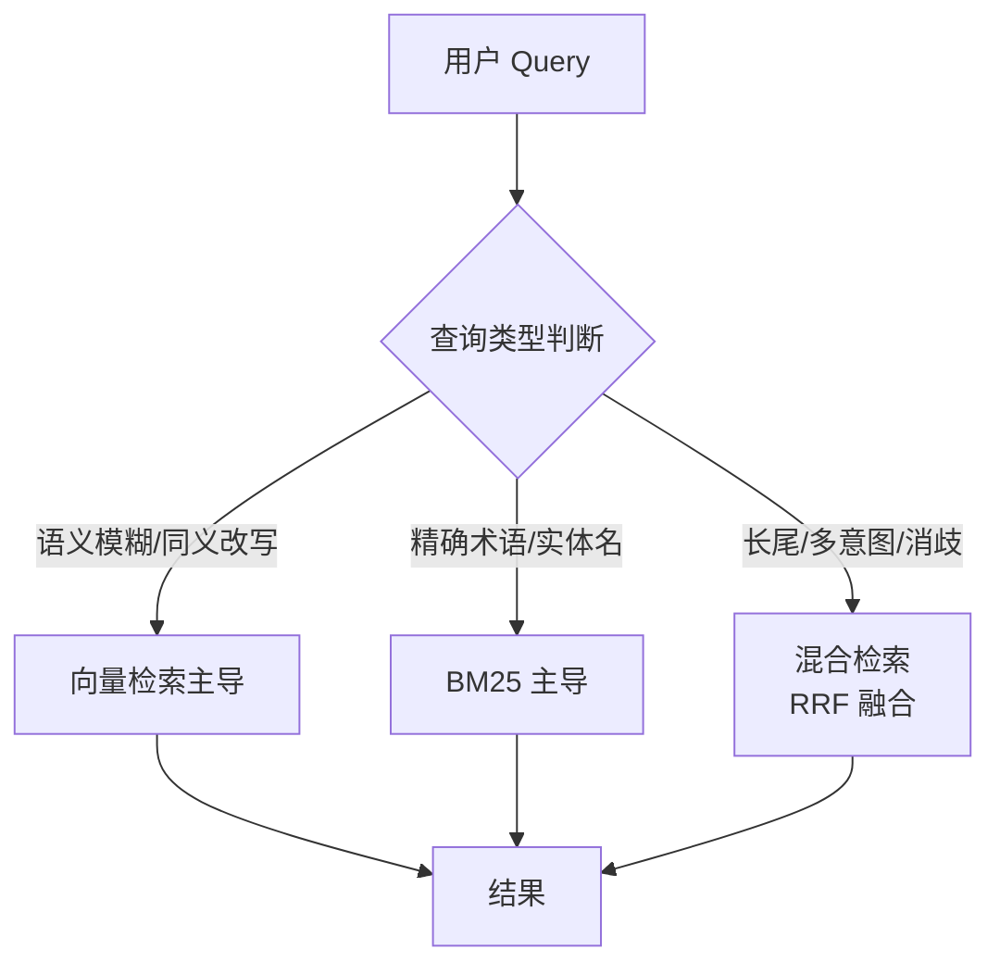

## Q：混合检索到底在哪个环节比单独用效果好？

> 来源：淘天/AI Agent一面【[百度Agent一面](https://www.nowcoder.com/feed/main/detail/72858aade19d443facc870fea8bb134f)追问：有没有通过实验分析向量检索及混合检索带来的提升？】

**新手答**：“混合检索综合了向量和关键词的优点，效果自然好。”

**高手答**：

混合检索不是“无条件好”——需要分场景分析：

**向量检索强的环节**：语义模糊/同义改写（“电脑卡顿” → “性能优化方案”）

**BM25强的环节**：精确术语/实体名/代码片段（“RuntimeError: CUDA out of memory”）

**混合检索真正发挥优势的场景**：

1. **长尾查询**：用户用口语化表达但目标文档是专业术语——向量桥接语义，BM25精确命中关键词
2. **多意图查询**：“Python的GIL锁对多线程性能的影响”——向量理解整体意图，BM25命中“GIL”这个精确关键词
3. **短查询消歧**：“苹果”——纯向量可能检索到手机和水果，BM25结合上下文关键词辅助消歧

**混合反而变差的场景**：

- 纯语义问答（“什么是幸福”）→ BM25引入噪声
- 纯关键词检索（错误码查询）→ 向量检索稀释精确结果

**融合策略的关键**：RRF（Reciprocal Rank Fusion）中的K参数决定了两路结果的权重平衡——需要根据实际查询分布调优。

**差距在哪**：面试官考的不是“混合检索好不好”，而是“你知不知道它在什么条件下好”——要有反面案例。能说出混合反而变差的场景（纯语义问答、纯关键词检索），说明你对混合检索有深入的工程实践，而非人云亦云。
