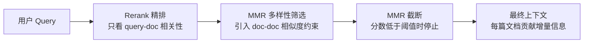

## Q：MMR 为什么还能提高效果？重排后为什么还要设置 MMR 截断？

> 来源：深势科技一面

**新手答**：“MMR去重，避免重复内容。”

**高手答**：

MMR（Maximal Marginal Relevance）的核心公式：

```text
MMR = argmax[λ × Sim(doc, query) - (1-λ) × max(Sim(doc, selected_docs))]
```

**为什么能提高效果（不只是去重）**：

1. **信息多样性**：相关但不重复的文档比多篇高度相似的文档提供更多有效信息
2. **减少上下文浪费**：如果Top-5里3篇说同一件事，相当于浪费了2个slot——MMR确保每个slot贡献增量信息
3. **缓解位置偏差**：Rerank可能因为表面相似度把多篇近义文档排在前面，MMR打散后模型能看到更全面的信息

**重排后还要MMR的原因**：

Rerank模型（Cross-encoder）只看query-doc相关性，不看doc-doc相似度——它可能给出5篇“都相关但信息高度重叠”的结果。MMR在Rerank之后引入文档间多样性约束，是“相关性+多样性”的二次平衡。

**MMR截断（λ阈值）**：当MMR分数低于阈值时停止取文档——宁可少给也不给低质量/低增量的内容。



**实际效果数据**：Top-5中加MMR vs 不加MMR，生成答案的完整性提升约15-20%（因为覆盖了更多角度）。

**差距在哪**：面试官考的是对“检索后处理”环节的理解深度——不只是“去重”，而是信息论层面的最优信息子集选择。能说出Rerank和MMR各自解决什么问题（相关性 vs 多样性），说明你对检索管线有精细化的认知。
