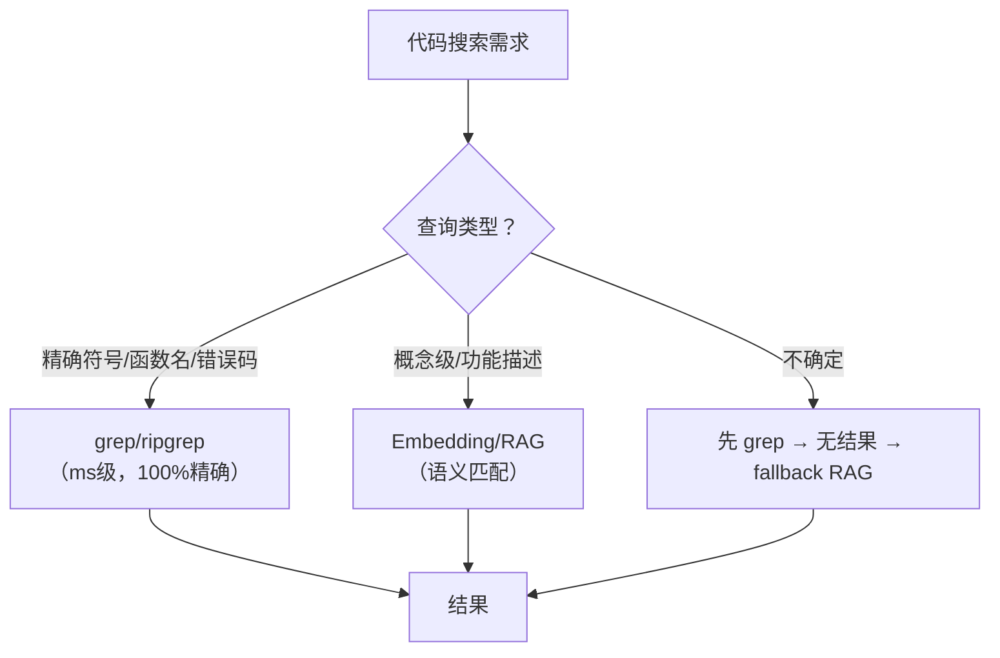

## Q：基于关键词的命令行代码搜索与基于 Embedding/RAG 的代码搜索，各有什么优缺点？

> 来源：某小厂FOSHO/AI应用开发二面

**新手答**：“关键词搜索快但不智能，RAG搜索智能但慢。”

**高手答**：

| 维度 | 关键词搜索（grep/ripgrep） | Embedding/RAG搜索 |
|------|--------------------------|-------------------|
| 速度 | 极快（ms级，直接扫文本） | 较慢（需要embedding+向量检索） |
| 精确度 | 完全精确匹配（函数名、变量名） | 可能有语义偏移 |
| 语义理解 | 零（只看字符串） | 强（理解“授权”=“authentication”） |
| 索引成本 | 零/极低 | 需要预计算embedding，增量更新成本高 |
| 跨语言能力 | 无 | 有（理解不同语言的同一概念） |
| 代码更新 | 实时（直接搜文件） | 有延迟（需要重新embedding） |
| 最佳场景 | 找函数定义、变量引用、精确错误信息 | 找“做XX功能的代码在哪”、理解性搜索 |

**为什么 Claude Code 选 grep 而非 RAG**：

1. 代码库变化频繁，embedding 索引维护成本高
2. 开发者搜索多数是精确搜索（函数名、类名、错误信息）
3. grep 结果确定性强——不会出现“检索到语义相似但不相关的代码”
4. 可以用 AST 结构化搜索补充 grep 的语义不足

**最佳实践**：混合方案——先 grep 精确匹配，无结果时再 fallback 到语义搜索。

**差距在哪**：面试官考的是对“搜索”本质的理解——不同场景下最优解不同，不是新技术一定比老技术好。能说出 Claude Code 选择 grep 的四个工程理由，说明你对代码搜索有深入的实践经验。
