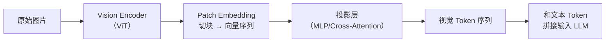

## 模型能力与部署

### Q：RLHF 中奖励模型（RM）的训练数据如何构建？

> 来源：字节 Agent 实习一面

**新手答**：“找人标注好坏就行。”

**高手答**：

RM 的训练数据核心是**偏好对（preference pairs）**——同一个 prompt，两条不同回答，人类标注哪条更好。

**数据构建流程**：

1. **采样候选回答**：对同一个 prompt，用 SFT 模型采样多条回答（通常 4-8 条），用不同的 temperature 和 top-p 增加多样性
2. **人工偏好标注**：标注员对每对回答标注偏好（A 优于 B / B 优于 A / 平局）。标注维度通常包括有用性（helpfulness）、无害性（harmlessness）、诚实性（honesty）
3. **质量控制**：
   - 多人标注同一对，用 Fleiss' Kappa 衡量一致性，低一致性的样本审核或丢弃
   - 设置金标准题（标注员已知的正确答案），筛除不合格标注员
   - 对争议样本做多轮仲裁
4. **数据增强**：用强模型（如 GPT-4）批量生成候选回答并做初步排序，再交人工校验，降低标注成本

**训练数据的关键设计**：

- **难度分层**：不能只有“好 vs 很差”的简单对比，需要大量“好 vs 稍好”的难样本，否则 RM 学不到细粒度区分
- **场景覆盖**：代码、数学、创意写作、事实性问答等不同场景需要分别覆盖
- **负样本多样性**：不只是“错的回答”，还要包含“部分正确但有瑕疵”、“正确但啰嗦”、“正确但不安全”等边界样本

**差距在哪**：新手以为标注就是“标好坏”。高手的回答覆盖了从采样、标注、质量控制到数据增强的完整流程，且强调了难样本和场景覆盖的重要性。面试官考的是你对 RLHF 数据管线的理解深度。

**追问：奖励函数/奖励模型的打分逻辑具体怎么设计？规则 vs 模型怎么选？**

> 来源：快手大模型推荐算法一面 / 荣耀大模型算法实习一面

奖励函数的设计直接决定 RL 训练的天花板——**奖励信号错了，模型越训越歪**。

**两种奖励方案对比**：

| 维度 | 规则奖励（Rule-based） | 模型奖励（Reward Model） |
|------|---------------------|----------------------|
| 打分逻辑 | 人工定义评分规则，确定性输出 | 训练一个模型学习人类偏好 |
| 适用场景 | 有客观正确答案（数学、代码、格式遵循） | 无唯一正确答案（创意写作、对话质量） |
| 优点 | 零噪声、可解释、无需训练、迭代快 | 能捕捉人类偏好中的微妙差异 |
| 缺点 | 难以覆盖开放式任务 | 有偏差、可被 hack、需要持续校准 |
| Reward hacking 风险 | 低（规则明确） | 高（模型可能学到捷径） |

**规则奖励的设计模式**：

```text
数学/代码任务的典型评分规则：
  结果正确性：answer == ground_truth → +1.0，否则 0.0
  格式遵循：输出包含指定格式标签 → +0.1
  推理完整性：包含中间步骤 → +0.1
  长度惩罚：超过 max_tokens → -0.1

组合公式：R = w1·正确性 + w2·格式 + w3·步骤 + w4·长度惩罚
```

关键原则：**正确性权重必须远大于其他项**，否则模型会通过格式分和步骤分刷分而忽略正确性。

**模型奖励的校准问题**：

RM 最大的风险是 **reward hacking**——模型找到 RM 的评分漏洞来刷高分，比如输出更长的回答（RM 偏好长回答）、堆砌关键词。校准手段：

1. **多维度打分**：不给一个总分，分维度（有用性/安全性/格式）独立打分再加权
2. **对抗评估**：定期用 RM 给已知差回答打分，检查是否有高分异常
3. **RM 版本迭代**：随着 Policy 变强，RM 也要重新训练——用新 Policy 的输出做标注

**实际选型建议**：

```text
有客观答案 → 规则奖励（数学/代码/SQL/格式遵循）
无客观答案但有标注数据 → Reward Model（对话/写作/摘要）
混合任务 → 规则 + 模型组合（正确性用规则，质量用模型）
```

DeepSeek-R1 的成功经验：数学和代码任务**纯用规则奖励**就够了，不需要训练 RM，大幅降低了 RL 训练的工程复杂度。

---

### Q：大模型推理加速技术有哪些？

> 来源：字节 Agent 实习一面

**新手答**：“用量化压缩模型。”

**高手答**：

推理加速从四个层面入手：

**1. 模型压缩**：

| 方法 | 原理 | 代表方案 | 精度损失 |
|------|------|---------|---------|
| 量化 | 降低权重/激活的数值精度 | GPTQ（训练后量化）、AWQ（激活感知量化）、GGUF（llama.cpp 格式） | INT4 约 1-3% |
| 剪枝 | 去除冗余连接或注意力头 | 结构化剪枝（去整层/头）、非结构化剪枝 | 视剪枝比例 |
| 蒸馏 | 用大模型教小模型 | DistilBERT、TinyLLaMA | 取决于师生模型差距 |

量化是当前性价比最高的方案——AWQ 在 INT4 下几乎不掉点，且推理速度提升 2-3 倍。

**2. 服务化框架**：

| 框架 | 核心技术 | 适用场景 |
|------|---------|---------|
| vLLM | PagedAttention（KV Cache 分页管理）+ 连续批处理 | 高并发在线服务 |
| TensorRT-LLM | 算子融合 + CUDA kernel 优化 | NVIDIA GPU 极致性能 |
| llama.cpp | CPU/Metal 推理 + GGUF 量化 | 端侧/低资源部署 |
| SGLang | RadixAttention + 前缀缓存 | 多轮对话/共享前缀场景 |

**3. 解码优化**：

- **推测解码（Speculative Decoding）**：用小模型快速生成候选 token，大模型只做验证。速度提升 2-3 倍，输出质量不变
- **连续批处理（Continuous Batching）**：不等一批请求全完成再处理下一批，有请求完成就立即填入新请求，GPU 利用率大幅提升

**4. KV Cache 优化**：

- **PagedAttention**：把 KV Cache 分页存储（类似操作系统虚拟内存），避免预分配大块连续显存
- **GQA/MQA**：Grouped Query Attention / Multi-Query Attention，用更少的 KV Head 减少缓存量
- **KV Cache 量化**：对缓存做 INT8 量化，显存占用减半

实际部署一般是**组合方案**：AWQ 量化 + vLLM 服务 + 推测解码，综合提速 5-10 倍。

**面试官追问：“有没有自己部署过推理服务？做过哪些优化？”**

如果做过，重点讲：用的什么框架（vLLM/TensorRT-LLM/SGLang）、部署在什么硬件上、做了哪些针对性优化。如果没做过，也要能说清楚关键优化方向：

- **算子融合（Operator Fusion）**：将多个小算子合并为一个大 kernel，减少 GPU 内存读写和 kernel launch 开销。典型案例：FlashAttention 把 QKV 计算和 Softmax 融合在一个 kernel 里
- **IO 瓶颈优化**：推理的主要瓶颈往往不是计算而是内存带宽（Memory-bound）。优化方向：减少 KV Cache 的内存占用（PagedAttention）、用量化降低数据搬运量、用 tensor parallelism 分摊内存压力
- **批处理优化**：continuous batching（请求到达即拼入当前 batch）比 static batching 吞吐高 2-5 倍

**差距在哪**：新手只知道量化。高手从模型压缩、服务化框架、解码策略、KV Cache 四个层面做了系统梳理，且给出了组合方案。面试官考的是你对推理优化全栈的理解。

---

### Q：多模态是怎么实现的？图片怎么编码？消耗很大怎么缩减 token 使用？

> 来源：蚂蚁集团一面【[美团 - Agent 开发岗（场景设计方向）](https://www.nowcoder.com/discuss/926273749555376128)追问：多模态（图片）输入与文本的融合方案？】

**新手答**：“把图片转成向量，和文本一起输入模型。”

**高手答**：

多模态大模型的核心架构是**视觉编码器 + 投影层 + 语言模型**，关键在于“怎么把图片变成 LLM 能理解的 token 序列”。

**图片编码流程**：



1. **图片切块（Patch Embedding）**：把图片按固定大小（通常 14×14 或 16×16 像素）切成 patch，每个 patch 经过线性投影变成一个向量——一个 patch 就是一个“视觉 token”
2. **Vision Encoder 提取特征**：用预训练的 ViT（Vision Transformer）对 patch 序列做 self-attention，提取视觉语义特征
3. **投影对齐**：视觉特征的维度和 LLM 的 embedding 维度不同，需要投影层（MLP 或 Cross-Attention）做对齐，让 LLM 能“读懂”视觉 token
4. **拼接输入**：视觉 token 和文本 token 拼在一起，送入 LLM 做联合推理

**为什么图片消耗 token 多**：

一张 224×224 的图片，按 14×14 切块，产生 (224/14)² = 256 个视觉 token。如果是高分辨率图片（如 1344×1344），可能产生上千个视觉 token——这直接吃掉大量上下文窗口。

**缩减 token 的方案**：

| 方案 | 原理 | 效果 | 代表模型 |
|------|------|------|---------|
| **动态分辨率** | 根据图片内容自动选择分辨率，简单图片用低分辨率 | token 数随内容复杂度弹性调整 | Qwen2.5-VL |
| **视觉 Token 压缩** | 在投影层用 Perceiver/Q-Former 把数百个视觉 token 压缩成几十个 | 4-8 倍压缩 | BLIP-2、InternVL |
| **自适应 Pooling** | 对视觉特征做空间池化，合并相邻的相似 patch | 2-4 倍压缩，信息损失可控 | LLaVA-1.6 |
| **稀疏注意力** | 视觉 token 之间不做全连接 attention，只关注关键区域 | 计算量降低，token 数不变但推理更快 | — |
| **早期退出** | 简单图片不需要 ViT 跑完所有层，中间层特征就够用 | 编码阶段省算力 | — |

**工程实践中的组合策略**：

```text
输入预处理：判断图片复杂度 → 选择分辨率
编码阶段：ViT + Q-Former 压缩视觉 token 到 64-128 个
缓存优化：相同图片多轮对话中复用视觉 token，不重复编码
提示优化：如果用户只问图片的局部信息，裁剪 ROI 区域再编码
```

**差距在哪**：新手只有“转向量”三个字。高手从 patch embedding → ViT → 投影对齐完整说清了图片编码流程，且给出了五种 token 缩减方案和工程组合策略。面试官考的是你对多模态模型实现细节的理解深度——不是“知道能处理图片”，而是“知道图片怎么变成模型输入、成本怎么控制”。

---

### Q：你了解哪些多模态大模型？各自的特点？

> 来源：腾讯 Agent 应用开发一面

**新手答**：“GPT-4V 可以看图。”

**高手答**：

多模态大模型按架构和能力分几类：

| 模型 | 架构特点 | 擅长场景 |
|------|---------|---------|
| GPT-4o | 原生多模态，文本/图像/音频统一处理 | 通用多模态理解和生成 |
| Claude 3.5 Sonnet | 视觉理解 + 长文本，图表和文档分析强 | 复杂文档理解、代码截图分析 |
| Qwen2.5-VL / Qwen3-VL | 开源，支持动态分辨率和视频理解 | 中文场景、本地部署 |
| LLaVA 系列 | 开源，visual encoder + LLM 两阶段训练 | 学术研究、定制微调 |
| InternVL | 开源，ViT + LLM，多分辨率策略 | 细粒度视觉理解 |
| Gemini | 原生多模态，长上下文（100 万 token） | 长视频理解、大规模文档处理 |

选型关键：不是“哪个最强”，而是**场景匹配**——
- 需要部署到本地 → Qwen-VL、InternVL（开源可控）
- 需要文档理解 → Claude（长文本 + 图表理解）
- 需要视频分析 → Gemini（长上下文）、Qwen-VL（视频理解）
- 需要微调 → LLaVA、Qwen-VL（开源 + 社区活跃）

**差距在哪**：新手只知道一两个。高手按架构和场景做了系统对比。面试官考的是你对多模态模型生态的广度认知。

---

### Q：有没有了解过端侧部署的模型？

> 来源：腾讯 Agent 应用开发一面

**新手答**：“手机上跑不了大模型吧。”

**高手答**：

端侧部署已经是可行的工程实践，关键是**模型够小 + 量化够狠 + 推理框架够优化**。

**端侧可部署的模型**：
- **Qwen2.5-0.5B/1.5B/3B**：阿里小参数模型，INT4 量化后可在手机/边缘设备运行
- **Phi-3-mini（3.8B）**：微软小模型，专为端侧优化，ONNX Runtime 支持
- **Gemma 2B**：Google 开源小模型，TensorFlow Lite 部署
- **LLaMA 3.2 1B/3B**：Meta 专为移动端发布的小模型

**端侧推理框架**：
- **llama.cpp**：C++ 实现，支持 GGUF 格式量化，跨平台（Mac/Linux/Android/iOS）
- **MLC-LLM**：基于 TVM 编译优化，支持 GPU 加速
- **MediaPipe LLM**：Google 出品，Android/iOS 原生支持
- **ONNX Runtime Mobile**：微软出品，支持多种硬件后端

**量化是端侧部署的关键**：3B 模型 FP16 约 6GB，INT4 量化后约 1.5GB——手机内存可以承受。精度损失通常在 1-3% 以内，对大部分应用场景可接受。

端侧部署的价值不只是“省钱”，更重要的是**隐私保护**（数据不出设备）和**离线可用**（无需网络）。

**差距在哪**：新手认为端侧不可行。高手列出了具体可部署的模型、推理框架和量化方案。面试官考的是你对模型部署的工程认知广度。

---

### Q：OCR、多模态模型、YOLO 与 ONNX 分别处于任务、模型和运行时哪个层次？如何组合？

> 来源：[北京金蝶二面](https://www.nowcoder.com/feed/main/detail/6edec13bc5f34f0ca137b4a4911dcb10)

**新手答**：“它们都是视觉模型，YOLO 做检测，OCR 识别文字，最后可以转成 ONNX。”

**高手答**：

这四个词不在同一抽象层：

| 名称 | 层次 | 解决的问题 |
|------|------|------------|
| OCR | 任务/系统 | 从图像或文档中定位并识别文字，常包含检测、识别、版面与后处理 |
| YOLO | 模型家族 | 典型能力是目标检测，也可扩展到分割、分类、姿态等；它可以检测文本区域，但不是完整 OCR |
| 多模态模型 | 模型/应用 | 联合处理图像、文本、音频等输入，做理解、生成或跨模态推理 |
| ONNX | 交换表示 | 用版本化计算图、数据类型和算子描述模型；它不是模型类型，也不是推理引擎 |

ONNX [官方规范](https://onnx.ai/onnx/repo-docs/IR.html)把它定义为可扩展计算图 IR，具体执行仍由 ONNX Runtime、TensorRT 等 Runtime 完成。Ultralytics 的 [YOLO 导出文档](https://docs.ultralytics.com/modes/export/)也展示了同一个检测模型可以导出为 ONNX，再交给相应 Runtime 部署。这说明“YOLO”和“ONNX”分别回答**模型做什么**与**模型怎样跨工具链交付**。

一个文档理解系统可以这样组合：

```text
图像/PDF
  → 版面或文字区域检测（可选 YOLO/专用 Detector）
  → 文字识别与表格/阅读顺序恢复（OCR）
  → 结构化文本、坐标与置信度
  → 多模态模型结合原图和 OCR 证据推理
  → 将可部署的子模型导出为 ONNX，并在目标 Runtime 验证
```

部署验收还要锁定预处理、动态 Shape、opset、Tokenizer/词表、后处理和数值误差。导出成功只证明图能序列化，不证明目标硬件支持全部算子，也不证明端到端结果一致。

**差距在哪**：新手把四个名词并列背诵，高手能区分任务、模型、IR 和 Runtime，并画出可验证的组合链路。

---

### Q：如何优化大模型在长文本生成中的显存占用？

> 来源：字节 Agent 实习一面

**新手答**：“用更大显存的 GPU。”

**高手答**：

长文本生成的显存瓶颈主要在 **KV Cache**——它随序列长度线性增长。一个 7B 模型生成 32K token 时，KV Cache 可能占到 16GB+。优化分四个方向：

**1. KV Cache 管理**：

- **PagedAttention**（vLLM）：把 KV Cache 分成固定大小的 page，按需分配，避免预留大块连续显存。显存浪费从 60-80% 降到 <4%
- **滑动窗口注意力**（Mistral）：只保留最近 N 个 token 的 KV Cache，超出窗口的丢弃。适合不需要完整长距离依赖的场景
- **KV Cache 量化**：对 KV 缓存做 FP8/INT8 量化，显存占用减半，精度损失微小

**2. 注意力机制优化**：

- **Flash Attention**：优化 attention 计算的内存访问模式，不把完整的 attention matrix 写入 HBM，而是用 tiling 技术在 SRAM 上分块计算。显存从 O(N²) 降到 O(N)
- **GQA（Grouped Query Attention）**：多个 query head 共享一组 KV head。LLaMA 3 用 8 组 GQA，KV Cache 直接缩减到 1/4

**3. 模型级优化**：

- **量化部署**：INT4/INT8 量化让模型参数本身占用缩小 2-4 倍
- **梯度检查点**（训练时）：不保留所有层的中间激活值，需要时重新计算。以时间换空间，显存降 60%+

**4. 系统级优化**：

- **Offloading**：把不活跃的 KV Cache 或模型层卸载到 CPU 内存/NVMe，需要时再加载回 GPU
- **Tensor Parallel**：把模型参数和 KV Cache 分布到多卡上，单卡显存压力线性下降

**差距在哪**：新手只想到换硬件。高手从 KV Cache 管理、注意力优化、模型压缩、系统调度四个层面给出了具体方案，且说清了每个方案的原理和效果。面试官考的是你对 Transformer 推理过程中显存消耗细节的理解。

---

### Q：Transformer 中梯度消失/爆炸是怎么解决的？

> 来源：字节 Agent 实习一面

**新手答**：“用 BatchNorm。”

**高手答**：

Transformer 架构本身就包含了多种防止梯度消失/爆炸的设计，这些不是“加上去的补丁”，而是**架构内建的稳定性保障**：

**1. 残差连接（Residual Connection）**：

- 每个子层（Attention、FFN）的输出都加上输入：`output = LayerNorm(x + SubLayer(x))`
- 梯度可以通过残差通道直接回传，不经过非线性变换，避免深层网络梯度消失
- 这是最关键的设计——没有残差连接，Transformer 深到 6 层就很难训练

**2. Layer Normalization**：

- 对每个样本的特征维度做归一化，稳定每层输入的分布
- **Pre-Norm**（GPT 系列）vs **Post-Norm**（原始 Transformer）：Pre-Norm 把 LayerNorm 放在子层之前，训练更稳定，但理论上限略低；Post-Norm 理论上限高但训练不稳定。当前大模型几乎都用 Pre-Norm
- RMSNorm（LLaMA）进一步简化，去掉均值中心化，只做方差归一化

**3. 缩放点积注意力**：

- `softmax(QK^T / √d_k)` 中的 `√d_k` 就是为了防止梯度消失——d_k 越大，点积值越大，softmax 输出越接近 one-hot，梯度趋近于零

**4. 权重初始化**：

- Xavier / He 初始化确保前向传播和反向传播时每层的方差稳定
- GPT 系列对残差分支做特殊缩放：`1/√(2N)`（N 是层数），防止深层模型的残差累积导致梯度爆炸

**5. 梯度裁剪（Gradient Clipping）**：

- 训练时设置梯度范数上限（通常 1.0），超过就按比例缩小。这是防止梯度爆炸的最后一道防线
- 大模型训练几乎必用，否则 loss spike 可能直接导致训练崩溃

**6. 学习率 Warmup**：

- 训练初期用很小的学习率逐步增大，避免随机初始化阶段梯度方向不稳定时做大步更新引发爆炸

**差距在哪**：新手只知道 BatchNorm（且 Transformer 不用 BatchNorm）。高手从残差连接、归一化、缩放注意力、初始化、梯度裁剪、Warmup 六个层面系统梳理了 Transformer 的梯度稳定机制，且说清了每个设计的动机。面试官考的是你对 Transformer 架构设计“为什么这么设计”的理解深度。
