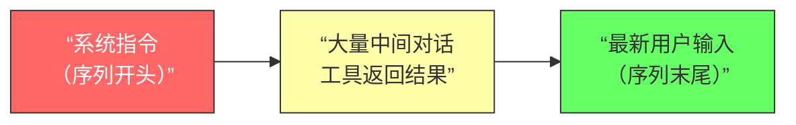
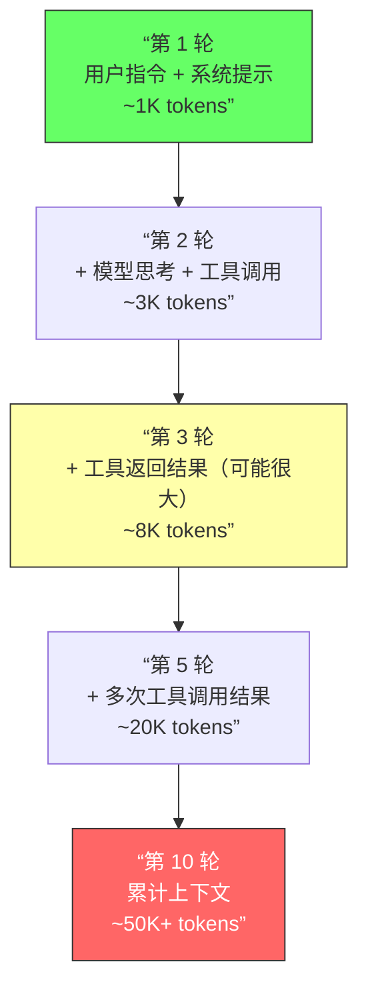

## 注意力机制与复杂度

### Q：Token 过长导致的 Attention 稀释现象为什么会导致 Agent 的指令遵循能力下降？

> 来源：淘天 AI Agent 一面

**新手答**：“上下文太长模型就处理不好。”

**高手答**：

这个问题的核心在于 **Softmax 注意力的概率质量守恒**——注意力分数经过 softmax 后总和恒为 1，当序列长度从 N 增长到 10N，每个 token 能分到的平均注意力权重就从 1/N 缩小到 1/10N。这就是 **Attention 稀释（Attention Dilution）**。

**Softmax 稀释的数学直觉**：

```text
Attention(Q, K, V) = softmax(QK^T / √d_k) · V

softmax 输出是概率分布，总和 = 1
  - 4K 上下文：每个 token 平均注意力 ≈ 1/4000 = 0.025%
  - 100K 上下文：每个 token 平均注意力 ≈ 1/100000 = 0.001%

系统指令通常在序列开头，占比固定（比如 200 token）：
  - 4K 上下文：系统指令占比 200/4000 = 5%
  - 32K 上下文：系统指令占比 200/32000 = 0.625%
  - 100K 上下文：系统指令占比 200/100000 = 0.2%
```

**为什么系统指令最先“被遗忘”**：



这涉及 **Lost in the Middle** 现象——研究表明模型对序列开头和末尾的关注度最高，中间部分的信息检索准确率可以下降 20% 以上。但当序列极长时，即使是开头的系统指令也会被稀释：

1. **位置编码衰减**：RoPE 等位置编码在长距离上的区分度下降，模型难以精确定位远处的指令 token
2. **KV Cache 中的竞争**：后续对话和工具结果不断注入新 token，这些新 token 在语义上与当前查询更相关，进一步抢占了系统指令的注意力份额
3. **训练分布偏移**：多数模型在中短上下文上训练更充分，超长上下文下的注意力分配模式偏离训练时的分布

**对 Agent 的具体影响**：

| 影响 | 表现 | 示例 |
|------|------|------|
| 指令遵循退化 | 忘记角色设定和输出约束 | 系统指令要求用 JSON 输出，10 轮后开始输出自然语言 |
| 工具选择混乱 | 不再按指令优先级选工具 | 应该先查数据库，却随机调了搜索引擎 |
| 格式约束失效 | 输出格式逐渐偏离模板 | 前几轮严格遵循格式，后面越来越随意 |
| 安全护栏松动 | 安全约束被稀释后更容易被绕过 | 前 3 轮拒绝越狱提示，20 轮后被攻破 |

**工程缓解策略**：

| 策略 | 原理 | 实现成本 |
|------|------|---------|
| **末尾重复注入** | 在每轮输入末尾重复关键指令，利用 recency bias | 低——改 prompt 模板即可 |
| **结构化标记** | 用 `<SYSTEM_INSTRUCTION>` 等特殊标记包裹关键指令，增强显著性 | 低 |
| **上下文压缩** | 定期用模型总结历史对话，只保留关键信息，缩短序列长度 | 中——需要额外一次模型调用 |
| **关键约束外置** | 把核心约束（预算、角色、格式）写入独立状态存储，每轮强制注入 | 中 |
| **滑动窗口 + 锚点** | 历史消息用滑动窗口截断，但系统指令作为锚点始终保留在窗口内 | 中 |

**差距在哪**：新手只说“处理不好”三个字——连症状都没描述清楚。高手从 softmax 的概率守恒出发，解释了注意力稀释的数学机制，再到 Lost in the Middle、位置编码衰减等具体成因，最后给出五种工程缓解策略。面试官考的是你对 Attention 机制的量化理解——不是“知道长了不好”，而是“知道为什么不好、不好到什么程度、怎么缓解”。

---

### Q：在 Agent 多轮对话任务中，标准 Attention 机制的平方复杂度在工程落地上主要引发了哪些问题？

> 来源：淘天 AI Agent 一面

**新手答**：“用更大的 GPU。”

**高手答**：

标准 Self-Attention 的计算和内存复杂度都是 **O(N²)**，其中 N 是序列长度。这个平方关系在 Agent 多轮对话场景下会被急剧放大，因为 Agent 的上下文增长速度远快于普通对话。

**平方复杂度的来源**：

```text
Attention 矩阵 = Q × K^T → 形状 [N, N]

内存占用：N × N × 2 bytes（FP16）
  -   4K tokens：  4K ×   4K × 2 = 32 MB     ✅ 轻松
  -  32K tokens： 32K ×  32K × 2 = 2 GB      ⚠️ 开始吃力
  - 128K tokens：128K × 128K × 2 = 32 GB     ❌ 超出单卡显存

计算量：2 × N² × d（d 为 head 维度）
  - N 翻倍 → 计算量翻 4 倍
```

**Agent 场景为什么特别痛**：

普通对话可能 5-10 轮结束，但 Agent 任务的上下文增长有其特殊性：



| Agent 特有的问题 | 具体表现 | 影响 |
|-----------------|---------|------|
| **上下文逐轮膨胀** | 每轮新增模型推理 + 工具调用 + 工具结果，上下文线性增长 | 第 N 轮的 Attention 计算量是第 1 轮的 N² 倍增长 |
| **工具结果尺寸不可控** | 数据库查询返回几百行、网页抓取返回整页 HTML | 单次工具调用就可能让上下文暴涨数千 token |
| **延迟逐步恶化** | 每生成一个新 token 都要对全量上下文做 Attention | 用户等待时间随对话轮次越来越长 |
| **成本不可预测** | token 用量呈超线性增长，实际花费难以提前估算 | 一个复杂任务可能烧掉远超预算的费用 |

**工程解决方案对比**：

| 方案 | 原理 | 内存复杂度 | 计算复杂度 | 质量损失 | 适用场景 |
|------|------|-----------|-----------|---------|---------|
| **Flash Attention** | 分块计算 Attention，避免完整 N×N 矩阵写入显存 | O(N) | O(N²)（但常数小很多） | 无损 | 通用，所有场景首选 |
| **KV Cache** | 缓存已计算的 K、V，新 token 只算增量 Attention | O(N) | 单 token 生成 O(N) | 无损 | 自回归生成必备 |
| **GQA / MQA** | 多个 Query Head 共享 KV Head，减少 KV Cache 大小 | O(N/G) | O(N²/G) | 极小 | LLaMA 3、Gemma 等主流模型已内置 |
| **滑动窗口注意力** | 每个 token 只关注最近 W 个 token | O(N×W) | O(N×W) | 丢失远距离依赖 | Mistral、对长距离依赖要求低的场景 |
| **上下文压缩** | 用模型总结历史对话，只保留摘要 | O(N') | O(N'²)，N' ≪ N | 信息有损 | 超长多轮对话 |
| **分层注意力** | 局部用全注意力，全局用稀疏注意力 | O(N√N) | O(N√N) | 略有损失 | 超长文档处理 |

**实际工程中的组合方案**：

```text
基础层：Flash Attention + KV Cache（零损失提速，必选）
模型层：GQA（选用内置 GQA 的模型，如 LLaMA 3）
应用层：上下文管理策略
  ├─ 工具结果截断：限制每次工具返回的最大 token 数
  ├─ 历史压缩：每 5 轮对历史消息做摘要压缩
  └─ 关键信息外置：核心状态存数据库，不占上下文空间
```

**差距在哪**：新手只想到堆硬件——这是最贵且最不可扩展的方案。高手理解 O(N²) 的算法根因，知道 Agent 场景下上下文增长有“工具结果不可控”等特殊性，并从算法层（Flash Attention）、模型层（GQA）、应用层（上下文管理）三个层面给出了组合方案。面试官考的是你对 Attention 复杂度问题的工程化思考——不是“知道 N² 很大”，而是“知道在 Agent 场景下具体大在哪、怎么在不同层级上逐个击破”。
