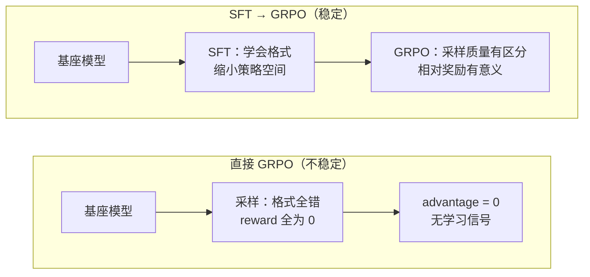

## Q：为什么 Step-level SFT 之后再进行 GRPO，通常比直接从基座模型开始做 GRPO 稳定？

> 来源：唯品会/NLP算法实习一面【[百度正式批：一面结束第二天就约二面了](https://www.nowcoder.com/discuss/925108144831725568)追问：SFT和GRPO是分两阶段的吗？】【[MiniMax - 大模型算法岗（后训练 / SFT / RL 方向，独角兽）](https://www.nowcoder.com/discuss/925527528259743744)追问：SFT 的作用是什么？为什么通常先做 SFT 再做强化学习？】【[MiniMax - 大模型算法岗（后训练 / SFT / RL）](https://www.nowcoder.com/discuss/926272883872075776)追问：SFT 的作用及为何先 SFT 后 RL？】

**新手答**：“SFT先打个基础，GRPO在上面调效果更好。”

**高手答**：

**根本原因**：GRPO 需要模型能生成“有区分度”的样本来计算相对奖励。

**直接从基座做GRPO的问题**：

1. **采样质量差**：基座模型在tool-use任务上几乎随机输出，生成的多个样本之间质量无明显差异 → 相对奖励方差接近0 → 梯度信号极弱
2. **格式不对齐**：基座不会输出正确的工具调用格式，所有样本的reward都是0 → GRPO的advantage全为0，等于没训练
3. **探索空间太大**：基座的策略空间极其分散，GRPO的exploration效率极低

**SFT先做的价值**：

1. **格式对齐**：模型学会了输出正确格式的工具调用 → GRPO采样时至少格式对了
2. **缩小策略空间**：模型已经大致知道“该做什么”，GRPO只需优化“怎么做得更好”
3. **提供reward区分度**：SFT后的模型能生成“质量有高有低”的轨迹 → GRPO的相对奖励有意义

**类比**：先教人走路（SFT），再教人跑得快（GRPO）。直接教婴儿跑步，反馈信号全是负的。

**工程经验**：SFT阶段用 200-500 条高质量轨迹就够，关键是覆盖常见工具组合模式。

**差距在哪**：面试官考的是对“SFT+RL”两阶段训练范式背后信息论原理的理解——为什么是两步不是一步。能说出“基座模型采样无区分度导致GRPO梯度信号消失”这个核心原因，说明你理解了GRPO的工作前提。
