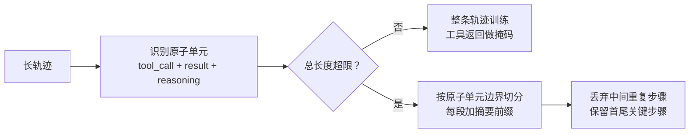

## Q：Tool-use SFT 训练时，长轨迹采用截断、切分还是掩码？如何避免破坏工具依赖关系？

> 来源：唯品会/NLP算法实习一面

**新手答**：“按最大长度截断。”

**高手答**：

**三种方案对比**：

| 方案 | 做法 | 核心问题 |
|------|------|---------|
| 截断（truncation） | 直接在 max_length 处截断 | 可能在工具调用和工具返回之间截断，导致模型学到“调了工具但看不到结果”的坏模式 |
| 切分（chunking） | 按工具调用边界切分为多个训练样本 | 后续chunk丢失了前面的上下文，模型不知道为什么要做这一步 |
| 掩码（masking） | 保留完整轨迹，但只对关键token计算loss | 对工具选择、参数填充、最终答案计算loss，中间的工具返回结果设为-100不计算loss |

**最佳实践（组合方案）**：

- 按“完整工具调用对”（call + result）为原子单位做切分
- 每个chunk保留摘要前缀（summary of previous steps）作为上下文
- 对工具返回的长文本做掩码（不让模型学习复述工具结果）

**避免破坏依赖关系的具体做法**：

1. 定义“不可分割单元”：`[tool_call, tool_result, model_reasoning]` 三元组不能跨chunk分割
2. 在不可分割单元内部做 padding 到固定长度，而非跨单元截断
3. 如果轨迹太长装不下，优先丢弃中间的重复步骤（如多次相似检索），保留首尾

**差距在哪**：面试官考的是对 SFT 数据工程细节的掌握——如何在有限窗口内保持轨迹完整性是核心挑战。能说出“不可分割单元”的概念和具体做法，说明你做过工具调用模型的训练数据工程。
