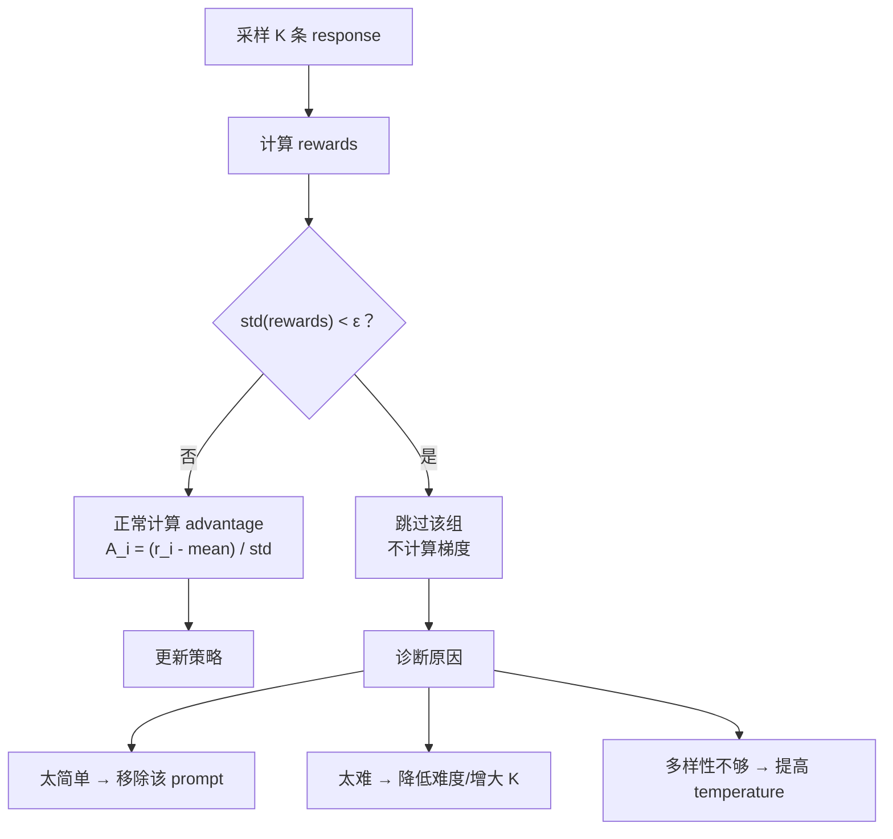

## Q：GRPO 中相对奖励是如何计算的？同一组奖励方差接近零时如何处理？

> 来源：唯品会/NLP算法实习一面

**新手答**：“奖励减去均值再除以标准差。”

**高手答**：

**GRPO 相对奖励计算**：

- 对同一个 prompt，采样 K 条 response（如 K=8）
- 计算每条的 reward：r_1, r_2, ..., r_K
- 相对奖励（advantage）：A_i = (r_i - mean(r)) / std(r)
- 本质：在这组样本内做 z-score 标准化——“相对同组其他样本好多少”

**方差接近零的场景**：

- 全部正确（全0/全1 reward）：所有样本质量一样，无法区分好坏
- 任务太简单/太难：简单任务所有样本都对了，难任务所有样本都错了

**处理方案**：

| 方案 | 做法 | 原理 |
|------|------|------|
| 跳过该 batch | 方差 < ε（如0.01）时不计算loss | 避免用噪声梯度污染模型 |
| 增大采样数K | K=8改为K=16 | 增加出现质量差异的概率 |
| 温度调高 | 采样时用更高temperature（如1.0→1.2） | 增加输出多样性 |
| 混合难度prompt | batch内包含不同难度的prompt | 避免整个batch方差为0 |
| 细粒度reward | 不只是0/1，用连续分数（工具选对+0.3，参数对+0.3，最终答案对+0.4） | 增加区分度 |

**工程经验**：实际训练中约5-10%的batch会遇到方差为0的情况，直接skip不会显著影响收敛。

**差距在哪**：面试官考的是对GRPO训练细节的工程经验——论文里不会写“方差为0怎么办”，但实际训练必须处理。能给出五种具体方案并说出“5-10%的batch会遇到”这样的经验数据，说明你做过RL训练而非只读过论文。
