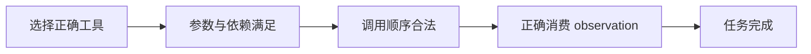

## Q：多工具调用存在依赖关系时，Reward 应如何做信用分配？

> 来源：唯品会/大模型算法实习

**新手答**：“最后成功就给 1 分，失败就给 0 分。”

**高手答**：

只给终局 0/1 奖励会产生严重的稀疏奖励问题：模型不知道是工具选错、参数错、顺序错，还是某一步结果没有正确传递。应把工具链表示为依赖 DAG，并同时设计过程奖励和终局奖励：

- 节点奖励：工具选择、参数合法、调用成功。
- 边奖励：下游参数是否正确引用上游输出，依赖顺序是否满足。
- 终局奖励：完整任务是否完成、最终答案是否正确。
- 效率惩罚：重复调用、无效分支、过多 token 和超时。

为避免“每一步都对但整体失败”仍拿高分，过程奖励只能占较小权重，并设置终局门控：任务未完成时过程分封顶。若有步骤级标注，可训练 PRM；没有标注时可用执行日志和依赖校验器自动产生大部分奖励。

**差距在哪**：新手只有终局奖励，高手能对 DAG 的节点和边做信用分配，同时用终局门控防止局部最优。面试官考的是多步 Tool-use RL 的稀疏奖励与奖励投机问题。
