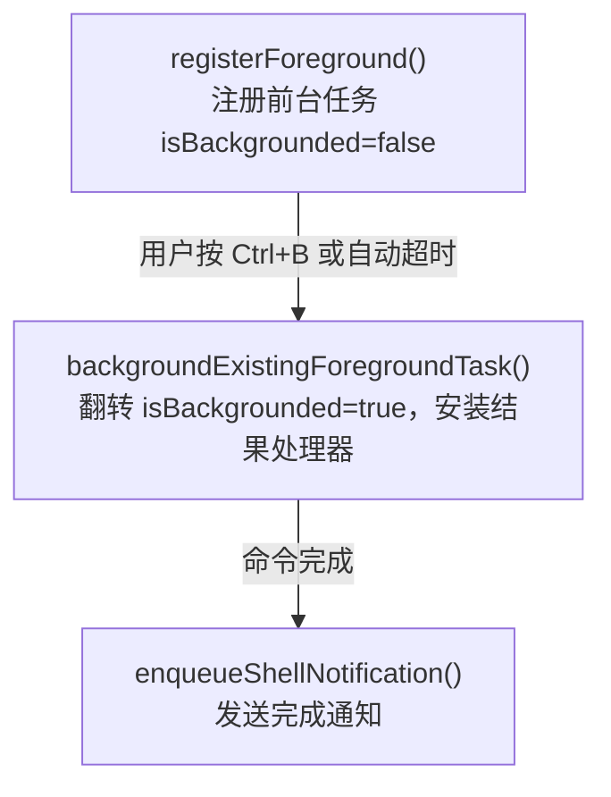

# Background Tasks：非阻塞工具执行

`npm install`、`pytest`、`docker build`——这些命令可能跑几分钟。

如果直接在 Agent 循环里同步等待，模型什么都干不了，用户体验糟糕，而且浪费时间。

这一节实现后台任务：启动慢命令，Agent 循环继续，完成时通知结果。

---

## 问题

```python
# 同步执行：卡住整个循环，等待 3 分钟
output = run_bash("npm install && npm run build")
# 3 分钟后才能继续...
```

Agent 被迫等待，什么都干不了。

---

## 源码实证：Claude Code 的 6 种后台任务

Claude Code 不只能后台跑 shell 命令。它的 `src/tasks/` 目录下有 **6 种任务类型**，覆盖了从 bash 到自动记忆的全部后台场景：

| 类型 | type 标识 | 用途 | ID 前缀 |
|------|----------|------|---------|
| `LocalShellTask` | `local_bash` | 后台 shell 命令（npm、pytest、docker） | — |
| `LocalAgentTask` | `local_agent` | AgentTool 派生的子 Agent | `a` |
| `RemoteAgentTask` | `remote_agent` | 云端 session（ultraplan/ultrareview） | — |
| `InProcessTeammateTask` | `in_process_teammate` | 同进程内队友 Agent | — |
| `DreamTask` | `dream` | 自动记忆整合（auto-dream） | `dream` |
| `LocalMainSessionTask` | `local_agent` | Ctrl+B 将主会话放入后台 | `s` |

所有任务共享同一个注册和生命周期框架：`registerTask()` + `updateTaskState()` + `enqueuePendingNotification()`。

---

## 源码实证：LocalShellTask 的完整生命周期

`LocalShellTask` 是最核心的后台任务。它管理后台 shell 进程，追踪输出，发送完成通知。

### 状态结构

源码 `guards.ts` 定义了任务状态：

```typescript
// src/tasks/LocalShellTask/guards.ts
export type LocalShellTaskState = TaskStateBase & {
  type: 'local_bash'
  command: string
  result?: {
    code: number         // 进程退出码
    interrupted: boolean // 是否被中断
  }
  shellCommand: ShellCommand | null
  isBackgrounded: boolean   // false=前台运行, true=已放入后台
  agentId?: AgentId         // 哪个 agent 启动的，用于孤儿清理
  kind?: 'bash' | 'monitor' // UI 显示变体
}
```

关键点：`isBackgrounded` 区分前台和后台。一个命令可以先在前台运行，跑久了再切到后台。

### 启动流程

```typescript
// src/tasks/LocalShellTask/LocalShellTask.tsx (简化)
export async function spawnShellTask(input, context): Promise<TaskHandle> {
  const { command, description, shellCommand, toolUseId, agentId } = input
  const taskId = shellCommand.taskOutput.taskId

  // 1. 注册清理回调（进程退出时自动 kill）
  const unregisterCleanup = registerCleanup(async () => {
    killTask(taskId, setAppState)
  })

  // 2. 创建任务状态，注册到全局 tasks 表
  const taskState: LocalShellTaskState = {
    ...createTaskStateBase(taskId, 'local_bash', description, toolUseId),
    type: 'local_bash',
    status: 'running',
    command,
    shellCommand,
    isBackgrounded: true,
    agentId,
  }
  registerTask(taskState, setAppState)

  // 3. 切换到后台模式——TaskOutput 自动持续接收数据
  shellCommand.background(taskId)

  // 4. 启动 Stall Watchdog（检测交互式卡住）
  const cancelStallWatchdog = startStallWatchdog(taskId, description, ...)

  // 5. 等待结果，完成时更新状态并发送通知
  void shellCommand.result.then(async result => {
    cancelStallWatchdog()
    await flushAndCleanup(shellCommand)
    updateTaskState(taskId, setAppState, task => ({
      ...task,
      status: result.code === 0 ? 'completed' : 'failed',
      result: { code: result.code, interrupted: result.interrupted },
      shellCommand: null,
      endTime: Date.now(),
    }))
    enqueueShellNotification(taskId, description, status, result.code, ...)
    void evictTaskOutput(taskId)
  })

  return { taskId, cleanup: () => unregisterCleanup() }
}
```

### Stall Watchdog：检测交互式阻塞

Claude Code 有个精妙的机制——当后台命令停止输出 45 秒，且输出尾部看起来像交互式提示符时，主动通知模型：

```typescript
// 每 5 秒检查一次
const STALL_CHECK_INTERVAL_MS = 5_000
const STALL_THRESHOLD_MS = 45_000

// 匹配的模式：(y/n)、Continue?、Press Enter 等
const PROMPT_PATTERNS = [
  /\(y\/n\)/i,
  /\(yes\/no\)/i,
  /Continue\?/i,
  /Press (any key|Enter)/i,
  /Overwrite\?/i,
]
```

watchdog 通过 `fs.stat()` 监控输出文件大小变化。文件大小不增长 + 尾部匹配 prompt 模式 = 发出通知，告诉模型 “这个命令可能卡在交互提示上，kill 掉重试吧”。

### 通知格式

完成通知以 XML 格式注入到消息流：

```xml
```

通知通过 `enqueuePendingNotification()` 放入队列，在下一轮 LLM 调用前注入到对话中。

### Kill 与孤儿清理

`killShellTasks.ts` 处理两种场景：

```typescript
// 1. 手动 kill 单个任务
export function killTask(taskId, setAppState): void {
  updateTaskState(taskId, setAppState, task => {
    task.shellCommand?.kill()
    task.shellCommand?.cleanup()
    task.unregisterCleanup?.()
    return { ...task, status: 'killed', notified: true, shellCommand: null }
  })
  void evictTaskOutput(taskId)
}

// 2. Agent 退出时清理所有它启动的 shell 任务（防止僵尸进程）
export function killShellTasksForAgent(agentId, getAppState, setAppState): void {
  const tasks = getAppState().tasks ?? {}
  for (const [taskId, task] of Object.entries(tasks)) {
    if (isLocalShellTask(task) && task.agentId === agentId && task.status === 'running') {
      killTask(taskId, setAppState)
    }
  }
  // 清除该 agent 的待处理通知
  dequeueAllMatching(cmd => cmd.agentId === agentId)
}
```

`killShellTasksForAgent` 是关键——没有它，子 Agent 退出后启动的 `npm run dev` 会变成僵尸进程，跑到天荒地老。

---

## 源码实证：Ctrl+B 放入后台与前后台切换

Claude Code 支持一个命令从前台无缝切换到后台。流程分三步：



`backgroundAll()` 在用户按 Ctrl+B 时，同时处理所有前台的 bash 任务和 agent 任务：

```typescript
export function backgroundAll(getAppState, setAppState): void {
  // 后台化所有前台 bash 任务
  for (const taskId of foregroundBashTaskIds) {
    backgroundTask(taskId, getAppState, setAppState)
  }
  // 后台化所有前台 agent 任务
  for (const taskId of foregroundAgentTaskIds) {
    backgroundAgentTask(taskId, getAppState, setAppState)
  }
}
```

---

## 源码实证：DreamTask 自动记忆整合

`DreamTask` 是一种特殊的后台任务——不执行用户命令，而是自动整理对话记忆。它的状态结构很独特：

```typescript
// src/tasks/DreamTask/DreamTask.ts
export type DreamTaskState = TaskStateBase & {
  type: 'dream'
  phase: 'starting' | 'updating'  // starting→reading sessions, updating→writing CLAUDE.md
  sessionsReviewing: number       // 正在复习多少个 session
  filesTouched: string[]          // 修改了哪些文件（不完全，仅工具调用可见的）
  turns: DreamTurn[]              // 最多保留 30 轮助手文本
  abortController?: AbortController
  priorMtime: number              // 用于 kill 时回滚 consolidation lock
}
```

DreamTask 的特殊之处：
