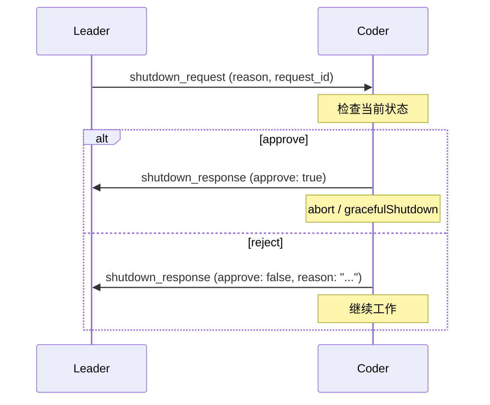
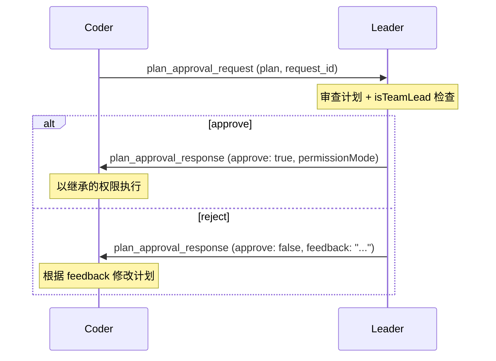

# Team Protocols：结构化通信协议

s09 的 Agent 团队可以互发消息，但消息是非结构化的——任意文本，没有固定格式，没有确认机制。

这一节在消息总线上加协议：**请求-响应握手**，用唯一 request_id 追踪每个请求的状态。

---

## 为什么需要协议

两个场景暴露了非结构化通信的问题：

**场景 1：关机**

Leader 发 “请关机” → Coder 可能正在执行重要任务，直接关掉会丢失工作。需要一个询问-确认流程。

**场景 2：危险操作**

Coder 要执行 `rm -rf src/`。这种危险操作需要 Leader 审批，不能自行决定。

这两个场景都需要：发出请求 → 等待批准/拒绝 → 根据结果执行。

---

## 源码实证：SendMessageTool 的结构化消息

Claude Code 的 `SendMessage` 工具不只是发文本——它用 Zod discriminated union 定义了三种**结构化消息类型**，这就是内置的协议层。

### 消息类型定义

源码位于 `src/tools/SendMessageTool/SendMessageTool.ts`：

```typescript
// SendMessageTool.ts — StructuredMessage schema
const StructuredMessage = lazySchema(() =>
  z.discriminatedUnion('type', [
    z.object({
      type: z.literal('shutdown_request'),
      reason: z.string().optional(),
    }),
    z.object({
      type: z.literal('shutdown_response'),
      request_id: z.string(),
      approve: semanticBoolean(),  // true/false 语义布尔
      reason: z.string().optional(),
    }),
    z.object({
      type: z.literal('plan_approval_response'),
      request_id: z.string(),
      approve: semanticBoolean(),
      feedback: z.string().optional(),
    }),
  ]),
)
```

关键设计：`message` 字段是 `z.union([z.string(), StructuredMessage])`——普通文本和协议消息走同一个工具，用类型区分。

### 输入验证规则

源码中有严格的验证约束：

```typescript
// validateInput 片段
if (input.message.type === 'shutdown_response' && input.to !== TEAM_LEAD_NAME) {
  return { result: false, message: `shutdown_response must be sent to "team-lead"` }
}
if (input.message.type === 'shutdown_response' && !input.message.approve
    && (!input.message.reason || input.message.reason.trim().length === 0)) {
  return { result: false, message: 'reason is required when rejecting a shutdown request' }
}
if (input.to === '*') {
  return { result: false, message: 'structured messages cannot be broadcast (to: "*")' }
}
```

三条硬约束：
1. **shutdown_response 必须发给 team-lead**——不能发给其他 agent
2. **拒绝关机必须给出理由**——空理由被拒绝
3. **结构化消息不能广播**——只能点对点

---

## 源码实证：协议的路由分发

`SendMessageTool.call()` 中用 switch 分发结构化消息：

```typescript
// SendMessageTool.ts — call() 路由逻辑
switch (input.message.type) {
  case 'shutdown_request':
    return handleShutdownRequest(input.to, input.message.reason, context)
  case 'shutdown_response':
    if (input.message.approve) {
      return handleShutdownApproval(input.message.request_id, context)
    }
    return handleShutdownRejection(input.message.request_id, input.message.reason!)
  case 'plan_approval_response':
    if (input.message.approve) {
      return handlePlanApproval(input.to, input.message.request_id, context)
    }
    return handlePlanRejection(
      input.to, input.message.request_id,
      input.message.feedback ?? 'Plan needs revision', context,
    )
}
```

每种消息类型映射到独立的 handler 函数。这就是协议的核心——**类型驱动分发**。

---

## 关机协议的完整流程

### 请求阶段

`handleShutdownRequest` 生成唯一 request_id，写入 mailbox：

```typescript
async function handleShutdownRequest(targetName, reason, context) {
  const requestId = generateRequestId('shutdown', targetName)
  const shutdownMessage = createShutdownRequestMessage({
    requestId, from: senderName, reason,
  })
  await writeToMailbox(targetName, {
    from: senderName,
    text: jsonStringify(shutdownMessage),
    timestamp: new Date().toISOString(),
  }, teamName)
  return {
    data: { success: true, request_id: requestId, target: targetName,
            message: `Shutdown request sent to ${targetName}. Request ID: ${requestId}` }
  }
}
```

### 批准阶段

`handleShutdownApproval` 做两件事——通知 team-lead 并终止自身进程：

```typescript
async function handleShutdownApproval(requestId, context) {
  // 1. 发确认消息给 team-lead
  await writeToMailbox(TEAM_LEAD_NAME, {
    from: agentName,
    text: jsonStringify(approvedMessage),
    timestamp: new Date().toISOString(),
  }, teamName)

  // 2. 终止自身
  if (ownBackendType === 'in-process') {
    // 进程内 agent：abort controller
    task.abortController.abort()
  } else {
    // 独立进程 agent：graceful shutdown
    setImmediate(async () => { await gracefulShutdown(0, 'other') })
  }
}
```

### 拒绝阶段

拒绝时只通知 team-lead，不终止自身——继续工作：

```typescript
async function handleShutdownRejection(requestId, reason) {
  await writeToMailbox(TEAM_LEAD_NAME, {
    from: agentName,
    text: jsonStringify(rejectedMessage),
    timestamp: new Date().toISOString(),
  }, teamName)
  return {
    data: { success: true, request_id: requestId,
            message: `Shutdown rejected. Reason: "${reason}". Continuing to work.` }
  }
}
```



---

## 计划审批协议

### 权限控制

只有 team-lead 可以审批计划——源码有硬检查：

```typescript
async function handlePlanApproval(recipientName, requestId, context) {
  if (!isTeamLead(appState.teamContext)) {
    throw new Error('Only the team lead can approve plans.')
  }

  // 审批时继承 leader 的权限模式
  const leaderMode = appState.toolPermissionContext.mode
  const modeToInherit = leaderMode === 'plan' ? 'default' : leaderMode

  const approvalResponse = {
    type: 'plan_approval_response',
    requestId,
    approved: true,
    permissionMode: modeToInherit,  // 权限继承
    timestamp: new Date().toISOString(),
  }
  await writeToMailbox(recipientName, { ... }, teamName)
}
```

注意 `permissionMode: modeToInherit`——审批不只是 “同意”，还传递了执行权限级别。



---

## 源码实证：Task 完成通知的 XML 格式

协议不止 agent 间通信。Coordinator 模式下，Worker 完成后用 XML 格式通知 Coordinator——这是另一个协议。

源码位于 `src/tasks/LocalAgentTask/LocalAgentTask.tsx`：

```typescript
// enqueueAgentNotification — 构建 task-notification XML

enqueuePendingNotification({ value: message, mode: 'task-notification' })
```

完整的 XML 结构：

```xml
```

status 的生成逻辑：

```typescript
const summary =
  status === 'completed' ? `Agent "${description}" completed`
  : status === 'failed'  ? `Agent "${description}" failed: ${error || 'Unknown error'}`
  : `Agent "${description}" was stopped`
```

这个通知会作为 user-role message 注入 coordinator 的对话中——coordinator 的 system prompt 明确说明了如何区分：
