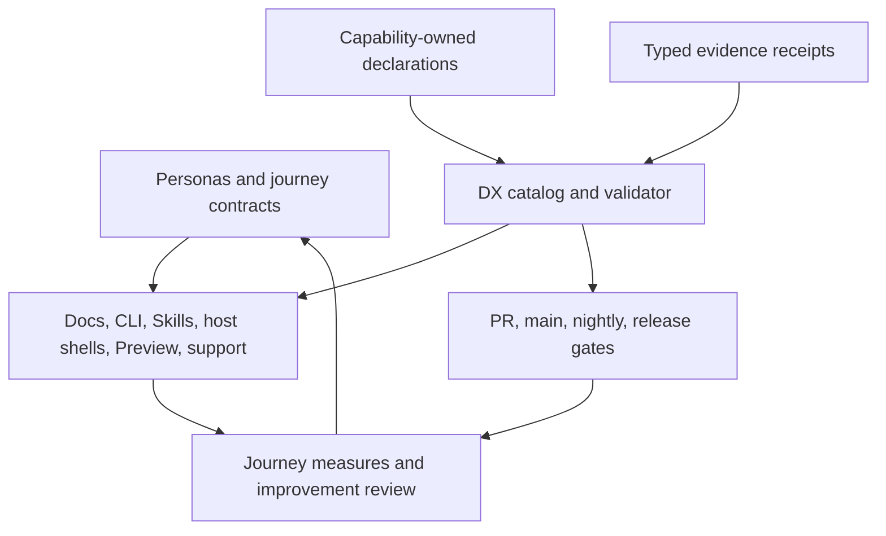

## Decision

### 1. Use a federated DX control plane

**Durable invariant.**

Better Harness will implement DX as a control plane for contracts, validation,
projection, evidence, promotion, and measurement. Runtime behavior remains in
business-named capabilities.



The DX catalog may locate declarations, validate schemas, compare projections,
and produce deterministic output. It must not decide host semantics, command
behavior, privacy policy, report meaning, or release support by itself.

### 2. Keep facts with federated canonical owners

**Durable invariant.** The ownership and conflict rules in this subsection
govern every contract version; individual declaration shapes are delegated.

| Fact type | Canonical owner | Allowed projections |
| --- | --- | --- |
| DX personas, core journey taxonomy/completion, required fields, pillars, and removal rules | This ADR | Core-catalog validation and architecture review routes |
| Versioned journey instances, additive non-core journeys, operational owners/routes, and stable metric-id bindings | Target journey catalog under `docs/dx/` after activation | Journey checklists, review templates, and metric-binding views |
| Metric ids, definitions, populations, numerators, denominators, sampling boundaries, privacy classes, cadence, and decision consumers | Target DX metric-policy registry under `docs/dx/` after activation | Journey measurement views, retrospective reports, and release/support decision inputs |
| Host-integrated route and completion facts | The canonical Skill/output contract plus the host-support profile for the selected host | README/site route cards, installation chooser, host-specific next step |
| CLI route and completion facts | The capability-owned command contract for each exposed outcome | CLI help, command inventory, reference facts, next-step output |
| Source-contribution route facts | `CONTRIBUTING.md` for curated workflow and root package tasks for executable commands | Contribution entrypoints and task reference |
| Host identity, aliases, capability slices, invocation, install, output, and support state | A target `host-support` capability plus native adapter evidence | Adapter matrix, Quickstart set, issue forms, command choices, support status |
| Command options, audience, I/O, mutability, side effects, examples, errors, aliases, and deprecations | The command's capability-owned public contract; the existing root CLI registry indexes it | Parser, help, command inventory, OpenCLI schema, conformance tests, reference facts |
| Public npm package identity and version | Root `package.json` | npm installation facts, release plan, artifact metadata |
| Native host-shell identity and compatibility version | The relevant native host manifest, with its relationship to the root release validated explicitly | Host discovery facts and native package metadata |
| Shared evidence envelope, class taxonomy, compatibility, and redaction invariants | Target evidence-contract capability and its versioned public schema | Cross-producer validators, evidence views, freshness gates |
| Native observation payload | Runtime-smoke producer and immutable sanitized evidence receipt | Support badges, evidence views, freshness gates, release plan |
| Reads, writes, network use, sensitive fields, and retention | The implementing capability contract, constrained by the target repository privacy policy | Preflight summaries, `doctor`, support plan, privacy tables |
| Human explanation and translation | The relevant README, canonical guide, curated site page, or locale owner | Semantic consistency checks only; no generated replacement prose |
| Release truth | Protected Git revision, tag, release manifest, produced artifacts, real registry, and post-publish receipt | Download/install page, compatibility statement, release notes |

When two surfaces need the same structured fact, they must consume or validate
the same declaration. They must not establish a second canonical list in a test
or documentation file.

Product routes are composed views, not new judgment owned by the DX catalog.
Every projected route field carries the id and version of its contributing
capability declaration. The catalog rejects missing owners, multiple
authoritative contributors for one field, and contradictory values; it has no
precedence rule that lets it choose a winner. Conflict resolution happens in a
dated spec owned by the conflicting capabilities before projection resumes.

### 3. Separate the three product routes

**Durable invariant.**

The public experience must distinguish:

1. **Host-integrated workflow:** a host installs or discovers the canonical
   Skill and can run the report loop supported by that host's declared slices.
2. **CLI workflow:** the CLI exposes only the outcomes its implementation
   actually completes. A command named `report` must produce a report; an
   evidence probe or host handoff is named `probe` or `prepare`. Changing the
   existing command requires a compatibility alias and deprecation window.
3. **Source-contribution workflow:** a repository checkout exposes development,
   focused testing, documentation, Preview, packaging verification, and
   maintainer commands. It must not be presented as an installed end-user path.

A future standalone full-report CLI may be promoted only when a separate spec
demonstrates install, verification, report production, output discovery,
recovery, update, removal, package, and cross-platform evidence.

### 4. Define a common command contract

**Durable invariant:** every command has one typed capability owner, strict and
side-effect-free discovery, declared effects, parser-safe machine behavior, and
versioned compatibility. Exact v1 fields and numeric exit values below are
delegated proposals.

Every public or maintainer command must declare:

- stable command id and contract version;
- capability owner and public entrypoint;
- `workflow`, `advanced`, or `maintainer` audience;
- purpose, examples, aliases, and deprecation state;
- typed options, defaults, enums, conflicts, required values, and explicit
  passthrough boundary;
- accepted input scopes and validation rules;
- output schema and artifacts;
- mutability: `read-only`, `plan`, `apply`, or `external`;
- filesystem reads and writes, network behavior, sensitive fields, and
  retention;
- success, partial, failure, and stable diagnostic codes;
- focused tests and documentation owner.

Contract rules:

- Unknown flags, extra positionals, and missing option values fail by default.
- Boolean options parse explicit true and false values or reject that syntax;
  string truthiness is never a boolean parser.
- `--help` exits zero and performs no workspace scan, host probe, network call,
  or write.
- `command describe` resolves a leaf command, not only its parent group.
- Human output is concise and actionable. Machine output is parser-safe and
  contains no progress, color, spinner, or unrelated diagnostics on stdout.
- Input paths are validated for existence, expected type, qualification, and
  safe real-path scope before analysis.
- Empty evidence, missing authority, unsupported scope, collector failure,
  invalid child output, and invalid input have distinct stable codes.
- Mutation uses plan then apply. External or destructive actions require
  explicit authority and non-interactive confirmation semantics.
- Help, parsers, machine schema, reference facts, and conformance tests derive
  from the same typed contract.

**Cross-version machine rule:** machine mode has a bootstrap parser that
recognizes an exact `--json` global-option token before capability parsing. It
may appear anywhere in the parent command's arguments before the first explicit
`--` passthrough terminator. Tokens after `--` belong exclusively to the child
or external command and are never interpreted by the parent bootstrap parser.
Once machine mode is recognized, every normal completion, partial
completion, usage error, preflight error, and operational failure emits exactly
one versioned JSON document on stdout. Stderr may contain bounded process or
developer diagnostics, but consumers never need it to interpret the result and
it never contains a second envelope. `--jsonl` is a separate declared stream
contract and cannot silently reuse the single-document contract.

**Proposed `command-contract.v1` detail:** the first version should use this
nullability and artifact behavior:

- `ok`: `data` matches the command output schema, `artifacts` is an array, and
  diagnostics may be empty;
- `partial`: usable `data` is present, `artifacts` contains only materialized
  outputs, and at least one diagnostic names every missing or degraded lane;
- `failed`, including invalid usage after machine mode is recognized: `data` is
  `null`, `artifacts` is empty unless a retained partial artifact is explicitly
  marked incomplete, and at least one error diagnostic supplies a stable code
  and safe next action;
- optional fields are omitted according to the schema, never represented by an
  undocumented mix of missing, empty, zero, and `null`.

For proposed v1, if argument bytes are malformed before the bootstrap parser can
recognize an exact machine-mode token, the process uses bounded human usage text
on stderr and exit `64`. If the process cannot serialize the versioned envelope
after machine mode is recognized, it emits no misleading JSON, exits `1`, and
writes the fixed transport diagnostic `ENVELOPE_SERIALIZATION_FAILED` to stderr.
This last-resort transport failure is covered by a dedicated conformance
fixture. A later major contract may change the numeric mapping or diagnostic
name, but it cannot return a parseable-looking partial envelope or violate the
cross-version machine rule.

Conformance covers `--json` before and after a leaf command, reordered global
flags, `-- --json`, missing option values followed by `--json`, and explicit
child-command passthrough. Only pre-terminator global tokens can select the
parent machine contract.

The following JSON shape is an illustrative proposal for
`command-contract.v1`, not an activated schema owned by this ADR:

```json
{
  "schemaVersion": "1",
  "command": "better-harness doctor",
  "status": "ok",
  "data": {},
  "artifacts": [],
  "diagnostics": [
    {
      "code": "HOST_NOT_DISCOVERED",
      "severity": "warning",
      "message": "The selected host was not discovered.",
      "hint": "Install the host or choose a different platform.",
      "docsUrl": "https://qoderai.github.io/better-harness/docs/troubleshooting"
    }
  ],
  "meta": {
    "durationMs": 42,
    "sideEffects": "read-only"
  }
}
```

The proposed v1 exit mapping is intentionally small and portable:

- `0`: `ok`;
- `2`: `partial`, with usable data and explicit missing lanes;
- `1`: operational `failed`;
- `64`: invalid command usage before product work begins.

The stable diagnostic code, rather than the numeric exit value alone, carries
the actionable failure category.

### 5. Add a read-only diagnostic journey

**Proposed `harness-doctor.v1` target contract.** Its read-only, bounded,
local-first, and redacted behavior follows the durable privacy and command
invariants; exact fields belong to the implementation spec.

The target diagnostic entrypoint is:

```text
better-harness doctor --platform <host> --json
```

It reports the CLI and package version, supported runtime range, host discovery,
selected support profile, authorized roots, available evidence lanes, output
directory writability, Preview runtime discovery, and stable diagnostics.

It must be read-only by default, bounded in time, safe without a network,
machine-readable, and free of raw source, prompt, transcript, token, credential,
or full absolute user-path content. Optional deeper probes require explicit
flags and must state their reads before execution.

### 6. Separate curated prose, projected facts, and evidence views

**Durable invariant:** curated explanation remains author-owned and only
structured facts may be deterministically projected. The Quickstart template
and CI routing below are target documentation operating policy.

Documentation has three kinds of content:

1. **Curated prose:** concepts, explanations, examples, recovery judgment, and
   translations. Authors own this content.
2. **Projected facts:** host identifiers, versions, command flags, support
   slices, paths, and lifecycle states. Deterministic tools may generate or
   validate these facts.
3. **Evidence views:** last native verification, tested OS and host version,
   observed slices, evidence class, receipt link, and freshness.

Structured projections must record their owner and source. Generated files or
blocks must be clearly marked and must reject manual drift. Curated prose is
checked for semantic alignment with declarations but is not overwritten or
automatically translated.

Every host Quickstart follows one completion template:

```text
Prerequisites and supported versions
-> Install
-> Verify
-> Invoke
-> Expected success
-> Open artifact
-> Recover
-> Update, pin, roll back, or uninstall
-> Privacy and data use
-> Support
```

Short commands should be shell-neutral single lines. When syntax differs,
documentation provides separate Bash and PowerShell forms. English and
Simplified Chinese pages require structural and factual parity, not literal
sentence parity.

Pull requests that change the site, its configuration, assets, locale content,
or projected facts must run a production Docusaurus build before merge.
Deployment remains a separate post-merge action.

### 7. Make Preview a declared, diagnosable surface

**Proposed Preview target contract.** The durable boundary is that a default
contributor Preview may not hide an undeclared installed-host dependency.

The default Preview development journey must not silently depend on an installed
Coding Agent host. The target offers:

- a self-contained deterministic fixture path for ordinary contribution;
- explicit HTML and Canvas Preview commands;
- explicit runtime selection rather than hidden host discovery;
- a Preview diagnostic that reports the selected runtime and missing
  dependencies;
- stable health, module, and metadata endpoints;
- actionable browser-open failures with a copyable manual URL;
- fixture variants for minimal, dense, Simplified Chinese, long-path, missing
  evidence, partial, and error states;
- automated browser checks for desktop and mobile, light and dark themes,
  supported locales, console errors, page errors, and screenshots.

Preview does not read user sessions or modify host configuration by default.
Screenshots remain temporary or CI artifacts unless a user explicitly selects a
durable destination.

### 8. Treat accessibility as a surface-owned contract

**Durable invariant:** every public surface owns accessibility and cannot
substitute a generic unit-test pass for surface evidence. The following minimums
are proposed target accessibility policy owned by `docs/accessibility.md`.

Accessibility is owned by each experience surface, constrained by a target
repository accessibility policy under `docs/`. The DX catalog may index
conformance evidence but does not decide UI or content behavior.

Minimum public web, report, and Preview requirements are semantic structure,
keyboard reachability, visible focus, meaningful alternative text, zoom and
responsive reflow, WCAG AA text and control contrast, no color-only status, and
reduced-motion behavior. CLI requirements are no color-only meaning, useful
plain-text and non-TTY output, stable reading order, and a `--no-color` path
where color is otherwise emitted. Host-native surfaces document any host-owned
accessibility limitation instead of presenting it as a Better Harness guarantee.

Changed visual surfaces run deterministic semantic and contrast checks plus
keyboard, focus, reduced-motion, desktop/mobile, and screen-reader-oriented
manual review proportional to the change. Evidence is recorded as automated
web/accessibility test output, browser screenshots, and a bounded manual
checklist; it is not replaced by a generic unit-test pass. The accessibility
policy owns minimum requirements and evidence definitions, while the changed
surface owns remediation and its focused tests.

### 9. Model host support as slices and evidence-backed promotion

This subsection contains the labeled durable host/evidence invariant, proposed
`host-support.v1` and `evidence-receipt.v1` details, and target evidence operating
policy. Those authority layers may not be inferred from unlabeled examples.

Host support is not a boolean. Each host profile declares these independent
slices when applicable:

- native contract research and version boundary;
- installation and discovery;
- configured assets;
- session evidence;
- shared workflow activation;
- report/output loop;
- package or host-shell distribution;
- documentation, recovery, update, and removal.

**Durable invariant:** host support is slice-based, evidence-class aware, and
evaluated against a named profile and freshness policy. No single scalar host or
slice state may combine declaration, verification, and freshness.

**Proposed `host-support.v1` detail:** each host slice has one intrinsic
declaration disposition: `unsupported`, `declared`, or `withdrawn`. The slice
also references immutable evidence receipts without copying a derived
verification state into its declaration.

Verification results are keyed by host, slice, evidence class, contract
version, profile predicate version, and freshness-policy version. Each result is
`unobserved`, `passed`, `failed`, or `stale`. A documentation slice can therefore
pass documentation-build evidence without pretending to be native-verified,
and two concurrent profile versions can evaluate the same immutable receipt set
without changing the slice declaration.

Public support profiles are versioned predicates over required declaration
dispositions and keyed verification results. A predicate marks each slice
`required`, `optional`, or `omitted`; omission is profile evaluation behavior,
not an intrinsic slice state. For example, `adapter-support.v1` may require at
least one declared slice with deterministic fixtures and explicit dispositions
for every other slice. `public-quickstart.v1` requires fresh native installation
and discovery, workflow activation, report/output-loop, artifact-discovery,
documentation, recovery, and removal results; it may omit session evidence when
that profile version does not require it.

Promotion is computed from a named predicate; it is not a manually copied label
and a host does not traverse irrelevant states. Partial profiles remain valid
and visible without being promoted to a full Quickstart. Predicate changes are
versioned and cause deterministic re-evaluation rather than mutation of
historical declarations or receipts.

Profile evaluation does not collapse blockers into one `unverified` scalar. It
produces two axes plus required-slice reasons:

- `eligibility`: `eligible`, `ineligible`, or `withdrawn` from declaration
  dispositions;
- `verification`: `not-evaluated`, `verified`, `unobserved`, `failed`, or
  `stale` from keyed evidence evaluation;
- `blockers`: one stable reason per unsatisfied required slice, including the
  slice id, declaration disposition, evidence class, verification result,
  diagnostic code, and evidence reference when present.

An unsupported required slice yields `ineligible` with an `unsupported`
blocker. A declared slice without evidence stays `eligible` but
`unobserved`; a fresh failed receipt yields `failed`; expired otherwise-passing
evidence yields `stale`; a required withdrawn slice yields `withdrawn`. Only
`eligible` plus `verified` qualifies for promotion. Every public projection
preserves blocker categories instead of reinterpreting unsupported, failed,
unobserved, stale, or withdrawn as the same state.

Mixed required slices reduce deterministically while retaining every blocker:

1. Eligibility precedence is `withdrawn` over `ineligible` over `eligible`. Any
   required withdrawn slice therefore yields `withdrawn`; otherwise any required
   unsupported slice yields `ineligible`; otherwise the profile is `eligible`.
2. Verification is reduced across required declared slices. Precedence is
   `failed` over `stale` over `unobserved` over `verified`. If there are no
   required declared slices, it is `not-evaluated`.
3. Scalar summaries never remove blocker rows. Consumers use them for sorting
   and promotion only; diagnostics and public support views render every
   unsatisfied required slice.

Conformance fixtures cover all-passed, unsupported plus withdrawn, failed plus
stale plus unobserved, no declared required slices, optional-slice failure, and
predicate-version changes over the same immutable receipts.

**Proposed `evidence-receipt.v1` detail:** every native support claim references
a sanitized evidence receipt containing:

- schema version and receipt id;
- host id and host version;
- OS, architecture, and relevant runtime versions;
- Better Harness Git revision or immutable package version;
- observed capability slices and explicitly unobserved slices;
- isolated fixture or representative workspace classification;
- executed command or interaction identifier and exit outcome;
- artifact type and checksum when an artifact was produced;
- privacy checks and redaction result;
- evidence class, source, `observedAt`, issuance freshness-policy id and
  version, and issuance-time validity boundary;
- bounded failure details when verification did not pass.

Receipts never contain raw prompts, transcripts, credentials, tokens, source
content, or unredacted user-home paths. Raw logs remain local or short-lived CI
artifacts with an explicit retention policy.

Unit or fixture, package, native host, installed desktop or browser, deployed
site, and post-publish evidence use different evidence classes and cannot
satisfy each other's gates. Evidence receipts are immutable. A current support
projection records `evaluatedAt`, active freshness-policy id and version,
effective validity boundary, and result. It evaluates existing receipts against
the active policy; a policy change can demote a claim without changing the
receipt or its issuance-time policy metadata.

When required evidence no longer satisfies the active policy, the public
projection keeps its eligibility axis and reports `unobserved` for missing
evidence, `failed` for fresh negative evidence, or `stale` for expired
otherwise-passing evidence, with the corresponding required-slice blocker. It
never silently remains verified. Each host profile owns a versioned, risk-based
freshness policy rather than inheriting an arbitrary universal number of days.

**Target evidence operating policy:** the evidence-contract capability owns the receipt index schema, trust tiers,
digest and attestation rules, revocation semantics, and compatibility. Evidence
producers own only their class-specific observation payload and cannot promote
their own result to an official product claim.

Receipt storage and trust are explicit:

- local receipts live under ignored `.harness/state/` and are untrusted until a
  reviewed promotion step; they are never packaged or uploaded automatically;
- CI receipts are immutable job artifacts addressed by run id and digest, with
  the workflow's declared retention; passing CI alone does not make them
  official native evidence;
- official sanitized receipts and their append-only index live under the target
  `docs/dx/evidence/` owner, record artifact provenance and digest, and require
  maintainer attestation or an approved trusted runner;
- release manifests snapshot the exact receipt ids, digests, support-predicate
  version, and freshness-policy version used at publication. That historical
  snapshot is immutable even when live support later becomes stale.

The live support projection evaluates non-revoked official receipts against the
currently active policy. The release view reports what was verified at release
time and links to current support separately. Revocation never edits a receipt;
the append-only index records `revokedAt`, reason, authority, and optional
replacement. Current support ignores revoked receipts, while historical release
manifests retain the original digest and display the later revocation.

Community-provided receipts enter as `candidate` and cannot change an official
support profile. Promotion requires either reproduction by an approved trusted
runner or explicit maintainer attestation after provenance, privacy, command,
artifact, and claimed-slice review. Official sanitized receipts are retained
for the lifetime of every support or release claim that references them; raw
logs follow their shorter declared local or CI retention.

### 10. Provide level-appropriate contribution loops

**Target contribution operating policy.** It implements the durable persona,
journey, ownership, and evidence invariants without making every route equally
complex.

The contribution surface exposes progressively deeper routes:

- a short documentation-only route;
- a fixture or test route;
- a capability behavior route;
- a host-adapter route;
- a maintainer and release route.

Each route lists the owner, whether a spec is required, smallest focused check,
broader gate, Preview or native evidence requirement, generated outputs, and
review evidence. Full architecture and native-host matrices stay out of the
first-contribution critical path until the selected change needs them.

The target root task vocabulary distinguishes:

- a fast changed-scope check;
- focused tests by capability;
- quiet and watch feedback;
- the complete repository gate;
- the complete gate plus documentation production build;
- package verification;
- Preview diagnosis and visual verification.

Tests and fixtures should mirror capability ownership as the suite grows.
Shared workspace, host-home, report, command-runner, and evidence-receipt
builders belong in a documented test-support surface instead of being copied
through large test files.

### 11. Use staged CI, promotion, and release gates

**Durable invariant:** publishing is planned from a protected immutable
revision, apply does not mutate the plan, evidence classes match claims, and the
real distribution surface is verified. The stage table is target release
operating policy.

| Stage | Required responsibility |
| --- | --- |
| Pull request | Changed-scope and contract tests, CLI conformance, declaration/projection drift, documentation build when affected, cross-platform core matrix, and Review Readiness evidence |
| Main | Full suite, package verification, projection consistency, deploy candidate, and merge-state evidence |
| Nightly | Available Host by OS native smoke, evidence freshness, dependency health, and advisory drift reporting |
| Release plan | Protected revision, version/tag/changelog agreement, support claims with fresh evidence, artifact inventory, rollback plan, and install-smoke plan |
| Release apply | Approved immutable tag, built artifact checksums and provenance, publish, GitHub Release, and no mutation of the plan |
| Post-publish | Install from the real distribution surface, run the bounded diagnostic and smoke, record receipt, and withdraw or roll back on failure |

Native smoke begins as advisory. It becomes a blocking promotion or release gate
only after the owning implementation spec demonstrates reliability, isolation,
diagnostic quality, and an explicit unavailable-host policy.

Publishing is tag-driven. A release workflow must not publish an arbitrary
manually selected ref. Protected main and release refs require the checks
appropriate to their claims, resolved review conversations, and an explicit
emergency bypass process. Force push and deletion are disabled for protected
release history.

Generated artifacts are validated from their actual archive contents. Public
documentation packaged in an artifact must have a closed relative-reference
boundary or exclude maintainer-only documents whose dependencies are absent.

### 12. Make privacy, support, and security part of the contract

**Durable invariant:** default operation is local-first and telemetry-free;
persistence and network send are separately explicit. Exact policy files,
retention periods, support versions, and bundle fields are delegated target
policies.

Every capability contract declares:

- filesystem roots and data classes read;
- filesystem roots and artifact classes written;
- network destinations and purpose;
- sensitive fields and redaction rules;
- default retention and deletion route;
- whether the action is read-only, plan, apply, or external.

The default policy is local-first and telemetry-free. A support bundle first
produces a manifest of fields it would collect. Persistence requires explicit
confirmation; upload, issue creation, or any network send is a separate external
apply action.

Default support evidence excludes source bodies, prompts, transcripts, tokens,
credentials, and full user paths. Redaction tests use credential-shaped and
value-level fixtures, not only key-name filters. Users can locate and remove
reports, caches, and support bundles without deleting host configuration as a
generic recovery step.

The repository provides a security policy, supported-version policy, public
support route, and private vulnerability-reporting route before diagnostic
collection becomes a public workflow.

Any future remote DX telemetry requires a separate ADR with explicit opt-in,
data minimization, retention, deletion, access, and threat-model decisions.

### 13. Measure journeys without a vanity score

**Durable invariant:** measures belong to journeys, retain failure and
unobserved coverage, and no single score approves release. The following metric
list is a proposed initial catalog whose definitions require separate review.

The DX metric-policy registry is the sole canonical owner of metric ids and
definitions. A journey instance contains only stable metric-id bindings and
references to capability-owned event sources; it never defines a population,
formula, privacy class, or review cadence inline. Deterministic collectors own
their emitted events and provenance, but they do not redefine the metric that
consumes those events.

Primary measures are task outcomes:

- time to verified installation;
- time to first opened report;
- first-attempt completion rate for each Quickstart step;
- recovery success after one bounded troubleshooting route;
- clone-to-focused-green and clone-to-full-green time;
- command-contract and command-conformance coverage;
- Host by OS evidence coverage and freshness;
- documentation production-build success, broken links, and projection drift;
- support demand grouped by journey and stable diagnostic code;
- release-plan to verified post-publish completion time.

Every metric declares its journey, definition, population, numerator,
denominator, sampling boundary, privacy class, owner, and intended decision.
Unobserved values do not become zeros and do not disappear from coverage
denominators. Small or biased samples remain visible.

The contract validator rejects an unknown, duplicate, inactive, or
journey-mismatched metric binding and requires every active binding to resolve
to exactly one active definition. Definition retirement requires either removal
of every binding or a versioned replacement mapping whose compatibility window
and end condition are explicit.

Evidence-source preference is:

1. deterministic CI, contract, release, and receipt facts;
2. a user explicitly generated local DX measure report;
3. only after a separate decision, opt-in aggregated telemetry.

The five DX pillars are reviewed against each journey at a regular
retrospective. A single average maturity score cannot approve a release or hide
a blocking journey.
