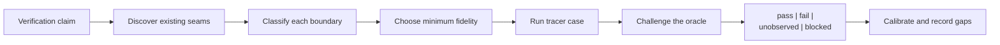

# Verification Environment Design

Use this reference when an agent can change code but cannot safely or cheaply
exercise the real environment. The goal is not to maximize mocking. The goal
is to construct the **smallest environment that preserves the behavior needed
by the verification claim**, then state exactly what that environment does not
prove.

A fast fake can be the right environment for request shaping and the wrong
environment for database isolation, browser behavior, compiler output,
concurrency, or vendor compatibility. Select the substitute only after naming
the claim and the dependency semantics that decide it.



## Ownership Boundary

This reference owns:

- discovery of repository-owned test-environment seams;
- claim-driven selection among fakes, virtual services, emulators, ephemeral
  real dependencies, and authorized sandbox checks;
- the environment contract and lifecycle shape;
- oracle independence, negative controls, and mock-drift calibration; and
- environment safety, isolation, cleanup, and portability.

It does not own case discovery, the regression skeleton, probe verdicts, or
diff-to-case scoping; use [Agent Verify Loop](/lib/09-harness/better-harness/references-project-harness-agent-verify-loop). It also
does not own general diagnostic instrumentation
([Observability](/lib/09-harness/better-harness/references-project-harness-observability)), recovery evidence
([Recovery Evidence](/lib/09-harness/better-harness/references-project-harness-recovery-evidence)), or production authorization.

## Load When

- A required service, device, account, dataset, kernel feature, or vendor
  sandbox is unavailable to the agent.
- A test suite passes with extensive mocks, but it is unclear which real
  behaviors remain proven.
- Local verification requires manual environment setup, shared credentials,
  fixed ports, or persistent state.
- A container or emulator exists, but nobody has checked whether it preserves
  the semantics relevant to the change.
- The agent must add a reproducible environment before it can close an
  Agent Verify Loop exercise-and-judge path.

## Start With the Claim

Write the claim before selecting a tool:

```text
Given <pinned starting state>, when <real subject action> runs,
observe <evidence> at <boundary>, and decide <expected invariant>,
under <platform / time / authority constraints>.
```

This turns “we need a mock database” into a decidable question:

- If the claim is “the repository calls `save()` with these fields,” an
  in-process spy may be enough.
- If the claim is “the migration, constraint, transaction, or query works on
  PostgreSQL,” PostgreSQL semantics are part of the claim; use an ephemeral
  real instance or an explicitly compatible emulator.
- If the claim is “checkout succeeds against the payment provider,” a local
  stub can prove request construction and failure handling, but provider
  acceptance remains `unobserved` until an authorized sandbox or contract
  verification runs.

Keep the code under change real. Replace a collaborator only at an explicit
boundary, and only when its omitted behavior is not part of the claim.

## Discover Before Constructing

Do not begin by adding a new mock framework or Dockerfile. Inventory the
repository in this order:

1. **Operating instructions and CI:** `AGENTS.md`, contribution guides,
   workflow files, build scripts, package scripts, Make targets, and test
   matrices. Extract the commands the project already treats as executable.
2. **Pinned environment inputs:** lockfiles, runtime/version files, container
   tags or digests, generated schemas, compiler flags, browser/device matrices,
   environment-variable schemas, locale/timezone/seed settings.
3. **Existing seams:** fixtures, fake factories, `__mocks__`, test builders,
   in-memory transports, local servers, service virtualizers, emulators,
   Testcontainers, Compose services, recorded snapshots, contract tests, and
   sandbox profiles.
4. **Lifecycle evidence:** setup, start, readiness, reset, teardown, timeout,
   and skip behavior. A service definition without readiness and reset is not
   yet an agent-ready environment.
5. **Real-only boundaries:** credentials, paid or rate-limited APIs, signing,
   hardware, OS/kernel capabilities, proprietary data, and production-only
   topology.

Prefer executable configuration over prose when they conflict, and record the
conflict instead of silently choosing one. Reuse the repository's narrowest
working seam before inventing a parallel test architecture.

The discovery output is a boundary inventory:

| Boundary | Behavior needed by claim | Existing seam | Candidate mode | Evidence gap |
| --- | --- | --- | --- | --- |
| subject | changed behavior | production module | real | none |
| database | transactions + constraints | container fixture | ephemeral real | production topology |
| provider API | request/response contract | fake HTTP server | virtualized | live provider behavior |
| browser | DOM + origin behavior | browser fixture | real local browser | device/vendor integration |

## Choose Fidelity by Behavior

Use the lowest rung that preserves the behavior under judgment, not the lowest
rung that makes the test green.

| Verification claim | Minimum credible environment | What it does not prove |
| --- | --- | --- |
| Pure transformation, validation, state machine | Real module + pinned inputs; no double unless needed to supply input | I/O integration |
| Calls, emitted events, retry selection | Fake/spy at the narrow collaborator boundary; keep orchestration real | Collaborator semantics |
| HTTP/RPC/message encoding and error handling | Local protocol server or virtual service with real serialization and request matching | Provider implementation |
| Consumer/provider compatibility | Consumer contract test plus provider verification; provider state explicit | End-to-end workflow |
| Database, broker, cache, filesystem semantics | Ephemeral real implementation or a compatibility-qualified emulator | Production scale/topology |
| Browser rendering, storage, origin, accessibility | Isolated real browser with local fixtures; virtualize only external network edges | Third-party/device integration |
| Core-path completion under degraded runtime capability | A pinned floor profile of the target runtime: constrained network, older engine version, missing platform API, failing native bridge | Behavior at full capability; pixel or layout fidelity |
| Compiler, debugger, OS, driver, native runtime | Real toolchain and target backend for the affected platform; use synthetic inputs only below that boundary | Other platform variants |
| Multi-service workflow | Real changed services plus contract-verified peers and real semantic state stores | Full production topology |
| Performance, races, resilience, security, vendor acceptance | Authorized sandbox/staging or controlled real boundary | Production behavior unless explicitly sampled |

Use these decision rules:

1. If the real collaborator is cheap, deterministic, and safe in-process, keep
   it real.
2. If the claim depends on a collaborator's protocol only, virtualize the
   service but keep real serialization, parsing, and transport behavior.
3. If the claim depends on engine semantics, run the real engine ephemerally.
4. If an emulator has known compatibility limits, name them in the contract and
   add a calibration rung against the real boundary.
5. If no stable contract or authorized observation exists, do not invent the
   collaborator's behavior. Mark the required evidence `unobserved` or the run
   `blocked`.

“Real” is boundary-relative. A containerized PostgreSQL process is real for SQL
and transaction semantics, but not for a managed service's topology, extensions,
latency, failover, or IAM. A real local browser is real for DOM and origin
behavior, but not for a payment provider's iframe or device wallet.

Capability degradation is a separate dimension from dependency fidelity: it asks
how poor the *target runtime* may be, not how real the dependencies are. A floor
profile is judged on whether the core path still completes — the flow reaches its
terminal state and the persisted outcome is correct — and explicitly not on
pixel or layout equality with the full-capability environment. Pin the floor
(which engine version, which bandwidth and latency, which API absent, which
bridge failing) in the environment contract, or the case silently re-tests the
full-capability path.

For browser and UI claims, how the browser is *driven* is a separate choice
from how real it is: an attached real-profile browser or an OS-driven user
session has higher session realism but **lower isolation** than the L3
isolated real browser, and that inversion is recorded in the case
`constraints`, not read as a higher rung. Use
[UI and System Drivers](/lib/09-harness/better-harness/references-project-harness-ui-and-system-drivers) to choose the injection
point and its observation adapter.

## Fidelity Ladder

Build a ladder rather than one oversized environment. A change climbs only as
high as its claim requires.

| Rung | Environment | Typical evidence |
| --- | --- | --- |
| L0 — preflight | Pinned toolchain, dependency/lock validation, configuration schema | versions, install/build readiness, manifest checks |
| L1 — hermetic component | Real subject, in-process inputs/doubles, no network | unit/property results, exact state/assertions |
| L2 — boundary simulation | Local protocol server, fake transport, contract fixture, recorded response | requests observed, protocol/error cases, contract artifact |
| L3 — semantic dependency | Ephemeral real database/broker/browser/toolchain or qualified emulator | migration/query/render/runtime behavior |
| L4 — sandbox system | Multiple real processes with virtualized external edges | workflow outcome and correlated evidence |
| L5 — real-boundary calibration | Authorized provider sandbox, device/platform matrix, staging sample | differential/contract result and remaining gaps |

Every rung needs:

- a bounded setup/start command;
- a readiness probe that checks behavior rather than process existence;
- unique or isolated state per run;
- a deterministic reset and cleanup path, including failure cleanup;
- a verification command with a machine-readable verdict;
- a timeout and resource limit; and
- an explicit list of higher-rung claims it cannot prove.

Do not run every rung by default. Map the change to the lowest sufficient rung,
then escalate after a `fail`, `unobserved`, fidelity-sensitive diff, or scheduled
calibration. Report the highest completed rung and every skipped required rung.

## Bootstrap One Tracer Environment

1. Select one Agent Verify Loop tracer case and write its claim.
2. Build the boundary inventory from repository evidence.
3. Classify each dependency as `real`, `ephemeral-real`, `emulator`,
   `virtual-service`, `fake`, or `unavailable`; explain why.
4. Pin the toolchain, inputs, clock/seed, service versions, and platform.
5. Implement setup → readiness → reset → exercise → judge → teardown for the
   minimum credible rung.
6. Run a known-good control. It must pass with the required evidence present.
7. Run a known-bad control that breaks the behavior named in the claim. The
   harness must fail for the expected reason.
8. Calibrate the substituted boundary against a contract, real dependency, or
   authorized sandbox observation.
9. Only then generalize the environment for more cases or platforms.

The known-bad control is essential for AI-authored tests: it proves the harness
is sensitive to the target behavior rather than merely executable.

## Environment Contract

Store a declarative contract next to the cases or harness configuration. Keep
commands portable; the YAML below is a shape, not a prescribed filename.

```yaml
id: <stable environment id>
claim: <behavior this environment can prove>
source:
  revision: <repository commit or content hash>
  platforms: [windows, macos, linux] # actual supported subset
toolchain:
  runtime: <name + pinned version>
  dependencies: <lockfile or image digest>
subject:
  component: <real code under test>
  entrypoint: <command/module/route>
boundaries:
  - name: <dependency>
    mode: real | ephemeral-real | emulator | virtual-service | fake | unavailable
    contract: <schema/spec/provider test/observed invariant>
    version: <pinned version or digest>
    reason: <why this mode is sufficient for the claim>
    fidelity_gaps: [<behavior not preserved>]
lifecycle:
  setup: <bounded command>
  ready: <behavioral probe>
