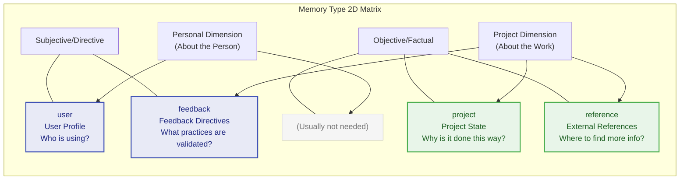

# Chapter 6: The Memory System -- Agent Long-Term Memory

> **Learning Objectives:** Master the design intent and automatic extraction mechanism of four memory types, understand the cache-aware architecture based on the Fork pattern, and learn how to design a persistent Agent memory system. Through this chapter, you will understand how to leverage the memory system to make the Agent increasingly understand you with use, and how to manage the lifecycle of memories in a multi-project environment.

---

Humans can maintain coherence across multiple conversations because we have memory. Similarly, a truly useful Agent cannot start from scratch every conversation -- it needs to remember who the user is, what the project is doing, and which practices have been validated. Claude Code's memory system (memdir) was built for exactly this purpose: a file-based, typed, cross-session persistent memory architecture.

Comparing the memory system to "long-term memory" is a biologically precise analogy. Human memory is divided into sensory memory (milliseconds), working memory (seconds, corresponding to the context management in Chapter 7), and long-term memory (minutes to years, corresponding to the memory system in this chapter). Claude Code's design follows this same layering: the context window is "working memory," temporarily holding information within a single session; while memdir is "long-term memory," persistently storing non-derivable critical knowledge across sessions.

## 6.1 Taxonomy of the Four Memory Types

### 6.1.1 Closed Type System

Claude Code's memory is constrained to a closed four-type classification system, defined in memory type constants: user, feedback, project, and reference.

The design philosophy of these four types is: **only save information that cannot be derived from the current project state.** Code patterns, architecture, file structure, and Git history can all be obtained in real time through tools (grep, git log), and therefore do not fall within the scope of memory.

**Why must it be a closed system?**

An open type system (allowing arbitrary custom types) appears more flexible but has fatal flaws in the Agent scenario: (1) Type explosion -- different users and projects might create dozens of types, making it impossible for the Agent to efficiently determine which memories are relevant to the current conversation when reading; (2) Classification ambiguity -- the same piece of information might belong to multiple custom types, leading to duplicate storage; (3) Index bloat -- the MEMORY.md index would need to maintain classification logic for each type, adding unnecessary complexity.

The closed four-type design embodies a "constraint is freedom" philosophy: constraining the classification method yields efficient consistent reasoning and precise relevance judgment.

### 6.1.2 Detailed Analysis of the Four Types

The relationship between the four memory types can be understood through a two-dimensional matrix:



> **user** -- User Profile

Stores the user's role, goals, and knowledge background. Helps the Agent adjust its collaboration style for users of different expertise levels -- it should communicate differently with a senior engineer versus a beginner.

```
when_to_save: When learning about the user's role, preferences, or knowledge background
how_to_use:  When needing to adjust explanation depth and collaboration style based on the user profile
```

Example: When a user says "I've been writing Go for ten years, but this is my first time touching React," the Agent saves a user-type memory and uses backend analogies when explaining frontend concepts in the future.

**Practical Application Scenarios:**

Scenario 1: Cross-project user preferences. After a user expresses preferences in project A, the Agent can apply the same preferences in project B. Because user-type memories are stored in the user's global directory, they naturally support cross-project sharing.

Scenario 2: Progressive understanding of the user. In the first conversation, the user mentions being a data scientist, and the Agent records this as a user memory. In the fifth conversation, the user demonstrates advanced Python skills, and the Agent updates the memory to add "proficient in Python, familiar with pandas/numpy." This progressive user profile building enhances the Agent's collaboration capabilities over time.

**feedback -- Feedback Directives**

Records the user's corrections and confirmations regarding Agent behavior. This is one of the most important memory types -- it enables the Agent to maintain behavioral consistency across future conversations.

```
when_to_save: When the user corrects your approach ("don't do that") or confirms a non-obvious successful practice
body_structure: The rule itself + Why: reason + How to apply: applicable scenarios
```

Key design: It records not only failures (corrections) but also successes (confirmations). If only corrections are saved, the Agent becomes overly cautious, deviating from validated methods.

**Practical Application Scenarios:**

Scenario 1: Code style preferences. The user says "don't use var, use const and let for everything," and the Agent saves this as a feedback memory. In all subsequent conversations, the Agent's generated code defaults to using const/let.

Scenario 2: Process requirements. The user says "lint must be run before committing code," and the Agent saves this as a feedback memory. Before every subsequent git commit execution, the Agent automatically runs the lint command.

Scenario 3: Lessons from failure. The user says "last time you directly modified package.json which caused version conflicts; from now on, check with me before changing dependencies," and the Agent saves this as a feedback memory, proactively requesting confirmation when modifying dependency files in the future.

**project -- Project State**

Records the non-code state of a project -- decisions, deadlines, work in progress. Code and Git history are derivable, but information like "why it was done this way" and "when it needs to be completed" is not.

```
when_to_save: When learning about who is doing what, why, and when it will be completed
body_structure: Fact or decision + Why: motivation + How to apply: impact on recommendations
```

Special attention: Relative dates must be converted to absolute dates ("Thursday" -> "2026-03-05"), because memories persist across sessions, and relative dates lose their meaning in future conversations.

**Practical Application Scenarios:**

Scenario 1: Architecture Decision Records (ADR). The user says "the authentication module uses JWT instead of Session because it needs to support mobile clients," and the Agent saves this as a project memory. When authentication-related code needs modification in the future, the Agent can understand the background of this decision.

Scenario 2: Work in progress. The user says "I'm migrating the user module from REST to GraphQL; I've completed the query part and need to work on the mutation part next," and the Agent saves this as a project memory. In the next conversation, the Agent can continue working from the correct context.

Scenario 3: Team conventions. The user says "our team agreed that all API responses use camelCase, but database fields use snake_case," and the Agent saves this as a project memory, following this convention when generating code.

**reference -- External References**

Pointers to external systems -- Linear projects, Grafana dashboards, Slack channels. This information is not in the code repository but is critical for understanding project context.

```
when_to_save: When learning about external system resources and their purposes
how_to_use:  When the user references external systems or needs to look up external information
```

**Practical Application Scenarios:**

Scenario 1: Monitoring dashboards. The user says: "the production Grafana dashboard is at [https://grafana.company.com/d/abc123](https://grafana.company.com/d/abc123)." The Agent saves this as a reference memory. When the user asks, "any anomalies recently," the Agent can remind the user to check this dashboard.

Scenario 2: Documentation links. The user says: "the API docs are on Confluence at [https://confluence.company.com/pages/api-docs](https://confluence.company.com/pages/api-docs)." The Agent saves this as a reference memory.

Scenario 3: Communication channels. The user says "backend team discussions are in the #backend-dev Slack channel," and the Agent saves this as a reference memory, reminding the user when cross-team coordination is needed.

### 6.1.3 Explicitly Excluded Information

The memory type validation module explicitly lists content that should not be saved as memory:

- Code patterns, conventions, architecture, file paths -- derivable by reading code
- Git history -- `git log` / `git blame` are authoritative sources
- Debugging solutions -- the fix is already in the code, the context is in the commit message
- Documentation already in CLAUDE.md
- Temporary task details -- transient state of the current conversation

Even when a user **explicitly requests** saving such information, the system guides toward a more valuable direction: "If you want to save a list of PRs, tell me what's **surprising** or **non-obvious** about them -- that's what's worth saving."

**The Deeper Logic of This Exclusion Principle**

Many users, when first using the memory system, try to have the Agent memorize "the project's file structure" or "the API route list." This instinct is understandable -- humans确实 need to understand this information when taking over a new project. But there is a key difference between Agents and humans: Agents can read the file system in real time during every conversation.

```
Information Acquisition Cost Comparison:

Human Developer:
  Memorize file structure -> hours of reading and understanding
  Recall when needed next time -> seconds (if remembered)
  -> Value of memory = time saved from re-reading

Agent:
  Read file structure in real time -> milliseconds for a tool call
  Cost of re-acquiring each time -> a few hundred tokens
  -> Value of memory ≈ 0 (because real-time acquisition cost is minimal)
```

Therefore, the memory system should focus on saving information that "cannot be acquired in real time" -- people's preferences, the rationale behind decisions, external links. The common characteristic of this information is that it exists in people's minds or external systems and cannot be obtained by reading the code repository.

### 6.1.4 Best Practices for Memory Usage

**Memories That Should Be Saved (Positive Examples):**

| Scenario | Memory Type | Content to Save |
|----------|-------------|-----------------|
| User expresses preference | feedback | "User prefers Vitest over Jest" + Why: faster test execution |
| User corrects behavior | feedback | "Don't modify files in the generated folder" + Why: they are auto-generated by protoc |
| Architecture decision | project | "Use event-driven architecture instead of direct calls" + Why: need for service decoupling |
| External system link | reference | "Monitoring alerts are in PagerDuty's X service" |
| User background | user | "User is a full-stack developer, proficient in TypeScript and Python" |

**Memories That Should NOT Be Saved (Negative Examples):**

| Scenario | Why Not to Save | Correct Approach |
|----------|----------------|------------------|
| Project file listing | Can be obtained in real time via `ls` | No memory needed |
| API endpoint list | Can be obtained by reading route code | If there are non-obvious design decisions, save only the decisions |
| Bug fix steps | Already recorded in commit messages | If the fix involves counter-intuitive reasons, save the "why" |
| Third-party library versions | Can be obtained by reading package.json | If there are special reasons for the selection, save the reasons |

### 6.1.5 Common Misconceptions in Memory Management

**Misconception 1: More Memories Is Better**

This is the most common misconception. Some users have the Agent memorize every detail from conversations, leading to MEMORY.md index bloat and a large accumulation of low-value files in the memory directory. Too many memories not only increase the context burden for each conversation but may also cause the Agent to be distracted by "noise" and overlook truly important memories.

**Correct approach:** Regularly review the memory directory and delete outdated or low-value memories. A good memory should pass the test of "if this memory were deleted, would the Agent's behavior be substantively different?"

**Misconception 2: Treating Memory as a Documentation System**

Some users try to use the memory system as a replacement for project documentation, having the Agent memorize all technical specifications and design documents. This violates the principle of "only save non-derivable information" -- technical specifications should be placed in the code repository's documentation directory, not in the memory system.

**Correct approach:** Place technical documentation in the `docs/` directory, and the "why" behind architectural decisions in memory.

**Misconception 3: Ignoring the Relative Date Problem**

The user says "this feature launches next Tuesday," and the Agent saves "launches next Tuesday." But two days later in the next conversation, "next Tuesday" has become "this Tuesday," and a week later it becomes "last Tuesday." This memory is not only useless but potentially misleading.

**Correct approach:** All time-related memories must use absolute dates. The Agent should convert "next Tuesday" to a specific date (e.g., 2026-04-07) before saving.

> **Cross-Reference:** The exclusion principle for memories shares the same philosophy as the compression strategy in Chapter 7 (Context Management) -- only retain information that cannot be re-acquired. Context compression clears old tool results (which can be re-acquired by re-executing tools), and the memory system excludes code patterns (which can be re-acquired by re-reading code).

## 6.2 Memory File Format

### 6.2.1 Frontmatter Format

Each memory is an independent Markdown file that uses YAML Frontmatter to declare metadata. The format requires three fields: name (memory name), description (a one-line description used to determine relevance in future conversations), and type (one of the four types). The `type` field must be one of the four types (strictly validated); legacy files without a type field can continue to work but cannot be filtered by type.

**Why use Markdown files instead of a database?**

This is an architectural choice worth analyzing. Using a file system instead of a database has the following advantages:

1. **Readability**: Developers can directly view and edit memory files with a text editor
2. **Version control**: Memory files naturally support Git tracking (if placed in a project directory)
3. **Portability**: The file system is the lowest common denominator, requiring no additional dependencies
4. **Debuggability**: When problems occur, simply `ls` and `cat` to diagnose
5. **Cost**: No need to maintain database connections, indexes, or backups

The downside is limited query capability -- complex relational queries or full-text searches are not possible. However, for the Agent's memory scenario, the query pattern is a simple "load all relevant memories" rather than complex relational queries, and the file system's capabilities are sufficient.

### 6.2.2 MEMORY.md Index File

`MEMORY.md` is the entry point of the memory system -- it is not a memory itself but an index file. At the start of each conversation, it is automatically loaded into the context, allowing the Agent to quickly understand the overview of existing memories.

The memory directory module's constants define the index capacity limits: the index file is named `MEMORY.md`, with a maximum of 200 lines and 25KB.

The format for index entries requires one line per entry, no more than 150 characters:

```markdown
- [Title](file.md) -- One-line hook description
```

The `truncateEntrypointContent` function implements dual capacity protection: first truncation by lines (200-line limit), then truncation by bytes (25KB limit). When limits are exceeded, a warning is appended to the end of the file indicating which limit was triggered.

**The Design Wisdom of Dual Capacity Protection**

Why are two layers of limits needed? The line limit and byte limit each address different concerns:

- **Line limit (200 lines)**: Protects the Agent's comprehension efficiency. Even if each line is short, an index of more than 200 lines requires the Agent to spend more tokens understanding and filtering. The line limit ensures that the index always remains a "quick browse" tool rather than a "deep reading" document.
- **Byte limit (25KB)**: Protects the context budget. A single memory's index entry may contain a long description (approaching the 150-character limit), and 200 such entries could reach 30KB, putting pressure on the context window. The byte limit provides a hard cost ceiling.

The order of the two layers also matters -- truncation by lines first, then by bytes. This means: when there are fewer memory entries but longer descriptions, the byte limit triggers first; when there are more memory entries but shorter descriptions, the line limit triggers first. In either case, there is a corresponding protection mechanism.

### 6.2.3 Directory Structure of Memory Files

The storage path for memory files is determined by functions in the path resolution module. The default path is:

```
