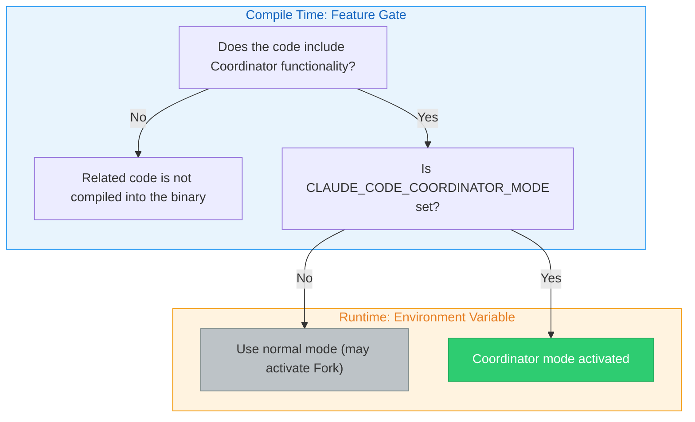
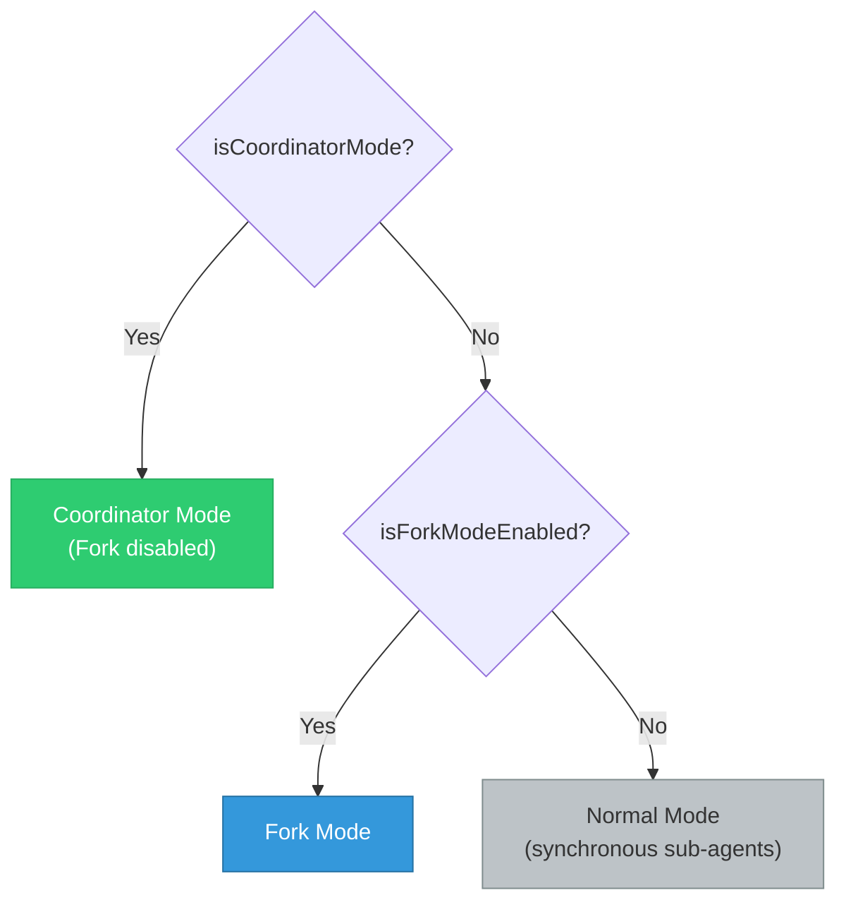
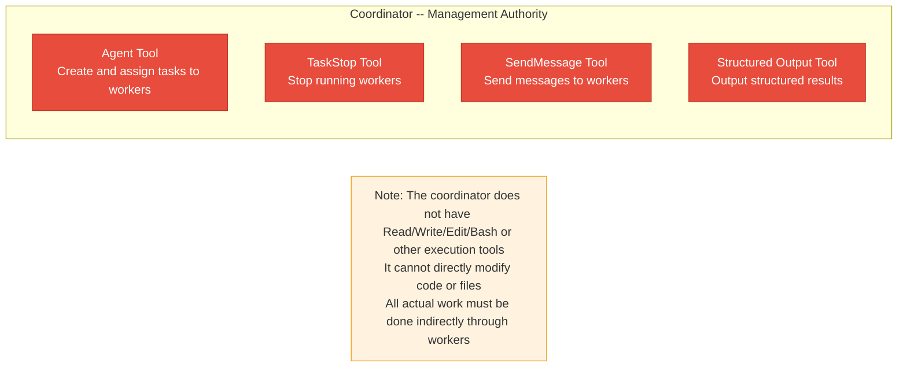
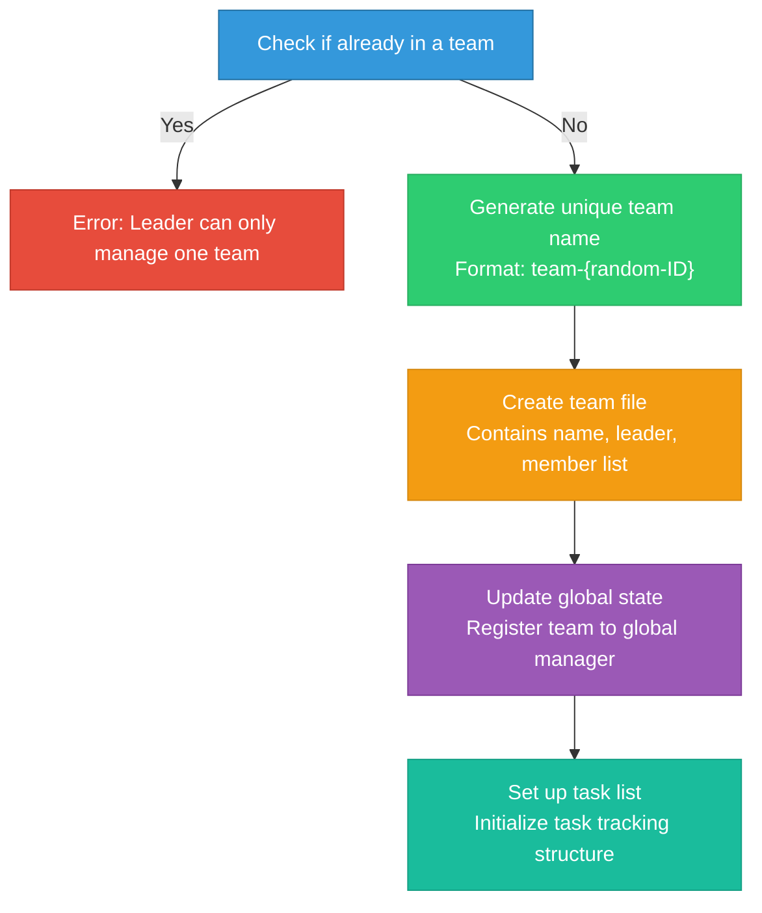

# Chapter 10: The Coordinator Pattern -- Multi-Agent Enterprise Orchestration

> **Learning Objectives:**
> - Understand the "coordinator-worker" architecture of the Coordinator pattern and its design motivations
> - Master the complete workflow of multi-agent collaboration: from requirements analysis to delivery verification
> - Gain a deep understanding of task allocation, fault recovery, and the Scratchpad collaboration space mechanisms
> - Be able to compare the Coordinator pattern with the Fork pattern and make the correct choice for given scenarios

When a single agent cannot handle complex engineering tasks, Claude Code provides the Coordinator pattern -- a centralized multi-agent orchestration solution. Unlike the Fork pattern's peer-to-peer parallelism, the Coordinator pattern employs a "coordinator-worker" architecture, where a dedicated coordinator manages the lifecycle and task allocation of multiple parallel workers.

This is like how a construction site operates: the project manager (Coordinator) doesn't need to lay bricks, run wiring, or install pipes personally, but they need to know which workers (Workers) are good at what, which tasks can run in parallel, which have dependencies, and how to coordinate shared resources (Scratchpad). When a worker encounters a problem, the project manager needs to decide whether to reassign the task or adjust the overall plan.

This chapter will dive deep into the source code design, revealing the design philosophy behind this enterprise-grade orchestration pattern.

---

## 10.1 Coordinator Architecture

### The coordinatorMode Core Module

The core code of the Coordinator pattern resides in the coordinator module. Although this module is only about 370 lines long, it defines the entire interaction model for multi-agent collaboration. The conciseness of the code is not accidental -- the coordinator's responsibility is "orchestration" rather than "execution," and it needs to stay lean to avoid becoming a performance bottleneck or single point of failure in the system.

The module's entry point is the `isCoordinatorMode()` function, which reveals the Coordinator pattern's dual gating mechanism:

1. **Feature gate**: Determines at compile time whether to include the feature's code
2. **Environment variable**: `CLAUDE_CODE_COORDINATOR_MODE` controls activation at runtime

> **Design Insight: Why use dual gating instead of a single switch?**
>
> The feature gate is a compile-time optimization -- deployments that don't need Coordinator functionality (such as lightweight SDK embedding scenarios) can completely exclude the related code, reducing binary size and attack surface. The environment variable is a runtime control -- even in builds that include the feature, it must be explicitly enabled. This "compile-time exclusion + runtime explicit enable" pattern is common in enterprise software, satisfying both flexibility requirements and the principle of least privilege.

### Activation Conditions and Mutual Exclusion

The Coordinator pattern interacts with other patterns in multiple places. First is its mutual exclusion with the Fork pattern: when both satisfy their conditions simultaneously, the Coordinator pattern takes priority. This is because the Coordinator already has its own task delegation model and doesn't need the Fork pattern's implicit parallelism capabilities.

> **Cross-Reference:** The Fork pattern's cache sharing mechanism is discussed in detail in Chapter 9. The core difference between the two is: Fork is "centerless parallelism" (all sub-agents are equal and share the same context), while Coordinator is "centered orchestration" (the coordinator controls the global view, and workers only see the tasks assigned to them).

The Coordinator pattern also affects the agent registry. When Coordinator mode is activated, the built-in agent registration function no longer returns the normal list of built-in agents but instead introduces Coordinator-specific worker agent definitions through lazy loading. This lazy loading approach is intentional, aimed at avoiding circular dependencies between the coordinator module and the tool module.

### Pattern Matching for Session Recovery

The `matchSessionMode()` function handles pattern consistency during session recovery: when the current mode doesn't match the session's recorded mode, the system automatically flips the environment variable to match the session's mode. This ensures that when a user recovers a session created in Coordinator mode, the system automatically activates Coordinator mode, even if the current startup configuration doesn't have the environment variable set.

This design solves a practical problem: a user might set the Coordinator environment variable during one launch and create a session, but forget to set it when recovering that session later. Without automatic mode matching, the session would be restored in the wrong mode, leading to inconsistent behavior or even errors.

### The Coordinator's System Prompt

The Coordinator's role is defined in the system prompt generation function -- a carefully crafted system prompt that specifies the complete behavioral norms for the coordinator. Key points include:

**Role Definition**: The coordinator is not an executor but an orchestrator. It directly answers simple questions and delegates complex tasks to workers.

**Tool Set**: The coordinator has only four core tools -- the Agent tool for spawning workers, the TaskStop tool for stopping workers, the SendMessage tool for sending messages to workers, and the structured output tool.

**Key Constraints**: The system prompt explicitly prohibits the coordinator from "using one worker to inspect another worker," "using a worker to simply report file contents," or "predicting or fabricating agent results." These constraints ensure that the coordinator manages all communication directly, preventing overly long information-passing chains.

> **Anti-Pattern Warning: Why is "worker inspecting worker" prohibited?**
>
> Allowing Worker A to inspect Worker B's results creates an "information chain": Worker B completes its task -> Worker A reads B's results -> Worker A reports to the coordinator. This chain has two serious problems:
>
> 1. **Information decay**: Each transmission loses details. Like a game of telephone, information after multiple rounds of relay may differ greatly from the original result.
>
> 2. **Debugging difficulty**: When the final result is wrong, you need to trace back layer by layer to find which link caused the problem.
>
> The correct pattern is: the coordinator directly receives each worker's results, understands them itself, and then writes the next set of instructions.

---

## 10.2 Worker Tool Allocation

### INTERNAL_WORKER_TOOLS

Under the Coordinator pattern, workers' tool allocation is controlled through two sets. The internal worker tools set defines the tools that workers **should not see** -- these are the coordinator's exclusive tools, including team creation, team deletion, message sending, and structured output.

This forms a clear boundary of authority:

```mermaid
graph LR
    subgraph Coordinator["Coordinator -- Management Authority"]
        C1["Agent Tool"]
        C2["TaskStop Tool"]
        C3["SendMessage Tool"]
        C4["Structured Output"]
    end
    subgraph Worker["Worker -- Execution Authority"]
        W1["Read / Write"]
        W2["Edit / Bash"]
        W3["Grep / Glob"]
        W4["WebSearch"]
        W5["Skill / MCP"]
    end

    Coordinator x-- Management vs Execution --x Worker

    style C1 fill:#e74c3c,stroke:#c0392b,color:#fff
    style C2 fill:#e74c3c,stroke:#c0392b,color:#fff
    style C3 fill:#e74c3c,stroke:#c0392b,color:#fff
    style C4 fill:#e74c3c,stroke:#c0392b,color:#fff
    style W1 fill:#3498db,stroke:#2471a3,color:#fff
    style W2 fill:#3498db,stroke:#2471a3,color:#fff
    style W3 fill:#3498db,stroke:#2471a3,color:#fff
    style W4 fill:#3498db,stroke:#2471a3,color:#fff
    style W5 fill:#3498db,stroke:#2471a3,color:#fff
```

### Simple Mode and Full Mode Tool Sets

The `getCoordinatorUserContext()` function returns different tool descriptions based on the mode:

- **Simple Mode**: Workers only have Bash, Read, and Edit tools, suitable for resource-constrained environments
- **Full Mode**: Workers have all whitelisted tools except internal tools, including Read, Write, Edit, Bash, Grep, Glob, WebSearch, WebFetch, NotebookEdit, Skill, ToolSearch, and more

| Mode | Tool Set | Applicable Scenarios |
|------|----------|---------------------|
| Simple | Bash, Read, Edit | CI/CD environments, resource-constrained containers, quick validation |
| Full | All whitelisted tools | Local development, full IDE integration, complex refactoring |

In Full mode, workers can also use MCP tools and Skill tools. The system prompt informs the coordinator of the available worker tool list through user context.

> **Practical Scenario: When to Use Simple Mode?**
>
> Simple mode is suitable for the following scenarios:
> - **Automated tasks in CI/CD pipelines**: Build servers don't need web search or file discovery
> - **Quick fix tasks**: Simple fixes that only require reading, editing, and running tests
> - **Security-restricted environments**: Minimizing the tool set reduces potential security risks
> - **Resource-constrained containers**: Reduces tool initialization overhead

### Independent Assembly of the Tool Pool

Workers' tool pools are assembled independently from the parent level, ensuring that workers always get the complete tool set, unaffected by parent-level tool restrictions. Workers default to the `acceptEdits` permission mode (automatically accept file edits), unless the agent definition specifies another mode.

This design decision reflects an important principle: **workers are executors and should not be hindered by permission issues**. If a worker needed user confirmation every time it edited a file, the advantages of multi-agent collaboration would be completely negated. Of course, this requires the coordinator to assign tasks correctly -- if given the wrong modification task, a worker will execute it without hesitation.

> **Best Practice: Pre-confirm Task Scope Under Coordinator Mode**
>
> Since workers automatically accept edits, users should review the overall plan before the Coordinator accepts a task. It's recommended to add a prompt in CLAUDE.md requiring the coordinator to present the complete task allocation plan before starting the Implementation phase.

---

## 10.3 Team Management

### TeamCreateTool / TeamDeleteTool

The Coordinator pattern shares team infrastructure with Agent Teams (multi-agent swarms). The team creation tool is responsible for creating teams, and its core process includes: checking whether already in a team (a leader can only manage one team), generating a unique team name, creating a team file (containing team name, leader ID, session ID, member list, etc.), then writing the team file, updating global state, and setting up the task list.

The team deletion tool handles cleanup: it first checks whether there are still active members, only allowing cleanup after all members have completed their work, then clears the team directory, worktree, and team context.

### Safety Guarantees for Team Deletion

Team deletion is not a simple "delete everything" operation but a process with multiple safety checks:

1. **Active member check**: If workers are still running, deletion is refused and the list of still-running members is returned
2. **Resource cleanup order**: Clean team directory (Scratchpad, etc.) first, then worktree, then team context
3. **Error tolerance**: Failure to clean up a single resource does not prevent cleanup of other resources

> **Anti-Pattern Warning: Do Not Delete a Team Before Work Is Complete**
>
> If the coordinator forcefully deletes a team while workers are still running, the workers will lose their association with the team, which may lead to:
> - Worker task notifications failing to reach the coordinator
> - Scratchpad files being deleted while in-use workers read empty data
> - Worktrees being cleaned up, causing workers' file modifications to be lost
>
> This is why team deletion requires the precondition that "all members have completed."

### SendMessageTool Message Passing

The message sending tool is the core communication channel for team collaboration. It supports four message types: close requests, close responses, and plan approval responses.

Addressing modes for message passing:

| Addressing Mode | Format | Use Case | Communication Scope |
|----------------|--------|----------|-------------------|
| Point-to-point | `to: "agent-name"` | Send specific instructions to a designated worker | Single worker |
| Broadcast | `to: "*"` | Publish public information to all workers | All workers |
