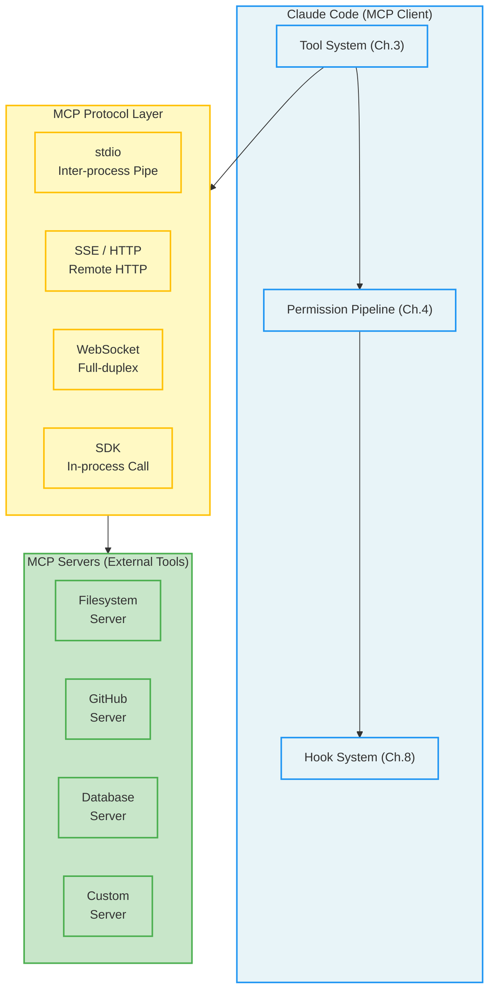
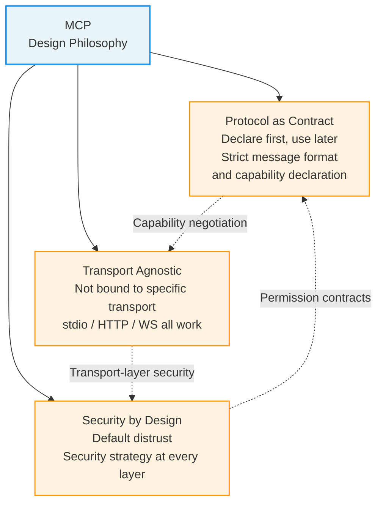
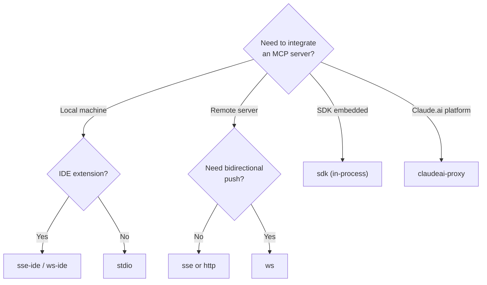
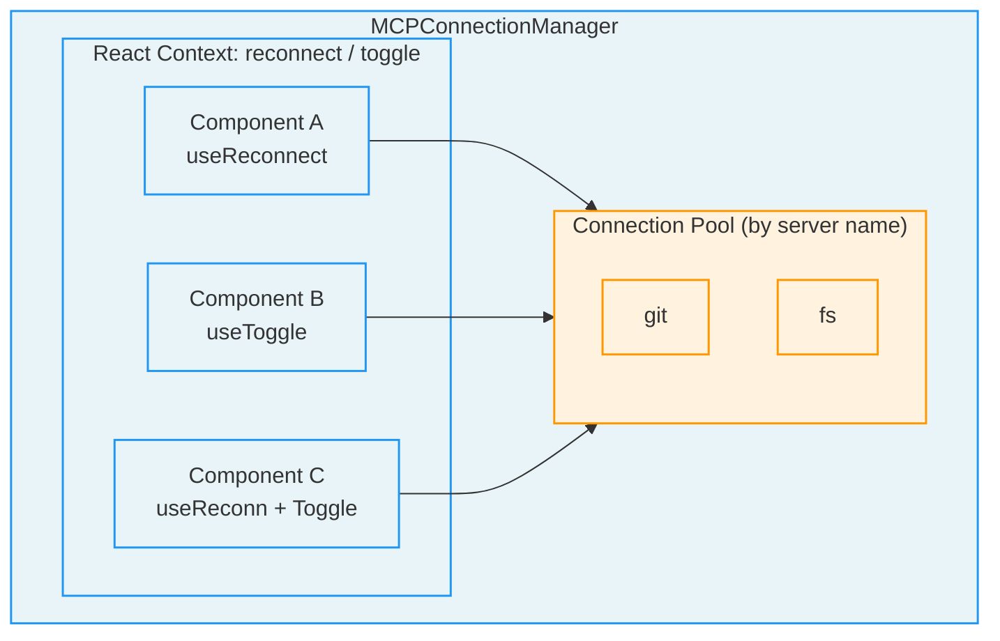
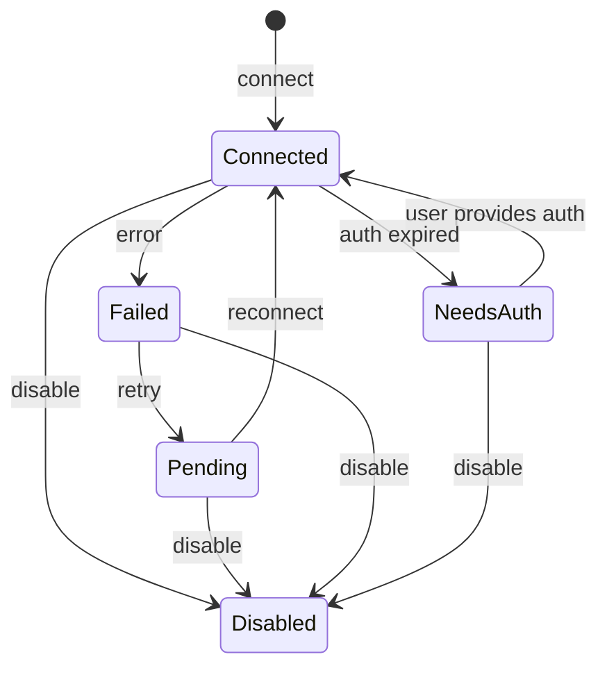
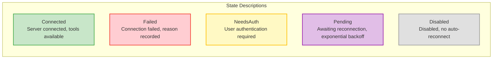
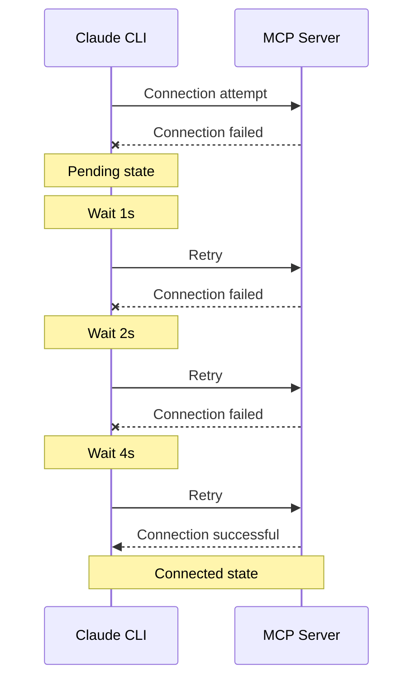

## 12.1 MCP Architecture Overview



### 12.1.1 Why MCP: Problems and Solutions

Before diving into technical details, let's first understand the fundamental problem MCP aims to solve.

**The Fragmented Integration Dilemma**

In the LLM application ecosystem, a core challenge has long persisted: every AI application needs to connect to external data sources and tools, but each application's integration approach is different. Imagine you're a database vendor who wants to make your data accessible to various AI tools. Without a unified standard, you'd need to develop a separate adapter for each AI platform — one for Claude, one for ChatGPT, one for Cursor... This is like the era before USB standards, when every phone had its own unique charging port.

MCP emerged to become the "USB-C port" of the AI world. It defines an open standard protocol that allows any AI application to connect to any data source or tool in a unified way. For tool developers, implementing an MCP server once makes it usable by all MCP-compatible AI applications; for AI application developers, implementing an MCP client once grants access to the entire MCP ecosystem.

**Three Core Design Principles**

MCP's design follows three core principles that permeate Claude Code's entire MCP implementation:



1. **Protocol as Contract**: MCP defines strict message formats and capability declaration mechanisms between client and server. Servers declare what tools, resources, and prompt templates they provide; clients retrieve this information through standardized requests. This "declare first, use later" pattern allows both parties to collaborate without understanding each other's internal implementation. This is consistent with the "interface as architecture" philosophy from the tool system in Chapter 3.

2. **Transport Agnostic**: The MCP protocol itself is not bound to any specific network transport method. The same MCP server can provide services through stdio, HTTP, WebSocket, and other methods. This design enables MCP servers to run in local processes (high performance, low latency) or be deployed on remote servers (centralized management, multi-user sharing) without modifying business logic.

3. **Security by Design**: MCP integrates security strategies into every layer of the protocol — from capability negotiation during connection establishment, to permission checks during tool invocation, to enterprise-level approval controls. This "default distrust" design ensures that even when untrusted third-party tools are connected, they cannot compromise the overall system's security.

> **Analogy:** Think of MCP as the USB protocol stack. The physical layer (USB-C cable) corresponds to MCP's transport layer (stdio/SSE/WS); the protocol layer (USB descriptors and endpoints) corresponds to MCP's capability declarations and tool discovery; the application layer (USB device drivers) corresponds to specific MCP tool implementations. Just as you don't need to know how a mouse works internally to use it, Claude Code doesn't need to know how an MCP server works internally to invoke its tools.

> **Cross-reference:** Once MCP tools are mapped to internal Claude Code Tool objects, they fully integrate into the tool system described in Chapter 3. This means MCP tools go through the same four-stage permission pipeline checks (Chapter 4), participate in the same concurrency scheduling strategies, and can be intercepted and enhanced through the hook system (Chapter 8).

### 12.1.2 Connection Configurations and Transports

The `McpServerConfigSchema` discussed in this chapter defines eight configuration variants. These include transports, IDE-specific variants, SDK integration, and a proxy configuration; they are not eight independent MCP-standard transport protocols. Distinguish the transport from the deployment adapter when choosing an integration.

| Configuration Kind | Config Type | Transport Method | Latency Profile | Use Case |
|---------|---------|---------|---------|---------|
| `stdio` | `McpStdioServerConfig` | Standard I/O pipes | Local inter-process communication | Local dev tools, filesystem operations, CLI tool wrappers |
| `sse` | `McpSSEServerConfig` | Server-Sent Events | Network latency | Remote HTTP services, cloud-deployed MCP servers |
| `sse-ide` | `McpSSEIDEServerConfig` | SSE + IDE metadata | Local network | IDE extension only, includes `ideName` identifier |
| `http` | `McpHTTPServerConfig` | HTTP Streamable | Network latency | New MCP spec protocol, supports streaming responses |
| `ws` | `McpWebSocketServerConfig` | WebSocket full-duplex | Network latency | Scenarios requiring real-time bidirectional communication |
| `ws-ide` | `McpWebSocketIDEServerConfig` | WebSocket + IDE metadata | Local network | IDE extension only, requires low-latency bidirectional communication |
| `sdk` | `McpSdkServerConfig` | In-process function calls | No external transport hop | SDK internal calls, no actual process or network connection started |
| `claudeai-proxy` | `McpClaudeAIProxyServerConfig` | Claude.ai proxy | Network latency | Claude.ai platform proxy servers |

**Transport Protocol Selection Decision Tree**

When you need to choose a transport protocol for an MCP server, refer to the following decision path:



**Protocol Details and Use Case Analysis**

**The stdio protocol** is the most common and recommended type. It launches a local MCP server subprocess via `command` and `args`, communicating through the operating system's standard I/O pipes. The advantages of this approach are: zero network overhead (data passes between processes via memory buffers), explicit lifecycle management and no network listener requirement. A subprocess is not a sandbox: inherited permissions may be broad, and parent exit alone does not guarantee child termination. The vast majority of local development scenarios — filesystem access, Git operations, database clients — should prefer stdio.

```json
{
  "mcpServers": {
    "filesystem": {
      "type": "stdio",
      "command": "npx",
      "args": ["-y", "@modelcontextprotocol/server-filesystem", "/home/user/projects"],
      "env": { "NODE_OPTIONS": "--max-old-space-size=4096" }
    }
  }
}
```

**The SSE protocol** is suited for remotely deployed MCP servers. Server-Sent Events is an HTTP-based unidirectional push technology: the client sends requests via HTTP POST, and the server streams responses and notifications via SSE. The advantage is deployment flexibility — the MCP server can run anywhere in the cloud, and Claude Code only needs to know the URL to connect. However, this introduces additional network latency and authentication complexity.

**The sse-ide and ws-ide protocols** are specialized types for IDE integration, adding IDE identification information (such as the `ideName` field, identifying whether it's VS Code or JetBrains) on top of standard SSE/WebSocket protocols. This "protocol variant" design pattern avoids embedding platform-specific logic into the generic protocol, keeping the core protocol clean.

**The HTTP Streamable protocol** is a newer protocol in the MCP specification that provides more flexible streaming response capabilities compared to SSE. It supports incrementally returning response content over a single HTTP connection, making it suitable for tools that need to return large amounts of data or run for extended periods.

**The WebSocket protocol** provides full-duplex communication capabilities, suited for scenarios requiring real-time bidirectional data exchange. Unlike SSE's unidirectional push, WebSocket allows the server to proactively send messages to the client and allows the client to send requests at any time without establishing new HTTP connections.

**The SDK protocol** is the most special type — it doesn't start any process or open any network connection. SDK-type MCP servers are embedded directly into the Claude Code process through function calls, with near-zero latency. It's primarily used for SDK integration scenarios, allowing third-party applications embedding Claude Code to register MCP tools directly without additional inter-process communication. For this reason, SDK servers are exempt from enterprise security policy checks — they run in the same process as Claude Code, with security boundaries guaranteed by the host application.

> **Best Practice:** Prefer the stdio protocol. Only consider SSE/HTTP/WebSocket when the MCP server must run on a remote machine (e.g., accessing an internal company database, using centralized compute resources). The SDK protocol is only for programmatic integration scenarios.

> **Anti-pattern Warning:** Do not perform long-running initialization operations in stdio servers. Claude Code connects to all configured MCP servers in parallel at startup; if one server's initialization takes too long (e.g., establishing a database connection pool, loading a large model), it will slow down the entire startup process. Consider lazy initialization strategies — establish connections only on the first tool invocation.

### 12.1.3 Connection Manager: MCPConnectionManager

The MCP connection manager is a React Context Provider that provides MCP connection management capabilities to the entire component tree. Its design embodies the "centralized control, distributed usage" architecture pattern — connection establishment, disconnection, and retries are handled uniformly by the manager, while tool usage is distributed across individual components.

**Why the Context Provider Pattern?**

Claude Code's UI layer is built on React. In the React component tree, if each component independently managed MCP connections, it would cause two serious problems: wasted connection resources (the same MCP server might be repeatedly connected by multiple components) and inconsistent state (one component has already detected a server disconnect while another is still using a cached tool list). The Context Provider pattern ensures all child components see consistent MCP state by injecting a shared connection management service at the top of the component tree.

Its core interface provides two operations:

- **Reconnect**: Triggers the reconnection flow for a specified MCP server, returning the updated tool list, command list, and resource list. This is used when server configuration changes or after recovering from a network interruption.
- **Toggle**: Controls the enabled/disabled state of a specified MCP server. Disabling a server disconnects it and removes all its tools; enabling a server re-establishes the connection and registers tools.

Child components access these operations through two hooks: one for the reconnect function (`useMcpReconnect`) and one for the toggle function (`useMcpToggle`). Both require usage within the `MCPConnectionManager` component tree, or they will throw an error. This is the standard React Context safety pattern — ensuring the Context is only consumed within legitimate component hierarchies.



### 12.1.4 Server Connection States and Lifecycle

MCP server connections have five states, forming a carefully designed finite state machine: Connected, Failed, NeedsAuth, Pending (with retry support), and Disabled.





**The Deeper Meaning of State Transitions**

Each state represents not only the technical state of the connection but also corresponds to different user interaction strategies:

- **Connected**: The server is connected and tools are available. `ConnectedMCPServer` contains the complete MCP Client instance, server capability declarations, configuration information, and a cleanup function (for graceful disconnection).
- **Failed**: The connection attempt failed. The system records the failure reason (network error, authentication failure, server not responding, etc.) and decides whether to enter the retry flow. Not all failures should be retried — authentication failures require user intervention, while network timeouts can be retried automatically.
- **NeedsAuth**: The server requires authentication but valid credentials were not provided. This is a critical aspect of security design — the system does not blindly retry connections that need authentication (which would lock accounts) but instead hands control to the user.
- **Pending**: Awaiting reconnection. `PendingMCPServer` records the number of reconnection attempts and the maximum retry count, supporting exponential backoff retry. This strategy avoids connection storms when the server is persistently unavailable.
- **Disabled**: A server that was actively disabled by the user or forcibly disabled by policy. It will not auto-reconnect; only explicit user re-enablement will trigger a connection attempt.

**Design Considerations for Exponential Backoff Retry**

The Pending state's retry uses an exponential backoff algorithm: the 1st retry waits approximately 1 second, the 2nd 2 seconds, the 3rd 4 seconds, and so on, until the maximum retry count is reached. This design is a standard fault-tolerance pattern in distributed systems. Its core logic is: if the server is temporarily unavailable, rapid consecutive retries only add burden; but if the server recovers in a few seconds, you don't want to wait too long.



> **Connection to Chapter 3:** MCP tools only appear in the tool list when the server is in the Connected state. When a server transitions from Connected to any other state, all its tools are immediately removed from the available tool list. This is tightly integrated with the tool registration mechanism described in Chapter 3 — tool availability is dynamic, not static.
