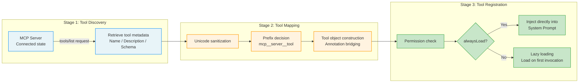
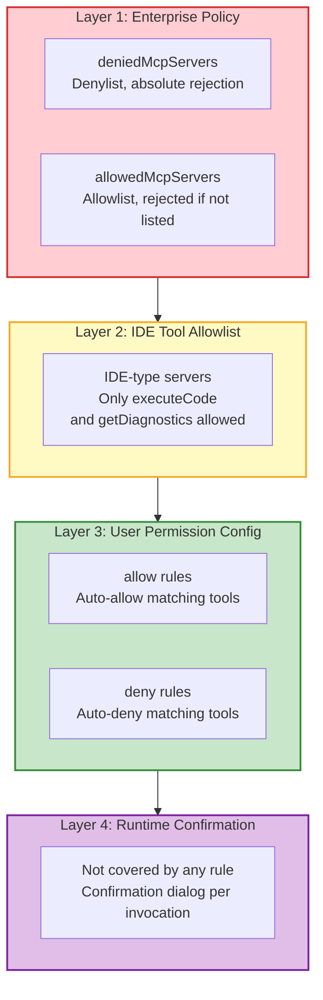

## 12.2 MCP Tool Integration

MCP tool integration is the process of seamlessly incorporating external server capabilities into Claude Code's internal tool system. This process involves three key stages: Discovery, Mapping, and Registration. Understanding this pipeline is understanding how MCP transforms "external tools" into "internal capabilities."



### 12.2.1 Tool Discovery and Mapping

**Discovery Stage**

After an MCP server successfully connects (entering the Connected state), Claude Code retrieves the server's tool list through a `tools/list` request. This request is part of the MCP protocol standard; the server must return metadata for all tools it provides — including tool names, descriptions, input parameter schemas, and behavioral annotations (hints).

> **Analogy:** Tool discovery is like sitting down at a restaurant and having the waiter hand you a menu. The menu lists all available dishes (tool names), ingredient descriptions (input parameters), and flavor tags (behavioral annotations). You don't need to visit the kitchen to see how the chef cooks — the menu is enough for you to make a choice.

**Mapping Stage**

The core tool mapping logic includes several key steps:

1. **Unicode Sanitization**: The returned tool list undergoes Unicode sanitization, removing control characters and illegal characters. This step may seem simple, but it's a classic example of defensive programming — you should never trust any external input, including characters in tool names.

2. **Prefix Decision**: Based on configuration, the system decides whether to add a server name prefix to tool names. In most modes, the prefix is mandatory (ensuring tool names don't conflict across servers); but in SDK mode, when the environment variable `CLAUDE_AGENT_SDK_MCP_NO_PREFIX` is set, tools are registered with their original names, allowing MCP tools to override built-in tools by name.

3. **Tool Object Construction**: Each MCP tool is mapped to a Claude Code internal `Tool` object. This mapping isn't simple field copying but a complete "protocol adaptation" — MCP semantics are translated into Claude Code tool system semantics.

After each MCP tool is mapped to a Claude Code internal `Tool` object, it contains the following key properties:

| Property | Source | Purpose |
|------|------|------|
| `isMcp: true` | Fixed flag | Identifies this as an MCP tool, distinguishing it from built-in tools |
| `mcpInfo` | Server config | Contains `serverName` and `toolName` metadata for permission checks and UI display |
| `isConcurrencySafe()` | MCP annotation `readOnlyHint` | Maps to concurrency safety determination, affects scheduling strategy |
| `isDestructive()` | MCP annotation `destructiveHint` | Maps to destructiveness determination, affects permission prompt level |
| `isOpenWorld()` | MCP annotation `openWorldHint` | Maps to open-world determination, affects permission scope checks |
| `alwaysLoad` | `_meta.anthropic/alwaysLoad` | When true, skips lazy loading and injects directly into system prompt |

**Behavioral Annotation Bridging Design**

The three "Hint" mappings in the table above deserve special attention. The MCP protocol defines tool behavioral annotations (such as `readOnlyHint`, `destructiveHint`), while Claude Code's tool system has its own semantic model (such as `isConcurrencySafe()`, `isDestructive()`). The mapping between these two semantic systems is not 1:1 — MCP's annotations are "suggestive" (hint), while Claude Code's methods are "decisive" (decision).

The elegance of this bridging design is that it allows MCP servers to describe their tool behavior in standardized language, while Claude Code can make final decisions based on its own security policies. If an MCP server's annotations are inaccurate (for example, a tool marked `readOnlyHint` that actually modifies data), Claude Code's permission pipeline will still perform a secondary check at runtime.

> **Cross-reference:** The concurrency safety (`isConcurrencySafe()`) here directly affects the concurrency partitioning strategy described in Chapter 3. MCP tools marked as concurrency-safe can execute in parallel with other safe tools, while unsafe tools must wait serially.

**Lazy Loading Mechanism**

The `alwaysLoad` property controls when tools are loaded. In the default lazy loading mode, MCP tool descriptions don't immediately appear in the system prompt (which would consume significant tokens); instead, they're loaded when the model first needs to use the tool. However, for tools marked with `alwaysLoad: true` (typically high-frequency foundational tools), the system injects them directly into the system prompt at startup, ensuring the model always knows these tools exist.

### 12.2.2 Tool Name Prefix: mcp__server__tool

MCP tools adopt a unified three-part naming convention `mcp__\{server\}__\{tool\}`. Behind this seemingly simple naming rule are several layers of important design considerations.

**Why Prefixes?**

Imagine a scenario: you're simultaneously connected to two MCP servers — one for GitHub tools and one for GitLab tools, and both provide a tool named `create_issue`. Without namespace isolation, the two tools would create a name conflict, and the model couldn't distinguish them. The three-part naming ensures global name uniqueness by using the server name as a namespace, even when different servers provide identically named tools.

**Implementation Details of the Naming Convention**

The naming function concatenates the server name and tool name into a fully qualified name, while the parsing function performs the reverse operation, splitting on double underscores to extract the server name and tool name.

Key design details:

**Double underscore separator**: Tool names follow the format `mcp__\{server\}__\{tool\}`. If the server name itself contains double underscores, parsing may be inaccurate — but this rarely occurs in practice. The rationale for choosing double underscores over single underscores is intuitive: single underscores are too common in variable names (like `read_file`), so using double underscores as separators significantly reduces ambiguity.

**SDK prefix skip**: When the environment variable `CLAUDE_AGENT_SDK_MCP_NO_PREFIX` is set and the server type is `sdk`, tools are registered with their original names. This design supports an advanced use case: allowing MCP tools to override built-in tools by name. For example, an SDK-registered `Read` tool can override Claude Code's built-in Read tool, implementing custom behavior. This is a "backdoor" mechanism typically used in SDK embedding scenarios (e.g., integrating Claude Code into another application that needs custom file reading behavior).

**Permission checks use fully qualified names**: The `getToolNameForPermissionCheck` function ensures permission rule matching uses the `mcp__server__tool` format. This solves a subtle security problem: if an MCP server provides a tool named `Write` (without prefix), its permission check should not match the built-in `Write` tool's rules — otherwise, a user's permission grant for the built-in Write tool could be exploited by the MCP Write tool.

**Edge Cases in Name Resolution**

Let's analyze some edge cases:

```
mcp__github__create_issue     → server="github", tool="create_issue"  ✓ Clear
mcp__my_server__read_file     → server="my_server", tool="read_file"  ✓ Clear
mcp__my__special__tool        → server="my", tool="special__tool"     ⚠ Ambiguous
mcp__server__name__with__dupes → server="server", tool="name__with__dupes" ⚠ Ambiguous
```

The parsing function splits on the first occurrence of double underscores — in the portion after `mcp`, everything before the first double underscore is the server name, and everything after is the tool name. This means that if the server name itself contains double underscores, the parsing result may not match expectations. But as mentioned earlier, this situation rarely occurs in practice.

> **Best Practice:** When naming MCP servers, avoid using double underscores. Use single underscores (e.g., `my_server`) or hyphens (e.g., `my-server`) as separators in server names.

> **Connection to the Permission Pipeline:** The three-part naming ensures MCP tools have independent namespaces during permission checks. When a user configures `allow: ["mcp__github__*"]` in `.claude/settings.local.json`, this rule only matches tools provided by the GitHub server, without affecting other servers or built-in tools. This is the concrete manifestation of the "per-tool granularity authorization" strategy from Chapter 4's permission pipeline in the MCP context.

### 12.2.3 MCP Tool Permission Model

MCP tool permission checks follow the "deny by default, allow explicitly" security principle. By default, every MCP tool invocation returns `passthrough` behavior, meaning each call requires user confirmation. This "confirm by default" design increases interaction cost but is correct from a security standpoint — you cannot predict what a third-party MCP tool will do and should keep users informed and consenting.

However, frequent confirmation dialogs severely impact the user experience. To address this, the system provides an auto-allow path where users can add rules in `.claude/settings.local.json` to pre-authorize specific MCP tools:

```json
{
  "permissions": {
    "allow": [
      "mcp__my_server__read_file",
      "mcp__github__*"
    ]
  }
}
```

**Permission Rule Matching Logic**

Permission rules support both exact matching and wildcard matching:

- `mcp__github__create_issue`: Exact match, only allows the GitHub tool named `create_issue`
- `mcp__github__*`: Wildcard match, allows all tools provided by the GitHub server
- `mcp__*`: Allows all MCP tools (use with caution)

**Permission Hierarchy Overview**

Placing the MCP tool permission model within Claude Code's overall permission system:



This four-layer permission model follows the "Defense in Depth" principle: even if one layer's check is bypassed or misconfigured, other layers still provide protection. For example, even if a user allows all MCP tools in their permission configuration (`mcp__*`), enterprise administrators can still block dangerous servers through the denylist.

> **Cross-reference to Chapter 4:** This permission hierarchy is tightly integrated with the Permission Pipeline described in Chapter 4. MCP tool permission checks occur during the second stage (permission evaluation stage) of the pipeline, sharing the same check framework as built-in tools but with independent default behavior (passthrough vs. the possible auto-allow for built-in tools).

> **Anti-pattern Warning:** Do not use `"mcp__*": "allow"` in global configuration to allow all MCP tools. This "one-click open-all" approach, while convenient, bypasses security checks — any tools provided by newly connected MCP servers will be automatically allowed to execute, including tools you may not be familiar with. Authorize at the server or tool granularity level.
