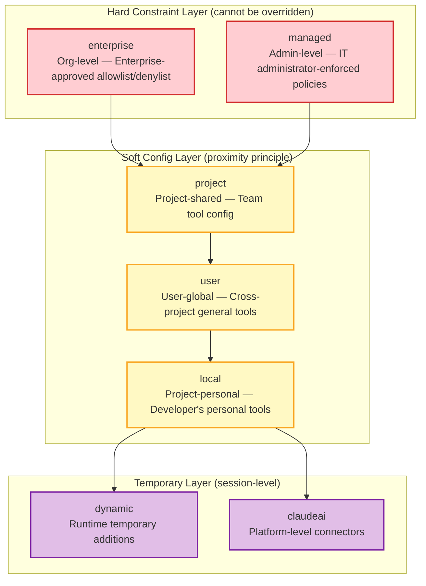
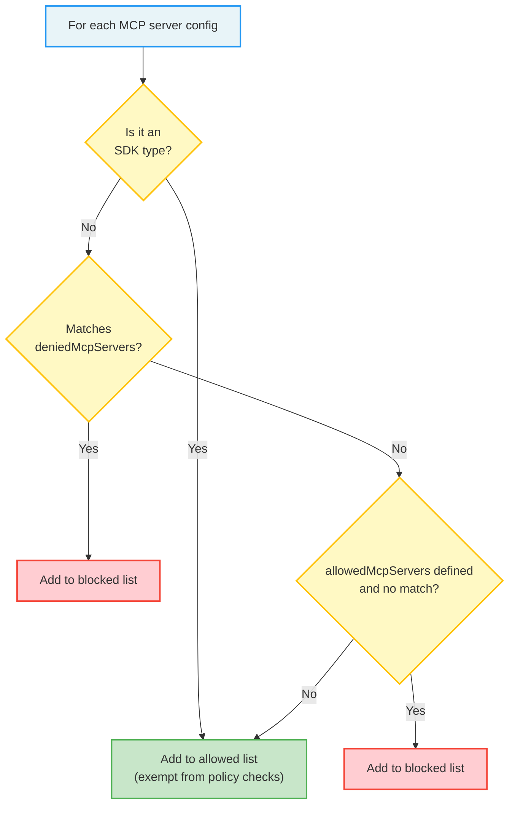
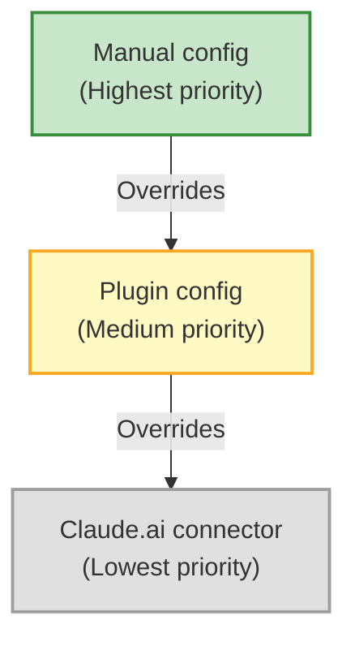

## 12.3 MCP Permissions and Security

Security is the most critical topic in MCP integration. Unlike built-in tools, MCP tools come from external third parties, and their behavior is unpredictable and uncontrollable. Therefore, Claude Code has built a multi-layered defense system for MCP, from configuration scopes to server approval, from tool allowlists to plugin deduplication — each layer targets specific security threats.

### 12.3.1 Configuration Scopes

MCP server configuration has seven scopes, each corresponding to different management levels and trust boundaries:

| Scope | Config Source | Management Level | Typical Use |
|--------|---------|---------|---------|
| `local` | `.claude/settings.local.json` | Project-personal | Developer's personal tools, not committed to version control |
| `project` | `.claude/settings.json` | Project-shared | Team-shared tool config, committed to version control |
| `user` | `~/.claude/settings.json` | User-global | Cross-project general tools (e.g., GitHub MCP) |
| `dynamic` | Dynamically added at runtime | Session-level | Temporarily added tools, disappear after session ends |
| `enterprise` | Enterprise management config | Organization-level | Enterprise-approved tool allowlists and denylists |
| `claudeai` | Claude.ai platform connectors | Platform-level | Claude.ai web interface tool connections |
| `managed` | Managed policy config | Admin-level | IT administrator-enforced policies |



**Scope Priority and Override Rules**

The priority of these seven scopes follows the "proximity principle": more specific scopes (such as local) take precedence over broader scopes (such as user), while management-level scopes (such as enterprise, managed) exist as hard constraints that cannot be overridden by lower-level scopes.

This design has the following security implications:

1. **Enterprise administrator decisions are final**: If the enterprise configuration prohibits an MCP server, even if a user adds that server in their local configuration, it will not take effect.
2. **Project configuration overrides personal configuration**: If project-level configuration enables specific tools, personal configuration cannot disable them (but can add additional tools).
3. **Runtime configuration is temporary**: Servers added via the dynamic scope are only valid for the current session and are not persisted.

> **Analogy:** The seven scopes are like a seven-level access control system in a building. The building entrance is the enterprise policy (only employees can enter), the floor entrance is the managed policy (you can only access your department's floor), the room door is the project configuration (only project members can enter), and the personal locker is the local configuration (only you can open it). Each level of access control operates independently, but combined they form a complete access control system.

> **Best Practice:** Configure general tools (such as GitHub, database clients) in the user scope; configure project-specific tools (such as project-specific API testing tools) in the project scope; configure personal preferences or experimental tools in the local scope.

### 12.3.2 Server Approval and Allowlists

Enterprise administrators can control which MCP servers are allowed through `allowedMcpServers` and `deniedMcpServers` policies. This is the core of the three-layer security strategy and the most important security control point when deploying Claude Code in enterprises.

**Why an Approval Mechanism?**

In enterprise environments, MCP servers can pose serious security risks: a malicious MCP server could execute arbitrary code during tool invocations, steal sensitive data, or even inject malicious instructions through tool input parameters. The approval mechanism lets enterprise administrators intercept servers before connections are established, shifting the security line forward to the "prevention" phase rather than the "detection" phase.

**Denylist: Absolute Priority**

The denylist has absolute priority — servers on the denylist will never be connected, regardless of which scope they appear in. Three matching methods are supported:

1. **Match by server name**: The simplest and most direct, matching by the server's registered name in the configuration.
2. **Match by command array**: For stdio servers, matching by the complete command-line arguments (`command` + `args`). This prevents users from bypassing the denylist by using a different name.
3. **Match by URL pattern**: For remote servers (SSE/HTTP/WS), supporting wildcard URL matching.

**Allowlist: Gate Control Mechanism**

If an allowlist is defined, only servers on the allowlist are permitted. The allowlist also supports name, command, and URL matching. The allowlist is a stricter security policy — deny everything by default, only allow what is explicitly approved. It's suitable for environments with extremely high security requirements (such as financial institutions, government agencies).

**URL Wildcard Matching Details**

URL pattern matching supports the `*` wildcard, enabling flexible matching of a group of related servers:

```
Exact match:
  "https://mcp.company.com/api"     matches only this URL

Wildcard match:
  "https://mcp.company.com/*"       matches all paths under mcp.company.com
  "https://*.company.com/*"         matches all subdomains and paths under company.com
  "https://mcp.company.com:*\/*"    matches any port

Practical matching examples:
  Pattern: "https://example.com/*"
  ✓ Matches "https://example.com/api/v1"
  ✓ Matches "https://example.com/tools/github"
  ✗ Does not match "https://api.example.com/tools" (different subdomain)

  Pattern: "https://*.example.com/*"
  ✓ Matches "https://api.example.com/path"
  ✓ Matches "https://mcp.example.com/tools"
  ✗ Does not match "https://example.com/path" (no subdomain)
```

**Design of the Policy Filter Function**

`filterMcpServersByPolicy` is the unified filter for all configuration entry points. Its execution logic can be summarized as:



SDK-type servers being exempt from policy checks is an important design decision. The reason is that SDK servers are transport placeholders managed by the SDK — the CLI doesn't start processes or open network connections for them. They run in the same process as Claude Code, with security boundaries guaranteed by the host application (i.e., the application embedding the Claude Code SDK), so CLI-level policy control is unnecessary.

> **Security Consideration:** The approval mechanism embodies the "Shift Left Security" philosophy. Rather than checking permissions at tool invocation time (when it may already be too late), it's better to intercept untrusted servers before connections are established. This preventive security measure costs very little (just configuration checks) but yields high returns (completely eliminates untrusted server access).

### 12.3.3 Plugin Deduplication

When a plugin-provided MCP server points to the same underlying process/URL as a manually configured server, the system automatically deduplicates. Deduplication may seem like a minor feature, but it's extremely important in practice — without it, the same MCP server might be connected multiple times, consuming double the resources, exposing duplicate tool lists (confusing the model), and even causing concurrency conflicts.

**The Signature Mechanism for Deduplication**

The deduplication function uses signature comparison to identify "identical" servers. The signature rules are as follows:

| Server Type | Signature Calculation | Example |
|-----------|-------------|------|
| `stdio` | `stdio:${JSON.stringify([command, ...args])}` | `stdio:["npx","-y","@mcp/server-filesystem","/tmp"]` |
| Remote server | `url:${originalUrl\}` | `url:https://mcp.example.com/api` |
| `sdk` | `null` (no deduplication) | N/A |

**Deeper Meaning of Signatures**

stdio servers use the complete command array as the signature, meaning even if the server name or environment variables differ, as long as the same command is ultimately launched, they will be identified as duplicates. This is a correct security decision — deduplication should be based on "actual effect" rather than "surface configuration." If two configurations ultimately run the same program, they are duplicates.

Remote servers use the original URL as the signature. Notably, if the URL is a CCR (Claude Code Relay) proxy path, the system first unwraps it to obtain the real URL before calculating the signature. This prevents the same remote server from evading deduplication through different proxy paths.

SDK server signatures are null, meaning no deduplication. This is because SDK servers may be registered through different code paths — while the types are the same, the functionality may differ, and deduplication would cause functionality loss.

**Deduplication Priority: Who Wins?**

When duplicates are detected, the system determines which configuration to keep based on the following priority:



The design logic behind this priority is: the user's explicit configuration (manual config) reflects the user's clear intent and should always be respected. If a user manually configures an MCP server with custom parameters, a plugin-injected server with the same identity should not override the user's choice.

> **Practical Example:** A common scenario is when a team has a GitHub MCP server configuration automatically injected through a VS Code extension (plugin config), but a developer has already manually configured the same server in `.claude/settings.local.json` with different environment variables (such as a custom GitHub Token). The deduplication mechanism ensures the manual configuration wins — the developer's custom Token is used, not the extension's default configuration.

### 12.3.4 IDE Tool Allowlist

For IDE-integrated MCP servers, the system enforces an additional security layer — a tool allowlist restriction. Only the following two tools are allowed to be loaded from IDE MCP servers:

| Tool Name | Function | Security Consideration |
|--------|------|---------|
| `mcp__ide__executeCode` | Execute code in the IDE environment | Restricted to running in the IDE's sandbox context |
| `mcp__ide__getDiagnostics` | Get IDE diagnostic information (errors, warnings, etc.) | Read-only operation, does not modify any state |

**Why This Restriction?**

Behind this seemingly strict design is a well-considered security decision. IDE extensions are written by third-party developers and can expose arbitrary tools through the MCP protocol. Without an allowlist restriction, a malicious VS Code extension could expose a `deleteFiles` or `executeCommand` tool, and when a user uses that extension in Claude Code, these dangerous tools would be registered.

The allowlist's design philosophy is the "principle of least privilege" — IDE integration only needs two core capabilities: executing code (letting Claude Code run code snippets in the IDE context) and getting diagnostic information (letting Claude Code see compilation errors and code issues). Any functionality beyond this scope should not be exposed through the IDE MCP channel.

**When the Allowlist Is Enforced**

The allowlist check occurs during the tool discovery stage — after Claude Code retrieves the tool list from an IDE-type MCP server, it filters out tools not on the allowlist. This means tools not on the allowlist never appear in Claude Code's tool registry; the model doesn't even know they exist. This is more secure than "register but forbid invocation" because it eliminates the possibility of accidentally invoking these tools through configuration errors or permission bypasses.

> **Relationship to the Bridge System:** The IDE tool allowlist is part of the Bridge system's (Section 12.4) security model. IDEs communicate with Claude Code through the Bridge channel, and the tool allowlist ensures that even if the Bridge channel is exploited by a malicious extension, the attack surface is strictly limited to two safe tools.
