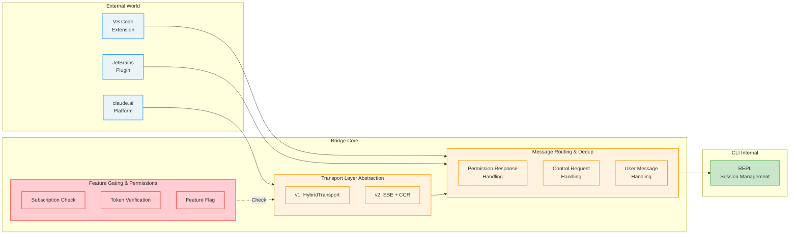
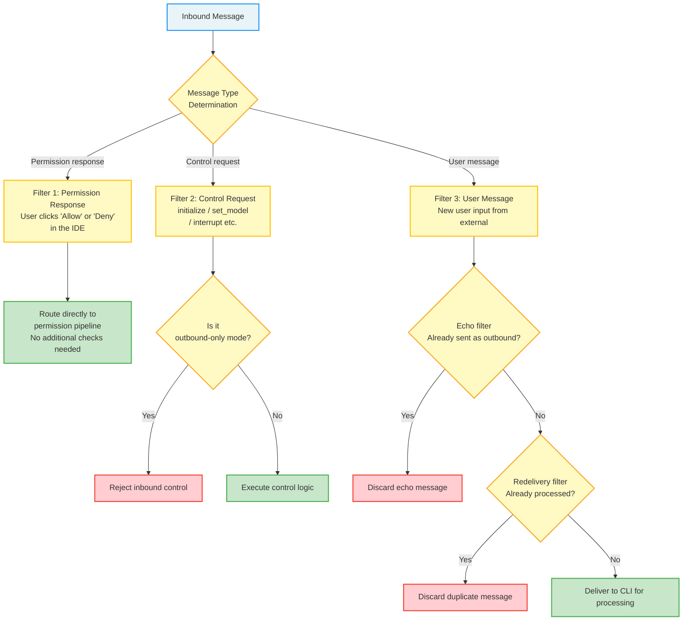
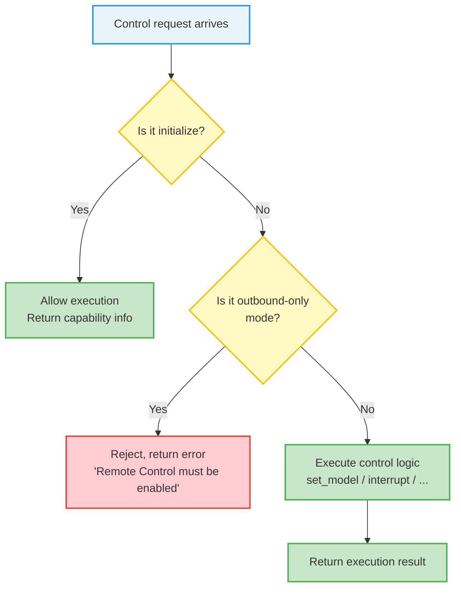
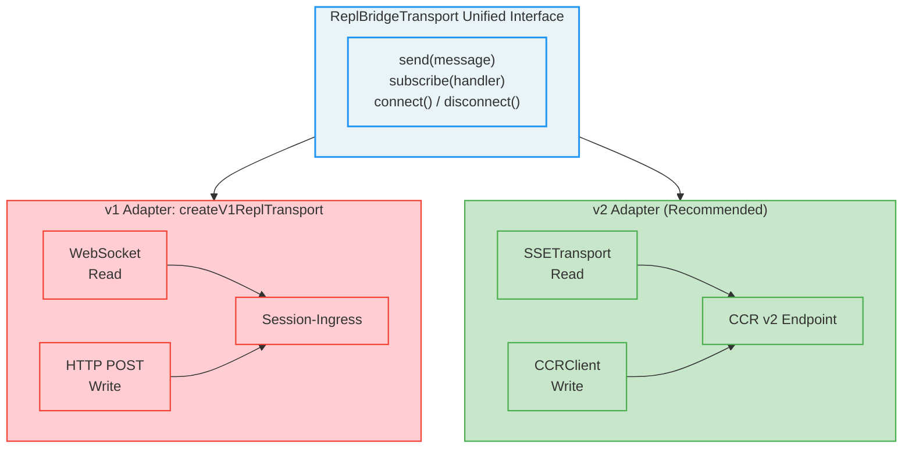
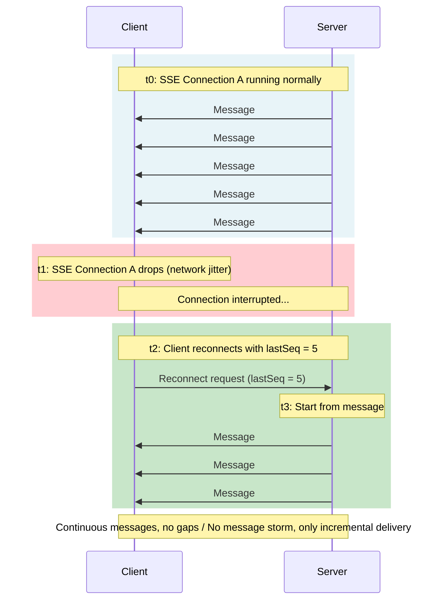
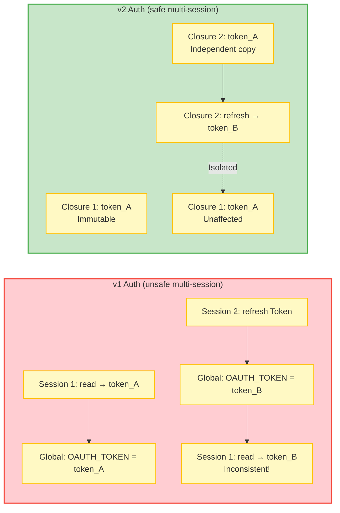
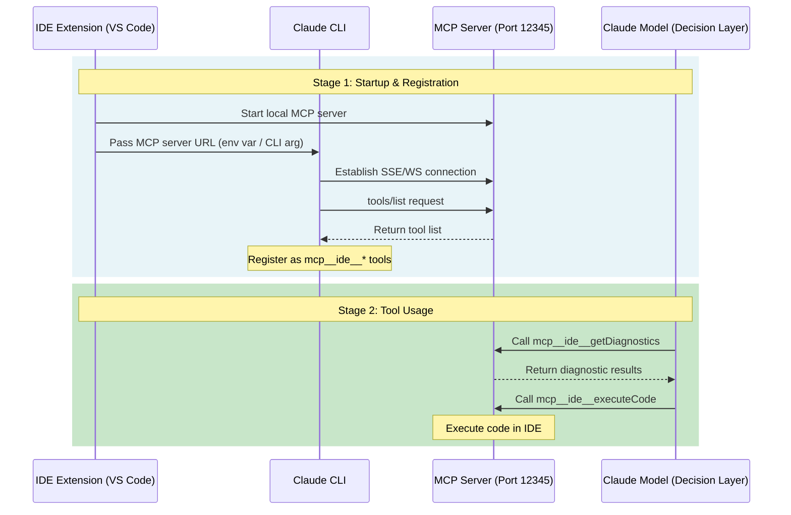
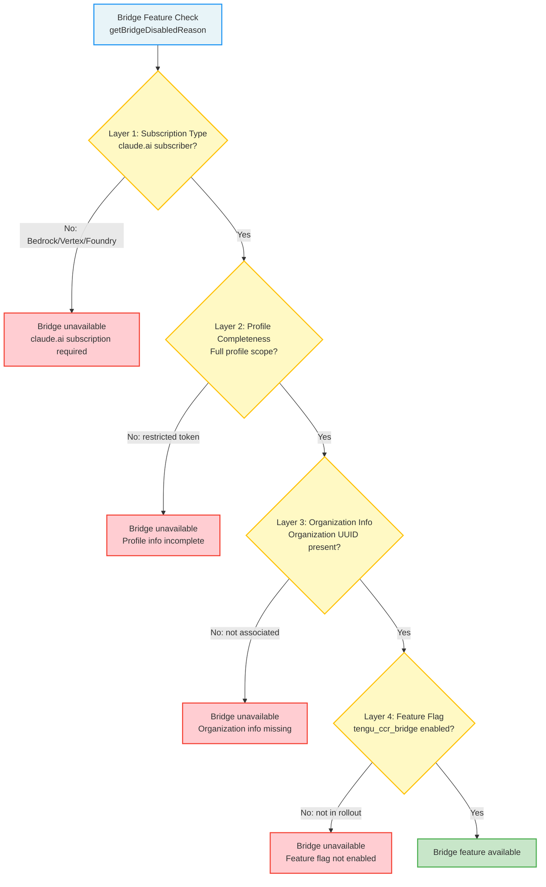
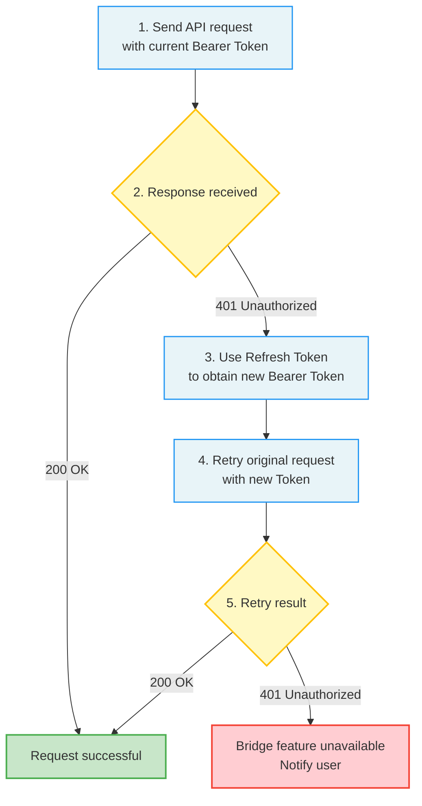

## 12.4 IDE Integration: The Bridge System

The Bridge system is the core layer for bidirectional communication between Claude Code and the external world. It implements integration with IDEs like VS Code and JetBrains, as well as Claude.ai platform remote control functionality. If the MCP protocol is the "dialect" between Claude Code and tool servers, then the Bridge system is the "lingua franca" between Claude Code and the entire external world.

> **Analogy:** Think of Bridge as the dispatch system of a multilingual translation center. The translation center (Bridge) simultaneously handles calls from different countries (IDE, claude.ai, remote terminals), needs to select the correct translation protocol for each line (v1/v2 transport), ensures messages don't cross lines (deduplication), and controls who can call in (permission gating).

### 12.4.1 Architecture Overview

The Bridge system is located in the bridge communication directory, containing over 30 module files that form a complete communication layer. Its scale alone demonstrates the complexity of IDE integration and remote control — this isn't simple message forwarding but a complete communication middleware that includes routing, deduplication, authentication, transport abstraction, and session management.

Key components are as follows:

| Responsibility | Description | Design Pattern |
|------|------|---------|
| REST API client | Communicates with the claude.ai backend | Adapter pattern |
| Message routing and deduplication | Handles inbound/outbound messages | Chain of Responsibility pattern |
| Transport layer abstraction | Encapsulates v1 (HybridTransport) and v2 (SSE + CCR) | Strategy pattern |
| REPL bridge core | Manages session lifecycle | Observer pattern |
| Remote control core logic | Manages remote control functionality | Command pattern |
| Bridge feature gating and permission checks | Controls feature access | Decorator pattern |
| Type definitions | Defines communication types | Type-driven design |
| Session creation and subprocess management | Manages session lifecycle | Factory pattern |
| JWT utilities | Used for authentication | Utility class |

**Why So Many Modules?**

The Bridge system's complexity stems from needing to simultaneously satisfy requirements across multiple dimensions:

1. **Multi-transport protocol compatibility**: Must support both legacy (v1) and new (v2) transport protocols simultaneously, with smooth migration without affecting existing integrations.
2. **Bidirectional communication**: Not only does the CLI push messages outward, it also needs to receive external control commands (such as switching models, interrupting execution).
3. **Multi-session parallelism**: The same user may simultaneously use multiple terminals or IDE windows, each requiring independent session management.
4. **Security isolation**: Messages from different sources require different authentication and permission check strategies.

These requirements, layered together, evolved what could be a simple message forwarding module into a complete communication middleware.

### 12.4.2 Bidirectional Communication Layer

Bridge's communication architecture is bidirectional, supporting two types of data flow. This bidirectionality is what distinguishes the Bridge system from simple "log pushing" — it doesn't just forward CLI output to the outside; it can also receive external commands and execute them.

**Outbound Flow (CLI -> External)**

Conversation messages, tool invocation results, status updates, and other data from the CLI are sent to external consumers (IDE, claude.ai, etc.) through the transport layer. Outbound messages include:

- Conversation messages (assistant and user roles)
- Tool invocation requests and results
- State change notifications (such as connection status, model switches)
- Errors and diagnostic information

Outbound messages are relatively simple — they are unidirectional pushes that don't need to handle complex synchronization and conflict issues.

**Inbound Flow (External -> CLI)**

User messages, permission responses, control requests, and other data from IDEs or claude.ai arrive at the CLI through the transport layer. Processing inbound messages is much more complex because they may change CLI state, requiring strict filtering and validation.

The core message routing logic implements triple filtering:

**BoundedUUIDSet: Efficient Duplicate Detection**

`BoundedUUIDSet` is a FIFO (first-in, first-out) bounded set implemented using a ring buffer. It stores UUIDs of recently processed messages with a constant memory footprint of O(capacity). When a new message arrives, the system checks whether its UUID is in the set — if so, it's a duplicate message and is discarded immediately.

Why use a ring buffer instead of a simple Set? Consider a long-running session that may process tens of thousands of messages. If a regular Set stored all historical UUIDs, memory would grow continuously. The ring buffer achieves a balance between memory efficiency and duplicate detection accuracy by maintaining a fixed capacity, keeping only the UUIDs of the most recent N messages. The value of N is set large enough to cover the time window of network retransmissions (typically seconds to minutes), yet small enough not to cause memory pressure.

> **Connection to Chapter 2:** Bridge's bidirectional communication occurs at the outer layer of the dialog loop (Chapter 2). The dialog loop manages user-model interactions, while Bridge manages CLI-external world interactions. The two operate in parallel: Bridge can receive and buffer inbound messages during dialog loop execution, processing them after the current conversation turn completes.

### 12.4.3 Control Protocol

Servers can send control requests to remotely manage CLI sessions. The `handleServerControlRequest` function implements a lightweight Remote Procedure Call (RPC) protocol supporting the following control subtypes:

| Subtype | Purpose | Request Parameters | Response |
|--------|------|---------|------|
| `initialize` | Initialization handshake, report capabilities | Client capability declaration | commands, output_style, models, account, pid |
| `set_model` | Remotely switch model | Target model name | Success/failure status |
| `set_max_thinking_tokens` | Adjust thinking token budget | Token count | Success/failure status |
| `set_permission_mode` | Switch permission mode | Target mode name | Policy verdict result |
| `interrupt` | Interrupt current execution | None | Immediate interrupt |

**Design Principles of the Control Protocol**

The control protocol's design reflects several important principles:

1. **Minimal Control Surface**: Only five control subtypes, each with clear semantics and boundaries. This aligns with the "minimal API surface" design philosophy — fewer control commands mean easier security auditing and lower likelihood of misuse.

2. **Explicit Capability Negotiation**: `initialize` is the first and mandatory control request. It allows both parties to exchange capability declarations, ensuring subsequent control requests only send commands the other side supports. This "negotiate first, operate later" pattern is a classic network protocol design approach.

3. **Fire-and-forget Interrupt**: `interrupt` does not wait for a response and triggers the interrupt directly. This is the only "fire-and-forget" control command, designed to prioritize response speed over reliability — the interrupt operation needs to take effect immediately, and waiting for a response would delay its execution.

**Security Considerations for Outbound-only Mode**

In **outbound-only** mode, all mutable requests except `initialize` are rejected, returning an error message indicating that Remote Control must be enabled locally to allow inbound control.

This is a critical security boundary. Outbound-only mode means the CLI only pushes information outward and does not accept external control commands. This is particularly important for claude.ai integration — users may just want to view conversation history without allowing the web interface to remotely control their CLI session (such as switching models or interrupting execution).

Why is `initialize` still allowed in outbound-only mode? Because initialize is a read-only operation — it doesn't change any CLI state, only returning current capability information. Prohibiting initialize would prevent external clients from understanding the CLI's capabilities, making it impossible to correctly display conversation content.

### 12.4.4 Transport Layer Abstraction

The transport layer defines a unified `ReplBridgeTransport` interface that encapsulates the complexity of underlying communication protocols behind a uniform abstraction. This is a classic application of the Strategy Pattern — upper-layer code interacts with the transport layer through a unified interface without needing to know whether the underlying protocol is WebSocket, SSE, or something else.

**v1 Adapter** (`createV1ReplTransport`)

The v1 adapter wraps `HybridTransport`, using WebSocket for reading + HTTP POST for writing to the Session-Ingress service. The design intent behind this hybrid approach leverages each protocol's strengths: WebSocket is suited for server push (low latency, real-time), while HTTP POST is suited for client sending (simple, reliable, no long-lived connection maintenance).

The v1 adapter is a legacy solution that is still operational but no longer recommended for new feature development.

**v2 Adapter**

The v2 adapter wraps SSETransport (read) + CCRClient (write to CCR v2 endpoints), representing the future direction of the Bridge transport layer. Key improvements in v2 include:

**1. SSE Sequence Number Continuation**

This is v2's most elegant design. In traditional SSE implementations, when a client disconnects and reconnects, the server typically needs to replay all events since the connection began (because the client doesn't know what it missed). For long-running sessions, this can cause a "message storm" — thousands of historical messages replayed at once, consuming significant bandwidth and processing time.

v2's solution is: carry the previous stream's high-water sequence number mark during transport switching. When the client reconnects, it tells the server "I've processed up to sequence number N, please start from N+1." This way, the server only needs to send incremental messages, not the complete history.

**2. Epoch Management and Heartbeat**

CCRClient periodically sends heartbeats to maintain the lease. The Epoch is a monotonically increasing logical clock that increments with each transport switch. Through the Epoch, the system can distinguish between "delayed messages from old connections" and "new messages from new connections," avoiding processing of stale messages.

The heartbeat mechanism ensures connection liveness detection — if a heartbeat times out, the system considers the connection broken and triggers the reconnection flow. This works in conjunction with the exponential backoff retry mechanism described in Section 12.1.4.

**3. Multi-session Secure Authentication**

v2 provides per-instance authentication through closures rather than using global environment variables. This improvement solves a subtle but important concurrency issue: in multi-session scenarios, if multiple Bridge transport instances share the same authentication Token from an environment variable, when one instance refreshes the Token, other instances may read an inconsistent state.

The closure approach gives each transport instance its own authentication context, without mutual interference:

> **Architectural Reflection:** The evolution from v1 to v2 is a classic "technical debt cleanup" process. v1's hybrid approach (WebSocket + HTTP POST) quickly met early requirements, but as session counts grew and mobile integration was added, its limitations became apparent. v2 fundamentally solved these problems by introducing sequence number continuation and closure-based authentication, while preserving the same interface abstraction so upper-layer code required no modifications.

### 12.4.5 VS Code and JetBrains Extension Integration

IDE extensions communicate with the Claude CLI through `sse-ide` and `ws-ide` type MCP servers. These are internal-only types that add IDE identification information (such as IDE name, whether running on Windows) on top of the standard SSE/WebSocket protocols. This "protocol variant" design lets the Bridge system provide differentiated services based on client type.

**Integration Flow Details**

The complete IDE integration flow involves collaboration across multiple components:

**Detailed Explanation of the Five Steps:**

1. **IDE extension starts the MCP server**: When the user opens the Claude Code extension in VS Code, the extension launches a local MCP server process listening on a randomly assigned local port.

2. **URL passing**: The IDE extension passes the server URL to Claude Code via environment variables (such as `CLAUDE_CODE_IDE_MCP_URL`) or CLI arguments. This URL typically looks like `http://127.0.0.1:12345/mcp`.

3. **Establishing the connection**: After starting, Claude Code reads the URL passed by the IDE and establishes a connection using the `sse-ide` or `ws-ide` protocol. Once connected, Claude Code becomes a client of this MCP server.

4. **Tool discovery**: Claude Code retrieves the IDE extension's tool list through the standard `tools/list` request. Since IDE-type servers are subject to the tool allowlist restriction, only `executeCode` and `getDiagnostics` are registered.

5. **Tool usage**: The Claude model can invoke these IDE tools when processing user requests to get real-time diagnostic information or execute code in the IDE context. For example, when the model suggests fixing a TypeScript type error, it can apply the fix directly in the IDE through `executeCode`, then verify the error has disappeared through `getDiagnostics`.

**Practical Value of IDE Integration**

The value of IDE integration goes far beyond "using Claude Code in the terminal." Through the MCP protocol, Claude Code gains "perception capabilities" of the IDE environment:

- **Real-time diagnostics**: `getDiagnostics` lets Claude Code see real-time compilation errors, type errors, and lint warnings in the IDE, without requiring users to manually copy-paste error messages.
- **Contextual execution**: `executeCode` lets Claude Code's code fixes execute in the IDE's full context (including the project's TypeScript configuration, Node.js version, environment variables, etc.), rather than in an isolated terminal environment.

> **Connection to Chapter 8's Hook System:** MCP tool invocations from IDE integration also trigger the hook system. For example, when Claude Code executes code in the IDE through `mcp__ide__executeCode`, the PreToolUse hook can intercept this call and check whether the code to be executed is safe. This adds an extra layer of security to IDE integration.

### 12.4.6 Bridge Permission Gating

Bridge (remote control) functionality is not open to all users — it requires a claude.ai subscription and passes through multiple gating layers. This "checkpoint upon checkpoint" design ensures remote control functionality is only used in controlled environments.

**Why Multiple Gating Layers?**

Remote control functionality allows external entities (IDE, claude.ai web interface) to control CLI sessions — switching models, adjusting parameters, even interrupting execution. If this capability were abused (for example, a malicious website controlling a user's CLI through an XSS attack), the consequences would be catastrophic. The multi-layer gating design follows the "defense in depth" principle — even if one layer's check is bypassed, other layers still provide protection.

The complete diagnostic function `getBridgeDisabledReason` checks four layers of conditions in sequence:

**API Authentication and Token Management**

The API client authenticates using OAuth Bearer Tokens and supports automatic Token refresh and retry on 401 responses. This mechanism handles a common distributed systems problem: Token expiration.

This "auto-refresh + retry" pattern is standard OAuth 2.0 practice. The benefit is that it's transparent to users — Token expiration won't interrupt an ongoing Bridge session, as the system handles it automatically in the background.

> **Best Practice:** If you need to use Bridge functionality in an enterprise environment, ensure: (1) team members sign in with claude.ai subscription accounts, not API Keys; (2) the organization UUID is correctly configured; (3) the network firewall permits SSE/CCR communication with the claude.ai backend.
