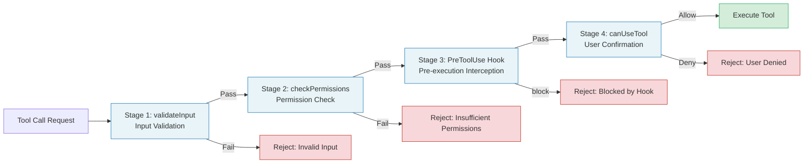
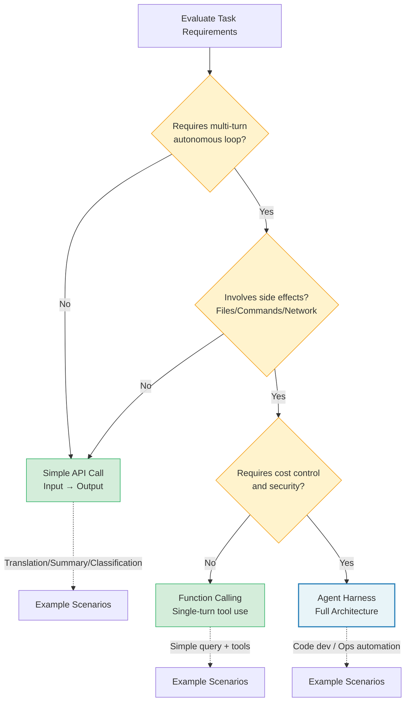

## 15.1 Design Principles Review and Selection Guide

### Five Design Principles in Practice

Five design principles for Agent Harnesses run throughout this book. Before writing code, let's review how they map to concrete engineering decisions. Understanding the "why" behind these principles matters more than memorizing the "what" -- because when you encounter scenarios in your own project that Claude Code doesn't cover, principles can guide you toward consistent design decisions.

**Principle 1: Loops over recursion.** Claude Code's core query function is an `AsyncGenerator` that manages state transitions through a `while(true)` loop and `continue` statements. Each iteration destructures the message list, compression tracking, recovery count, and other state from the `state` object, then writes a new `State` object at each `continue` site. This "destructure-reassign" pattern is easier to debug than recursive calls and avoids call stack overflow.

Why are loops better suited than recursion for Agent scenarios? Three reasons:

1. **State recovery is more natural.** In a loop, state recovery simply requires reassigning the `state` variable. In recursion, state recovery requires unwinding the entire call stack, with complexity increasing dramatically. Claude Code's auto-compact mechanism needs to compress context without terminating the conversation -- in a loop this is a simple "replace message list + continue," while in recursion it requires exceptions or special return values.

2. **Abort is more controllable.** The `AbortController` signal check at the top of the loop is a natural "exit point." In recursion, the abort signal must be passed and checked at every recursive level, making it easy to miss.

3. **Debugging is more intuitive.** State changes in a loop happen at a fixed code location -- a single breakpoint captures all state transitions. In recursion, state changes are scattered across multiple call stack frames, requiring breakpoints at different levels.

**Principle 2: Schema-driven, not hard-coded.** Each tool defines its input parameters through a Zod Schema, and the `buildTool` factory function automatically fills in default behavior from partial definitions. This means tool validation logic, permission checks, and description generation all derive from the same Schema, eliminating the root cause of inconsistencies.

The deeper value of Schema-driven design lies in "Single Source of Truth." Consider an alternative without Schema-driven design: input validation is written in one place, permission checks in another, and API documentation is manually authored. When a parameter needs modification, all three locations need synchronized updates, and missing any one leads to inconsistency. Schema-driven design ensures that validation logic, permission logic, and documentation all derive from the same definition -- modify one place and it takes effect globally.

**Principle 3: Progressive permissions.** The permission system is divided into four stages: `validateInput` (input validation), `checkPermissions` (permission check), PreToolUse hooks (pre-execution interception), and `canUseTool` (user confirmation). Each stage can short-circuit, and requests that don't pass a previous stage never enter the next one.



The benefit of this pipeline design is "early rejection" (Fail Fast). If input parameters are invalid (Stage 1), there's no need to waste time checking permission rules (Stage 2); if permission rules explicitly deny (Stage 2), there's no need to pop up a user confirmation dialog (Stage 4). Each stage acts as a "sieve," intercepting requests that don't need further processing as early as possible.

**Principle 4: Streaming first.** From model responses to tool execution results, all data flows through `AsyncGenerator`'s `yield`. Consumers can process messages one by one without waiting for the entire turn to complete. This makes real-time UI updates and streaming to SDK consumers possible.

**Principle 5: Pluggable extensions.** The hook system provides extension points at over twenty lifecycle nodes, from `SessionStart` to `PostToolUse`, from `PreCompact` to `Stop`. Each hook is an independent Shell command or HTTP endpoint that interacts with the Harness through a standardized JSON input/output protocol.

### When to Use Agent Harness Pattern vs. Simple LLM API Calls

Not every scenario requires a full Agent Harness. The decision hinges on three dimensions:



| Dimension | Simple API Call | Agent Harness |
|-----------|----------------|---------------|
| Interaction turns | Single request-response | Multi-turn autonomous loop |
| Tool requirements | None or Function Calling only | Multiple tools, permission control |
| Context management | Manual prompt assembly | Automatic compression, memory extraction |
| Error recovery | Retry | Multi-layer recovery (circuit breaker, fallback, compression) |
| Cost sensitivity | Low (single call) | High (accumulated over long sessions) |
| Security requirements | Low (no side effects) | High (file operations, command execution) |

If your task meets any of the following conditions, you should consider the Agent Harness pattern:

1. The agent needs to decide its next action based on intermediate results (autonomous loop)
2. Involves side-effect operations such as file system access, code execution, or network requests
3. Conversations may span dozens or even hundreds of turns
4. Needs to maintain consistent behavior across multiple environments (CLI, IDE, SDK)
5. Requires fine-grained cost control and token budget management
6. Needs observability -- tracking the decision process and resource consumption at every step

> **Decision rule of thumb:** If your system only needs the LLM to perform "input -> output" transformations (such as translation, summarization, classification), use a simple API call. If your system needs the LLM to perform an "observe -> think -> act -> observe again" loop, use an Agent Harness.

### Runtime Selection: Bun vs. Node.js vs. Python

Claude Code chose Bun as its runtime, primarily for three reasons:

- **Startup speed:** Bun's cold start time is roughly one-third that of Node.js, which is critical for CLI tools
- **Native TypeScript:** No pre-compilation step needed, runs `.ts` files directly
- **Bundle features:** `bun:bundle` provides compile-time feature flags (`feature('X')`), eliminating unnecessary code paths at build time

If your project primarily runs server-side and you already have Node.js infrastructure, Node.js works perfectly well. Python is suitable for data science and ML scenarios, but is weaker than TypeScript in type safety and tooling ecosystem. Code examples in this book are written in TypeScript and can run on both Bun and Node.js.

**Runtime selection trade-off matrix:**

```
+------------------+--------+---------+---------+
| Consideration    | Bun    | Node.js | Python  |
+------------------+--------+---------+---------+
| Startup speed    | Fast   | Medium  | Slow    |
| Native TypeScript| Yes    | Compile | No      |
| Package maturity | Medium | High    | High    |
| Feature flags    | Built-in| Tooling| Tooling |
| Deploy prevalence| Emerging| Wide   | Wide    |
| Type safety      | Strong | Strong  | Weak    |
| Async model      | Native | Native  | asyncio |
+------------------+--------+---------+---------+
```
