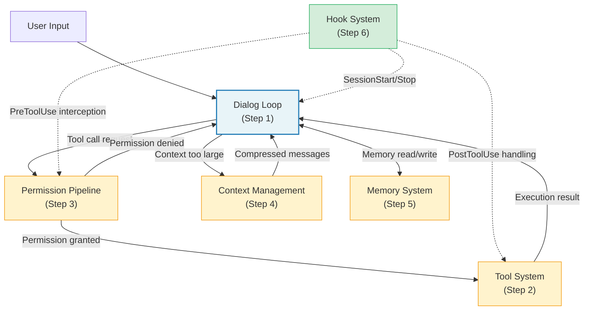
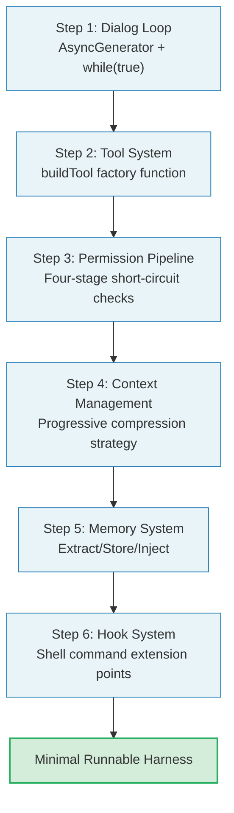

## 15.2 Core Component Implementation Roadmap

The call relationships and data flow between the six core components of an Agent Harness are shown below:



Building an Agent Harness is an incremental process. This section provides six steps, each building on the previous one, ultimately producing a minimal runnable Harness.



Don't be misled by the number "six steps" -- this is not a linear waterfall process. In practice, you'll find yourself iterating between steps: implementing the permission pipeline may require going back to modify the tool system's interface, and implementing context management may require adjusting the dialog loop's state structure. The six steps provide an ordered learning path, not a rigid development sequence.

### Step 1: Dialog Loop

The dialog loop is the heart of an Agent Harness. Claude Code's core query function is an `AsyncGenerator`. Let's draw inspiration from its design essence to implement a streamlined but complete dialog loop.

First, define the core types:

```typescript
// types.ts
export interface Message {
  role: 'system' | 'user' | 'assistant'
  content: string | ContentBlock[]
}

export interface ContentBlock {
  type: 'text' | 'tool_use' | 'tool_result'
  text?: string
  id?: string
  name?: string
  input?: Record<string, unknown>
  content?: string | ContentBlock[]
  is_error?: boolean
  tool_use_id?: string
}

export interface StreamEvent {
  type: 'assistant' | 'tool_results' | 'error' | 'complete'
  content?: unknown
}

export interface LoopState {
  messages: Message[]
  turnCount: number
  abortController: AbortController
}
```

Then implement the main loop. Note that this uses the same pattern as Claude Code: a `while(true)` loop with `continue` statements to manage state transitions:

```typescript
// agentLoop.ts
import type { Tool } from './toolSystem'

interface AgentDeps {
  callModel: (
    messages: Message[],
    tools: Tool[],
    signal: AbortSignal,
  ) => AsyncGenerator<ContentBlock[]>
  uuid: () => string
}

export async function* agentLoop(
  messages: Message[],
  tools: Tool[],
  deps: AgentDeps,
): AsyncGenerator<StreamEvent, { reason: string }> {
  let state: LoopState = {
    messages,
    turnCount: 0,
    abortController: new AbortController(),
  }

  while (true) {
    const { messages: currentMessages, abortController } = state

    // Collect assistant messages and tool calls for this iteration
    const assistantBlocks: ContentBlock[] = []
    const toolUseBlocks: ContentBlock[] = []

    try {
      // Stream model call
      for await (const block of deps.callModel(
        currentMessages,
        tools,
        abortController.signal,
      )) {
        assistantBlocks.push(block)
        if (block.type === 'tool_use') {
          toolUseBlocks.push(block)
        }
        yield {
          type: 'assistant' as const,
          content: block,
        }
      }
    } catch (error) {
      yield { type: 'error', content: String(error) }
      return { reason: 'model_error' }
    }

    // No tool calls -- conversation complete
    if (toolUseBlocks.length === 0) {
      yield { type: 'complete' }
      return { reason: 'completed' }
    }

    // Execute tools and collect results
    const toolResults: ContentBlock[] = []
    for (const toolCall of toolUseBlocks) {
      const tool = tools.find(t => t.name === toolCall.name)
      if (!tool) {
        toolResults.push({
          type: 'tool_result',
          tool_use_id: toolCall.id,
          content: `Unknown tool: ${toolCall.name}`,
          is_error: true,
        })
        continue
      }

      try {
        const result = await tool.execute(toolCall.input ?? {})
        toolResults.push({
          type: 'tool_result',
          tool_use_id: toolCall.id,
          content: JSON.stringify(result),
        })
      } catch (error) {
        toolResults.push({
          type: 'tool_result',
          tool_use_id: toolCall.id,
          content: `Tool error: ${error}`,
          is_error: true,
        })
      }

      yield { type: 'tool_results', content: toolResults }
    }

    // Update state and enter the next loop iteration
    state = {
      ...state,
      messages: [
        ...currentMessages,
        {
          role: 'assistant',
          content: assistantBlocks,
        },
        {
          role: 'user',
          content: toolResults,
        },
      ],
      turnCount: state.turnCount + 1,
    }
  }
}
```

This implementation embodies key design decisions distilled from Claude Code's source code:

1. **State object pattern:** Loop state is encapsulated in a single `state` variable, and each `continue` site writes a new `State` object (corresponding to `const next: State = \{ ... \}` in the source code)
2. **Dependency injection:** The `deps` object encapsulates all I/O operations (model calls, UUID generation), allowing tests to inject mock implementations
3. **Generator output:** Events are passed one by one through `yield`, enabling consumers to respond in real time

**Extension considerations for Step 1:** This minimal implementation lacks several features essential for production environments. Before putting the dialog loop into actual use, you should consider adding:

- **Maximum turn limit**: Prevents infinite loops from consuming tokens. Claude Code uses a `maxTurns` parameter for control.
- **Abort mechanism**: Supports user cancellation of in-progress conversations via `AbortController`.
- **Error retry**: Retry logic for model call failures, including exponential backoff and fallback strategies.
- **Usage tracking**: Records token consumption per turn, supporting budget ceiling checks.

### Step 2: Tool System

Claude Code's tool system implements elegant default value population through the `buildTool` factory function. Each tool only needs to define its unique parts, while common behavior is provided by the factory. Let's implement a streamlined version:

```typescript
// toolSystem.ts
import { z } from 'zod'

export interface Tool {
  name: string
  description: string
  inputSchema: z.ZodType<{ [key: string]: unknown }>
  execute: (input: Record<string, unknown>) => Promise<unknown>
  // Default behaviors
  isEnabled: () => boolean
  isReadOnly: (input: unknown) => boolean
  isConcurrencySafe: (input: unknown) => boolean
  isDestructive: (input: unknown) => boolean
  checkPermissions: (
    input: Record<string, unknown>,
  ) => Promise<{ allowed: boolean; reason?: string }>
}

// Default value set -- corresponds to Claude Code's TOOL_DEFAULTS
const TOOL_DEFAULTS = {
  isEnabled: () => true,
  isReadOnly: () => false,
  isConcurrencySafe: () => false,
  isDestructive: () => false,
  checkPermissions: async () => ({ allowed: true }),
}

type ToolDef = Partial<typeof TOOL_DEFAULTS> &
  Omit<Tool, keyof typeof TOOL_DEFAULTS>

export function buildTool(def: ToolDef): Tool {
  return {
    ...TOOL_DEFAULTS,
    ...def,
  } as Tool
}
```

Usage example -- defining a file read tool:

```typescript
const readFileTool = buildTool({
  name: 'read_file',
  description: 'Read the contents of a file',
  inputSchema: z.object({
    path: z.string().describe('Absolute path to the file'),
    offset: z.number().optional().describe('Line number to start reading'),
    limit: z.number().optional().describe('Maximum lines to read'),
  }),
  isReadOnly: () => true,
  isConcurrencySafe: () => true,
  async execute(input) {
    const { path, offset, limit } = input as {
      path: string
      offset?: number
      limit?: number
    }
    const fs = await import('fs/promises')
    const content = await fs.readFile(path, 'utf-8')
    const lines = content.split('\n')
    const start = offset ?? 0
    const end = limit ? start + limit : lines.length
    return lines.slice(start, end).join('\n')
  },
})
```

The essence of `buildTool` lies in **fail-closed defaults**: `isConcurrencySafe` defaults to `false`, and `isReadOnly` defaults to `false`. This means the system assumes the most dangerous scenario for new tools until they explicitly declare their safety. This is emphasized in Claude Code's source code comments -- "assume not safe" and "assume writes."

**Fail-closed vs. Fail-open trade-offs:**

```
+------------------+--------------------------------+--------------------------------+
| Strategy         | Fail-closed (Claude Code's     | Fail-open                      |
|                  | choice)                        |                                |
+------------------+--------------------------------+--------------------------------+
| Default          | Tool is unsafe                 | Tool is safe                   |
| assumption       |                                |                                |
+------------------+--------------------------------+--------------------------------+
| New tool         | Sequential execution,          | Parallel execution,            |
| behavior         | confirmation required          | auto-approved                  |
+------------------+--------------------------------+--------------------------------+
| Risk of missing  | Slightly lower performance     | Security vulnerability         |
| annotations      | (unnecessary serialization)    | (dangerous ops run in parallel)|
+------------------+--------------------------------+--------------------------------+
| Suitable for     | Security-first production      | Development/experimentation    |
|                  | environments                   | phase                          |
+------------------+--------------------------------+--------------------------------+
```

> **Best Practice:** When developing new tools, start with fail-closed defaults. After confirming the tool behaves correctly, progressively add safety annotations (isReadOnly, isConcurrencySafe). This incremental approach avoids the "mark as safe first, discover it's unsafe later" rollback.

### Step 3: Permission Pipeline

Claude Code's permission check is a four-stage pipeline where each stage can short-circuit:

```typescript
// permissions.ts
export type PermissionDecision =
  | { allowed: true }
  | { allowed: false; reason: string }

export async function checkToolPermission(
  tool: Tool,
  input: Record<string, unknown>,
  context: PermissionContext,
): Promise<PermissionDecision> {
  // Stage 1: Tool's own validation (corresponds to validateInput)
  if (tool.validateInput) {
    const validation = await tool.validateInput(input, context)
    if (!validation.result) {
      return { allowed: false, reason: validation.message }
    }
  }

  // Stage 2: Tool's own permission check (corresponds to checkPermissions)
  const toolPermission = await tool.checkPermissions(input)
  if (!toolPermission.allowed) {
    return { allowed: false, reason: toolPermission.reason ?? 'Denied by tool' }
  }

  // Stage 3: User-configured rule matching
  const ruleDecision = matchPermissionRules(tool.name, input, context.rules)
  if (ruleDecision !== 'unknown') {
    return ruleDecision === 'allow'
      ? { allowed: true }
      : { allowed: false, reason: `Blocked by ${ruleDecision} rule` }
  }

  // Stage 4: User interactive confirmation (interactive mode only)
  if (context.mode === 'interactive') {
    const userChoice = await context.promptUser(
      `Allow ${tool.name} to execute?`,
    )
    return userChoice
      ? { allowed: true }
      : { allowed: false, reason: 'User denied' }
  }

  return { allowed: false, reason: 'Non-interactive: no matching rule' }
}
```

**Extension considerations for the permission pipeline:** Production permission systems typically need the following enhancements:

1. **Audit logging**: Record the tool name, input summary, decision result, and decision reason for every permission decision.
2. **Dynamic rule updates**: Support adding/removing permission rules at runtime without restarting the Agent.
3. **Permission caching**: Cache permission decisions for frequently called read-only tools (such as Read) to reduce latency.
4. **Role-based access control**: In multi-user scenarios, different user roles have different permission rule sets.

> **Cross-reference:** The complete design of the permission pipeline is analyzed in depth in Chapter 4, "The Permission Pipeline -- Agent Guardrails." The implementation in this chapter is a minimal version; production environments should refer to the complete design in Chapter 4.

### Step 4: Context Management

Long conversations inevitably hit token limits. Claude Code employs a **progressive compression strategy** composed of multiple tiers:

> **Example scope:** The fixed-window strategy below is a teaching example for text-only messages, not a production Snip implementation. Conversations with tools must preserve complete tool-call/result groups at the cut boundary.

```typescript
// contextManager.ts
export interface CompressionStrategy {
  name: string
  shouldTrigger: (tokenCount: number, limit: number) => boolean
  compress: (messages: Message[]) => Promise<Message[]>
}

// Teaching example: retain system messages and a recent text-message window
const snipStrategy: CompressionStrategy = {
  name: 'snip',
  shouldTrigger: (count, limit) => count > limit * 0.7,
  async compress(messages) {
    // Keep system messages and the most recent N messages
    const systemMsgs = messages.filter(m => m.role === 'system')
    const recentMsgs = messages.filter(m => m.role !== 'system').slice(-20)
    return [...systemMsgs, ...recentMsgs]
  },
}

// Strategy 2: Summary compression (medium cost)
const summaryStrategy: CompressionStrategy = {
  name: 'summary',
  shouldTrigger: (count, limit) => count > limit * 0.9,
  async compress(messages) {
    // Use LLM to generate a conversation summary
    const summary = await generateSummary(messages)
    return [
      messages[0], // System message
      {
        role: 'user',
        content: `[Conversation summary]\n${summary}`,
      },
    ]
  },
}

export class ContextManager {
  private strategies: CompressionStrategy[] = [
    snipStrategy,
    summaryStrategy,
  ]

  async manageContext(
    messages: Message[],
    tokenCount: number,
    tokenLimit: number,
  ): Promise<{ messages: Message[]; wasCompressed: boolean }> {
    for (const strategy of this.strategies) {
      if (strategy.shouldTrigger(tokenCount, tokenLimit)) {
        const compressed = await strategy.compress(messages)
        return { messages: compressed, wasCompressed: true }
      }
    }
    return { messages, wasCompressed: false }
  }
}
```

**Design trade-offs for compression strategies:**

```
+----------+----------+-----------+---------------------------+
| Strategy | Token    | Info Loss | Suitable Scenarios        |
|          | Savings  |           |                           |
+----------+----------+-----------+---------------------------+
| Snip     | 20-40%   | High      | Quick space release,      |
|          |          |           | non-critical conversations|
+----------+----------+-----------+---------------------------+
| Micro-   | 30-50%   | Medium    | Preserve structure,       |
| compress |          |           | compress tool results     |
+----------+----------+-----------+---------------------------+
| Summary  | 70-90%   | Low       | Essential for long        |
|          |          | (lossy)   | conversations, preserves  |
|          |          |           | key information           |
+----------+----------+-----------+---------------------------+
```

Key insight: **Information loss is relative.** Message-level Snip discards historical messages; MicroCompact replaces tool-result bodies while retaining their message structure. Summary compression preserves semantic information but loses original phrasing. Which strategy to choose depends on what information matters most in the conversation -- if the user is debugging a complex bug, tool results (such as log output) may be the least expendable; if the user is performing a code refactoring, the overall design decisions matter more than intermediate steps.

> **Cross-reference:** Claude Code's four-tier compression strategy is fully analyzed in Chapter 7, "Context Management -- Agent Working Memory." The two-tier strategy in this chapter is a simplified version.

### Step 5: Memory System

```typescript
// memory.ts
export interface MemoryEntry {
  content: string
  source: 'extracted' | 'explicit' | 'project_file'
  timestamp: number
  relevance: number
}

export class MemoryStore {
  private store: Map<string, MemoryEntry> = new Map()

  async extractAndStore(messages: Message[]): Promise<void> {
    // Extract key information from conversations and persist
    const lastExchange = messages.slice(-4)
    const extraction = await extractKeyFacts(lastExchange)
    for (const fact of extraction.facts) {
      this.store.set(fact.key, {
        content: fact.value,
        source: 'extracted',
        timestamp: Date.now(),
        relevance: fact.relevance,
      })
    }
  }

  getRelevantMemories(query: string, limit = 5): MemoryEntry[] {
    return Array.from(this.store.values())
      .filter(m => m.relevance > 0.3)
      .sort((a, b) => b.relevance - a.relevance)
      .slice(0, limit)
  }
}
```

**Design challenges for the memory system:** The memory system faces three core challenges, each corresponding to a design decision:

1. **What to extract?** Not all conversation content is worth remembering. User preferences ("I prefer Jest over Vitest"), project conventions ("this project uses camelCase naming"), and important decisions ("chose Redis over Memcached for caching") are high-value memories. Temporary debug output and intermediate step file contents are low-value memories.

2. **How long to store?** Memory has a decay curve. Conversation context from a week ago may no longer be relevant (the code has been rewritten). A good memory system needs to determine retention time based on a memory's "timeliness" and "reference frequency."

3. **When to inject?** Memories should not be injected in full on every request -- that would waste tokens and dilute key information. Memories should be selectively injected based on relevance to the current conversation, choosing only the most relevant fragments.

> **Cross-reference:** The complete design of the memory system is analyzed in detail in Chapter 6, "The Memory System -- Agent Long-Term Memory," including the CLAUDE.md storage format and session memory extraction strategies.

### Step 6: Hook System

The hook system is the extension layer of the Agent Harness. Claude Code supports over twenty hook events, each being an independent Shell command. Here is a streamlined implementation:

```typescript
// hooks.ts
export type HookEvent =
  | 'pre_tool_use'
  | 'post_tool_use'
  | 'session_start'
  | 'session_end'
  | 'stop'

export interface HookConfig {
  event: HookEvent
  command: string
  matcher?: string // Tool name matching pattern
}

export interface HookResult {
  outcome: 'success' | 'blocking' | 'error'
  decision?: 'approve' | 'block'
  reason?: string
  updatedInput?: Record<string, unknown>
}

export class HookRunner {
  constructor(private config: HookConfig[]) {}

  async runHooks(
    event: HookEvent,
    input: Record<string, unknown>,
    toolName?: string,
  ): Promise<HookResult[]> {
    const matching = this.config.filter(h => {
      if (h.event !== event) return false
      if (h.matcher && toolName && !h.matcher.includes(toolName)) return false
      return true
    })

    const results: HookResult[] = []
    for (const hook of matching) {
      const result = await this.executeHook(hook, input)
      results.push(result)
      // Blocking result short-circuits
      if (result.outcome === 'blocking') break
    }
    return results
  }

  private async executeHook(
    hook: HookConfig,
    input: Record<string, unknown>,
  ): Promise<HookResult> {
    const { spawn } = await import('child_process')
    return new Promise(resolve => {
      const child = spawn(hook.command, [], {
        shell: true,
        env: { ...process.env, HOOK_INPUT: JSON.stringify(input) },
        timeout: 10_000,
      })
      let stdout = ''
      child.stdout?.on('data', d => (stdout += d))
      child.on('close', code => {
        if (code !== 0) {
          resolve({
            outcome: code === 2 ? 'blocking' : 'error',
            reason: stdout,
          })
        } else {
          resolve({ outcome: 'success' })
        }
      })
    })
  }
}
```

**Extension considerations for the hook system:** Production hook systems need attention in the following areas:

1. **Timeout management**: Shell command execution time is unpredictable. Claude Code sets a 10-second timeout; timed-out hooks are treated as errors rather than blocking, ensuring that a slow hook doesn't stall the entire dialog loop.

2. **Error tolerance**: Hook failures should not cause the Agent to stop working. Hooks are "advisors" not "commanders" -- their output influences decisions but doesn't control flow.

3. **Security isolation**: Hook commands execute in separate processes, isolated from the Agent's main process. This prevents malicious hooks from affecting Agent behavior by modifying global variables or hijacking the module system.

4. **Audit trail**: Record each hook's execution time, return code, and output for debugging and compliance auditing.

> **Cross-reference:** The complete design of the hook system is analyzed in detail in Chapter 8, "The Hook System -- Agent Lifecycle Extension Points."
