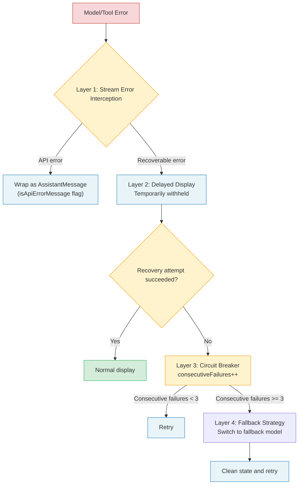
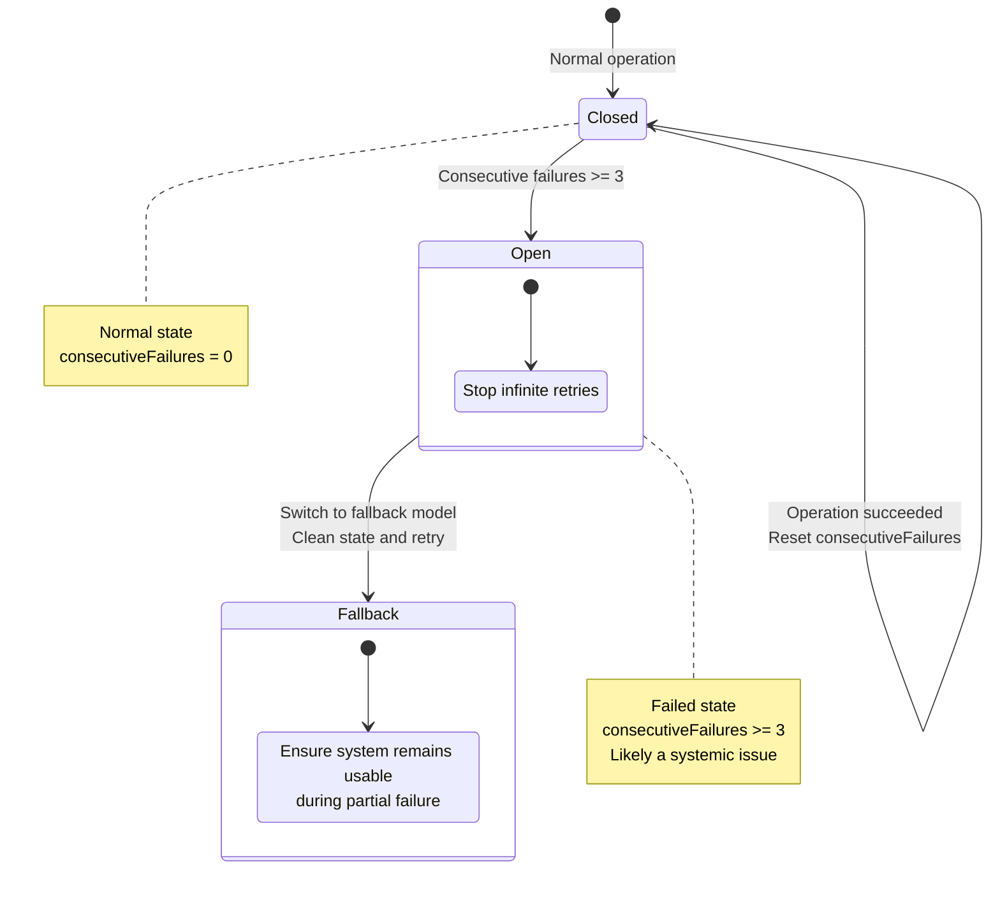

## 15.3 Architectural Lessons from Claude Code

### Breaking Circular Dependencies

In a codebase with over sixty tools and hundreds of modules, circular dependencies are the number one architecture killer. Claude Code employs multiple strategies to break cycles:

**Lazy Require pattern.** Conditional modules are loaded at runtime through `require()`, combined with feature flags, so unused modules are never loaded. The pattern is: use a feature flag to determine whether to load, fetch the module via `require()` when enabled, and return null when disabled.

This pattern defers imports from compile time to runtime, and combined with feature flags, ensures that unused modules are never loaded. This is the standard approach for handling optional heavy dependencies in the TypeScript ecosystem.

**Centralized type exports.** Another key strategy is importing types from a centralized location rather than from implementation modules. This decouples type definitions from implementations -- tool files don't need to import the entire permission system to get type signatures; they only need to import types from the centralized export location.

**Diagnosing circular dependencies.** How do you tell if your project is plagued by circular dependencies? Here are some symptoms:

1. **Startup time grows non-linearly with module count** -- module loading becomes a directed graph requiring depth-first traversal
2. **`undefined` surprises** -- imported values are `undefined` in certain code paths because the module hasn't finished initializing
3. **Modifying one file triggers mass recompilation** -- TypeScript's incremental compilation degrades in the face of circular dependencies

Methodology for breaking circular dependencies:

```
1. Draw the dependency graph (using madge or dependency-cruiser)
2. Identify cycles (find all loops)
3. Analyze each cycle's root cause:
   - Type dependency vs. runtime dependency?
   - Can it be broken through interface/type centralized exports?
   - Can it be broken through lazy require deferred loading?
   - Does it need a mediator module to decouple?
4. Break them one at a time, solving only one cycle per iteration
5. Add CI checks to prevent new circular dependencies
```

### Modular Design for Large Codebases

Claude Code's modularization strategy follows a core principle: **every tool is an independent citizen.** Tools are defined through the `buildTool` factory function, enjoying a uniform interface while maintaining internal autonomy. The `Tool` type defines over twenty methods, but only a few are required (`call`, `description`, `inputSchema`, `name`), with the rest having sensible defaults.

The `Tools` type is defined as `readonly Tool[]` rather than a regular array -- this is intentional design. Once a tool collection is created, it should not be modified; any changes should be made by creating a new collection.

This immutable collection design brings several benefits:

1. **Security guarantee**: No code can secretly add or remove tools at runtime; the tool list remains fixed once determined at creation.
2. **Simplified reasoning**: No need to consider "the tool list changed during execution" scenarios, reducing the complexity of concurrency issues.
3. **Cache-friendly**: The tool list's hash value is fixed and can be used as part of a cache key.

### Feature Flag-Driven Progressive Releases

Claude Code uses Bun's `bun:bundle` feature to implement compile-time feature flags. Code blocks wrapped in `feature('X')` functions are completely absent from the build output when not enabled, with no branch prediction penalty. For production systems that need progressive releases, this is a pattern worth adopting.

**Layered feature flag strategy:**

```
+-------------------+----------------------------+---------------------------+
| Flag Type         | Lifecycle                  | Suitable Scenarios        |
+-------------------+----------------------------+---------------------------+
| Compile-time flag | Permanent (determined at   | Incomplete features,      |
| (feature())       | build time)                | A/B testing               |
+-------------------+----------------------------+---------------------------+
| Runtime config    | Session-level (can vary    | User preferences,         |
| flag              | per startup)               | environment differences   |
| (settings.json)   |                            |                           |
+-------------------+----------------------------+---------------------------+
| Remote feature    | Real-time (API-driven)     | Gradual rollout,          |
| flag              |                            | emergency disabling       |
| (feature flag     |                            |                           |
|  service)         |                            |                           |
+-------------------+----------------------------+---------------------------+
```

Each flag type has its appropriate use case. Compile-time flags are suitable for features you're "certain aren't needed"; runtime configuration is suitable for features that "differ across environments"; remote feature flags are suitable for features that "need rapid toggling." Choosing the wrong flag type introduces unnecessary complexity -- for example, implementing user preferences with compile-time flags means every preference change requires a rebuild.

### Error Handling and the Circuit Breaker Pattern

Claude Code's error handling demonstrates a multi-layered defense system:



1. **Stream error interception:** Errors returned by the model are wrapped as `AssistantMessage` (with `isApiErrorMessage` flag) rather than thrown as exceptions
2. **Delayed display:** Recoverable errors (such as prompt-too-long) are temporarily withheld, with a recovery attempt made before deciding whether to display
3. **Circuit breaker:** Compression failure count is tracked (`consecutiveFailures`), and retries stop after reaching the threshold
4. **Fallback strategy:** When the model is unavailable, it automatically switches to a fallback model, cleaning state before retrying

The circuit breaker implementation is particularly elegant. In the source code, the `autoCompactTracking`'s `consecutiveFailures` field increments after each compression failure and resets on success. When the consecutive failure count exceeds the threshold, the loop exits directly rather than retrying indefinitely.



**Design dimensions for the circuit breaker pattern:** When implementing a circuit breaker, the following parameters need to be decided:

| Parameter | Claude Code's Choice | Considerations |
|-----------|---------------------|----------------|
| Failure threshold | 3 consecutive failures | Too low gives up too early, too high wastes resources |
| Recovery strategy | Reset counter on success | Simpler than half-open state |
| Fallback plan | Switch to fallback model | Ensures system remains usable during partial failure |
| Timeout | No fixed timeout | Controlled by loop-level maximum turn limit |

> **Anti-pattern Warning:** Don't implement a circuit breaker that "never triggers" -- such as setting the threshold to 100. The value of a circuit breaker lies in failing fast; an excessively high threshold is equivalent to having no circuit breaker at all. Claude Code chose 3 because observational data shows that if compression fails 3 times consecutively, it's most likely a systemic issue (such as API service degradation), and continued retries won't succeed.

### In-Depth Discussion on Observability

Observability for a production-grade Agent Harness goes beyond "logging" -- it's a systematic, layered design:

**Layer 1: Structured logs.** Every critical operation outputs structured log entries containing the operation type, duration, input summary, and output summary. Claude Code's approach is to instrument key paths, recording metrics such as message count, tool result count, query chain ID, and query depth.

```
{
  "event": "tool_execution",
  "tool": "read_file",
  "duration_ms": 45,
  "input_size": 128,
  "output_size": 15234,
  "cache_hit": true,
  "query_chain_id": "abc123",
  "turn_number": 5
}
```

**Layer 2: Aggregated metrics.** Aggregated data extracted from structured logs, used for dashboard display and alerting.

- **Latency distribution:** Model call latency and tool execution latency per loop turn
- **Token budget:** Input/output token consumption trends, compression frequency
- **Error rate:** Failure rates categorized by error type (model errors, tool errors, permission denials)
- **Behavioral metrics:** Average tool calls per turn, average turns to completion, user interruption rate

**Layer 3: Distributed tracing.** In multi-Agent scenarios, a single user request may trigger multiple sub-Agents. Distributed tracing links all related operations through a unique `query_chain_id`, allowing you to trace from a single user request to all sub-Agent behaviors.

**Layer 4: Anomaly detection.** Anomaly detection based on historical data, automatically identifying abnormal behavior patterns:
- Abnormal increase in tool calls per turn -- the Agent may be stuck in a loop
- Sudden spike in token consumption -- a tool may have returned unexpectedly large amounts of data
- Sudden rise in error rate -- an external API may be experiencing issues
