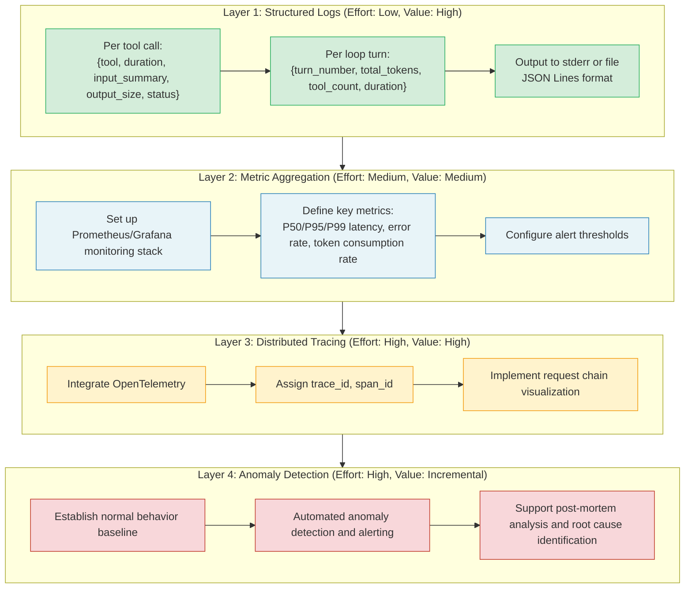
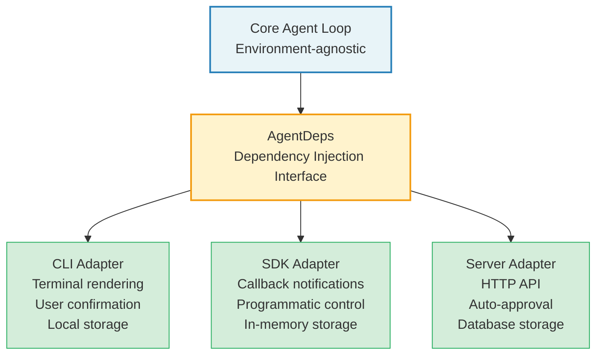
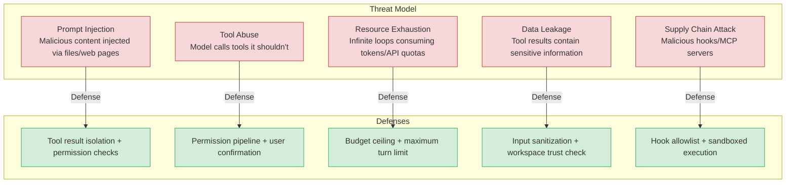

## 15.4 Production Considerations

### Telemetry and Observability

A production Agent Harness must have comprehensive observability. Claude Code's approach is worth emulating: instrument key paths to record metrics such as message count, tool result count, query chain ID, and query depth.

A production-grade Harness should track at minimum the following metrics:

- **Latency distribution:** Model call latency and tool execution latency per loop turn
- **Token budget:** Input/output token consumption trends, compression frequency
- **Error rate:** Failure rates categorized by error type (model errors, tool errors, permission denials)
- **Behavioral metrics:** Average tool calls per turn, average turns to completion, user interruption rate

**Observability implementation roadmap:**

### Multi-Environment Adaptation: CLI / IDE / SDK / Server

Claude Code's dependency injection pattern provides an elegant multi-environment adaptation solution. By abstracting I/O operations into dependency injection interfaces (such as model calls, message compression, UUID generation, etc.), the core loop doesn't need to know what environment it's running in.

In a CLI environment, production dependencies provide real file system access and model calls. In tests, mock implementations can be injected. In SDK mode, different UI feedback mechanisms can be substituted. This "core + adapter" architecture allows the same Harness logic to run seamlessly across different platforms.

Key environment difference points include:

| Environment | Permission Interaction | UI Rendering | Hook Execution | Session Storage |
|-------------|----------------------|--------------|----------------|-----------------|
| CLI | Terminal prompt | Ink/React | Shell commands | Local files |
| IDE (VS Code) | Dialog popup | WebView | Same | Same |
| SDK | Callback functions | None | Same | In-memory |
| Server | Auto-deny/allow | None | HTTP endpoints | Database |

**Multi-environment adaptation architecture pattern:**

The core principle of this architecture is "the core doesn't know where it's running." If any `if (isCLI) ... else if (isSDK) ...` branch logic appears in the core code, it means dependency injection isn't thorough enough -- environment differences should be encapsulated in adapters, not handled through conditional logic in core code.

### Security Auditing

An Agent Harness's security boundary is more complex than traditional applications because LLM output is unpredictable. Claude Code takes a multi-layered defense approach to security:

1. **Tool permission tiers:** Each tool declares `isReadOnly`, `isDestructive`, and `isConcurrencySafe`; the system determines the approval flow based on these annotations
2. **Workspace trust check:** `shouldSkipHookDueToTrust()` ensures hooks don't execute in untrusted workspaces
3. **Input sanitization:** The `backfillObservableInput` method cleans tool input before passing it to observers, without modifying the API-bound original input (to avoid breaking prompt caching)
4. **Budget ceiling:** The `maxBudgetUsd` parameter limits token costs per query

**Security threat model for Agent systems:**

Agent systems face threats fundamentally different from traditional applications. Traditional application threats come from external attackers (injecting malicious input), while Agent system threats come from the LLM itself -- the model may execute unintended operations due to prompt injection.

**Security audit checklist:**

- [ ] Every tool has correct `isReadOnly`/`isDestructive`/`isConcurrencySafe` annotations
- [ ] The permission pipeline completes all checks before tool execution (no bypass paths)
- [ ] Budget ceiling is checked on every loop turn, not just at session end
- [ ] Sensitive information in tool results is sanitized before passing to the model
- [ ] Hook commands execute in trusted workspaces; untrusted workspaces are automatically skipped
- [ ] Sub-Agent permissions do not exceed parent Agent's permission scope
- [ ] All permission decisions have audit logs
